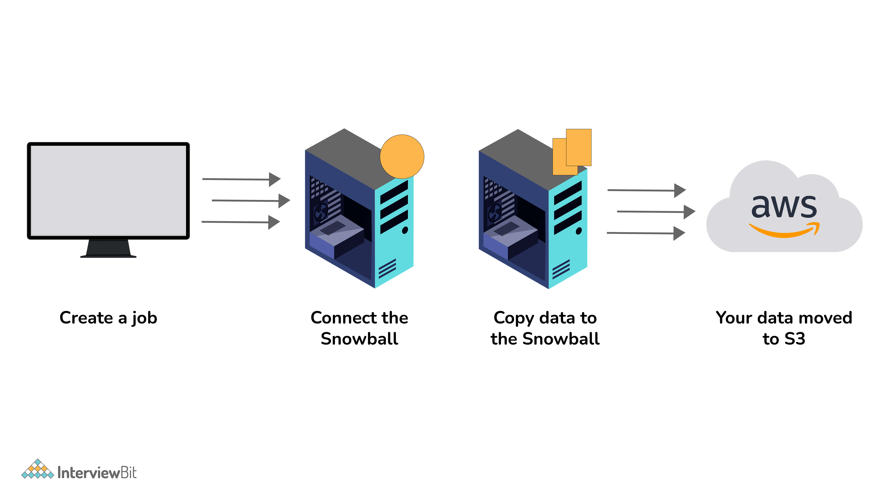
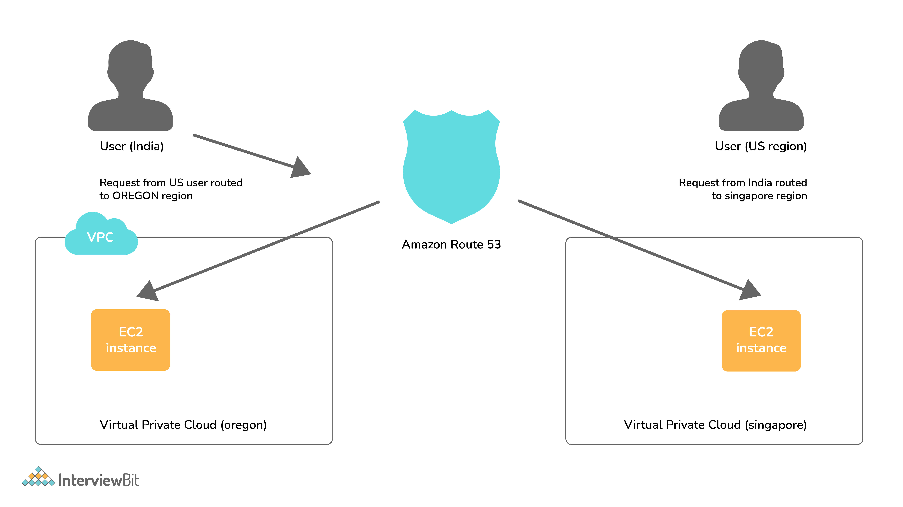

# AWS Certified Cloud Practitioner (ACCP) Exam Note

Notes from the AWS  Academy Cloud Foundations course.

> Who should take this exam? 
>
>[The AWS Certified Cloud Practitioner](https://aws.amazon.com/certification/certified-cloud-practitioner/) (*CLF-C01*) exam is intended for individuals who can effectively demonstrate an overall knowledge of the AWS Cloud independent of a specific job role.

You can find every updated information in this [link](https://aws.amazon.com/certification/certified-cloud-practitioner/) which is the official and reputable information.

The following table lists the main content domains and their weightings. 
Also you can download [the official exam guide](https://d1.awsstatic.com/training-and-certification/docs-cloud-practitioner/AWS-Certified-Cloud-Practitioner_Exam-Guide.pdf).

| Domain                            | % of Exam |
|:-----------------------------------|:-----------:|
| Domain 1: Cloud Concepts          | 26%       |
| Domain 2: Security and Compliance | 25%       |
| Domain 3: Technology              | 33%       |
| Domain 4: Billing and Pricing     | 16%       |
| **Total**                             | **100%**      |

* * *
### Table of contents
 - [What is EC2?](#1)
 - [What is SnowBall?](#2)
 - [What is cloudwatch?](#3)
 - [What is Elastic Transcoder](#4)
 - [What do you understand by VPC?](#5)
 - [DNS and Load Balancers Services come under which type of Cloud Service?](#6)
 - [What are the Storage Classes available in Amazon S3?](#7)
 - [Explain what T2 instances are?](#8)
 - [What are Key-Pairs in AWS?](#9)
 - [What is the difference between Amazon S3 and EC2?](#10)
 - [How many Subnets can you have per VPC?](#11)
 - [What is the difference between Amazon S3 and EBS?](#12)
 - [List different types of Cloud Services.](#13)
 - [Explain what S3 is?](#14)
 - [How does Amazon Route 53 provide high availability and low latency?](#15)
 - [How can you send a request to Amazon S3?](#16)
 - [What does AMI include?](#17)
 - [What are the different types of Instances?](#18)
 - [What is the relation between the Availability Zone and Region?](#19)
 - [How do you monitor Amazon VPC?](#20)
 - [What are the different types of EC2 instances based on their costs?](#21)
 - [What do you understand by stopping and terminating an EC2 Instance?](#22)
 - [What are the consistency models for modern DBs offered by AWS?](#23)
 - [What is Geo-Targeting in CloudFront?](#24)
 - [What are the advantages of AWS IAM?](#25)
 - [What do you understand by a Security Group?](#26)
 - [Explain Connection Draining.](#27)
 - [What is a Stateful and a Stateless Firewall?](#28)
 - [What is a Power User Access in AWS?](#29)
 - [What is an Instance Store Volume and an EBS Volume?](#30)
 - [What are Recovery Time Objective and Recovery Point Objective in AWS?](#31)
 - [Is there a way to upload a file that is greater than 100 Megabytes in Amazon S3?](#32)
 - [Can you change the Private IP Address of an EC2 instance while it is running or in a stopped state?](#33)
 - [What is the use of lifecycle hooks is Autoscaling?](#34)
 - [What are the policies that you can set for your user’s passwords?](#35)
 - [Cloud Computing](#cloud-computing)
 - [Six advantages of Amzon Cloud (Benefits)](#six-advantages-of-amzon-cloud-benefits)
 - [AWS Categories](#aws-categories)
 - [Amazon S3](#amazon-s3)
 - [Amazon EBS volumes types](#amazon-ebs-volumes-types)
 - [Amazon load balancers](#amazon-load-balancers)
 - [AWS Security Groups](#aws-security-groups)
 - [AWS Internet Gateway](#aws-internet-gateway)
 - [AWS Scalability](#aws-scalability)
 - [The core concepts of Amazon SNS](#the-core-concepts-of-amazon-sns)
 - [Amazon Simple Queue Service (SQS)](#amazon-simple-queue-service-sqs)
 - [AWS Inspector](#aws-inspector)
 - [AWS Trusted Advisor](#aws-trusted-advisor)
 - [AWS Personal Health Dashboard](#aws-personal-health-dashboard)
 - [AWS TCO Calculator](#aws-tco-calculator)
 - [AWS EBS](#aws-ebs)
 - [Amazon SageMaker](#amazon-sagemaker)
 - [Amazon Kinesis](#amazon-kinesis)
 - [AWS CloudFormation](#aws-cloudformation)
 - [AWS Elastic Beanstalk](#aws-elastic-beanstalk)
 - [Amazon Simple Notification Service (SNS)](#amazon-simple-notification-service-sns)
 - [AWS Lambda](#aws-lambda)
 - [AWS Well-Architected Framework](#aws-well-architected-framework)
 - [AWS WAF](#aws-waf)
 - [Amazon Kinesis](#amazon-kinesis)
 - [AWS AD Connector](#aws-ad-connector)
 - [AWS Simple AD](#aws-simple-ad)
 - [Amazon Elastic Container Service for Kubernetes (EKS)](#amazon-elastic-container-service-for-kubernetes-eks)
 - [Amazon Elastic Container Service (ECS)](#amazon-elastic-container-service-ecs)
 - [Virtual Private Gateway](#virtual-private-gateway)
 - [VPC peering connection](#vpc-peering-connection)
 - [AWS support plans](#aws-support-plans)
 - [Amazon IAM](#amazon-iam)
 - [Popular HTTTP code](#popular-htttp-code)
 - [AWS CloudTrail](#aws-cloudtrail)
 - [Amazon DynamoDB](#amazon-dynamodb)
 - [AWS Database SQL type](#aws-database-sql-type)
 - [AWS Device Farm](#aws-device-farm)
 - [AWS Config](#aws-config)
 - [AWS Shared Responsibility Model](#aws-shared-responsibility-model)
 - [Amazon RDS](#amazon-rds)
 - [AWS Auto Scaling Group](#aws-auto-scaling-group)
 - [AWS CloudHSM](#aws-cloudhsm)
 - [AWS Auto Scaling](#aws-auto-scaling)
 - [AWS Glacier](#aws-glacier)
 - [AWS Storage Gateway Volume Gateway](#aws-storage-gateway-volume-gateway)
 - [AWS Step Functions](#aws-step-functions)
 - [Amazon Simple Workflow Service (SWF)](#amazon-simple-workflow-service-swf)
 - [Amazon Security Token Service (STS)](#amazon-security-token-service-sts)
 - [AWS Server Migration Service (SMS)](#aws-server-migration-service-sms)
 - [Amazon DevPay](#amazon-devpay)
 - [Amazon Elasticsearch Service](#amazon-elasticsearch-service)
 - [Amazon Athena](#amazon-athena)
 - [Amazon QuickSight](#amazon-quicksight)
 - [Amazon CodeStar](#amazon-codestar)
 - [Amazon Cloud9](#amazon-cloud9)
 - [Amazon CodeDeploy](#amazon-codedeploy)
 - [Amazon Route 53](#amazon-route-53)
 - [Amazon CloudFront](#amazon-cloudfront)
 - [Amazon Lightsail](#amazon-lightsail)
 - [Amazon EC2](#amazon-ec2)
 - [AWS pricing policies](#aws-pricing-policies)
 - [AWS Cost Explorer](#aws-cost-explorer)
 - [Amazon Elastic Transcoder](#amazon-elastic-transcoder)
 - [AWS Organization](#aws-organization)
 - [AWS Glue](#aws-glue)
 - [AWS Artifact](#aws-artifact)
 - [AWS WAF](#aws-waf)
 - [AWS Service Catalog](#aws-service-catalog)
 - [AWS Managed Services](#aws-managed-services)
 - [Amazon Machine Image (AMI)](#amazon-machine-image-ami)
 - [Five design principles for performance efficiency in the cloud](#five-design-principles-for-performance-efficiency-in-the-cloud)
 - [Five design principles for cost optimization in the cloud](#five-design-principles-for-cost-optimization-in-the-cloud)
 - [Five design principles for reliability in the cloud](#five-design-principles-for-reliability-in-the-cloud)
 - [Six design principles for security in the cloud](#six-design-principles-for-security-in-the-cloud)
 - [Five pillars of the AWS Well-Architected Framework](#five-pillars-of-the-aws-well-architected-framework)
 - [Amazon S3 Transfer Acceleration](#amazon-s3-transfer-acceleration)
 - [Amazon Neptune](#amazon-neptune)
 - [Amazon Elasicsearch](#amazon-elasicsearch)
 - [AWS Direct Connect](#aws-direct-connect)
 - [AWS Snowball](#aws-snowball)
 - [Amazon Comprehend](#amazon-comprehend)
 - [Amazon Resource Names (ARNs)](#amazon-resource-names-arns)
 - [Amazon ELB](#amazon-elb)
 - [AWS IoT Core](#aws-iot-core)
 - [AWS Fargate](#aws-fargate)
 - [Amazon Detective](#amazon-detective)
 - [Amazon Global Accelerator](#amazon-global-accelerator)
 - [AWS Data Sync](#aws-data-sync)
 - [AWS CodePipeline ](#aws-codepipeline)
 - [Amazon GuardDuty](#amazon-guardduty)
 - [Amazon Macie](#amazon-macie)
 - [AWS X-Ray](#aws-x-ray)
 - [Note](#note)

# 1. What is EC2? 

EC2 is a **virtual machine** in the cloud on which you have **OS-level control**. You can run this cloud server whenever you want and can be used when you need to deploy your own servers in the cloud, similar to your on-premises servers, and when you want to have full control over the choice of hardware and the updates on the machine.

# 2. What is SnowBall? 

SnowBall is a small application that enables you to transfer terabytes of data inside and outside of the AWS environment.

# 3. What is cloudwatch? 

CloudWatch helps you to monitor AWS environments like EC2, RDS Instances, and CPU utilization. It also triggers alarms depending on various metrics.

# 4. What is Elastic Transcoder? 

Elastic Transcoder is an AWS Service Tool that helps you in changing a video’s format and resolution to support various devices like tablets, smartphones, and laptops of different resolutions.

# 5. What do you understand by VPC? 

VPC stands for Virtual Private Cloud. It allows you to customize your networking configuration. VPC is a network that is logically isolated from other networks in the cloud. It allows you to have your private IP Address range, internet gateways, subnets, and security groups.

# 6. DNS and Load Balancers Services come under which type of Cloud Service? 

DNS and Load Balancers Services come under the category of **Infrastructure as a Service (IaaS)**.

# 7. What are the Storage Classes available in Amazon S3? 

**Storage Classes** are different data storage options available in Amazon S3. Each storage class is designed for a specific use case. You can choose the storage class based on the following factors:

- **Frequency of access**: How often you need to access your data.
- **Durability**: How long you need to store your data.
- **Availability**: The availability of data you need to store.

Storage Classes available with Amazon S3 are:

- Amazon S3 Standard
- Amazon S3 Standard-Infrequent Access
- Amazon S3 Reduced Redundancy Storage
- Amazon Glacier

# 8. Explain what T2 instances are? 

T2 are part of Amazon EC2’s burstable performance instances.

T2 Instances are designed to provide moderate baseline performance and the capability to burst to higher performance as required by the workload.

# 9. What are Key-Pairs in AWS? 

Key-Pairs are secure login information for your Virtual Machines. To connect to the instances, you can use Key-Pairs which contain a Public Key and a Private Key.

# 10. What is the difference between Amazon S3 and EC2? 

Amazon S3 is a storage service that is used for storing objects, whereas EC2 is a compute service that is used for running applications on the cloud.

# 11. How many Subnets can you have per VPC? 

You can have 200 subnets per VPC.

# 12. What is the difference between Amazon S3 and EBS? 

Amazon S3 is a storage service that is used for storing objects, whereas EBS is a storage service that is used for storing data on volumes.

Note: volumes are like hard disks attached to EC2 instances. Objects are files stored in S3 buckets.

# 13. List different types of Cloud Services. 

There are four types of Cloud Services:

- Software as a Service (SaaS)
- Data as a Service (DaaS)
- Platform as a Service (PaaS)
- Infrastructure as a Service (IaaS)

# 14. Explain what S3 is? 

S3 stands for Simple Storage Service. It is a storage service that is used for storing objects. It is a highly scalable, reliable, and low-latency data storage infrastructure at a very low cost.

For S3, the payment model is “pay as you go”. You pay only for the storage you use. There is no minimum fee and no setup cost.

# 15. How does Amazon Route 53 provide high availability and low latency? 

Amazon Route 53 is a highly available and scalable cloud Domain Name System (DNS) web service. It is designed to give developers and businesses an extremely reliable and cost-effective way to route end users to Internet applications by translating names like www.example.com into the numeric IP addresses like

Amazon Route 53 uses the following to provide high availability and low latency:

- **Globally Distributed Servers** - Amazon is a global service and consequently has DNS Servers globally. Any customer creating a query from any part of the world gets to reach a DNS Server local to them that provides low latency.
- **Dependency**- Route 53 provides a high level of dependability required by critical applications.
- **Optimal Locations** - Route 53 serves the requests from the nearest data center to the client sending the request. AWS has data-centers across the world. The data can be cached on different data-centers located in different regions of the world depending on the requirements and the configuration chosen. Route 53 enables any server in any data-center which has the required data to respond. This way, it enables the nearest server to serve the client request, thus reducing the time taken to serve.

As can be seen in the above image, the requests coming from a user in India are served from the Singapore Server, while the requests coming from a user in the US are routed to Oregon region.

# 16. How can you send a request to Amazon S3? 

Amazon S3 is a REST Service, and you can send a request by using the REST API or the AWS SDK wrapper libraries that wrap the underlying Amazon S3 REST API.

# 17. What does AMI include? 

AMI is an Amazon Machine Image that provides the information required to launch an instance, which is a virtual server in the cloud. It includes the following:

- A template for the root volume for the instance (for example, an operating system, an application server, and applications)
- Launch permissions that control which AWS accounts can use the AMI to launch instances
- A block device mapping that specifies the volumes to attach to the instance when it’s launched

# 18. What are the different types of Instances? 

There are five types of instances:

- **General Purpose**: It provides a balance of compute, memory, and networking resources and can be used for various purposes.
- **Compute Optimized**: It provides a high-performance processor and is useful for compute-bound applications that benefit from high-performance processors.
- **Memory Optimized**: It provides fast performance for workloads that process large data sets in memory.
- **Accelerated Computing**: It provides hardware accelerators, or co-processors, to perform functions, such as floating-point number calculations, graphics processing, or data pattern matching, more efficiently than is possible in software running on CPUs.
- **Storage Optimized**: It provides high, sequential read and write access to very large data sets on local storage.

# 19. What is the relation between the Availability Zone and Region? 

An AWS Availability Zone is a physical location where an Amazon data center is located. On the other hand, an AWS Region is a collection or group of Availability Zones or Data Centers. 

This setup helps your services to be more available as you can place your VMs in different data centers within an AWS Region. If one of the data centers fails in a Region, the client requests still get served from the other data centers located in the same Region. This arrangement, thus, helps your service to be available even if a Data Center goes down.

# 20. How do you monitor Amazon VPC? 

You can monitor Amazon VPC by using the following:

- **Amazon CloudWatch**: It is a monitoring service for AWS cloud resources and the applications you run on AWS. You can use Amazon CloudWatch to collect and track metrics, collect and monitor log files, set alarms, and automatically react to changes in your AWS resources.
- **VPC Flow Logs**: It is a feature that enables you to capture information about the IP traffic going to and from network interfaces in your VPC. Flow log data can be published to Amazon CloudWatch Logs or Amazon S3.

# 21. What are the different types of EC2 instances based on their costs? 

There are three types of EC2 instances based on their costs:

- **On-Demand Instances**: It allows you to pay a fixed rate by the hour (or by the second) with no commitment.

- **Reserved Instances**: It provides you with a capacity reservation, and offer a significant discount on the hourly charge for an instance. Contract Terms are 1 Year or 3 Years.

- **Spot Instances**: It enables you to bid whatever price you want for instance capacity, providing for even greater savings if your applications have flexible start and end times.

# 22. What do you understand by stopping and terminating an EC2 Instance? 

Stopping an EC2 Instance means that the instance will be hibernated and can be started again at a later time. The data on the instance will be retained.

On the other hand, terminating an instance is equivalent to deleting an instance. All the volumes attached to the instance get deleted and it is not possible to restart the instance if needed at a later point in time.

# 23. What are the consistency models for modern DBs offered by AWS? 

The following are the consistency models for modern DBs offered by AWS:

- **Eventual Consistency**: It is a consistency model used in the DynamoDB database. It is a weaker form of consistency and is usually used in systems that require low latency rather than consistency. In this model, the data is copied to all the replicas, but the data may not be consistent across all the replicas immediately. The data is made consistent eventually over a period of time.

- **Strong Consistency**: It is a consistency model used in the RDS database. It is a stronger form of consistency and is usually used in systems that require high consistency rather than low latency. In this model, the data is copied to all the replicas and the data is consistent across all the replicas immediately.

# 24. What is Geo-Targeting in CloudFront? 

Geo-Targeting is a feature of Amazon CloudFront that allows you to restrict your content to users in specific geographic locations. You can use Geo-Targeting to deliver different versions of your content based on the geographic location of your users.

# 25. What are the advantages of AWS IAM? 

**IAM stands for Identity and Access Management**. It is a web service that helps you securely control access to AWS resources. It enables you to create and manage AWS users and groups and use permissions to allow and deny their access to AWS resources.

AWS IAM enables an administrator to provide granular level access to different users and groups. Different users and user groups may need different levels of access to different resources created. With IAM, you can create roles with specific access-levels and assign the roles to the users. 

It also allows you to provide access to the resources to users and applications without creating the IAM Roles, which is known as Federated Access.

# 26. What do you understand by a Security Group? 

When you create an instance in AWS, you may or may not want that instance to be accessible from the public network. Moreover, you may want that instance to be accessible from some networks and not from others.

Security Groups are a type of rule-based Virtual Firewall using which you can control access to your instances. You can create rules defining the Port Numbers, Networks, or protocols from which you want to allow access or deny access.

# 27. Explain Connection Draining. 

Connection Draining is a feature provided by AWS which enables your servers which are either going to be updated or removed, to serve the current requests. 

If Connection Draining is enabled, the Load Balancer will allow an outgoing instance to complete the current requests for a specific period but will not send any new request to it. Without Connection Draining, an outgoing instance will immediately go off and the requests pending on that instance will error out.

Connection Draining is a feature that enables you to keep the existing connections in service while the instance is de-registering or unhealthy. It allows the load balancer to complete the in-flight requests made to the instances that are de-registering or unhealthy.

# 28. What is a Stateful and a Stateless Firewall? 

A **Stateful Firewall** is a firewall that keeps track of the state of network connections (such as TCP streams, UDP communication) traveling across it. The firewall is programmed to distinguish legitimate packets for different types of connections. Only packets matching a known active connection will be allowed by the firewall; others will be rejected.

A **Stateless Firewall** is a firewall that treats each network frame or packet individually. It has no information about the packets that have passed through it previously. It is not aware of any connection state. It filters packets based on the values in the packet header but does not track whether a packet is part of an existing connection.

# 29. What is a Power User Access in AWS? 

Power User Access is an AWS IAM access level that gives more permissions to a user than the Read-Only access level but fewer permissions than the Administrator access level. A user with Power User Access can create and manage AWS resources, but cannot manage other users and groups.

# 30. What is an Instance Store Volume and an EBS Volume? 

An Instance Store Volume is a temporary storage volume that is available for the lifetime of the instance. It is physically attached to the host machine and is not network-attached storage. It is ideal for temporary storage of information that changes frequently, such as buffers, caches, scratch data, and other temporary content, or for data that is replicated across a fleet of instances, such as a load-balanced pool of web servers.

An EBS Volume is a persistent storage volume that can be attached to an instance. It is a network-attached storage volume. It is ideal for data that must be retained even after the instance is terminated, such as database volumes and boot volumes.

# 31. What are Recovery Time Objective and Recovery Point Objective in AWS? 

**Recovery Time Objective (RTO)** is the maximum acceptable length of time that a system can be down after a failure or disaster occurs. It is the time taken to recover from a disaster and resume normal operations.

**Recovery Point Objective (RPO)** is the maximum acceptable length of time during which data might be lost from an IT service due to a major incident. It is the maximum amount of data loss that is acceptable during a disaster.

# 32. Is there a way to upload a file that is greater than 100 Megabytes in Amazon S3? 

Yes, it is possible by using the Multipart Upload Utility from AWS. With the Multipart Upload Utility, larger files can be uploaded in multiple parts that are uploaded independently. You can also decrease upload time by uploading these parts in parallel. After the upload is done, the parts are merged into a single object or file to create the original file from which the parts were created.

# 33. Can you change the Private IP Address of an EC2 instance while it is running or in a stopped state? 

No, a Private IP Address of an EC2 instance cannot be changed. When an EC2 instance is launched, a private IP Address is assigned to that instance at the boot time. This private IP Address is attached to the instance for its entire lifetime and can never be changed.

# 34. What is the use of lifecycle hooks is Autoscaling? 

Lifecycle hooks are used for Auto-scaling to put an additional wait time to a scale-in or a scale-out event.

# 35. What are the policies that you can set for your user’s passwords? 

You can set the following policies for your user’s passwords:

- You can set a minimum length of the password.
- You can ask the users to add at least one number or special character to the password.
- Assigning the requirements of particular character types, including uppercase letters, lowercase letters, numbers, and non-alphanumeric characters.
- You can enforce automatic password expiration, prevent the reuse of old passwords, and request for a password reset upon their next AWS sign-in.
- You can have the AWS users contact an account administrator when the user has allowed the password to expire.

***
### Cloud Computing
- Cloud computing is the **on-demand** delivery of compute power.
  - Cloud computing is the **on-demand** delivery of IT resources and applications via the Internet with **pay-as-you-go** pricing.
  - Cloud computing provides a simple way to access servers, storage, databases and a broad set of application services over the Internet.
- With cloud computing you get to <ins>benefit from massive economies of scale</ins>.
- With cloud computing you can <ins>increase your speed and agility</ins>.
- With cloud computing you can <ins>stop guessing capacity</ins>.
- With cloud computing you can <ins>go global in minutes</ins>.
- **Types of cloud computing:**
	- **Infrastructure as a Service** (IaaS): the most basic category of cloud computing services. With IaaS, you rent IT infrastructure—servers and virtual machines (VMs), storage, networks, operating systems—from a cloud provider on a pay-as-you-go basis.
	- **Platform as a Service** (PaaS): refers to cloud computing services that supply an on-demand environment for developing, testing, delivering, and managing software applications. PaaS is designed to make it easier for developers to quickly create web or mobile apps, without worrying about setting up or managing the underlying infrastructure of servers, storage, network, and databases needed for development.
	- **Software as a Service** (SaaS): Refers to end-user applications. With a SaaS offering you do not have to think about how the service is maintained or how the underlying infrastructure is managed; you only need to think about how you will use that particular piece software. A common example of a SaaS application is web-based email where you can send and receive email without having to manage feature additions to the email product or maintaining the servers and operating systems that the email program is running on.
- **Types of cloud implementation:**
	- **Public cloud** (AWS, Azure, GCP): A public cloud is one in which the services and infrastructure are provided off-site over the Internet. These clouds offer the greatest level of efficiency in shared resources; however, they are also more vulnerable than private clouds.
	- **Private cloud** : A private cloud hosting solution, also known as an internal or enterprise cloud, resides on company’s intranet or hosted data center where all of your data is protected behind a firewall. This can be a great option for companies who already have expensive data centers because they can use their current infrastructure. However, private clouds are not as scalable as public clouds.
	- **Hybrid cloud** : A hybrid cloud is a combination of public and private clouds. In a hybrid cloud, an organization provides and manages some resources in-house and has others provided externally. For example, an organization might use a public cloud service, such as Amazon Simple Storage Service (Amazon S3) for archived data but continue to maintain in-house storage for operational customer data.

### AWS Introduction

- Web service: a collection of open protocols and standards used for exchanging data between applications or systems.
- it is not typically tied to any one operating system or programming language.
- AWS: a collection of remote computing services that together make up a cloud computing platform, offered over the Internet by Amazon.com.
- Offers flexible, reliable, scalable, easy-to-use and cost-effective solutions.

### CAF (Cloud Adoption Framework)
- The Cloud Adoption Framework (CAF) provides guidance for adopting the cloud.
- The CAF is designed to help you build a comprehensive approach to cloud computing across your organization, and throughout your IT lifecycle.
- The CAF is divided into six areas of focus, called perspectives.
- The perspectives are:
	- **Business**: The business perspective focuses on the business outcomes that you want to achieve.
	- **People**: The people perspective focuses on the people who are involved in your cloud adoption journey.
	- **Governance**: The governance perspective focuses on the governance model that you will use to manage and measure your cloud adoption journey.
	- **Platform**: The platform perspective focuses on the platform that you will use to support your cloud adoption journey.
	- **Security**: The security perspective focuses on the security controls that you will use to protect your cloud adoption journey.
	- **Operations**: The operations perspective focuses on the operations that you will use to run your cloud adoption journey.

### AWS Categories

- **Compute**: Amazon EC2, AWS Lambda, Amazon ECS, Amazon EKS, AWS Batch, AWS Elastic Beanstalk, AWS Fargate, AWS Serverless Application Repository, AWS Outposts, AWS Wavelength, AWS Snow Family, AWS Thinkbox Deadline
- **Storage**: Amazon S3, Amazon EBS, Amazon EFS, Amazon FSx, Amazon S3 Glacier, AWS Storage Gateway, AWS Snow Family, AWS Backup, AWS DataSync
- **Database**: Amazon RDS, Amazon DynamoDB, Amazon ElastiCache, Amazon Neptune, Amazon QLDB, Amazon DocumentDB (with MongoDB compatibility), Amazon Keyspaces (for Apache Cassandra), Amazon Timestream, Amazon Managed Blockchain, Amazon Redshift, AWS Database Migration Service, AWS Database Migration Service, AWS Datab
- **Migration & Transfer**: AWS Migration Hub, AWS Application Discovery Service, AWS Database Migration Service, AWS Server Migration Service, AWS Snow Family, AWS Transfer Family, AWS DataSync, AWS Application Migration Service, AWS DataSync, AWS Transfer Family, AWS Application Migration Service
- **Networking & Content Delivery**: Amazon VPC, Amazon CloudFront, AWS Direct Connect, Amazon Route 53, AWS Global Accelerator, AWS Transit Gateway, AWS App Mesh, AWS PrivateLink, AWS Network Firewall, AWS Site-to-Site VPN, AWS Client VPN, AWS Global Accelerator, AWS Transit Gateway, AWS App Mesh, AWS PrivateLink, AWS Network Firewall, AWS Site-to-Site VPN, AWS Client VPN
- **Developer Tools**: AWS CodeStar, AWS CodeCommit, AWS CodeBuild, AWS CodeDeploy, AWS CodePipeline, AWS Cloud9, AWS X-Ray, AWS CodeStar, AWS CodeCommit, AWS CodeBuild, AWS CodeDeploy, AWS CodePipeline, AWS Cloud9, AWS X-Ray
- **Management & Governance**: AWS Organizations, AWS CloudFormation, AWS CloudTrail, Amazon CloudWatch, AWS Config, AWS OpsWorks, AWS Service Catalog, AWS Systems Manager, AWS AppConfig, AWS Control Tower, AWS License Manager, AWS Managed Services, AWS Trusted Advisor, AWS Well-Architected Tool, AWS Compute Optimizer, AWS Systems Manager, AWS AppConfig, AWS Control Tower, AWS License Manager, AWS Managed Services, AWS Trusted Advisor, AWS Well-Architected Tool, AWS Compute Optimizer
- **Media Services**: Amazon Kinesis Video Streams, Amazon Interactive Video Service, AWS Elemental MediaConvert, AWS Elemental MediaLive, AWS Elemental MediaPackage, AWS Elemental MediaStore, AWS Elemental MediaTailor, AWS Elemental Appliances & Software, AWS Elemental Link, Amazon Interactive Video Service, AWS Elemental MediaConvert, AWS Elemental MediaLive, AWS Elemental MediaPackage, AWS Elemental MediaStore, AWS Elemental MediaTailor, AWS Elemental Appliances & Software, AWS Elemental Link

- **Machine Learning**: Amazon SageMaker, Amazon Comprehend, Amazon Lex, Amazon Polly, Amazon Rekognition, Amazon Textract, Amazon Forecast, Amazon Personalize, Amazon Augmented AI, Amazon CodeGuru, Amazon Fraud Detector, Amazon Kendra, Amazon Managed Blockchain, Amazon Monitron, Amazon Lookout for Equipment, Amazon Lookout for Vision, Amazon Lookout for Metrics, Amazon Lookout for Vision, Amazon Lookout for Metrics.
- **Analytics**: Amazon Athena, Amazon EMR, Amazon CloudSearch, Amazon Elasticsearch Service, Amazon Kinesis, Amazon Managed Streaming for Apache Kafka (Amazon MSK), Amazon Redshift, Amazon QuickSight, AWS Data Exchange, AWS Data Pipeline, AWS Glue, AWS Lake Formation, AWS Data Exchange, AWS Data Pipeline, AWS Glue, AWS Lake Formation
- **Security, Identity & Compliance**: AWS Identity and Access Management (IAM), Amazon Cloud Directory, Amazon Cognito, AWS Directory Service, AWS Resource Access Manager, AWS Single Sign-On, AWS Key Management Service, AWS Secrets Manager, AWS Certificate Manager, AWS CloudHSM, AWS Firewall Manager, AWS Resource Access Manager, AWS Single Sign-On, AWS Key Management Service, AWS Secrets Manager, AWS Certificate Manager, AWS CloudHSM, AWS Firewall Manager
- **Mobile**: AWS Amplify, Amazon API Gateway, AWS AppSync, Amazon Pinpoint, Amazon SNS, Amazon Cognito, AWS Device Farm, AWS Mobile Hub, AWS Amplify, Amazon API Gateway, AWS AppSync, Amazon Pinpoint, Amazon SNS, Amazon Cognito, AWS Device Farm, AWS Mobile Hub
- **AR & VR**: Amazon Sumerian, Amazon Sumerian
- **Application Integration**: Amazon EventBridge, Amazon MQ, Amazon SNS, Amazon SQS, Amazon AppFlow, Amazon EventBridge, Amazon MQ, Amazon SNS, Amazon SQS, Amazon AppFlow
- **Customer Engagement**: Amazon Connect, Amazon Pinpoint, Amazon Simple Email Service (SES), Amazon Chime, Amazon Connect, Amazon Pinpoint, Amazon Simple Email Service (SES), Amazon Chime
- **Business Applications**: Amazon Honeycode, Amazon Honeycode
- **End User Computing**: Amazon WorkSpaces, Amazon WorkLink, Amazon AppStream 2.0, Amazon WorkDocs, Amazon WorkMail, Amazon WorkSpaces, Amazon WorkLink, Amazon AppStream 2.0, Amazon WorkDocs, Amazon WorkMail
- **Internet of Things**: AWS IoT Core, AWS IoT Greengrass, AWS IoT Analytics, AWS IoT Device Management, AWS IoT Events, AWS IoT SiteWise, AWS IoT Things Graph, AWS IoT Core, AWS IoT Greengrass, AWS IoT Analytics, AWS IoT Device Management, AWS IoT Events, AWS IoT SiteWise, AWS IoT Things Graph

### Six advantages of Amzon Cloud (Benefits)
- **1. Trade capital expense for variable expense:** 
	- No upfront investment
	- Pay for what you use
	- Economies of scale
- **2.Benefit from massive economies of scale:**
	- Lower variable costs than you can get on your own, because usage from hundreds of thousands of customers are aggregated in the cloud.
- **3.Stop guessing about capacity:** 
	- Eliminate guessing on your infrastructure capacity needs. 
	- When you make a capacity decision prior to deploying an application, you often either end up sitting on expensive idle resources or dealing with limited capacity. 
	- You can access as much or as little as you need, and scale up and down as required with only a few minutes notice.
- **4.Increase speed and agility:**
	- In a cloud computing environment, new IT resources are only ever a click away, which means you reduce the time to make those resources available to your developers from weeks to just minutes. 
- **5.Stop spending money running and maintaining data centres:**
	- Focus on projects that differentiate your business, not the infrastructure. 
	- Cloud computing lets you focus on your own customers, rather than on the heavy lifting of racking, stacking and powering servers.
- **6.Go global in minutes:**
	- Easily deploy your application in multiple regions around the world with just a few clicks. 
	- This means you can provide a lower latency and better experience for your customers at minimal cost.
### Amazon S3
- **CRR** (Cross-region replication): enables automatic, asynchronous
copying of objects across buckets in different AWS Regions.
- You cannot reserve capacity.
- Bucket names rules:
	- Names must be unique across all of AWS
	- Names must be 3 to 63 characters in length
	- Names can only contain lowercase letters, numbers and hyphens.
	- Names cannot be formatted as an IP address.
- IAM policies can be written to grant access to Amazon S3 buckets.
- Amazon S3 storage tier:
	- **S3 Standard** -> 99.99% SLA -> for data that is accessed less frequently, but
	requires rapid access when needed
	- **S3 Standard-IA** -> 99.9% SLA -> offers the high durability, high throughput, and low 		latency of S3 Standard
	- **S3 One Zone-IA** -> 99% SLA ->  *the most cost-effective* Amazon S3 storage tier for 		data that is not often accessed but requires high durability. It stores data in a **single** AZ
	- **Glacier** -> No SLA
- **Multipart upload** can be used to speed up uploads to S3
- **S3 Copy** -> up to 5GB in size in a single atomic operation
- **S3 Intelligent-Tiering** is an appropriate Amazon S3 storage class for "data with unknown/changing access pattern" 
- **Data consistency** models available are:
	- Read after write consistency for PUTS of new objects
	- Eventual consistency for overwrite PUTS and DELETES (takes time to propagate)
- "**MFA delete**" adds a layer of additional security to prevent accidental deletion.
- Amazon S3 **objects** consist of:
	- Key
	- Value
	- Version ID
	- Metadata
- **Object lifecycle management** can be used with objects so that they are stored cost effectively throughout their lifecycle. Objects can be transitioned to another storage class or expired. It enables you to **set rules** to **automatically transfer** objects between different storage classes at defined time intervals.
- **Standard-IA** and **One Zone-IA** both have a minimum storage duration charge of **30** days

### Amazon EBS volumes types
- **General purpose(gp2)**(SSD): provides a good balance of price to performance, is suitable for most workloads and can be used as a system boot volume.
- **Provisioned IOPS(io1)**(SSD): is a high-performance volume type that is more expensive and should be used for apps that require the higher performance.
- **Cold HDD(sc1)**:  cannot be used as a boot volume and is good for throughput oriented storage for infrequently accessed data.
- **Throughput Optimized(st1)**: It is ideal for streaming workloads with fast throughput such as big data and data warehouses.

### Amazon load balancers
- NLBs process traffic at the TCP level (layer 4)
- ALBs process traffic at the HTTP, HTTPS level (layer 7)
- CLBs process traffic at the TCP, SSL, HTTP and HTTPS levels (layer 4 & 7).
- *Load balancing with session affinity* can be used for **horizontal scaling** of **stateful** components.

### AWS Security Groups
- Only `allow` rules, You cannot create `deny` rules.
- A security group is **stateful** but this is not a rule type
- You can create **inbound** and **outbound** rules in a security group

### AWS Internet Gateway
- Do not have **allow/deny** rules
- It attached at the **VPC level**

### AWS Scalability
AWS Scaling **vertically**: increasing the instance size/CPU/RAM/DISK,...
AWS Scaling **horizontally**: adding more EC2 instances, AWS Lambda adding concurrently executing functions, Adding read replicas to an Amazon RDS database

### The core concepts of Amazon SNS
- **Topics**: how you label and group different endpoints that you
send messages to
- **Subscriptions**: the endpoints that a topic sends messages to
- **Publisher**: the person/alarm/event that gives SNS the message
that needs to be sent

### Amazon Simple Queue Service (SQS)
- is a fully managed message queuing service that enables you to *decouple* and *scale microservices*, *distributed systems*, and *serverless applications*.
- **Use case**: *Decoupling application* components to ensure that there is no dependency on the availability of a single component.
- It can be used to ensure the **persistence** of **in-flight** *transactions independently* of any single application component.
- It is a message queue used for **decoupling** application components

### AWS Inspector
- Inspector is an *automated security assessment* service that helps improve the security and compliance of applications deployed on AWS.
- It uses an **agent** installed in EC2 instances and assesses applications for *vulnerabilities* and *deviations* from best practices.
- Organization can assess applications for vulnerabilities and **deviations** *from best practice*.

### AWS Trusted Advisor
- An **online resource** that helps to *reduce cost*, *increase performance* and *improve security* by **optimizing** your AWS environment.
- Five *categories* of Trusted Advisor:
	- Cost optimization
	- Security
	- Performance
	- Service limits
	- Fault tolerance
- It can be used to **display current usage and limits**.It offers a Service Limits check (in the *Performance* category) that displays your usage and limits for some aspects of some services
- It can be used to provide **real time guidance** on provisioning resources following *AWS best practices*.
- It can be used to **check service limits** for resources launched within AWS Infrastructure.

### AWS Personal Health Dashboard
- It provides **alerts** and **remediation** *guidance* when AWS is experiencing events that may *impact* you.

### AWS TCO Calculator
- It can be used to **compare** the *cost of running* your applications in an *on-premises* or colocation environment to *AWS*.
- "**Compute Hardware**" and "**Data Center Security**" should be included in a TCO analysis comparing on-premise to AWS Cloud.

### AWS EBS
- EBS Volume type
	- **Provisioned IOPS SSD**: supports **up to 50 IOPS** *per GiB* with **up to 32,000 IOPS** *per volume*.
	- **General Purpose SSD**: supports 3 IOPS per GiB and can burst up to 3000 IOPS (volumes > 334GB), and a maximum of **10,000** *per volume*.
	- Throughput Optimized HDD:
	- Cold HDD:
- The **easiest** way to store a backup of an EBS volume on Amazon S3: Create a **snapshot** of the volume.
- Amazon EBS snapshots are stored on *S3*.
- EBS volumes must be **in the same AZ** as the instances they are attached to
- You can use *Amazon Data Lifecycle Manager* (**Amazon DLM**) to automate the creation, retention, and deletion of snapshots taken to back up your Amazon EBS volumes.
- The Fundamental *charges* for EBS volumes are:
	- the amount of data **provisioned** (**not** *consumed*) *per* <ins>month</ins>.
	- amount you provision in **IOPS**
- The **root** EBS volumes are **deleted** on termination by <ins>default</ins>.
- Extra **non-root** volumes are **not deleted** on termination by <ins>default</ins>.
- Both non-root and root if launched from an **encrypted** AMI.

### Amazon SageMaker
- That enables developers and data scientists to quickly and easily **build**, **train**, and **deploy** <ins>machine learning models</ins> at any scale. 

### Amazon Kinesis
- There are four **types** of Kinesis services:
	- Kinesis Video Streams
	- Kinesis Data Streams
	- Kinesis Data Firehose
	- Kinesis Data Analytics

### AWS CloudFormation
- It provides a **common language** for you to <ins>describe</ins> and <ins>provision</ins> all the infrastructure resources in your cloud environment.
- It's free of charge.
- **Change sets** allow you to preview how proposed changes to a stack might impact your running resources

### AWS Elastic Beanstalk
-  The **fastest** and **simplest** way to get web applications up and running on AWS.
-  It is more of a **PaaS** service and is focused on <ins>web applications</ins> not infrastructure.

### Amazon Simple Notification Service (SNS)
- It is a web service that makes it easy to **set up**, **operate**, and **send notifications** <ins>from the cloud</ins>.
- SNS supports notifications over multiple transports including *HTTP/HTTPS*, *Email/Email-JSON*, *SQS* and *SMS*.
- It is used for building and *integrating* **loosely-coupled**, *distributed applications*

### AWS Lambda
- Lambda functions can be invoked in response to **events**.
	- Invoke a function in response to resource lifecycle events, such as with Amazon **S3**. (*Lambda & S3*)
	- Respond to incoming **HTTP requests**. (*Lambda & API Gateway*)
	- Consume events *from* a **queue**. (*Lambda & SQS*)
	- Run a function on a **schedule**. (*Lambda & CloudWatch*)

### AWS Well-Architected Framework
- Operation excellence
- Security
- Reliability
- Performance efficiency
- Cost optimization

### AWS WAF
- create custom rules that block <ins>common attack patterns</ins>, such as:
	- SQL injection.
	- Cross-site scripting.
	- Rules that are designed for your specific application

### Amazon Kinesis
- It enables you to build custom applications that process or analyze **streaming data** for specialized needs.
- **Producers** continually push data to Kinesis data Streams and **Consumers** process the data in *real time*.
- Consumers can <ins>store their results</ins> using an AWS service such as:
	- Amazon DynamoDB
	- Amazon Redshift
	- Amazon S3

### AWS AD Connector
- A directory gateway for **redirecting** <ins>directory requests</ins> to your on-premise Active Directory.
- Connects your **existing** *on-premise AD* to AWS.

### AWS Simple AD
- An inexpensive **Active Directory**-compatible service with common directory features.
- It is a **standalone**.
- It does **not** connect your on-premise AD to AWS

### Amazon Elastic Container Service for Kubernetes (EKS)
- It's a managed Kubernetes service that makes it easy for you to run Kubernetes on AWS without needing to install, operate, and maintain your own Kubernetes **control plane**.

### Amazon Elastic Container Service (ECS)
- It is used for running Docker containers on <ins>EC2 instances</ins>.

### Virtual Private Gateway
- It's the VPN concentrator on the **Amazon side** of the <ins>VPN connection</ins>.
-  You create a virtual private gateway and *attach* it to the **VPC** from which you want to create the VPN connection.
-  <ins>NAT devices and firewalls</ins> are **not** required for an *AWS managed VPN*.
-  A **customer gateway** is a physical device or software application on **your side** of the VPN connection.

### VPC peering connection
- if you have **more than one AWS account**, you can **peer** the VPCs across those accounts to create a <ins>file sharing network</ins>.
- You **cannot** peer *subnets*.
- It is a way of <ins>allowing routing between VPCs</ins> in *different AWS accounts*.
- It enables you to route traffic via **private IP addresses** between *two* peered VPCs.

### AWS support plans
- **Basic**: Does not provide any <ins>*technical support*</ins>.
- **Developer**: Provides **business hours** access via **email**.
- **Business**: Provides < 1-hour response times for a <ins>production system failure</ins>.
- **Enterprise**: Provides < 1-hour response times for a <ins>production system failure</ins> but is a **more expensive**.
- All support plans provide "**24/7**":
	- access to customer service
	- documentation
	- whitepapers
	- support forums
- Only the **Enterprise** plan provides a **response time of < 15 minutes** for the failure of a *business-critical system*.
- Both **Business** and **Enterprise** offer < 1-hour response time for the failure of a production system.
- Only **business** and **enterprise** plans provide *support via* **email**, **chat** and **phone**.
- **Enterprise** plan comes with a *Technical Account manager*(**TAM**)
- **Developer** plan provides **email support** by **cloud support associates** team whereas **business** and **enterprise** provide **email support** by the **cloud support engineers** team.
- With the **Developer** plan you can open **unlimited** cases.

### Amazon IAM
- you **cannot** use IAM to create **local user accounts** on any system.
- You are also not charged for what you use, <ins>IAM is free to use</ins>.
- You can share access to your AWS account
- Identity federation
- PCI DSS complince
- AWS recommended **best practices**:
	- Create individual IAM users
	- Grant lease privilage
- IAM **supported authentication** methods include:
	- console passwords
	- access keys
	- server certificates
- Best practice to ensure the security of AWS account
	- **Don’t generate** an access key for the **root account** user
	- Use **Temporary Security Credentials** (IAM Roles) Instead of Long-Term Access Keys
	- Manage IAM User Access Keys Properly
- You can enable single sign-on (**SSO**) to your AWS accounts by using **federation** and AWS Identity and Access Management (IAM).
-  All you can do with an **access key** once it has been generated is to:
	- make active
	- make inactive
	- delete

### Popular HTTTP code
- A HTTP 200 codes: successful
- A HTTP 300 codes: redirection
- A HTTP 400 codes: client error
- A HTTP 500 codes: server error

### AWS CloudTrail
- It is a web service that **records activity** made on your account and delivers <ins>log files</ins> to an **Amazon S3 bucket**.
- logging and saves a history of API calls for your AWS account.
- It is for **auditing**.
- It records account activity and service events from most AWS services and logs the following records:
	- The identity of the API caller.
	- The time of the API call.
	- The source IP address of the API caller.
	- The request parameters.
	- The response elements returned by the AWS service.

### Amazon DynamoDB
- It's a fully managed **NoSQL** database service. (schema-less)
- You can scale the DB at any time **without incurring downtime**.
- DaynamoDB pricing models:
	- **On-demand capacity mode**: charges you for the data reads and writes your 				application
	- **Provisioned capacity mode**: you specify the number of reads and writes per 			second that you expect
- Availability model:
	- **Data is synchronously** replicated across **3** facilities in a region
- Best practices for storing **large items** and attributes in DynamoDB:
	- <ins>Compress</ins> large attribute values
	- Store large attributes as objects in <ins>Amazon S3</ins>.

### AWS Database SQL type
- Amazon RDS
- Amazon Aurora
- Amazon RedShift

### AWS Device Farm
- It is an **app testing service** that lets you **test** and **interact** with your **Android**, **iOS**, and **web apps** on <ins>many devices</ins> at once, or reproduce issues on a device in real time

### AWS Config
-  It allows you to **automate the evaluation of recorded** configurations against desired configuration.
-  It enables you to **assess**, **audit**, and **evaluate** the <ins>**configurations of your AWS resources**</ins>.
-  It continuously **monitors** and **records** your <ins>AWS resource configurations</ins> and allows you to automate the evaluation of recorded configurations against desired configurations.
-  It can be used to **keep track** of configuration changes on AWS resources, *keeping multiple date-stamped* versions in a reviewable history.
-  It can be used to **retrive configuration** changes made to AWS resources causing *operational issues*.

### AWS Shared Responsibility Model
- Customers are responsible for *networking traffic protection*.
- AWS are responsible for networking **infrastructure**.
- AWS are responsible for **compute infrastructure**.
- Customers are responsible for *network and firewall configuration*.
- **AWS** are responsible for **edge locations**.
- **Shared Controls**: Apply to both the *infrastructure layer* and *customer layers*
	- Patch Management: AWS -> Infra patches | Customer -> OS/Applications patches
	- Configuration Management: AWS -> Configuration of its infra devices | Customer -> Configuration their OS, Apps, DBs.

### Amazon RDS
- Read replicas are used for **offloading read traffic** from the primary RDS database.
	- You can configure **read replicas** to be:
		- within as AZ
		- across AZs
		- across regions
- It provides "**Multi-AZ**" and "**Read Replicas**" to deliver *scalability*, *availibility* and *durability*.
- You can **restore** a DB instance to a specific **point in time** with a granularity of **5 minutes**
- **Multi-AZ**: <ins>synchronously</ins>
- **Read Replicas**: <ins>asynchronously</ins>
- RDS supports the following **engines**:
	- SQL Server
	- Oracle
	- MySQL Server
	- PostgreSQL
	- Aurora
	- MariaDB
- **Read replicas** are available for:
	- MySQL
	- PostgreSQL
	- MariaDB
	- Aurora
- RDS **automated** *backups* allow point in time recovery to any point within the retention period down to a second.
- RDS supports **automated backups** as a **default** configuration
- With RDS you are **charged for**:
	- the type and size of DB
	- document type (e.g multi AZ)
	- data transfer outbound
	- requests
	- the uptime
	- any additional storage of backup

### AWS Auto Scaling Group
- **Scaling Policy** determine when, if, and how the ASG scales and shrinks:
	- **on-demand**(dynamic scaling)
	- **cyclic**(scheduled scaling)
- **Scaling Plan** define the triggers and when instances should be provisioned/de-provisioned

### AWS CloudHSM
- Is a **cloud-based hardware security module**(HSM) that allows you to easily <ins>add secure key storage</ins> and <ins>high performance crypto operations</ins> to your AWS applications.
- CloudHSM has **no upfront costs** and provides the ability to *start* and *stop* HSMs **on-demand**, allowing you to provision cpacity when and where it is needed quickly and cost-effectively.
- CloudHSM is a managed service that **automates** <ins>time-consuming administrative tasks</ins>, such as hardware provisioning, **software patching**, **high availability**, and **backups**.
- It uses a highly secure *hardware storage device* to **store encryption keys**

### AWS Auto Scaling
- The **scaling policies** include:
	- simple
	- scheduled
	- dynamic
	- step scaling
- vertical scaling -> scaling-up
- horizontal scaling -> scaling-out

### AWS Glacier
- Data access option **retrieves** data:
	- **Standard**: takes 3-5 hours
	- **Expedited**: within 1-5 minutes
- That is accessed though  S3
- You *pay* for <ins>storage on a per GB/month</ins> basis, <ins>retrival requests</ins> and <ins>quantity</ins> (based on expedited, standard or bulk)
- For **interacting** with AWS **Glacier** require that you use the **AWS CLI** or write code(Using **REST API**)
- Only Amazon Glacier has **a minimum storage** duration charge of **90** days

### AWS Storage Gateway Volume Gateway
- The volume gateway represents the family of gateways that *support* **block-based volumes**, previously referred to as gateway-cached and gateway-stored modes. it allows you to <ins>use block-based volumes on-premise</ins> that are then **asynchronously** backed up to Amazon **S3**.
	- **Stored Volumes mode**:  the *entire dataset is stored on-site* and is **asynchronously** backed up to S3 (EBS point-in-time snapshots). Snapshots are incremental and compressed
	- **Cached Volume mode**: the *entire dataset is stored on S3* and a cache of the 			*most frequently accessed* data is cached on-site.

### AWS Step Functions
- It lets you **coordinate** *multiple AWS services* into **serverless** workflows so you can build and update apps quickly.
- It lets you build **visual** *workflows*.

### Amazon Simple Workflow Service (SWF)
- helps developers build, run, and scale background jobs that have parallel or sequential steps.
- SWF is **not** a <ins>*visual*</ins> workflow tool.
- It can assist with **coordinating tasks** across *distributed application* components.

### Amazon Security Token Service (STS)
- It's used for requesting **temporary** credentials.

### AWS Server Migration Service (SMS)
- It's an **agentless** service which makes it easier and faster for you migrate on-premises workloads to AWS.
- You can migrarte Virtual Machines from **VMware vSphere** and **Windows Hyper-V** to AWS with this sevice.

### Amazon DevPay
- That makes it easy for budinesses to **sell applications** that are built in, or run on top of, *Amazon Web Services*.

### Amazon Elasticsearch Service
- For **operational analytics** such as:
	- application monitoring
	- log analytics
	- clickstream analytics
- It allows you to search, explore, filter, aggrigate and visualize your data in near real-time.

### Amazon Athena
- For interactive analysis
- analyze data directly in **S3** and **Glacier** using <ins>standard SQL queries</ins>

### Amazon QuickSight
- For dashboards and visualizations

### Amazon CodeStar
- It enables you to **quickly develop**, **build**, and **deploy** applications on AWS. AWS CodeStar provides a **unified user interface**, enabling you to easily manage your software development activities <ins>in one place</ins>.

### Amazon Cloud9
- It's a cloud-based integrated development environment (**IDE**) that lets you write, run, and debug your code with just a **browser**.

### Amazon CodeDeploy
- It is a deployment service that **automates application deployments** to <ins>Amazon EC2 instances</ins>, <ins>on-premises instances</ins>, or <ins>serverless Lambda functions</ins>.

### Amazon Route 53
- It has a **global scope**.
- Both **CNAME** records and **Alias** records can be used to <ins>map a domain name to a target domain name</ins>. However, only a **CNAME** record can be used to map to a target domain **external** to AWS.
- You can transfer domains to Route 53 only if the Top Level Domain (**TLD**) is supported
- Amazon **Route 53 health checks** monitor the health and performance of your web applications, web servers, and other resources
- It offers the following *functions*:
	- Domain Name registry
	- DNS resolution
	- Health checking of resources
- **Routing policies** include:
	- simple
	- Weighted
	- Latency-based
	- Failover
	- Geo-Location

### Amazon CloudFront
- It has a **global scope**.
- It is a content delivery network (**CDN**) that allows you to store (cache) your content at “**edge locations**” located around the world.
- This allows customers to access content **more quickly** and provides security against **DDoS attacks**.
- It can be used for **data**, **videos**, **applications**, and **APIs**.
- Routing policies:
	- simple
	- weighted
	- latency based
	- failover
	- geo-location
	- geo-proximity
	- multi-value
	- traffic flow
- It supports below **origins**:
	- S3 Bucket
	- EC2 instance
	- Elastic Load Balancer
	- Route 53

### Amazon Lightsail
- It provides developers compute, storage, and networking capacity and capabilities to deploy and manage websites, web applications, and databases in the cloud. Also it provides **preconfigured VPS** that inclouds **everything required to deploy** or create a **DB**.
- The **product set** includes:
	- **VPS** (Virtual Private Servers)
	- Managed **MySQL** databases
	- **HA** storage
	- **Load balancing**

### Amazon EC2
- EC2 pricing model:
	- **On-Demand**: It is the **most economical** option that will ensure **no interruptions**.
	- **Spot**: They are good for **short term requirements** as they can be very economical. However, you may find that the instance is terminated if the spot market price moves.
	- **Dedicated Instance**: They are EC2 instances that run on hardware dedicated to a 		single customer.
	- **Reserved**: They are good for **long-term**, static requirements as you must lock-in for **1 or 3 years** in return for a decent discount.
- It offers SLAs of **95%** for *each region*.
- EC2 **benefits** over using non-cloud servers:
	- Elastic Web-Scale computing
	- Inexpensive
- Types of Reserved Instance(RI):
	- **Standard RIs**: These provide the **most significant discount** (up to 75% off On-Demand) and are best suited for **steady-state** usage.
	- **Convertible RIs**: These provide a discount (up to 54% off On-Demand) and the 		<ins>capability to change</ins> the attributes of the RI as long as the exchange results in the creation of Reserved Instances of equal or greater value. Like Standard RIs, Convertible RIs are best suited for steady-state usage.
	- **Scheduled RIs**: These are available to launch within the time windows you 				reserve. This option allows you to match your capacity reservation to a predictable 		recurring schedule that only requires a **fraction of a day, a week, or a month**.
	- Payment options for reserverd instances include All Upfront, Partial Upfront, and NoUpfront.
- With EC2 you are billed either by the **second**, for some Linux instances or by **hour**
- with "**Inter-Region VPC Peering**" a company can connect their EC2 instances in <ins>*one region*</ins> with EC2 instances in <ins>*another region*</ins> using **private IP** addresses

### AWS pricing policies
- pay-as-you-go
- save when you reserve
- pay less by using more

### AWS Cost Explorer
-  It is a free tool that allows you to **view charts** of your costs. You can view cost data for the **past 13 months** and **forecast** how much you are likely to spend over the **next three months**. Cost Explorer can be used to **discover patterns** in how much you spend on AWS resources over time and to **identify cost problem** area.

### Amazon Elastic Transcoder
- It **converts video and audio files** from their source format into versions that will **playback** on devices like smartphones, tablets and PC

### AWS Organization
- **One bill provided** per AWS organization
- Best practices:
	-  Always enable **multi-factor** authentication (MFA) on the root account
	-  Always use a **strong and complex password** on the root account
	-  The **Paying account** should be used for **billing purposes only**. Do not deploy resources into the Paying account
-  With below options organizations can **reduce their cost**:
	-  "Create an AWS Organization configuration linking the accounts"
	-  "Setup consolidated billing between the accounts"
- Volume pricing discounts applied **across multiple accounts**.

### AWS Glue
- Is a fully managed **extract**, **transform**, and **load** (**ETL**) service that makes it easy for customers to prepare and load their <ins>data for analytics</ins>.

### AWS Artifact
- It is a self-service audit artifact retrieval **portal** that provides our customers with on-demand access to AWS’ compliance **documentation** and AWS **agreements**.
- You can use **AWS Artifact Reports** to download AWS security and compliance documents, such as <ins>AWS ISO certifications</ins>, <ins>Payment Card Industry (PCI)</ins>, and <ins>System and Organization Control (SOC) reports</ins>.
- It is **online**, self-service portal that AWS provides to enable customers to *view reports* and, such as *PCI reports*, and *accept agreements*.
- It is your **go-to**, central resource for compliance-related information that matters to you.

### AWS WAF
-  Is a **web application firewall** that protects against **common exploits** that could compromise application availability, compromise security or consume excessive resources.

### AWS Service Catalog
- It can be used to <ins>create and manage a selection of AWS services</ins> that are approved for use on AWS.
- These IT services **can include everything** from virtual machine images, servers, software, and databases to complete multi-tier application architectures.

### AWS Managed Services
- It manages the **daily operations** of your AWS infrastructure in alignment with **ITIL** processes and provides a **baseline integration** with IT Service Management (**ITSM**) tools such as the ServiceNow platform.

### Amazon Machine Image (AMI)
- It contains three catagories:
	- Community AMIs
	- AWS Marketplace AMIs
	- My AMIs
- It stores the **information** that defines an **EC2 instance** such as the template for the *root volume*, *launch permissions* and *block device mappings*.

### Five design principles for performance efficiency in the cloud
1. Democratize advanced technologies
2. Go global in minutes
3. Use serverless architectures
4. Experiment more often
5. Mechanical sympathy

### Five design principles for cost optimization in the cloud
1. Adopt a consumption model
2. Measure overall efficiency
3. Stop spending money on data center operations
4. Analyze and attribute expenditure
5. Use managed services to reduce cost of ownership

### Five design principles for reliability in the cloud
1. Test recovery procedures
2. Automatically recover from failure
3. Scale horizontally to increase aggregate system availability
4. Stop guessing capacity
5. Manage change in automation

### Six design principles for security in the cloud
1. Implement a strong identity foundation
2. Enable traceability
3. Apply security at all layers
4. Automate security best practices
5. Protect data in transit and at rest
6. Prepare for security events

### Five pillars of the AWS Well-Architected Framework
1. Operational excellence
2. security
3. reliability
4. performance efficiency
5. cost optimization

### Amazon S3 Transfer Acceleration
- It enables fast, easy, and secure **transfers** of files **over long distances** between your client and your Amazon S3 bucket.

### Amazon Neptune
- Amazon Neptune is a fast, reliable, fully-managed **graph database** service that makes it easy to build and run applications that work with highly connected datasets.

### Amazon Elasicsearch
- It is a fully managed Amazon search service b**ased on open source** software

### AWS Direct Connect
- Benefits:
	- Reduce cost when using large volumes of traffic
	- Increase reliability (predictable performance)
	- Increase bandwidth (predictable bandwidth)
	- Decrease latency
- It uses <ins>private network connections</ins> (It's **NOT** based on internet connection)
- It is available in **1Gbps** and **10Gbps** speeds.
- When connecting to AWS over Direct Connect:
	- You can connect to all AZs **within the VPC** of the **local region**.
	- You can connect to public services in **remote regions**.
- You can use **AWS Direct Connect Gateway** for connecting a company from their on-premises network to VPCs in **multiple regions** using **private connections**

### AWS Snowball
- It is a **petabyte-scale** <ins>data transport</ins> solution that uses devices designed to be secure to transfer large amounts of data **into and out of** the AWS Cloud.

### Amazon Comprehend
- Amazon Comprehend is a natural language processing (**NLP**) service that uses **machine learning** to find insights and relationships in **text**.

### Amazon Resource Names (ARNs)
- It is used to **uniquely identify AWS resources**

### Amazon ELB
- A **listener** is a process that checks for connection requests, using the protocol and port that you configure.
- Each listener has a default **rule**.
- Each rule **action** has a type.
- There are two types of **rule condition**:
	- host
	- path
- The primary **benefits** of using AWS ELB:
	- High availability
	- Elasticity

### AWS IoT Core
- It lets **connected devices** *easily* and *securely* interact with cloud applications and other devices.

### AWS Fargate
- Fargate <ins>removes the need to provision and manage servers</ins>.
- Amazon ECS is a container orchestration service used to provision and manage container clusters.
- It's **Serverless** offering (**no** EC2 instances)

### Amazon Detective
- It uses **machine learning** and **graph theory** capability collected log data to help you conduct faster and efficient security invedtigations.

### Amazon Global Accelerator
- You are asked to **improve the performance** of the application for <ins>local and global users</ins>. As part of this initiative, you must **monitor** the **application endpoint health** and **route traffic** to the most appropriate endpoint. For aiming this we should use amazon global accelerator.

### AWS Data Sync
- It is a simple and fast way to **move huge amounts** of data (hundreds of terabytes) between **on-premise** storage to **S3**, **EFS**, **FSx**.

### AWS CodePipeline
- AWS CodePipeline is a **continuous delivery service** you can use to **model**, **visualize**, and **automate the steps** required to release your software. You can quickly model and configure the different stages of a software release process. CodePipeline automates the steps required to release your software changes continuously.
- To orchestrate and **automate** the **various phases** involved in the release of application updates in-line with a predefined release model.

### Amazon GuardDuty
- Amazon GuardDuty is a **threat detection** service that **continuously monitors** your **AWS accounts** and **workloads** for malicious activity and delivers detailed security findings for visibility and remediation.
- For implementing a threat detection service that continuously monitors malicious activities and **unauthorized behaviors** protect AWS account, workloads and data stored in Amazon S3 we use this service.

### Amazon Macie
- It can be used to **detect users' personal credit card numbers** from data stored in Amazon **S3**.

### AWS X-Ray
- It is a service that helps developers **analyze** and **debug** distributed applications.

***
### Note
- **Loose Coupling**: A desirable attribute of an IT system is that it can be broken into smaller, loosly coupled components.
- Amazon VPC is a **free of charge** service.
- Network ACLs operate at the **subnet** level NOT AZ level. It provides a firewall/security layer at the subnet level
- Network ACLs are **stateless** so you must create rules in both directions to allow traffic through.
- **Bootstrapping** and **Infrastructure as code** are two echniques for using automated, repeatable processes that are fast and avoid human error.
- **Golden Image Instances**: A golden image is a snapshot of a particular state for that resource. (e.g. EC2 instances, RDS instances, EBS volumes)
- "**Direct Connect**" and "**VPN CloudHub**" are two ways of connecting to an *Amazon VPC* from an *on-premise* data center.
- If you have **multiple VPN connections**, you can provide secure communication **between sites** using the **AWS VPN CloudHub**.
- Health Insurance Portability and Accountability Act of 1996 (**HIPAA**) is used for **secure AWS environment** to process, maintain and store protected health information.
- "**File Gateway**" and "**Gateway Virtual Tape Library**" are types of <ins>AWS storage gateway</ins>.
- "**virtual gateway**" on the <ins>VPC side</ins> and a **customer gateway** on <ins>the on-premise network side</ins> are need to connect VPC with a VPN connection (Those are <ins>parts of Amazon Managed VPN connection</ins>).
- *AWS Managed VPN* uses **internet connection**
- **Resource groups** make it easy to group resources using the tags that are assigned to them. You can group resources that share one or more tags
- "**PCI DSS**" is an **information security standard** applies to entities that store, process or transmit credit **cardholder data**.
- With the public cloud the consumer organization typically incurs **OPEX costs for usage**
- You **cannot detach** a primary network interface (**eth0**) from an instance. You can create and attach **additional** network interfaces.[elastic network interface(**ENI**)]
- **NAT instances** are managed by **you** and they must be **scaled manually** and <ins>do not privide HA</ins>. They can be used as **bastion** hosts and can be *assigned to security groups*.
- **NAT Gateway** are managed for you by **AWS**. They can **scale automatically** and they are **not** *associated with any security groups*. They are highly available in **each AZ**.
- You can use **DynamoDB** and **SWF** for create a "stateless" application
- These are valid use cases for using AWS services to implement **real-time auditing**:
	- Use Amazon Inspector to monitor for compliance
	- Use AWS Lambda to scan log files
- The options available in the **VPC Wizard** are:
	- VPC with a Single Public Subnet
	- VPC with Public and Private Subnets
	- VPC with Public and Private Subnets and Hardware VPN Access
	- VPC with a Private Subnet Only and Hardware VPN Access
- Only the **Memcached** and **Redis** database engines can be used with **ElastiCache**
- **AWS Migration Hub** provides a **single location** to <ins>track the progress of application migrations</ins> across multiple AWS and partner solutions.
- Amazon **CloudWatch**:
	- **Basic** monitoring: collects metrics **every 5 minutes**
	- **Detailed** monitoring: collects metrics **every 1 minute**
- Your payment model in cloud is operational (**OPEX**)
- "**AWS Concierge**" is available to support customers on an **Enterprise** support plan.
- You use a **key pair** to decrypt the Administrator password through the console or using the CLI (For Amazon EC2 **Windows** instance)
- An **RTMP** distribution (It is a type of Amazon CloudFront distribution) is used to distribute streaming media files using **Adobe Flash** Media Server’s RTMP protocol.
- The **public cloud** is offered under a purely **pay as you go** model, and allows companies to completely **avoid** *CAPEX costs*.
- **SQL** stands for *Structured Query Language*.
- AWS **Lambda** and Amazon **API Gateway** are both **app-facing** components of the AWS Serverless infrastructure.
- Amazon **DynamoDB** and **EFS** are *database and storage* services of the serverless infrastructure
- The *EC2 container registry* (**ECR**) is a managed AWS Docker registry service for storing, managing and deploying Docker images.
- **Amazon Aurora Multi-Master** can scale out **write** performance for their Amazon Aurora database across *multiple* availability zones.
- **Placement groups** are a logical grouping of instances in one of the following configurations:
	- A **Cluster**: It's a logical grouping on intances **within a single AZ**. Cluster placement groups are recommended for **applications** that benefit from **low network latency**, **high network throughput**, or both, and if the majority of the network traffic is between the instances in the group
	- A **spread**:  that are each placed on **distinct** underlying hardware. Spread placement groups are recommended for **applications** that have **a small number of critical instances** that should be kept separate from each other
- With "**EC2**, **Auto Scaling** and **E**lastic **L**oad **B**alancing" combination of AWS services could be used to deploy a **stateless** web application that can automatically and elastically scale.
- With the AWS cloud you get **fine-grained** billing and can **turn off resources** you are not using easily and not have to pay for them.
- To install a **PCI-compliant** workload on AWS:
	-  Use an AWS service that is in scope for PCI compliance and apply PCI controls at 			the application layer.
-  In IAM user access and secrert keys:
	-  The customer is responsible for **rotating** keys.
-  Which compute hosting model should be accounted for in the Total Cost of Ownership (TCO) when undertaking a cost analysis that allows physical isolation of a customer workload? **Dedicated Hosts**.
