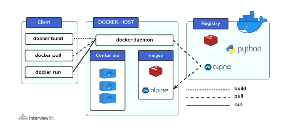
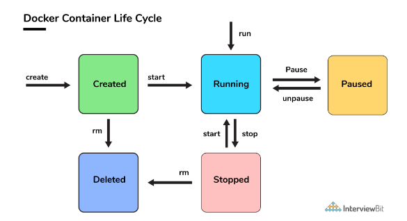

### Table of Contents - Docker

| No. | Questions |
| --- | --------- |
|   | **Docker** |
| 1 | [What is Docker?](#1)|
| 2 | [What is a Container?](#2)|
| 3 | [Can you tell something about docker container?](#3)|
| 4 | [What is Docker Image?](#4)|
| 5 | [What is Docker DockerFile?](#5)|
| 6 | [What is Docker Compose?](#6)|
| 7 | [What is Docker Hub?](#7)|
| 8 | [What is Docker Swarm?](#8)|
| 9 | [What is Docker Engine?](#9)|
| 10 | [What is Docker Registry?](#10)|
| 11 | [Can you tell what is the functionality of a hypervisor?](#11)|
| 12 | [What is the difference between Docker Image and Docker Container?](#12)|
| 13 | [Can you tell something about docker namespace?](#13)|
| 14 | [What is the docker command that lists the status of all docker containers?](#14)|
| 15 | [On what circumstances will you lose data stored in a container?](#15)|
| 16 | [What is docker image registry?](#16)|
| 17 | [How many Docker components are there?](#17)|
| 18 | [What command can you run to export a docker image as an archive?](#18)|
| 19 | [What command can be run to import a pre-exported Docker image into another Docker host?](#19)|
| 20 | [Can a paused container be removed from Docker?](#20)|
| 21 | [What command is used to check for the version of docker client and server?](#21)|
| 22 | [Differentiate between virtualization and containerization.?](#22)|
| 23 | [Differentiate between COPY and ADD commands that are used in a Dockerfile?](#23)|
| 24 | [Can a container restart by itself?](#24)|
| 25 | [What is the difference between Docker Image and Docker Container?](#25)|
| 26 | [ What is the purpose of the volume parameter in a docker run command?](#26)|
| 27 | [Can you tell the what are the purposes of up, run, and start commands of docker compose?](#27)|
| 28 | [What are the basic requirements for the docker to run on any system?](#28)|
| 29 | [List the most commonly used instructions in Dockerfile?](#29)|
| 30 | [Can we use JSON instead of YAML while developing docker-compose file in Docker?](#30)|
| 31 | [Describe the lifecycle of Docker Container?](#31)|

## 1. What is Docker? <a id="1"></a>

is a very popular and powerful open-source containerization platform that is used for building, deploying, and running applications. Docker allows you to decouple the application/software from the underlying infrastructure.

This makes it easier to deploy the application/software on different machines since you don’t have to worry about the underlying software environment where the application/software is going to run.

## 2. What is a Container? <a id="2"></a>

A container is a standard unit of software bundled with dependencies so that applications can be deployed fast and reliably b/w different computing platforms.

- Docker can be visualized as a big ship (docker) carrying huge boxes of products (containers).
- Each container has a different product (application/software) and its dependencies.
- The ship (docker) can carry multiple containers (boxes) and can be deployed on any machine (port).
- The containers (boxes) can be loaded and unloaded from the ship (docker) without affecting other containers (boxes).
- Docker container doesn’t require the installation of a separate operating system. Docker just relies or makes use of the kernel’s resources and its functionality to allocate them for the CPU and memory it relies on the kernel’s functionality and uses resource isolation for CPU and memory, and separate namespaces to isolate the application’s view of the OS (operating system).


## 3. Can you tell something about docker container? <a id="3"></a>

- In simplest terms, docker containers consist of applications and all their dependencies.
- They share the kernel and system resources with other containers and run as isolated systems in the host operating system.
- The main aim of docker containers is to get rid of the infrastructure dependency while deploying and running applications. This means that any containerized application can run on any platform irrespective of the infrastructure being used beneath.
- Technically, they are just the runtime instances of docker images.

## 4. What is Docker Image? <a id="4"></a>

- Docker image is a read-only template that is used to create a docker container.
- They are executable packages(bundled with application code & dependencies, software packages, etc.) for the purpose of creating containers.
- Docker images can be deployed to any docker environment and the containers can be spun up there to run the application.

## 5. What is Docker DockerFile? <a id="5"></a>

- Dockerfile is a text file that contains all the commands a user could call on the command line to build an image.


## 6. What is Docker Compose? <a id="6"></a>

- Docker Compose is a tool that is used to define and run multi-container Docker applications.
- It is used to run multiple containers as a single service.
- It is mainly used to run applications that have multiple containers.

It is a YAML file consisting of all the details regarding various services, networks, and volumes that are needed for setting up the Docker-based application. So, docker-compose is used for creating multiple containers, host them and establish communication between them. For the purpose of communication amongst the containers, ports are exposed by each and every container.

## 7. What is Docker Hub? <a id="7"></a>

- Docker Hub is a cloud-based registry service that allows you to link to code repositories, build your images and test them, stores manually pushed images, and links to Docker Cloud so you can deploy images to your hosts.
- It is a public cloud-based registry provided by Docker for storing public images of the containers along with the provision of finding and sharing them.
- The images can be pushed to Docker Hub through the **docker push** command.

## 8. What is Docker Swarm? <a id="8"></a>

- Docker Swarm is a clustering and scheduling tool for Docker containers.
- It allows you to deploy a set of Docker hosts into a single cluster.
- Docker Swarm is a native clustering tool provided by Docker which can be used to turn a group of Docker engines into a single, virtual Docker Engine.

## 9. What is Docker Engine? <a id="9"></a>

- Docker Engine is a client-server application with these major components:
  - A server which is a type of long-running program called a daemon process (the dockerd command).
  - A REST API which specifies interfaces that programs can use to talk to the daemon and instruct it what to do.
  - A command-line interface (CLI) client (the docker command).

## 10. What is Docker Registry? <a id="10"></a>

- Docker Registry is a stateless, highly scalable server-side application that stores and lets you distribute Docker images.
- The Registry is open-source, under the permissive Apache license.
- You can run it on-premises, or in a cloud provider.

## 11. Can you tell what is the functionality of a hypervisor? <a id="11"></a>

- A hypervisor is a program that allows multiple operating systems to share a single hardware host.
- Each operating system appears to have the host’s processor, memory, and other resources all to itself.
- However, the hypervisor is actually controlling the host processor and resources, allocating what is needed to each operating system in turn and making sure that the guest operating systems (called virtual machines) cannot disrupt each other.


This means that multiple OS can be installed on a single host system. Hypervisors are of 2 types:

1. Native Hypervisor: This type is also called a Bare-metal Hypervisor and runs directly on the underlying host system which also ensures direct access to the host hardware which is why it does not require base OS.
2. Hosted Hypervisor: This type makes use of the underlying host operating system which has the existing OS installed

## 12. What is the difference between Docker Image and Docker Container? <a id="12"></a>

- Docker Image is a read-only template that is used to create a docker container.
- Docker Container is a runtime instance of docker image.

## 13. Can you tell something about docker namespace? <a id="13"></a>

- Docker namespace is a feature that is used to isolate the containers from each other.
- It is used to provide the isolated workspace for containers.

Examples for namespace types that are currently being supported by Docker – PID, Mount, User, Network, IPC.

## 14. What is the docker command that lists the status of all docker containers? <a id="14"></a>

- docker ps -a

## 15. On what circumstances will you lose data stored in a container? <a id="15"></a>

- If the container is deleted, then the data stored in the container will be lost.

## 16. What is docker image registry? <a id="16"></a>

- Docker image registry is a place where docker images are stored.
- Docker Hub is a public registry that anyone can use, and Docker is configured to look for images on Docker Hub by default.
-  Instead of converting the applications to containers each and every time, a developer can directly use the images stored in the registry.
- This image registry can either be public or private and Docker hub is the most popular and famous public registry available.

## 17. How many Docker components are there? <a id="17"></a>

- Docker has 3 components:
  - Docker Client: This component performs “build” and “run” operations for the purpose of opening communication with the docker host.
  - Docker Host: This component has the main docker daemon and hosts containers and their associated images. The daemon establishes a connection with the docker registry.
  - Docker Registry: This component stores the docker images. There can be a public registry or a private one. The most famous public registries are Docker Hub and Docker Cloud.



## 18. What command can you run to export a docker image as an archive? <a id="18"></a>
This can be done using the docker save command and the syntax is:

```bash
docker save -o <path for generated tar file>.tar <image/container name>
```

## 19. What command can be run to import a pre-exported Docker image into another Docker host? <a id="19"></a>

This can be done using the docker load command and the syntax is:

```bash
docker load -i <path to image tar file>.tar
```

## 20. Can a paused container be removed from Docker? <a id="20"></a>

- No, a paused container cannot be removed from Docker.
- It can be removed only after it is unpaused (stopped) .

## 21. What command is used to check for the version of docker client and server?? <a id="21"></a>

- The command used to get all version information of the client and server is the **docker version**.
- To get only the server version details, we can run **docker version --format '{{.Server.Version}}'**


## 22. Differentiate between virtualization and containerization.? <a id="22"></a>

- Virtualization is a technology that allows you to create multiple simulated environments or dedicated resources from a single, physical hardware system.
- Containerization is a type of virtualization strategy that emerged as an alternative to traditional hypervisor-based virtualization.

| Virtualization | Containerization |
| --- | --------- |
| This helps developers to run and host multiple OS on the hardware of a single physical server. | This helps developers to deploy multiple applications using the same operating system on a single virtual machine or server. |
| Hypervisors provide overall virtual machines to the guest operating systems. |Containers ensure isolated environment/ user spaces are provided for running the applications. Any changes done within the container do not reflect on the host or other containers of the same host. |
| These virtual machines form an abstraction of the system hardware layer this means that each virtual machine on the host acts like a physical machine. | Containers form abstraction of the application layer which means that each container constitutes a different application. |

## 23. Differentiate between COPY and ADD commands that are used in a Dockerfile? <a id="23"></a>

Both the commands have similar functionality, but COPY is more preferred because of its higher transparency level than that of ADD.

COPY provides just the basic support of copying local files into the container whereas ADD provides additional features like remote URL and tar extraction support.

## 24. Can a container restart by itself? <a id="24"></a>

- Yes, a container can restart by itself.
- it is possible only while using certain docker-defined policies while using the docker run command. Following are the available policies:

    - Off: In this, the container won’t be restarted in case it's stopped or it fails.
    - on-failure: This policy restarts the container only when the container exits with a non-zero exit code.
    - always: This policy always restarts the container irrespective of the exit code.
    - unless-stopped: This policy always restarts the container unless it is stopped by the user.

These policies can be used as:

```bash

docker run --restart=on-failure:5 <image_name>
```

## 25. Can you tell the differences between a docker Image and Layer? <a id="25"></a>

- **Docker Image** is a read-only template that is used to create a docker container.
- **Docker Layer** Each layer corresponds to an instruction of the image’s Dockerfile. In simple words, the layer is also an image but it is the image of the instructions run.

## 26. What is the purpose of the volume parameter in a docker run command? <a id="26"></a>

- The volume parameter is used to mount a directory from the host machine to the container.
- This is used to persist the data even after the container is stopped or deleted.


## 27. Can you tell the what are the purposes of up, run, and start commands of docker compose? <a id="27"></a>

- Using the **up** command for keeping a docker-compose up (ideally at all times), we can start or restart all the networks, services, and drivers associated with the app that are specified in the docker-compose.yml file. Now if we are running the docker-compose up in the “attached” mode then all the logs from the containers would be accessible to us. In case the docker-compose is run in the “detached” mode, then once the containers are started, it just exits and shows no logs.
- Using the **run** command, the docker-compose can run one-off or ad-hoc tasks based on the business requirements. Here, the service name has to be provided and the docker starts only that specific service and also the other services to which the target service is dependent (if any).
  - This command is helpful for testing the containers and also performing tasks such as adding or removing data to the container volumes etc.
- Using the **start** command, only those containers can be restarted which were already created and then stopped. This is not useful for creating new containers on its own.

## 28. What are the basic requirements for the docker to run on any system? <a id="28"></a>

- For the Windows platform, docker atleast needs Windows 10 64bit with 2GB RAM space. For the lower versions, docker can be installed by taking help of the toolbox. Docker can be downloaded from https://docs.docker.com/docker-for-windows/ website.
- For Linux platforms, Docker can run on various Linux flavors such as Ubuntu >=12.04, Fedora >=19, RHEL >=6.5, CentOS >=6 etc

## 29. List the most commonly used instructions in Dockerfile? <a id="29"></a>

- FROM: This is used to set the base image for upcoming instructions. A docker file is considered to be valid if it starts with the FROM instruction.
- LABEL: This is used for the image organization based on projects, modules, or licensing. It also helps in automation as we specify a key-value pair while defining a label that can be later accessed and handled programmatically.
- RUN: This command is used to execute instructions following it on the top of the current image in a new layer. Note that with each RUN command execution, we add layers on top of the image and then use that in subsequent steps.
- CMD: This command is used to provide default values of an executing container. In cases of multiple CMD commands the last instruction would be considered.


## 30. Can we use JSON instead of YAML while developing docker-compose file in Docker? <a id="30"></a>

- Yes, we can use JSON instead of YAML while developing docker-compose file in Docker.

In order to run docker-compose with JSON, 
~~~bash
docker-compose -f docker-compose.json up
~~~
can be used.

## 31. Describe the lifecycle of Docker Container? <a id="31"></a>

- Created: This is the state where the container has just been created new but not started yet.
- Running: In this state, the container would be running with all its associated processes.
- Paused: This state happens when the running container has been paused.
- Stopped: This state happens when the running container has been stopped.
- Deleted: In this, the container is in a dead state.

