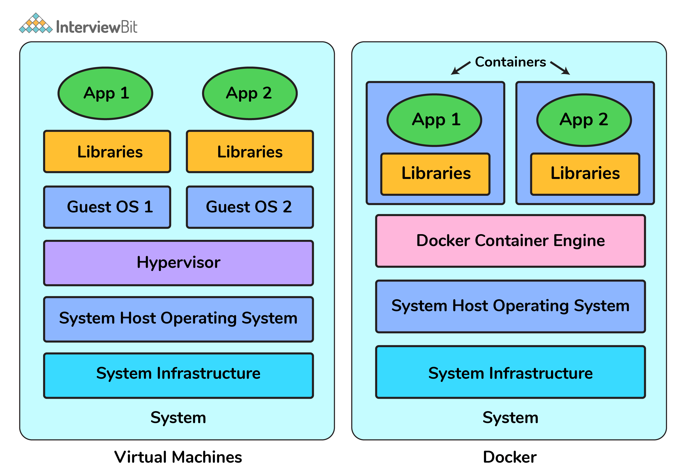
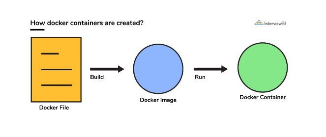
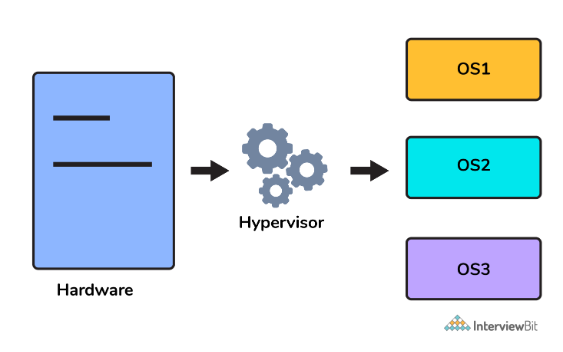

### Table of Contents - Docker

| No. | Questions |
| --- | --------- |
|   | **Docker** |
| 1 | [What is Docker?](#1)|
| 2 | [What is a Container?](#2)|
| 3 | [Can you tell something about docker container?](#3)|
| 4 | [What is Docker Image?](#4)|
| 5 | [What is Docker DockerFile?](#5)|
| 6 | [What is Docker Compose?](#6)|
| 7 | [What is Docker Hub?](#7)|
| 8 | [What is Docker Swarm?](#8)|
| 9 | [What is Docker Engine?](#9)|
| 10 | [What is Docker Registry?](#10)|
| 11 | [Can you tell what is the functionality of a hypervisor?](#11)|
| 12 | [What is the difference between Docker Image and Docker Container?](#12)|
| 13 | [What is the difference between Docker Image and Docker Container?](#13)|
| 14 | [Can you tell something about docker namespace?](#14)|
| 15 | [What is the docker command that lists the status of all docker containers?](#15)|

## 1. What is Docker? 

is a very popular and powerful open-source containerization platform that is used for building, deploying, and running applications. Docker allows you to decouple the application/software from the underlying infrastructure.

This makes it easier to deploy the application/software on different machines since you don’t have to worry about the underlying software environment where the application/software is going to run.

## 2. What is a Container? 

A container is a standard unit of software bundled with dependencies so that applications can be deployed fast and reliably b/w different computing platforms.

- Docker can be visualized as a big ship (docker) carrying huge boxes of products (containers).
- Each container has a different product (application/software) and its dependencies.
- The ship (docker) can carry multiple containers (boxes) and can be deployed on any machine (port).
- The containers (boxes) can be loaded and unloaded from the ship (docker) without affecting other containers (boxes).
- Docker container doesn’t require the installation of a separate operating system. Docker just relies or makes use of the kernel’s resources and its functionality to allocate them for the CPU and memory it relies on the kernel’s functionality and uses resource isolation for CPU and memory, and separate namespaces to isolate the application’s view of the OS (operating system).

## 3. Can you tell something about docker container? 

- In simplest terms, docker containers consist of applications and all their dependencies.
- They share the kernel and system resources with other containers and run as isolated systems in the host operating system.
- The main aim of docker containers is to get rid of the infrastructure dependency while deploying and running applications. This means that any containerized application can run on any platform irrespective of the infrastructure being used beneath.
- Technically, they are just the runtime instances of docker images.

## 4. What is Docker Image? 

- Docker image is a read-only template that is used to create a docker container.
- They are executable packages(bundled with application code & dependencies, software packages, etc.) for the purpose of creating containers.
- Docker images can be deployed to any docker environment and the containers can be spun up there to run the application.

## 5. What is Docker DockerFile? 

- Dockerfile is a text file that contains all the commands a user could call on the command line to build an image.

## 6. What is Docker Compose? 

- Docker Compose is a tool that is used to define and run multi-container Docker applications.
- It is used to run multiple containers as a single service.
- It is mainly used to run applications that have multiple containers.

It is a YAML file consisting of all the details regarding various services, networks, and volumes that are needed for setting up the Docker-based application. So, docker-compose is used for creating multiple containers, host them and establish communication between them. For the purpose of communication amongst the containers, ports are exposed by each and every container.

## 7. What is Docker Hub? 

- Docker Hub is a cloud-based registry service that allows you to link to code repositories, build your images and test them, stores manually pushed images, and links to Docker Cloud so you can deploy images to your hosts.

## 8. What is Docker Swarm? 

- Docker Swarm is a clustering and scheduling tool for Docker containers.
- It allows you to deploy a set of Docker hosts into a single cluster.
- Docker Swarm is a native clustering tool provided by Docker which can be used to turn a group of Docker engines into a single, virtual Docker Engine.

## 9. What is Docker Engine? 

- Docker Engine is a client-server application with these major components:
  - A server which is a type of long-running program called a daemon process (the dockerd command).
  - A REST API which specifies interfaces that programs can use to talk to the daemon and instruct it what to do.
  - A command-line interface (CLI) client (the docker command).

## 10. What is Docker Registry? 

- Docker Registry is a stateless, highly scalable server-side application that stores and lets you distribute Docker images.
- The Registry is open-source, under the permissive Apache license.
- You can run it on-premises, or in a cloud provider.

## 11. Can you tell what is the functionality of a hypervisor? 

- A hypervisor is a program that allows multiple operating systems to share a single hardware host.
- Each operating system appears to have the host’s processor, memory, and other resources all to itself.
- However, the hypervisor is actually controlling the host processor and resources, allocating what is needed to each operating system in turn and making sure that the guest operating systems (called virtual machines) cannot disrupt each other.

This means that multiple OS can be installed on a single host system. Hypervisors are of 2 types:

1. Native Hypervisor: This type is also called a Bare-metal Hypervisor and runs directly on the underlying host system which also ensures direct access to the host hardware which is why it does not require base OS.
2. Hosted Hypervisor: This type makes use of the underlying host operating system which has the existing OS installed

## 12. What is the difference between Docker Image and Docker Container? 

- Docker Image is a read-only template that is used to create a docker container.
- Docker Container is a runtime instance of docker image.

## 13. Can you tell something about docker namespace? 

- Docker namespace is a feature that is used to isolate the containers from each other.
- It is used to provide the isolated workspace for containers.

Examples for namespace types that are currently being supported by Docker – PID, Mount, User, Network, IPC.

