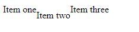
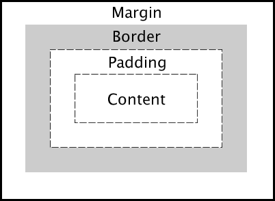

# Frontend Questions


### Table of Contents - HTML and CSS

| No. | Questions |
| --- | --------- |
|   | **CSS AND HTML** |
| 1 | [Center an element](#1)|
| 2 | [Difference between relative, absolute and fixed position](#2)|
| 3 | [Difference between display: none and visibility: hidden](#3)|
| 4 | [Difference between div and span](#4)|
| 5 | [State all the elements of the CSS Box Model](#5)|
| 6 | [Explain the difference between "margin" and "padding" in CSS and how they impact web page layout](#6)|
| 7 | [What is the CSS box-sizing property, and how does it affect the layout of elements?](#7)|
## 1. Center an element

### given the following code, how to center the div?<a id="1"></a>

~~~html
<div class="container">
     <div class="item">I need to be centered.</div>
</div>
~~~

~~~css
.item {
  margin: auto;
  text-align: center;
}   
~~~

## Position an element

## 2. Difference between relative, absolute and fixed position<a id="2"></a>

- <b>relative</b> is relative to its normal position.
- <b>absolute</b> is relative to its first positioned ancestor.
- <b>fixed</b> is relative to the viewport.

### given the following code, how would the output would look like ?

~~~html
  <div class="container">
      <div id="item1">Item one</div>
      <div id="item2">Item two</div>
      <div id="item3">Item three</div>
  </div>
~~~

~~~css
.container {
   display: flex;
}
#item2 {
   position: relative; 
   top: 10px;
}
~~~



## 3. Difference between display: none and visibility: hidden<a id="3"></a>

- <b>display: none</b> removes the element from the normal document flow and the element will not take up any space.
- <b>visibility: hidden</b> hides the element but it will still take up the same space as before.

## 4. Difference between div and span<a id="4"></a>

| DIV | SPAN |
| -------------------------------------------------- | -------------------------------------------------- |
| Block level element | Incline level element |
| Used to wrap sections of a document | Use to wrap portions of text, images |
| Used while creating CSS based layouts in html | Used to stylize text |

## 5. State all the elements of the CSS Box Model<a id="5"></a>


- <b>Content:</b> Displays the main content and the text of the web page.
- <b>Padding:</b> This area encircles the content.
- <b>Border:</b> The border is the padding's outer layer.
- <b>Margin:</b>  Margin is the area outside the border.

## 6. Explain the difference between "margin" and "padding" in CSS and how they impact web page layout<a id="6"></a>

- `Margin` and `Padding` are two essential CSS properties that control the spacing and layout of elements in a web page:

  - **Margin:**
    - Margins are the space outside the element's border.
    - They affect the space between elements and control the spacing between elements and their surrounding elements.
    - Margins do not have a background color and are transparent.
    - Margin values can be positive or negative, allowing you to create gaps or overlap elements.

  - **Padding:**
    - Padding is the space between an element's content and its border.
    - It influences the internal spacing of an element, affecting the space between the content and the element's border.
    - Padding is visible and can have a background color or other styles applied.
    - Padding values are typically non-negative.

## 7. What is the CSS `box-sizing` property, and how does it affect the layout of elements?<a id="7"></a>

The `box-sizing` property in CSS determines how the total width and height of an element are calculated. It has three possible values: `content-box`, `border-box`, and `padding-box` (though `padding-box` is not widely supported).

- `content-box` (Default behavior): The width and height of an element are calculated only based on its content area. Padding and borders are added to the specified width and height, increasing the total dimensions of the element.

- `border-box`: The width and height of an element include its content, padding, and borders. In this model, the specified width and height of the element determine the overall size of the box. Padding and borders are included within the specified dimensions, potentially altering the size of the content area.

The choice of `box-sizing` impacts how designers and developers create layouts and manage spacing. `border-box` is often favored as it simplifies layout calculations by including padding and borders within specified dimensions, making it easier to create consistent and predictable layouts. It helps avoid unexpected variations in element sizes due to padding and border additions.

Example usage of `box-sizing`:

```css
/* Applying box-sizing to all elements */
* {
  box-sizing: border-box;
}

/* Applying box-sizing to specific elements */
.element {
  box-sizing: border-box;
}
```
