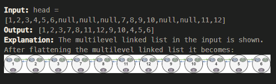
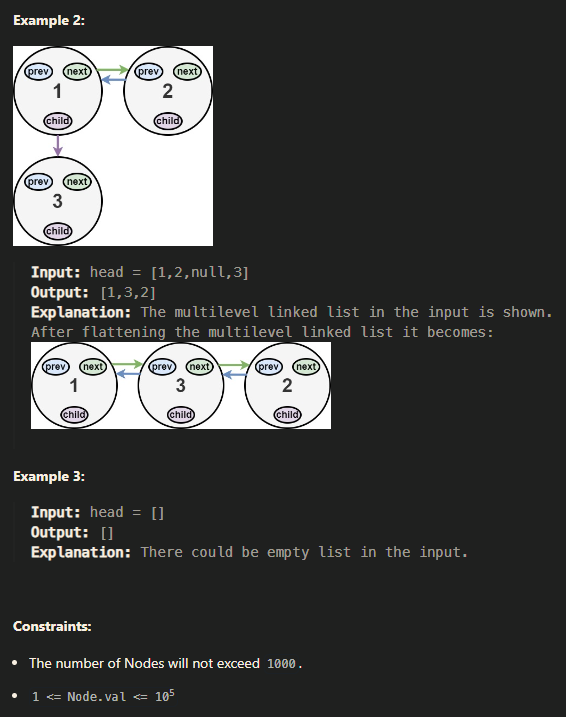
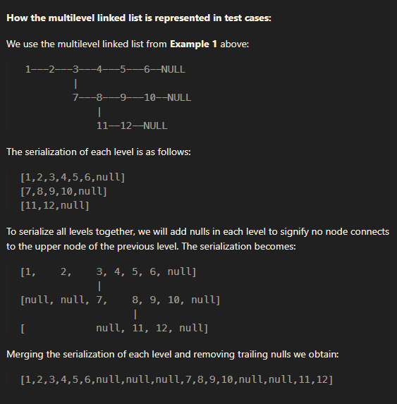

## 1. Flatten a Multilevel Doubly Linked List

You are given a doubly linked list, which contains nodes that have a next pointer, a previous pointer, and an additional child pointer. This child pointer may or may not point to a separate doubly linked list, also containing these special nodes. These child lists may have one or more children of their own, and so on, to produce a multilevel data structure as shown in the example below.

Given the head of the first level of the list, flatten the list so that all the nodes appear in a single-level, doubly linked list. Let curr be a node with a child list. The nodes in the child list should appear after curr and before curr.next in the flattened list.

Return the head of the flattened list. The nodes in the list must have all of their child pointers set to null.

~~~js
/**
 * // Definition for a Node.
 * function Node(val,prev,next,child) {
 *    this.val = val;
 *    this.prev = prev;
 *    this.next = next;
 *    this.child = child;
 * };
 */

/**
 * @param {Node} head
 * @return {Node}
 */

var flatten = function(head) {
    if(!head) return head;
    
    function traverse(node) {
        if(!node.next && !node.child) return node;
        
        if(node.child) {
            const nextNode = node.next;
            node.next = node.child;
            node.next.prev = node;
            node.child = null;
            
            if(nextNode) {
                const tailNode = traverse(node.next);
                tailNode.next = nextNode;
                nextNode.prev = tailNode;
            }
        }
        return traverse(node.next);
    }
    traverse(head);
    return head;
};
~~~