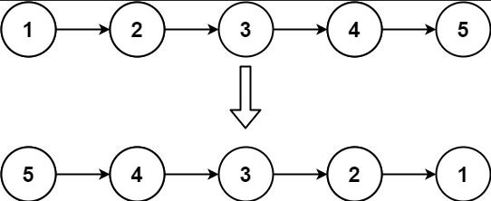
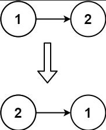
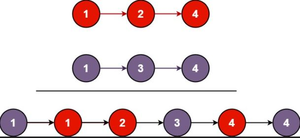
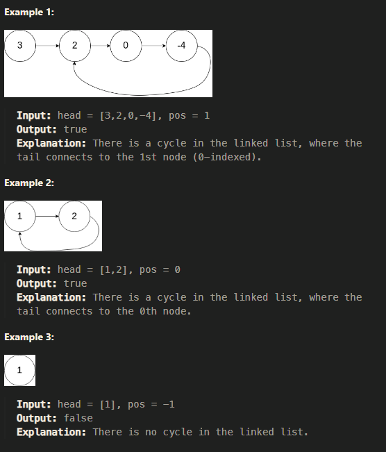

# Reverse Linked List

## Given the head of a singly linked list, reverse the list, and return the reversed list.

~~~js
Example 1:
~~~

~~~js
Input: head = [1,2,3,4,5]
Output: [5,4,3,2,1]
~~~

~~~js
Example 1:
~~~

~~~js
Input: head = [1,2]
Output: [2,1]

Example 3:

Input: head = []
Output: []
~~~

## Solution

~~~js
/**
 * Definition for singly-linked list.
 * function ListNode(val, next) {
 *     this.val = (val===undefined ? 0 : val)
 *     this.next = (next===undefined ? null : next)
 * }
 */
/**
 * @param {ListNode} head
 * @return {ListNode}
 */
var reverseList = function(head) {
    let prev = null;
    let current = head;
    let next = null;
    
    while (current) {//1, 2, 3
        next = current.next;//2,3,4
        current.next = prev;//null,1,2
        prev = current;//1,2,3
        current = next;//2,3,4
    }
    // 3-> 2-> 1 -> null
    
    return prev;
};
~~~

# Merge Two Sorted Lists

## You are given the heads of two sorted linked lists list1 and list2.

## Merge the two lists in a one sorted list. The list should be made by splicing together the nodes of the first two lists.

## Return the head of the merged linked list.

~~~js
Example 1:
~~~

~~~js
Input: list1 = [1,2,4], list2 = [1,3,4]
Output: [1,1,2,3,4,4]

Example 2:

Input: list1 = [], list2 = []
Output: []

Example 3:

Input: list1 = [], list2 = [0]
Output: [0]
~~~

~~~js
/**
 * Definition for singly-linked list.
 * function ListNode(val, next) {
 *     this.val = (val===undefined ? 0 : val)
 *     this.next = (next===undefined ? null : next)
 * }
 */
/**
 * @param {ListNode} list1
 * @param {ListNode} list2
 * @return {ListNode}
 */
var mergeTwoLists = function(l1, l2) {

    let head = ListNode(-1,null);// head initialization
    let aux = head;
    while(l1  && l2 ){ // while there are elements in one of the list
        if(l1.val < l2.val){
            aux.next = ListNode(l1.val,l1.next); //create and add node
            l1 = l1.next;
        }else{
            aux.next = ListNode(l2.val,l2.next); //create and add node
            l2 = l2.next;
        }
        aux = aux.next; // point to the next node
    }
    aux.next = l1||l2;//add remaining node
    return head.next;

};

 function ListNode(val, next) {
     let node = Object();
     node.val = (val===undefined ? 0 : val);
     node.next = (next===undefined ? null : next);

     return node;
 }
~~~

# Linked List Cycle

Given head, the head of a linked list, determine if the linked list has a cycle in it.

There is a cycle in a linked list if there is some node in the list that can be reached again by continuously following the next pointer. Internally, pos is used to denote the index of the node that tail's next pointer is connected to. Note that pos is not passed as a parameter.

Return true if there is a cycle in the linked list. Otherwise, return false.

~~~js
/**
 * Definition for singly-linked list.
 * function ListNode(val) {
 *     this.val = val;
 *     this.next = null;
 * }
 */

/**
 * @param {ListNode} head
 * @return {boolean}
 */
var hasCycle = function(head) {
    if(!head) return false
    while(head.val !== "done"){
        head.val = "done";
        head = head.next;
        if(!head) return false;
    }
    return true
};

~~~