# Invert Binary Tree

## Given the root of a binary tree, invert the tree, and return its root.

## Example 1:

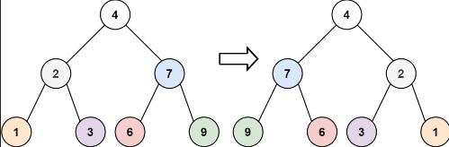

~~~js
Input: root = [4,2,7,1,3,6,9]
Output: [4,7,2,9,6,3,1]
~~~

## Example 2:

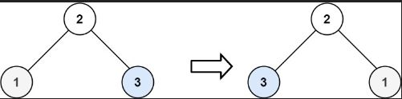

~~~js
Input: root = [2,1,3]
Output: [2,3,1]

Example 3:

Input: root = []
Output: []
~~~

## Solution

~~~js
/**
 * Definition for a binary tree node.
 * function TreeNode(val, left, right) {
 *     this.val = (val===undefined ? 0 : val)
 *     this.left = (left===undefined ? null : left)
 *     this.right = (right===undefined ? null : right)
 * }
 */
/**
 * @param {TreeNode} root
 * @return {TreeNode}
 */
var invertTree = function(root) {
    if (root === null) return null
    let temp = root.left
    root.left = root.right
    root.right = temp 
    if(root.left) invertTree(root.left)
    if(root.right) invertTree(root.right)
    return root
};
~~~

# Maximum Depth of Binary Tree

## Given the root of a binary tree, return its maximum depth.

## A binary tree's maximum depth is the number of nodes along the longest path from the root node down to the farthest leaf node.

## Example 1:

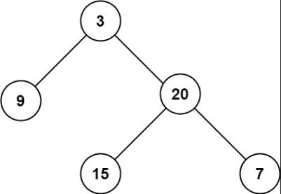

~~~js

Input: root = [3,9,20,null,null,15,7]
Output: 3

Example 2:

Input: root = [1,null,2]
Output: 2

~~~
## Solution
~~~js
/**
 * Definition for a binary tree node.
 * function TreeNode(val, left, right) {
 *     this.val = (val===undefined ? 0 : val)
 *     this.left = (left===undefined ? null : left)
 *     this.right = (right===undefined ? null : right)
 * }
 */
/**
 * @param {TreeNode} root
 * @return {number}
 */
var maxDepth = function(root) {
    let depth = 0
    depthTraverse(root)
    function depthTraverse(root,nodeDepth = 1){
         if (!root){
            return
        }
        
        if (nodeDepth>depth){
            depth=nodeDepth
        }
      
        
        depthTraverse(root.left,nodeDepth+1)
        depthTraverse(root.right,nodeDepth+1)
    }
    
    return depth
    
};
~~~

# Diameter of Binary Tree

## Given the root of a binary tree, return the length of the diameter of the tree.

## The diameter of a binary tree is the length of the longest path between any two nodes in a tree. This path may or may not pass through the root.

## The length of a path between two nodes is represented by the number of edges between them.

## Example 1:

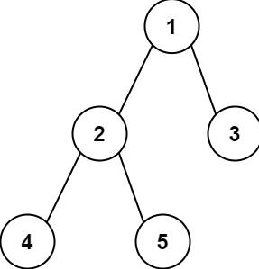

~~~js
Input: root = [1,2,3,4,5]
Output: 3
Explanation: 3is the length of the path [4,2,1,3] or [5,2,1,3].
~~~

## Example 2:

~~~js
Input: root = [1,2]
Output: 1
~~~

## Solution

~~~js
/**
 * Definition for a binary tree node.
 * function TreeNode(val, left, right) {
 *     this.val = (val===undefined ? 0 : val)
 *     this.left = (left===undefined ? null : left)
 *     this.right = (right===undefined ? null : right)
 * }
 */
/**
 * @param {TreeNode} root
 * @return {number}
 */
var diameterOfBinaryTree = function(root) {
    let diameter = 0;
    
    dfs(root);
    
    return diameter;
    
    function dfs(node, level) {
        if (!node) return 0;
        
        const left = dfs(node.left);
        const right = dfs(node.right);
        
        // update diameter at every node
        diameter = Math.max(diameter, left + right);

        // update the largest number of edge so far
        return 1 + Math.max(left, right);
    }
};
~~~

# Balanced Binary Tree

## Given a binary tree, determine if it is height-balanced ( A height-balanced binary tree is a binary tree in which the depth of the two subtrees of every node never differs by more than one.  ) .

## Example 1:

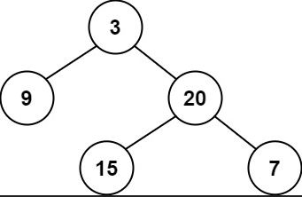

~~~js

Input: root = [3,9,20,null,null,15,7]
Output: true
~~~
## Example 2:
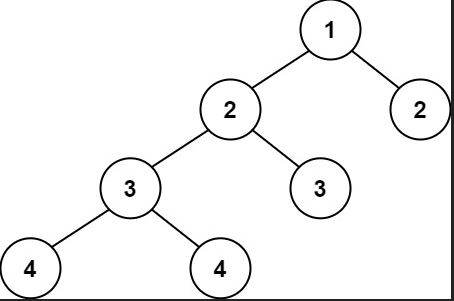
~~~js
Input: root = [1,2,2,3,3,null,null,4,4]
Output: false

Example 3:

Input: root = []
Output: true

~~~

## Solution

~~~js
/**
 * Definition for a binary tree node.
 * function TreeNode(val, left, right) {
 *     this.val = (val===undefined ? 0 : val)
 *     this.left = (left===undefined ? null : left)
 *     this.right = (right===undefined ? null : right)
 * }
 */
/**
 * @param {TreeNode} root
 * @return {boolean}
 */
// var isBalanced = function(root) {

var isBalanced = function(root) {
	let isBalanced = true
	function dfs(node){
		if(!node) return 0
		const left = dfs(node.left)
		const right = dfs(node.right)
		if(Math.abs(left-right) > 1){
			isBalanced = false
		}
		return 1 + Math.max(left, right)
	}
	dfs(root)
  return isBalanced;    
};
~~~

# Same Tree

## Given the roots of two binary trees p and q, write a function to check if they are the same or not.

## Two binary trees are considered the same if they are structurally identical, and the nodes have the same value.

## Example 1:

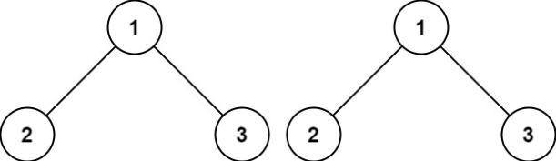

~~~js
Input: p = [1,2,3], q = [1,2,3]
Output: true
~~~

## Example 2:

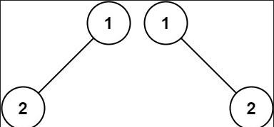

~~~js
Input: p = [1,2], q = [1,null,2]
Output: false
~~~

## Example 3:

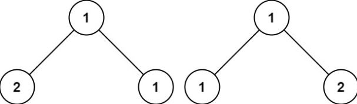

~~~js
Input: p = [1,2,1], q = [1,1,2]
Output: false
~~~
## Solution
~~~js
/**
 * Definition for a binary tree node.
 * function TreeNode(val, left, right) {
 *     this.val = (val===undefined ? 0 : val)
 *     this.left = (left===undefined ? null : left)
 *     this.right = (right===undefined ? null : right)
 * }
 */
/**
 * @param {TreeNode} p
 * @param {TreeNode} q
 * @return {boolean}
 */
var isSameTree = function (p, q) {
  if (!p && !q) return true;
  if ((p && !q) || (q && !p) || p.val !== q.val) return false;
  return isSameTree(p.left, q.left) && isSameTree(p.right, q.right);
};
~~~

# Subtree of Another Tree

## Given the roots of two binary trees root and subRoot, return true if there is a subtree of root with the same structure and node values of subRoot and false otherwise.

## A subtree of a binary tree tree is a tree that consists of a node in tree and all of this node's descendants. The tree tree could also be considered as a subtree of itself.

## Example 1:

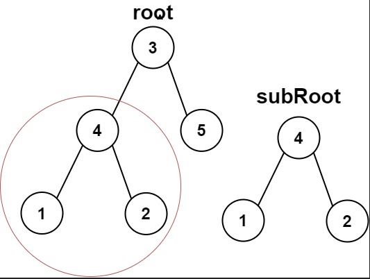

~~~js
Input: root = [3,4,5,1,2], subRoot = [4,1,2]
Output: true
~~~

## Example 2:

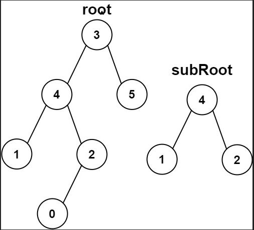

~~~js
Input: root = [3,4,5,1,2,null,null,null,null,0], subRoot = [4,1,2]
Output: false
~~~
## Solution
~~~js

/**
 * Definition for a binary tree node.
 * function TreeNode(val, left, right) {
 *     this.val = (val===undefined ? 0 : val)
 *     this.left = (left===undefined ? null : left)
 *     this.right = (right===undefined ? null : right)
 * }
 */
/**
 * @param {TreeNode} root
 * @param {TreeNode} subRoot
 * @return {boolean}
 */

const isSameTree = (a, b)=>{
    if (!a && !b) return true;
    if (a && !b) return false;
    if (b && !a) return false;
    if (a.val === b.val) return isSameTree(a.left, b.left) && isSameTree(a.right, b.right);
}

var isSubtree = function(root, subRoot) {
    if (!root) return false;
    if (isSameTree(root, subRoot)) return true;
    return isSubtree(root.left, subRoot) || isSubtree(root.right, subRoot)
};
~~~