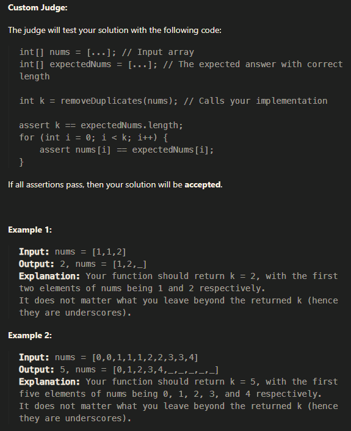

# Valid Palindrome

## A phrase is a palindrome if, after converting all uppercase letters into lowercase letters and removing all non-alphanumeric characters, it reads the same forward and backward. Alphanumeric characters include letters and numbers.

## Given a string s, return true if it is a palindrome, or false otherwise.

~~~js
xample 1:

Input: s = "A man, a plan, a canal: Panama"
Output: true
Explanation: "amanaplanacanalpanama" is a palindrome.
Example 2:

Input: s = "race a car"
Output: false
Explanation: "raceacar" is not a palindrome.
Example 3:

Input: s = " "
Output: true
Explanation: s is an empty string "" after removing non-alphanumeric characters.
Since an empty string reads the same forward and backward, it is a palindrome.
~~~

## Solution

~~~js
/**
 * @param {string} s
 * @return {boolean}
 */
var isPalindrome = function(s) {
    
    //s=  s.toLowerCase().replace(/[^a-z0-9]/gi,'');
    //gi means global and case insensitive, replace all non-alphanumeric characters

    let result = '';
    for (let i = 0; i < s.length; i++) {
        let char = s[i].toLowerCase();
        if ((char >= 'a' && char <= 'z') || (char >= '0' && char <= '9')) {
            result += char;
        }
    }
    s = result;
  
    let p2=s.length-1;
    for(let i=0;i<s.length;i++,p2--){
        if(!(s[i] == s[p2])){
            return false;
        }
    }
    return true;
};
~~~

with regex
~~~js
/**
 * @param {string} s
 * @return {boolean}
 */

var isPalindrome = function(s) {
    s = s.toLowerCase().replace(/[^a-z0-9]/gi,''); // gi means global and case insensitive, replace all non-alphanumeric characters, ^ means not
    let p2=s.length-1;
    for(let i=0;i<s.length;i++,p2--){
        if(!(s[i] == s[p2])){
            return false;
        }
    }
    return true;
};
~~~

# Palindrome Number

Given an integer x, return true if x is a palindrome, and false otherwise.

- Example 1:

  - Input: x = 121
  - Output: true
  - Explanation: 121 reads as 121 from left to right and from right to left.
- Example 2:

  - Input: x = -121
  - Output: false
  - Explanation: From left to right, it reads -121. From right to left, it becomes 121-. Therefore it is not a palindrome.
- Example 3:

  - Input: x = 10
  - Output: false
  - Explanation: Reads 01 from right to left. Therefore it is not a palindrome.

~~~js
/**
 * @param {number} x
 * @return {boolean}
 */
var isPalindrome = function(x) {
    x = x + "";

    for(let i = 0 , j = x.length -1; i < x.length/2 ; i++ , j--){
        if(x[i] != x[j]){
            return false;
        }
    }
    return true;

};
~~~

# Best time to buy and sell stock

## You are given an array prices where prices[i] is the price of a given stock on the ith day.

## You want to maximize your profit by choosing a single day to buy one stock and choosing a different day in the future to sell that stock.

## Return the maximum profit you can achieve from this transaction. If you cannot achieve any profit, return 0.

~~~js
Example 1:

Input: prices = [7,1,5,3,6,4]
Output: 5
Explanation:
Buy on day 2 (price = 1) and sell on day 5 (price = 6), profit = 6-1 = 5.
Note that buying on day 2 and selling on day 1 is not allowed because you must buy before you sell.

Example 2:

Input: prices = [7,6,4,3,1]
Output: 0
Explanation: In this case, no transactions are done and the max profit = 0.
~~~

~~~js

/**
 * @param {number[]} prices
 * @return {number}
 */
var maxProfit = function(prices) {

    let lPointer = 0;
    let rPointer = 1;
    let profit = 0;

    while(rPointer <= prices.length){
        if(prices[lPointer] < prices[rPointer] ){
            profit =  Math.max(profit,prices[rPointer] - prices[lPointer]);
        }else{
            lPointer= rPointer;
        }
        rPointer++;
    }
    return profit;
    
};

~~~

# Longest Substring without repeating characters

## Given a string s, find the length of the longest substring without repeating characters.

~~~js
Example 1:

Input: s = "abcabcbb"
Output: 3
Explanation: The answer is "abc", with the length of 3.

Example 2:

Input: s = "bbbbb"
Output: 1
Explanation: The answer is "b", with the length of 1.

Example 3:

Input: s = "pwwkew"
Output: 3
Explanation: The answer is "wke", with the length of 3.
Notice that the answer must be a substring, "pwke" is a subsequence and not a substring.

~~~

## Solution

~~~js

/**
 * @param {string} s
 * @return {number}
 */
var lengthOfLongestSubstring = function(str) {
  let longest = 0;
  let seen = {};
  let start = 0;
 
  for (let i = 0; i < str.length; i++) {
    let char = str[i];
    if (seen[char]) {
      start = Math.max(start, seen[char]);// if the character is already in the seen object, update the start pointer to the index of the character + 1
    }
    // index - beginning of substring + 1 (to include current in count)
    longest = Math.max(longest, i - start + 1);// update the longest substring
    // store the index of the next char so as to not double count
    seen[char] = i + 1;
  }
  return longest;
};
~~~

or better with sliding window

~~~js
lengthOfLongestSubstring(s) {
        let mp = new Map();
        let l = 0, res = 0;
        
        for (let r = 0; r < s.length; r++) {
            if (mp.has(s[r])) {
                l = Math.max(mp.get(s[r]) + 1, l);
            }
            mp.set(s[r], r);
            res = Math.max(res, r - l + 1);
        }
        return res;
    }
~~~

# Remove Element

Given an integer array nums and an integer val, remove all occurrences of val in nums in-place. The order of the elements may be changed. Then return the number of elements in nums which are not equal to val.

Consider the number of elements in nums which are not equal to val be k, to get accepted, you need to do the following things:

- Change the array nums such that the first k elements of nums contain the elements which are not equal to val. The remaining elements of nums are not important as well as the size of nums.
- Return k.

~~~js
/**
 * @param {number[]} nums
 * @param {number} val
 * @return {number}
 */
var removeElement = function(nums, val) {
    let left = 0;
    let right = nums.length - 1;
    
    while (left <= right) {
        if (nums[left] === val) {
            nums[left] = nums[right];
            right--;
        }
        else {
            left++;
        }
    }
    
    return left;
};
~~~

# Remove Duplicates from Sorted Array

Given an integer array nums sorted in non-decreasing order, remove the duplicates in-place such that each unique element appears only once. The relative order of the elements should be kept the same. Then return the number of unique elements in nums.

Consider the number of unique elements of nums to be k, to get accepted, you need to do the following things:

- Change the array nums such that the first k elements of nums contain the unique elements in the order they were present in nums initially. The remaining elements of nums are not important as well as the size of nums.
- Return k.

~~~js
/**
 * @param {number[]} nums
 * @return {number}
 */
var removeDuplicates = function(n) {
    
    let j = 0;
    
    for(let i = 0; i < n.length; i++) {
        
        if(n[i] !== n[i+1]) {    
            n[j++] = n[i];
        }
    };
    
    return j;
};
~~~

# Repeated Substring Pattern

Given a string s, check if it can be constructed by taking a substring of it and appending multiple copies of the substring together.

- Example 1:

  - Input: s = "abab"
  - Output: true
  - Explanation: It is the substring "ab" twice.
- Example 2:

  - Input: s = "aba"
  - Output: false
- Example 3:

  - Input: s = "abcabcabcabc"
  - Output: true
  - Explanation: It is the substring "abc" four times or the substring "abcabc" twice.

~~~js
/**
 * @param {string} s
 * @return {boolean}
 */
var repeatedSubstringPattern = function(s) {
  let sub = "";
  for (let i = 0; i < Math.floor(s.length / 2); i++) {
    sub += s[i];
    if (sub.repeat(s.length / sub.length) === s) return true;
    //repeat() method constructs and returns a new string which contains the specified number of copies of the string on which it was called, concatenated together.
  }
  return false;
};
~~~

# K items with the maximum sum

There is a bag that consists of items, each item has a number 1, 0, or -1 written on it.

You are given four non-negative integers numOnes, numZeros, numNegOnes, and k.

The bag initially contains:

- numOnes items with 1s written on them.
- numZeroes items with 0s written on them.
- numNegOnes items with -1s written on them.

We want to pick exactly k items among the available items. Return the maximum possible sum of numbers written on the items.

Example 1:

- Input: numOnes = 3, numZeros = 2, numNegOnes = 0, k = 2
  - Output: 2
  - Explanation: We have a bag of items with numbers written on them {1, 1, 1, 0, 0}. We take 2 items with 1 written on them and get a sum in a total of 2.

  It can be proven that 2 is the maximum possible sum.
Example 2:

- Input: numOnes = 3, numZeros = 2, numNegOnes = 0, k = 4
  - Output: 3
  - Explanation: We have a bag of items with numbers written on them {1, 1, 1, 0, 0}. We take 3 items with 1 written on them, and 1 item with 0 written on it, and get a sum in a total of 3.
  It can be proven that 3 is the maximum possible sum.

~~~js

/**
 * @param {number} numOnes
 * @param {number} numZeros
 * @param {number} numNegOnes
 * @param {number} k
 * @return {number}
 */
// var kItemsWithMaximumSum = function(numOnes, numZeros, numNegOnes, k) {
//     let maxSum = 0;
//     for(i=0;i<k;i++){
//         if(numNegOnes>0 && numOnes<=0 && numZeros<=0){
//             maxSum = maxSum-1;
//             numNegOnes--;
//         }
//         if(numOnes>0){
//             maxSum = maxSum+1;
//             numOnes--;
//         }else if(numZeros>0){
//             numZeros--;
//         }

//     }
//     return maxSum;

// };

var kItemsWithMaximumSum = function(numOnes, numZeros, numNegOnes, k) {
    if(numOnes>=k){
        return k;
    }else if(k<=numOnes+numZeros){
        return numOnes;
    }else{
        return numOnes-(k-numOnes-numZeros);
    }

};
~~~

# Minimum size subarray sum

Given an array of positive integers nums and a positive integer target, return the minimal length of a 
subarray
 whose sum is greater than or equal to target. If there is no such subarray, return 0 instead.

- Example 1:

  - Input: target = 7, nums = [2,3,1,2,4,3]
  - Output: 2
  - Explanation: The subarray [4,3] has the minimal length under the problem constraint.

- Example 2:
    
      - Input: target = 4, nums = [1,4,4]
      - Output: 1

- Example 3:
    
      - Input: target = 11, nums = [1,1,1,1,1,1,1,1]
      - Output: 0

~~~js
/**
 * @param {number} target
 * @param {number[]} nums
 * @return {number}
 */
var minSubArrayLen = function(sum, nums) {
  let total = 0;
  let start = 0;
  let end = 0;
  let minLen = Infinity;
 
  while (start < nums.length) {
    // if current window doesn't add up to the given sum then 
		// move the window to right
    if(total < sum && end < nums.length){
      total += nums[end];
			end++;
    }
    // if current window adds up to at least the sum given then
		// we can shrink the window 
    else if(total >= sum){
      minLen = Math.min(minLen, end-start);
			total -= nums[start];
			start++;
    } 
    // current total less than required total but we reach the end, need this or else we'll be in an infinite loop 
    else {
      break;
    }
  }
 
  return minLen === Infinity ? 0 : minLen;
};
~~~

# 3Sum
Given an integer array nums, return all the triplets [nums[i], nums[j], nums[k]] such that i != j, i != k, and j != k, and nums[i] + nums[j] + nums[k] == 0.
Notice that the solution set must not contain duplicate triplets.

- Example 1:

  - Input: nums = [-1,0,1,2,-1,-4]
  - Output: [[-1,-1,2],[-1,0,1]]
  - Explanation: nums[0] + nums[1] + nums[2] == 0 is true. 
  nums[0] + nums[2] + nums[3] == 0 is false. 
  nums[0] + nums[4] + nums[5] == 0 is true. 
  The distinct triplets are [-1,-1,2] and [-1,0,1].
- Example 2:
  - Input: nums = [0,1,1]
  - Output: []
  - Explanation: The only possible triplet does not sum up to 0.
- Example 3:
  - Input: nums = [0,0,0]
  - Output: [[0,0,0]]
  - Explanation: The only possible triplet sums up to 0.

## Solution with Two Pointers
~~~js

var threeSum = function(nums) {
    nums.sort((a, b) => a - b);
        const res = [];

        for (let i = 0; i < nums.length; i++) {
            if (nums[i] > 0) break;
            if (i > 0 && nums[i] === nums[i - 1]) continue;

            let l = i + 1;
            let r = nums.length - 1;
            while (l < r) {
                const sum = nums[i] + nums[l] + nums[r];
                if (sum > 0) {
                    r--;
                } else if (sum < 0) {
                    l++;
                } else {
                    res.push([nums[i], nums[l], nums[r]]);
                    l++;
                    r--;
                    while (l < r && nums[l] === nums[l - 1]) {
                        l++;
                    }
                }
            }
        }
        return res;
};
~~~

# Container With Most Water

You are given an integer array height of length n. There are n vertical lines drawn such that the two endpoints of the ith line are (i, 0) and (i, height[i]).

Find two lines that together with the x-axis form a container, such that the container contains the most water.

Return the maximum amount of water a container can store.

Notice that you may not slant the container.

- Example 1:

  - Input: height = [1,8,6,2,5,4,8,3,7]
  - Output: 49
  - Explanation: The above vertical lines are represented by array [1,8,6,2,5,4,8,3,7]. In this case, the max area of water the container can contain is 49.
- Example 2:
  - Input: height = [1,1]
  - Output: 1
- Example 3:
  - Input: height = [4,3,2,1,4]
  - Output: 16
  
  ## Solution with Two Pointers

~~~js
maxArea(heights) {
        let l = 0;
        let r = heights.length - 1;
        let res = 0;

        while (l < r) {
            const area = Math.min(heights[l], heights[r]) * (r - l);
            res = Math.max(res, area);
            if (heights[l] <= heights[r]) {
                l++;
            } else {
                r--;
            }
        }
        return res;
    }
~~~

# Longest Repeating Character Replacement

You are given a string s and an integer k. You can choose any character of the string and change it to any other uppercase English character. You can perform this operation at most k times.

Return the length of the longest substring containing the same letter you can get after performing the above operations.

- Example 1:

  - Input: s = "ABAB", k = 2
  - Output: 4
  - Explanation: Replace the two 'A's with two 'B's or vice versa.

- Example 2:
  - Input: s = "AABABBA", k = 1
  - Output: 4
  - Explanation: Replace the one 'B' in the middle with an 'A' and form "AABBBBA" or replace the one 'A' in the middle with a 'B' and form "AAABABBA".
  - The substring "BBBB" is the longest substring containing only one unique letter, which is 'B'.

# Solution with Sliding Window

~~~js
characterReplacement(s, k) {
        let count = new Map();
        let res = 0;

        let l = 0, maxf = 0;
        for (let r = 0; r < s.length; r++) {
            count.set(s[r], (count.get(s[r]) || 0) + 1);
            maxf = Math.max(maxf, count.get(s[r]));

            while ((r - l + 1) - maxf > k) {
                count.set(s[l], count.get(s[l]) - 1);
                l++;
            }
            res = Math.max(res, r - l + 1);
        }

        return res;
    }
~~~