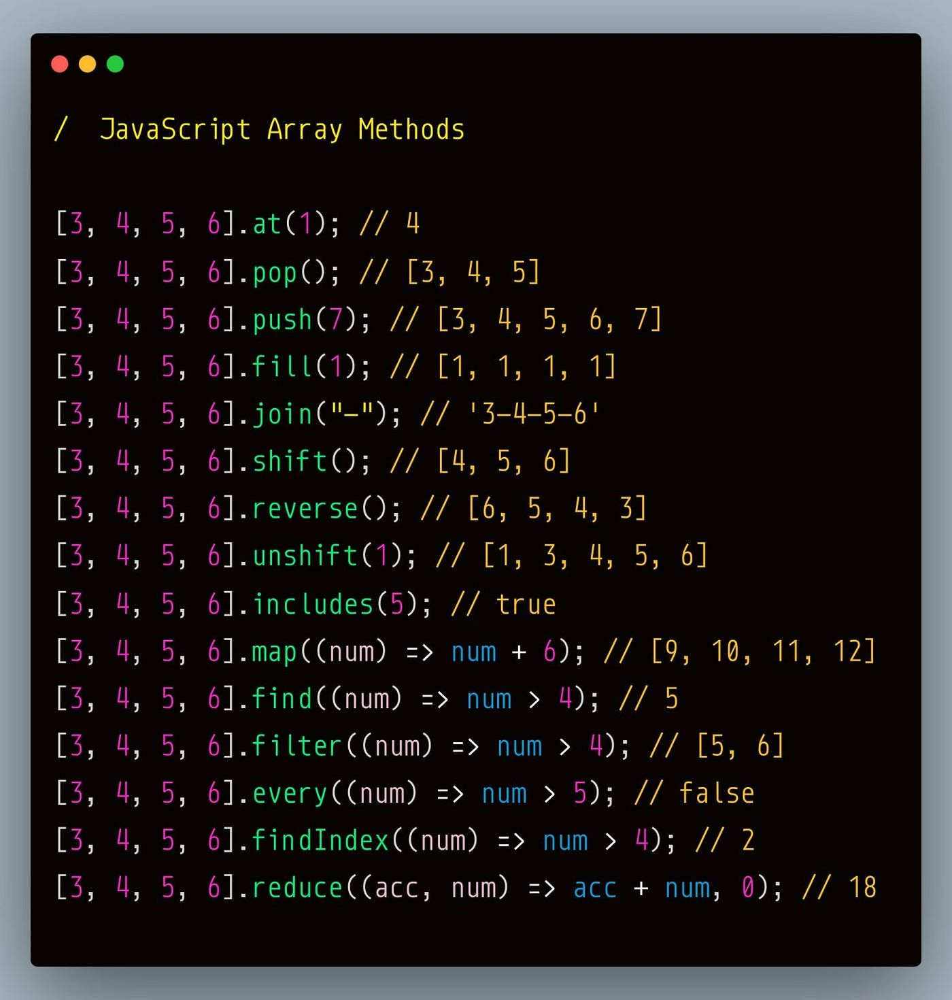
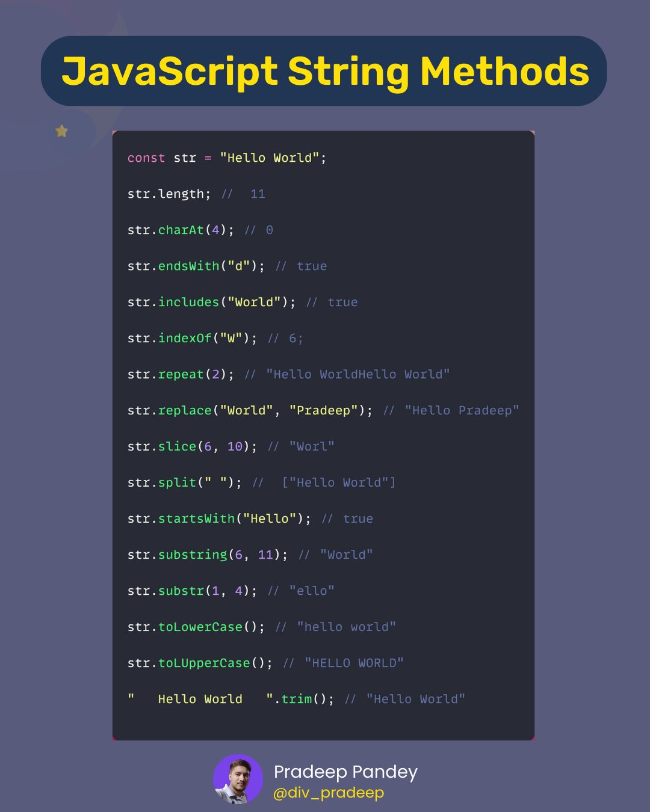

### Table of Contents - Javascript

| No. | Questions |
| --- | --------- |
|   | **Javascript** |
| 1 | [What is the event loop?](#1)|
| 2 | [What is the call stack?](#2)|
| 3 | [What are Macro tasks?](#3)|
| 4 | [Examples of Macro tasks](#4)|
| 5 | [What are Micro tasks?](#5)|
| 6 | [What is a callback?](#6)|
| 7 | [What is a callback hell?](#7)|
| 8 | [What is a promise?](#8)|
| 9 | [What is async/await?](#9)|
| 10| [Passed by Value and by Reference](#10)|
| 11| [What is the difference between var, let and const?](#11)|
| 12| [What is hoisting?](#12)|
| 13| [What is currying?](#13)|
| 14| [What is higher order function?](#14)|
| 15| [What is scope?](#15)|
| 16| [What is context?](#16)|
| 17| [What is an array?](#17)|
| 18 | [Array vs Set](#18)|
| 19 | [Array Methods](#19)|
| 20 | [Set Methods](#20)|
| 21 | [What is the difference between slice and splice?](#21)|
| 22 | [Object deep copy](#22)|
| 23 | [What is prototype?](#23)|
| 24 | [What is prototype chain?](#24)|
| 25 | [What is inheritance?](#25)|
| 26 | [What is the difference between classical inheritance and prototypal inheritance?](#26)|
| 27| [What is the difference between __proto__ and prototype?](#27)|
| 28| [DOM and Virtual DOM](#28)|
| 29| [What is DOM?](#29)|
| 30| [What is Virtual DOM?](#30)|
| 31| [Why is virtual DOM faster?](#31)|
| 32| [Fetch and Axios](#32)|
| 33| [What is REST?](#33)|
| 34| [What are primitive types and non-primitive types in javascript?](#34)|
| 35| [rewrite this code to use closures or async await and print the different values of the array:](#35)|
| 36| [Mutability vs Immutability](#36)|
| 37| [What Is the for…of Loop in JavaScript?](#37)|
| 38| [What are closures?](#38)|
| 39| [What is the difference between null and undefined?](#39)|
| 40| [What is the difference between == and ===?](#40)|
| 41| [Map vs Array](#41)|
# Event Loop

## 1. What is the event loop?

Event loop is simply an infinite loop. 
Wherever you run the JavaScript code, on browser or on Node.js, there will be an event loop which will take care of handling the asynchronous tasks.

Event loop involves Call stack, Macro tasks and Micro tasks.

## 2. What is the call stack?

Call stack is the LIFO (Last In First Out) stack. It is the place where the task gets added from Macro task queue or Micro task queue. 

"JavaScript engine picks up the task for execution from the call stack. Event loop continuously checks the call stack for any function that needs to be run."

## 3. What are Macro tasks?

You will find macro task queue being called as task queue on some resources on the internet. Task queue and Macro task queue are the same concept.

"<b>Macro task</b> is any JavaScript code which is scheduled to run by the standard mechanism such as an event callback, interval or timeout."

### 4. Examples of Macro tasks

- <b>setTimeout():</b> function which accepts the first parameter as a function callback and the second parameter as time in milliseconds. It executes the function callback once the timer expires.
- <b>setImmediate():</b> provided by Node.js which could be one of the options when you want to execute some piece of code asynchronously but as soon as possible. s designed to execute a script once the poll phase of the event loop completes
- <b>setInterval():</b>If a block of code needs to be executed repeatedly, then setInterval() can be used to schedule the repetition of that piece of code. Similar to setTimeout(), it takes callback function as first parameter and number of milliseconds as second parameter. 
The difference between setTimeout() and setInterval() is that, setTimeout() will execute the given callback function only once and setInterval() will execute the callback function infinite number of times.
- <b>requestAnimationFrame()</b>
- <b>I/O</b>
- <b>UI rendering</b>

## 5. What are Micro tasks?

The difference between macro and micro tasks seems minor. Both of them get placed on call stack and run at an appropriate time. Event loop picks up the task from call stack one after another. It treats micro tasks differently. 
All the micro tasks will be executed in one go-around of the event loop. One micro task can schedule another micro task.

### Examples of Micro tasks

- <b>Promise:</b> represents eventual result of an asynchronous operation. Promises are a way to deal with asynchronous code. Async functions use promises behind the scenes.  
The primary way of interacting with Promise is through its then function which registers a callback to receive either a promise’s eventual value or the reason why the promise cannot be fulfilled.
- <b>process.nextTick():</b>In Node.js, each iteration of an event loop is called a tick. The callback passed to the process.nextTick() will be executed in the current phase of the event loop. process.nextTick() is not part of event loop though its part of asynchronous API. process.nextTick() will run before any immediates that are set as well as before any scheduled I/O. process.nextTick() is non-cleanable. Once code is scheduled to execute with process.nextTick(), the execution can not be stopped.
- <b>queueMicrotask:</b>will explicitly put a task in the micro task queue. This is what happens when a promise resolves. The callback function gets queued into the micro tasks. If you chain multiple then statements, all of their callbacks will be added to micro task queue and are guaranteed to be executed before handing the control back to event loop.

## When to use what?

Whenever you want to defer the execution of some piece of code then you should go for a macro task. But, when you want to make JavaScript behave synchronously then go for micro task. Excessive use of micro tasks in the code is not at all recommended. It will block the execution of event loop and it will be a really bad experience for the users of your application.

### given the following code, what will be the output?

~~~js
console.log(1);
setTimeout(()=>console.log(2), 0);
Promise.resolve().then(()=>console.log(3));
setTimeout(()=>console.log(4), 1);
console.log(5);

// 1 5 3 2 4

~~~

## Callback, Promise and Async/Await

### 6. What is a callback? 

A callback is a function passed as an argument to another function. This technique allows a function to call another function. A callback function can run after another function has finished.

### 7. What is a callback hell? 

Callback hell is a phenomenon that afflicts a JavaScript developer when he tries to execute multiple asynchronous operations one after the other. It is a result of writing code in a style that continuously nests callbacks within callbacks.

### example of callback

~~~js

function add(x, y, callback) {
  callback(x + y);
}

add(1, 2, function(result) {
  console.log(result);
});

~~~

### 8. What is a promise?

Represents eventual result of an asynchronous operation.  A promise is an object that may produce a single value some time in the future: either a resolved value, or a reason that it's not resolved (e.g., a network error occurred). A promise may be in one of 3 possible states: fulfilled, rejected, or pending.

### example of promise

~~~js
const myPromise = new Promise((resolve, reject) => {
  setTimeout(() => {
    resolve("foo");
  }, 300);
});

myPromise
  .then((value) => `${value} y barra`, console.error(err))
  .then(handleResolvedB, handleRejectedB)
  .then(handleResolvedC, handleRejectedC)
  .catch(handleRejectedAny);
~~~

### 9. What is async/await? 

Async/await is a new way to write asynchronous code. Previous alternatives for asynchronous code are callbacks and promises.

### example of async/await

~~~js
async function foo() {
  const result1 = await new Promise((resolve) =>
    setTimeout(() => resolve("1")),
  );
  const result2 = await new Promise((resolve) =>
    setTimeout(() => resolve("2")),
  );
}
foo();
~~~

# JavaScript Questions
## 10. Given the following code, what will be the output? 

~~~js
var a = 5; 
var b = a;
a = 7;// a = 7, b = 5

const a = [1];
const b = a;
b.push(2);
console.log(a, b);// [1,2] [1,2]
~~~

After assigning a to b both constants contain a reference to the same object, thus changes made through either of them affect the same object
 primitive data types are passed by value and non-primitive types are passed by reference. 

## Var, Let and Const

### 11. What is the difference between var, let and const?

- <b>var</b> is function scoped when it is declared inside a function. It is global when it is declared outside a function. It can be updated and re-declared within its scope.
- <b>let</b> is block scoped. It can be updated but not re-declared.
- <b>const</b> is block scoped. It can neither be updated nor re-declared. It is also important to note that const declaration alone doesn't really protect your data from mutation. You can freeze the object to prevent this behavior.

### 12. What is hoisting?

Hoisting is a JavaScript mechanism where variables and function declarations are moved to the top of their scope before code execution. This means that if we do this:

~~~js
console.log(hoist); // Output: undefined
var hoist = 'The variable has been hoisted.';
~~~

it is interpreted as this:

~~~js
var hoist;
console.log(hoist); // Output: undefined
hoist = 'The variable has been hoisted';
~~~

## 13. What is currying? 

Currying is a process in functional programming in which we can transform a function with multiple arguments into a sequence of nesting functions. It returns a new function that expects the next argument inline.

### write a function to execute add(3)(4).
~~~js

function add(x){
   return function(y){
        return x + y;
   }
}
add(3)(4)  // returns 7

~~~

### another example

~~~js
function sum(a) {
    return (b, c) => {
        return a * b * c
    }
}

let x = sum(10);
x(3,12);
x(20,12);
x(20,13);
// OR
sum(10)(3,12);
sum(10)(20,12);
sum(10)(20,13);
~~~

### Is currying a form of closure?
Yes, as you may have noticed by now, the two patterns share similarities. However, they have different use-cases.

Currying means that the closure does not have to receive all of its arguments at once, but separately.

### What are the benefits of currying? When I should use it?
As your project grows, you’ll soon realize how useful currying can be, as it’s extremely scalable. The more complex the project, the more currying will turn out to be a lifesaver.

If you want to keep control of large and complex applications, you can turn to currying as a safe methodology to ensure a clean code.

## 14. What is higher order function? 

Higher-order functions are functions that make use of functions as either their argument or their return value. 

### example with map

~~~js
const num = [10, 20, 30];
const num10 = num.map(i => i * 2);
console.log(num10);
~~~

### example with our own higher order function like map

~~~js
function mapClone(arr, fn) {
  const nameList = [];
  for(let i = 0; i < arr.length; i++) {
    nameList.push(
      fn(arr[i])
    );
  }
  return nameList;
}

const names = ['Emmanuel', 'John', 'Philip', 'James', 'Andrew'];
const nameLength = mapClone(names, function(item) {
  return item.length;
});

console.log(nameLength) // prints [ 8, 4, 6, 5, 6 ]

~~~

## Context and Scope

### What is scope?

Scope refers to the visibility of variables. In JavaScript, scope is function-based meaning that a variable defined inside a function is only visible within that function. It is not visible outside of the function, unless it is explicitly passed as a return value.

### What is context?

Context is similar to scope in that it determines what is and isn't accessible to a function. Every function invocation has both a scope and a context associated with it. Fundamentally, scope is function-based while context is object-based. In other words, scope pertains to the variable access of a function when it is invoked and is unique to each invocation. Context is always the value of the this keyword which is a reference to the object that “owns” the currently executing code.

## Context and this

### given the following code, what will be the output?

~~~js

const obj = {
  a: this,
  b: function(){
    return this;
  },
  c: ()=>{
    return this;
  },
  d(){
    return this;
  }, 
  e: function(){
    return this.a;
  }
}

console.log(obj.a);// window
console.log(obj.b());// obj
console.log(obj.c());// window
console.log(obj.d());// obj
console.log(obj.e());// window

~~~

In the regular function, a function always defines its this value. Arrow functions treat this keyword differently. They don’t define their own context since it doesn’t have its own this context. They inherit that from the parent scope whenever you call this.

### What will be the outputs

~~~js
const obj = {
   name: this,
   foo: function(){
      return this
   } 
}
function bar(){
    return this
}
//what will be the outputs
console.log(obj.name);// window
console.log(obj.foo());// obj
console.log(bar());// window

~~~

## Arrays

### 17. What is an array? 

An array is a special variable, which can hold more than one value at a time.

### How to create an array?

~~~js

const arr = [1,2,3,4,5];

~~~

### 18. Array vs Set 

- <b>Array</b> is an ordered list of elements of the same type. It is a collection of elements which can be accessed via indices and can be iterated upon. It is a mutable data structure.
- <b>Set</b> is a collection of unique elements. It is an unordered collection of elements which can be iterated upon. It is an immutable data structure.

#### 19. Array Methos

1. <b>concat():</b> used to merge two or more arrays. This method does not change the existing arrays, but instead returns a new array.
    - returns a new array containing the concatenated arrays.
2. <b>every():</b> used to check if all the elements in an array pass a test (provided as a function).
    - returns true if all the elements pass the test, otherwise it returns false.
3. <b>filter():</b> used to create a new array with all the elements that pass the test implemented by the provided function.
    - returns a new array containing all the elements that pass the test.
4. <b>find():</b> used to get the value of the first element in the array that satisfies the provided condition.
    - returns the value of the first element in the array that satisfies the provided condition. Otherwise undefined is returned.
5. <b>findIndex():</b> used to get the index of the first element in the array that satisfies the provided condition.
    - returns the index of the first element in the array that satisfies the provided condition. Otherwise, it returns -1, indicating that no element passed the test.
6. <b>forEach():</b> used to execute a provided function once for each array element.
7. <b>includes():</b> used to determine whether an array contains a specified element.
    - returns true if the array contains the element, otherwise it returns false.
8. <b>indexOf():</b> used to get the index of the first occurrence of the specified element in the array.
    - returns the index of the first occurrence of the specified element in the array. Otherwise, it returns -1, indicating that element does not exist.
9. <b>join():</b> used to join all elements of an array into a string.
    - returns a string with all array elements joined. The elements will be separated by a specified separator. If no separator is provided, then a comma is used.
10. <b>keys():</b> used to get the array of keys from an array.
    - returns an Array Iterator object with the keys of an array.
11. <b>lastIndexOf():</b> used to get the index of the last occurrence of the specified element in the array.
    - returns the index of the last occurrence of the specified element in the array. Otherwise, it returns -1, indicating that element does not exist.
12. <b>map():</b> used to create a new array with the results of calling a provided function on every element in the calling array.
    - returns a new array containing the results of calling a provided function on every element in the calling array.
13. <b>pop():</b> used to remove the last element from an array and return that element.
    - returns the removed element from the array. If the array is empty, it returns undefined.
14. <b>push():</b> used to add one or more elements to the end of an array and returns the new length of the array.
    - returns the new length of the array.
15. <b>reduce():</b> used to apply a function to each element in the array to reduce the array to a single value.
    - returns a single value which is the function’s accumulated result.
16. <b>reduceRight():</b> used to apply a function to each element in the array (from right to left) to reduce the array to a single value.
    - returns a single value which is the function’s accumulated result.
17. <b>reverse():</b> used to reverse the order of the elements in an array.
    - returns the reversed array.
18. <b>shift():</b> used to remove the first element from an array and return that element.
    - returns the removed element from the array. If the array is empty, it returns undefined.
19. <b>slice():</b> used to extract a section of an array and returns a new array. From the start index up to but not including the end index.
    - returns a new array containing the extracted elements.
    - Parameters:
        - start: Zero-based index at which to start extraction.
        - end: Zero-based index before which to end extraction. slice extracts up to but not including end. For example, slice(1,4) extracts the second element through the fourth element (elements indexed 1, 2, and 3).
20. <b>some():</b> used to check if any of the elements in an array pass a test (provided as a function).
    - returns true if any of the elements pass the test, otherwise it returns false.
21. <b>sort():</b> used to sort the elements of an array in place and returns the sorted array.
    - returns the sorted array. The default sort order is ascending, built upon converting the elements into strings, then comparing their sequences of UTF-16 code units values.
22. <b>splice():</b> used to add or remove items to or from an array and returns the removed item(s).
    - returns an array containing the deleted elements. If only one element is removed, an array of one element is returned. If no elements are removed, an empty array is returned.
    - Parameters:
        - index: The index at which to start changing the array.
        - deleteCount: An integer indicating the number of elements in the array to remove from start.
        - item1, item2, ...: The elements to add to the array. If you don't specify any elements, splice simply removes elements from the array.
23. <b>toString():</b> used to return a string representing the specified array and its elements.
24. <b>unshift():</b> used to add one or more elements to the beginning of an array and returns the new length of the array.
    - returns the new length of the array.
25. <b>valueOf():</b> used to return the primitive value of the specified object.
26. <b>entries():</b> used to return a new Array Iterator object that contains the key/value pairs for each index in the array.

Reduce example:

~~~js

const arr = [1,2,3,4,5];

const sum = arr.reduce((acc, curr) => acc + curr, 0); // 0 is the initial value of acc and curr is the current value of the array element

console.log(sum);// 15

~~~

#### 19.1 String Methods

- <b>charAt():</b> used to return the character at the specified index in a string.
    - returns the character at the specified index in a string.
- <b>charCodeAt():</b> used to return the Unicode of the character at the specified index in a string.
    - returns the Unicode of the character at the specified index in a string.
- <b>concat():</b> used to join two or more strings.
    - returns a new string that is a concatenation of this string and other strings.
- <b>endsWith():</b> used to check whether a string ends with the specified string/characters.
    - returns true if the string ends with the characters, otherwise it returns false.
- <b>fromCharCode():</b> used to convert Unicode values into characters.
    - returns a string created from the specified sequence of UTF-16 code units.
- <b>includes():</b> used to check whether a string contains the specified string/characters.
    - returns true if the string contains the characters, otherwise it returns false.
- <b>indexOf():</b> used to return the index of the first occurrence of the specified string/characters in a string.
    - returns the index of the first occurrence of the specified string/characters in a string, or -1 if it never occurs.
- <b>lastIndexOf():</b> used to return the index of the last occurrence of the specified string/characters in a string.
    - returns the index of the last occurrence of the specified string/characters in a string, or -1 if it never occurs.
- <b>localeCompare():</b> used to compare two strings in the current locale.
    - returns a number indicating whether a reference string comes before or after or is the same as the given string in sort order.
- <b>match():</b> used to return an array of all the matches of a string against a regular expression.
    - returns an array containing all of the matches, including capturing groups, or null if no match is found.
- <b>repeat():</b> used to return a new string which contains the specified number of copies of the original string.
    - returns a new string which contains the specified number of copies of the original string.
- <b>replace():</b> used to search for a match between a substring (or regular expression) and a string, and replaces the matched substring with a new substring.
    - returns a new string with some or all matches of a pattern replaced by a replacement.
- <b>search():</b> used to search for a match between a regular expression and a string.
    - returns the index of the first match between the regular expression and the given string, or -1 if no match was found.
- <b>slice():</b> used to extract a section of a string and returns a new string.
    - returns a new string containing the extracted section of the given string.
- <b>split():</b> used to split a string into an array of substrings.
    - returns an array of strings split at each point where the separator occurs in the given string.
- <b>startsWith():</b> used to check whether a string begins with the characters of a specified string.
    - returns true if the string begins with the characters, otherwise it returns false.
- <b>substr():</b> used to return the characters in a string beginning at the specified location through the specified number of characters.
    - returns a subset of a string between one index and another, or through the end of the string.
- <b>substring():</b> used to return the characters in a string between two indexes into the string.
    - returns the characters in a string between two indexes into the string.
- <b>toLocaleLowerCase():</b> used to convert the characters in a string to lowercase while respecting the current locale.
    - returns the calling string value converted to lower case, according to any locale-specific case mappings.
- <b>toLocaleUpperCase():</b> used to convert the characters in a string to uppercase while respecting the current locale.
    - returns the calling string value converted to upper case, according to any locale-specific case mappings.
- <b>toLowerCase():</b> used to convert the characters in a string to lowercase.
    - returns the calling string value converted to lower case.
- <b>toString():</b> used to return a string representing the specified object.
    - returns a string representing the specified object.
- <b>toUpperCase():</b> used to convert the characters in a string to uppercase.
    - returns the calling string value converted to uppercase.
- <b>trim():</b> used to remove whitespace from both ends of a string.
    - returns the calling string value trimmed of whitespace from both ends.
- <b>valueOf():</b> used to return the primitive value of the specified object.
    - returns the primitive value of the specified object.

#### 19.2 RegExp Methods

- <b>exec():</b> used to execute a search for a match in a specified string. Returns a result array, or null.
    - returns a result array, or null.
- <b>test():</b> used to test for a match in a string. Returns true or false.
    - returns true or false.

|Character Classes|Description|
|---|---|
|\d|Matches any digit character (0-9). Equivalent to [0-9].|
|\D|Matches any non-digit character. Equivalent to [^0-9].|
|\s|Matches any white space including space, tab, form-feed, etc. Equivalent to [ \f\n\r\t\v​\u00A0\u1680​\u180e\u2000​\u2001\u2002​\u2003\u2004​\u2005\u2006​\u2007\u2008​\u2009\u200a​\u2028\u2029​\u2028\u2029​\u202f\u205f​\u3000].|
|\S|Matches any non-white space character. Equivalent to [^ \f\n\r\t\v​\u00A0\u1680​\u180e\u2000​\u2001\u2002​\u2003\u2004​\u2005\u2006​\u2007\u2008​\u2009\u200a​\u2028\u2029​\u2028\u2029​\u202f\u205f​\u3000].|
|\w|Matches any alphanumeric character including the underscore. Equivalent to [A-Za-z0-9_].|
|\W|Matches any non-word character. Equivalent to [^A-Za-z0-9_].|
|\b|Matches a word boundary. That is, the position between a word and a space.|
|\B|Matches any non-word boundary.|
|\0|Matches a NULL character. Do not follow this with another digit.|
|\n|Matches a new line character.|
|\f|Matches a form-feed character.|
|\r|Matches a carriage return character.|
|\t|Matches a tab character.|
|\v|Matches a vertical tab character.|
|i|Ignore case.|
|g|Global search.|
|\ |Escapes the next character. This allows you to match reserved characters [ ] ( ) { } . * + ? ^ $ \ / |.|
|x\|y|Disjunction: Matches either "x" or "y". Each component, separated by a pipe (\|), is called an alternative. For example, /green\|red/ matches "green" in "green apple" and "red" in "red apple". |
|[xyz]| Matches any one of the enclosed characters|
|[^xyz]| Matches any character that is not enclosed|
|[a-z]| Matches any character in the range specified|
|[^a-z]| Matches any character not in the range specified|
|.| Matches any single character except newline \n,\r,\u2028 or \u2029 or another Unicode line terminator.|
|*| Matches the preceding expression 0 or more times. Equivalent to {0,}.|
|[xyz]+| Matches the preceding expression 1 or more times. Equivalent to {1,}.|
|^| Matches the beginning of input. If the multiline flag is set to true, also matches immediately after a line break character.|
|$| Matches the end of input. If the multiline flag is set to true, also matches immediately before a line break character.|
|?| Matches the preceding expression 0 or 1 time. Equivalent to {0,1}.|
|x(?=y)| Matches "x" only if "x" is followed by "y". For example, /Jack(?=Sprat)/ matches "Jack" only if it is followed by "Sprat". /Jack(?=Sprat\|Frost)/ matches "Jack" only if it is followed by "Sprat" or "Frost". However, neither "Sprat" nor "Frost" is part of the match results.|
|x(?!y)| Matches "x" only if "x" is not followed by "y". For example, /\d+(?!\.)/ matches a number only if it is not followed by a decimal point.|
|(?<=y)x| Matches "x" only if "x" is preceded by "y". For example, /(?<=Jack)Sprat/ matches "Sprat" only if it is preceded by "Jack". /(?<=Jack\|Tom)Sprat/ matches "Sprat" only if it is preceded by "Jack" or "Tom". However, neither "Jack" nor "Tom" is part of the match results.|
|(?<!y)x| Matches "x" only if "x" is not preceded by "y". For example, /(?<!-)\d+/ matches a number only if it is not preceded by a minus sign.|

|Quantifiers|Description|
|---|---|
|*|Matches the preceding item "x" 0 or more times. For example, /bo*/ matches "boooo" in "A ghost booooed" and "b" in "A bird warbled", but nothing in "A goat grunted".|
|x+|Matches the preceding item "x" 1 or more times. Equivalent to {1,}. For example, /a+/ matches the "a" in "candy" and all the "a"'s in "caaaaaaandy".|
|x?|Matches the preceding item "x" 0 or 1 time. For example, /e?le?/ matches the "el" in "angel" and the "le" in "angle." If used immediately after any of the quantifiers *, +, ?, or {}, makes the quantifier non-greedy (matching the minimum number of times), as opposed to the default, which is greedy (matching the maximum number of times). For example, applying /\d+/ to "123abc" matches "123". But applying /\d+?/ to that same string matches only the "1".|
|x{n}|Where "n" is a positive integer, matches exactly "n" occurrences of the preceding item "x". For example, /a{2}/ doesn't match the "a" in "candy," but it matches all of the "a"'s in "caandy," and the first two "a"'s in "caaandy."|
|x{n,m}|Where "n" is 0 or a positive integer, "m" is a positive integer, and m > n, matches at least "n" and at most "m" occurrences of the preceding item "x". For example, /a{1,3}/ matches nothing in "cndy", the "a" in "candy," the two "a"'s in "caandy," and the first three "a"'s in "caaaaaaandy". Notice that when matching "caaaaaaandy", the match is "aaa", even though the original string had more "a"s in it.|

Regex examples:

~~~js

const regex = /hello/;// matches the word hello
const str = 'hello world';
const result = regex.test(str);// true

const regex = /hello/;// matches the word hello
const str = 'world';
const result = regex.test(str);// false

const regex = /hello/i;// matches the word hello case insensitive
const str = 'Hello world';
const result = regex.test(str);// true

const regex = /hello/g;// matches the word hello globally
const str = 'hello world';
const result = regex.test(str);// true

const regex = /hello/g;// matches the word hello globally
const str = 'hello world hello';
const result = regex.test(str);// true

const regex = /[bt]ear/;// matches the words bear and tear
const str = 'bear';
const result = regex.test(str);// true

//combinations

const regex = /[a-z]ear/;// matches the words bear, tear, fear, gear, hear, year
const str = 'bear';
const result = regex.test(str);// true

const regex = /[a-zA-Z]ear/;// matches the words bear, tear, fear, gear, hear, year, Bear, Tear, Fear, Gear, Hear, Year
const str = 'Bear';
const result = regex.test(str);// true

const regex = /[a-zA-Z0-9]ear/;// matches the words bear, tear, fear, gear, hear, year, Bear, Tear, Fear, Gear, Hear, Year, 1ear, 2ear, 3ear, 4ear, 5ear, 6ear, 7ear, 8ear, 9ear, 0ear
const str = '1ear';
const result = regex.test(str);// true

const regex = /\d/;// matches any digit
const str = '1';
const result = regex.test(str);// true

const regex = /\D/;// matches any non-digit
const str = 'a';
const result = regex.test(str);// true

const regex = /\w/;// matches any alphanumeric character including the underscore
const str = 'a';
const result = regex.test(str);// true

const regex = /\W/;// matches any non-alphanumeric character including the underscore
const str = '!';
const result = regex.test(str);// true

const regex = /\s/;// matches any whitespace character
const str = ' ';
const result = regex.test(str);// true

const regex = /\S/;// matches any non-whitespace character
const str = 'a';
const result = regex.test(str);// true

const regex = /\d+/;// matches any digit one or more times
const str = '123';
const result = regex.test(str);// true

const regex = /\d?/;// matches any digit zero or one time
const str = '1';
const result = regex.test(str);// true

const regex = /\d{2}/;// matches any digit two times
const str = '12';
const result = regex.test(str);// true

const regex = /\d{2,4}/;// matches any digit two to four times
const str = '123';
const result = regex.test(str);// true

const regex = /go*d/;//Matches the preceding expression zero or more times.
const str = 'gd';// or god or good or goood or goooood
const result = regex.test(str);// true

const regex = /^g/;//Matches the beginning of input. If the multiline flag is set to true, also matches immediately after a line break character.
const str = 'good';
const str2 = 'bad';
const result = regex.test(str);// true
const result2 = regex.test(str2);// false

const regex = /.com$/;//Matches the end of input. If the multiline flag is set to true, also matches immediately before a line break character.

const str = 'good.com';
const str2 = 'bad';
const result = regex.test(str);// true
const result2 = regex.test(str2);// false

const regex = /(green|red) apple/;//Matches either "green apple" or "red apple".
const str = 'green apple';
const str2 = 'red apple';
const result = regex.test(str);// true
const result2 = regex.test(str2);// true

const regex = /a+b/;//Matches the preceding expression 1 or more times. Equivalent to {1,}.
const str = 'ab';
const str2 = 'aab';
const str3 = 'aaab';
const result = regex.test(str);// true
const result2 = regex.test(str2);// true
const result3 = regex.test(str3);// true

const regex = /(foo)bar\1/;//Matches "foobar" or "foobazbar", where the first group is "foo".
const str = 'foobar';
const str2 = 'foobazbar';
const result = regex.test(str);// true
const result2 = regex.test(str2);// false

const regex = /Red(?=Apple)/;//Matches "Red" only if it is followed by "Apple".
const str = 'RedApple';
const str2 = 'Red';
const result = regex.test(str);// true
const result2 = regex.test(str2);// false

~~~

#### 20. Set Methods

~~~js

const set = new Set([1,2,3,4,5]);

~~~

- <b>add():</b> used to add a new element with a specified value to the set.
- <b>clear():</b> used to remove all elements from the set object.
- <b>delete():</b> used to remove the specified element from the set object.
- <b>entries():</b> used to return a new Iterator object that contains an array of [value, value] for each element in the Set object, in insertion order.
- <b>forEach():</b> used to execute a provided function once for each value in the Set object, in insertion order.
- <b>has():</b> used to returns a boolean indicating whether an element with the specified value exists in a Set object or not.
- <b>keys():</b> used to return a new Iterator object that contains the keys for each element in the Set object, in insertion order.
- <b>values():</b> used to return a new Iterator object that contains the values for each element in the Set object, in insertion order.

### 21. What is the difference between slice and splice?

- <b>slice</b> returns a new array containing the extracted elements while splice removes the elements from the original array and returns the removed elements.
    - can take two arguments, the first is the index of where to begin and the second is the index for where to end. The second argument is optional and if it is not specified the slice method will return all elements from the start position to the end of the array. If the second argument is specified, slice will return all elements from the start position to the end position minus one. The original array will not be modified.

- <b>splice</b> can take two arguments, the first is the index of where to begin, the second is the number of elements to be removed and the third is the element to be added. The second and third arguments are optional. If the second argument is not specified, splice will remove all elements from the start position to the end of the array. If the second argument is specified, splice will remove the specified number of elements. If the third argument is specified, splice will replace the removed elements with the value of this argument. The original array will be modified.

## 22. Object deep copy

### give the function to deep copy an object

~~~js

const obj = {
  a: 1,
  b: "hello",c: {
    d: "world"
  },
  e: {
    f: {
      g: 100
    }
  }
};

const deepCopy = (obj) => {
  const newObj = {};
  for(let key in obj) {
    if(typeof obj[key] === "object") {
      newObj[key] = deepCopy(obj[key]);
    } else {
      newObj[key] = obj[key];
    }
  }
  return newObj;
}

~~~

## Prototype and Inheritance

### 23. What is prototype?

Prototypes are the mechanism by which JavaScript objects inherit features from one another. 
JavaScript is a dynamic language. You can attach new properties to an object at any time as shown below. Prototype object is being used by JavaScript engine in two things, 
* 1) to find properties and methods of an object 
* 2) to implement inheritance in JavaScript.

~~~js

function Student() {
    this.name = 'John';
    this.gender = 'Male';
}

var studObj1 = new Student();
studObj1.age = 15;
alert(studObj1.age); // 15

var studObj2 = new Student();
alert(studObj2.age); // undefined
~~~

As you can see in the above example, age property is attached to studObj1 instance. However, studObj2 instance will not have age property because it is defined only on studObj1 instance.

So what to do if we want to add new properties at later stage to a function which will be shared across all the instances?

The answer is <b>Prototype</b>.

The prototype is an object that is associated with every functions and objects by default in JavaScript, where function's prototype property is accessible and modifiable and object's prototype property (aka attribute) is not visible.

~~~js
function Student() {
    this.name = 'John';
    this.gender = 'M';
}

Student.prototype.age = 15;

var studObj1 = new Student();
alert(studObj1.age); // 15

var studObj2 = new Student();
alert(studObj2.age); // 15

~~~

Every object which is created using literal syntax or constructor syntax with the new keyword, includes __proto__ property that points to prototype object of a function that created this object.

As mentioned before, object's prototype property is invisible. Use Object.getPrototypeOf(obj) method instead of __proto__ to access prototype object.

~~~js
function Student() {
    this.name = 'John';
    this.gender = 'M';
}

var studObj = new Student();

Student.prototype.sayHi= function(){
    alert("Hi");
};

var studObj1 = new Student();
var proto = Object.getPrototypeOf(studObj1);  // returns Student's prototype object
            
alert(proto.constructor); // returns Student function 

~~~

### 24. What is prototype chain?

Every object in JavaScript has a built-in property, which is called its prototype. The prototype is itself an object, so the prototype will have its own prototype, making what's called a prototype chain. The chain ends when we reach a prototype that has null for its own prototype.

### 25. What is inheritance?

Inheritance is an important concept in object oriented programming. In the classical inheritance, methods from base class get copied into derived class. In JavaScript, inheritance is supported by using prototype object. 
In JavaScript, inheritance is supported by using prototype object. Some people call it "Prototypal Inheriatance" and some people call it "Behaviour Delegation".

~~~js

function Person(firstName, lastName) {
    this.FirstName = firstName || "unknown";
    this.LastName = lastName || "unknown";            
}

Person.prototype.getFullName = function () {
    return this.FirstName + " " + this.LastName;
}
function Student(firstName, lastName, schoolName, grade)
{
    Person.call(this, firstName, lastName);// base constructor call, call() allows for a function/method belonging to one object to be assigned and called for a different object. Similar to super() in Java

    this.SchoolName = schoolName || "unknown";
    this.Grade = grade || 0;
}
//Student.prototype = Person.prototype;
Student.prototype = new Person();
Student.prototype.constructor = Student;

var std = new Student("James","Bond", "XYZ", 10);
            
alert(std.getFullName()); // James Bond
alert(std instanceof Student); // true
alert(std instanceof Person); // true
~~~

### 26. What is the difference between classical inheritance and prototypal inheritance?

- <b>Class Inheritance:</b> instances inherit from classes (like a blueprint — a description of the class), and create sub-class relationships: hierarchical class taxonomies. Instances are typically instantiated via constructor functions with the `new` keyword. Class inheritance may or may not use the `class` keyword from ES6.

- <b>Prototypal Inheritance:</b> instances inherit directly from other objects. Instances are typically instantiated via factory functions or `Object.create()`. Instances may be composed from many different objects, allowing for easy selective inheritance.

### 27. What is the difference between __proto__ and prototype?

- <b>__proto__</b> is the actual object that is used in the lookup chain to resolve methods, etc. prototype is the object that is used to build __proto__ when you create an object with new:

~~~js

function Foo() {
  this.val = 42;
}

Foo.prototype = {
  method: function() {}
};

function Bar() {}

// Set Bar's prototype to a new instance of Foo

Bar.prototype = new Foo();
Bar.prototype.foo = 'Hello World';

// Make sure to list Bar as the actual constructor

Bar.prototype.constructor = Bar;

var test = new Bar() // create a new bar instance

// test.__proto__ will contain the prototype object of Bar (Bar.prototype).

// test.prototype will be undefined, as the test object will not contain a prototype property.

~~~

## 28. DOM and Virtual DOM

### 29. What is DOM?

The Document Object Model (DOM) is a programming interface for HTML and XML documents. It represents the page so that programs can change the document structure, style, and content. The DOM represents the document as nodes and objects. That way, programming languages can connect to the page.

### 30. What is Virtual DOM?

The virtual DOM (VDOM) is an in-memory representation of Real DOM. The representation of a UI is kept in memory and synced with the "real" DOM. It's a step that happens between the render function being called and the displaying of elements on the screen. This entire process is called reconciliation.

### 31. Why is virtual DOM faster?

The virtual DOM is faster because it updates the DOM tree in an efficient way. It only updates the individual nodes in which some changes have occurred rather than updating all the nodes. This saves a lot of time and hence updates the view faster.

# 32. Fetch and Axios

## What is the difference between fetch and axios?

- <b>fetch</b> is a browser API for loading texts, images, JSON, etc. It is a built-in way to fetch data across the network and it is promise-based.
- <b>axios</b> is a library that helps us make http requests to external resources. It is promise-based and therefore we can take advantage of async and await for more readable asynchronous code.

## example of fetch (GET and POST)

~~~js

fetch('https://jsonplaceholder.typicode.com/todos/1')
  .then(response => response.json())
  .then(json => console.log(json))

fetch('https://jsonplaceholder.typicode.com/todos', {
    method: 'POST',
    body: JSON.stringify({
      title: 'foo',
      body: 'bar',
      userId: 1
    }),
    headers: {
      'Content-type': 'application/json; charset=UTF-8',
    },
  })
    .then((response) => response.json())
    .then((json) => console.log(json));

~~~

## example of axios (GET AND POST)

~~~js

axios.get('https://jsonplaceholder.typicode.com/todos/1')
  .then(response => console.log(response.data))

axios.post('https://jsonplaceholder.typicode.com/todos', {
    title: 'foo',
    body: 'bar',
    userId: 1
  })
    .then(response => console.log(response.data))
~~~

## 33. What is REST?

REST stands for REpresentational State Transfer. It is a software architectural style that defines a set of constraints to be used for creating Web services. Web services that conform to the REST architectural style, called RESTful Web services, provide interoperability between computer systems on the Internet.

## 34. What are primitive types and non-primitive types in javascript?

- <b>Primitive types</b> are immutable data types that have no methods. There are 6 primitive types: string, number, bigint, boolean, undefined, and symbol.

- <b>Non-primitive types</b> are mutable data types that have methods. Non-primitive values are all other types that are not primitive. Non-primitive values are mutable data types. These include objects, arrays, and functions.

## 35. (Brightcove) rewrite this code to use closures or async await and print the different values of the array: 

~~~js
const arr = [10, 12, 15, 21];

for (var i = 0; i < arr.length; i++) {
  setTimeout(function() {
    console.log('The index of this number is: ' + i);
  }, 3000);
}
~~~

response with closures:

~~~js
const arr = [10, 12, 15, 21];

for (var i = 0; i < arr.length; i++) {
  (function(index) {
    setTimeout(function() {
      console.log('The index of this number is: ' + index);
    }, 3000);
  })(i);
}
~~~

response with async await:

~~~js
const arr = [10, 12, 15, 21];

const delay = (ms) => new Promise((resolve) => setTimeout(resolve, ms));

const printWithDelay = async () => {
  for (let i = 0; i < arr.length; i++) {
    await delay(3000);
    console.log('The index of this number is: ' + i);
  }
};

printWithDelay();
~~~

## 36. Mutability vs Immutability

- <b>Mutable</b> means that something is changeable or can be changed. In JavaScript, only objects and arrays are mutable, not primitive values. (We call primitive values immutable because you can't change them once they're created.).
  - Mutability allows you to modify existing values without creating new ones.
- <b>Immutable</b> means that something is unchangeable or cannot be changed. In JavaScript, strings and numbers are primitive values that are immutable.

### Const != Immutability

A variable declared using the let keyword can be reassigned using the assignment operator (=). Take a look at the code below to understand what I mean.

~~~js
 let num = 34;
   num = 50;

   console.log(num); // 50
~~~

The code above will print 50 to the console. The variable num was declared using the let keyword and assigned the value 34. Then, the value of num was reassigned to 50. This is possible because variables declared using the let keyword are mutable.

However, you cannot achieve the same thing on the same variable declared using the const keyword.

~~~js
const num = 34;
num = 50;

console.log(num); // Error: Assignment to constant variable.
~~~

The code above will throw an error. The variable num was declared using the const keyword and assigned the value 34. Then, the value of num was reassigned to 50. This is not possible because variables declared using the const keyword are immutable.

But that is not the case with objects. An object that you declared using const is still mutable, so you can still modify the properties of that particular object as you can see below:

~~~js
 const getObj = {
           color1: "Green",
           color2: "Blue",
           color3: "Yellow"
   }

   getObj.color1 = "Brown";
   
   console.log(getObj.color1); // Brown

~~~

The code above will print Brown to the console. The object getObj was declared using the const keyword and assigned the value of an object. Then, the value of the property color1 was reassigned to Brown. This is possible because objects declared using the const keyword are mutable.

### Object.freeze()

The Object.freeze() method freezes an object. A frozen object can no longer be changed. The freeze() method freezes the prototype as well. It prevents the addition of new properties to the frozen object, prevents new properties being added to its prototype, prevents the modification of existing properties, and prevents the deletion of existing properties.

### Object.seal()

All objects in Javascript are extensible by default. Just as the name suggests, this method seals an object. You cannot add new properties to a sealed object or delete an existing property from a sealed object. But object.seal permits modifying existing properties.

## 37. What Is the for…of Loop in JavaScript?

- A for…of loop works for arrays (and similar iterables) and loops through the values.
- A for…in loop works for objects and it loops through the object’s keys.

~~~js
const arr = [1, 2, 3, 4, 5];

for (let i = 0; i < arr.length; i++) {
  console.log(arr[i]);// 1 2 3 4 5
}

for (let i of arr) {
  console.log(i);// 1 2 3 4 5
}

const obj = {
  a: 1,
  b: 2,
  c: 3,
  d: 4,
  e: 5,
};

for (let i in obj) {
  console.log(i);// a b c d e
  console.log(obj[i]);// 1 2 3 4 5
}

for (let i of obj) {
  console.log(i);// TypeError: obj is not iterable
}
~~~

## 38. What are closures?

A closure is the combination of a function bundled together (enclosed) with references to its surrounding state (the lexical environment). 

In other words, a closure gives you access to an outer function’s scope from an inner function.

This is essentially achieved by defining a function inside another function: a function within a function is technically a closure.

When you activate the main function (also known as a parent or outer function), you will also produce a new context of execution that keeps a fresh copy of all local variables. These local variables can be referred to in the global scope by either linking them to variables declared globally or returning the closure from the parent function.

~~~js

function outer() {
  let name = "John";
  function inner() {// inner function is a closure
    console.log(name);
  }
  return inner;
}

const closure = outer();
closure(); // John

~~~
or
~~~js
const closuredFunction= someVariable =>{
   let scopedVariable=someVariable;
   const closure=()=>{
       scopedVariable++;
       console.log(scopedVariable);
   }
  console.log(scopedVariable);
   return closure;
}

let testOne = closuredFunction(1);
testOne(); // will output 2
testOne(); // will output 3
let testTwo = closuredFunction(10);
testTwo(); // will output 11
testTwo(); // will output 12
testOne(); // will output 4
~~~

What is happening? All the invocations of testOne() are accessing the same outer scope, therefore, the same scopedVariable. If one changes, the next value will change accordingly. The same goes for testTwo().

another call of the same outer function creates a new scope, with a new scopedVariable, so an entirely independent variable will be prompted, because of the scope and the context.

## 39. What is the difference between null and undefined?

- <b>undefined</b> means a variable has been declared but has not yet been assigned a value.
- <b>null</b> is an assignment value. It can be assigned to a variable as a representation of no value.

## 40. What is the difference between == and ===?

- <b>==</b> checks for equality of value.
- <b>===</b> checks for equality of value and type.

## 41. Map vs Object 

- <b>Map</b> is a collection of keyed data items, just like an Object. But the main difference is that Map allows keys of any type.
- <b>Object</b> is very similar to Map, but there are important differences that make using a Map preferable in certain cases.

### Why Map is better than Object? 

- The keys can be any type of values (including functions, objects, or any primitive).
- It’s easy to get the size of a Map, while you have to manually keep track of size for an Object.
- The iteration of Map is in insertion order of elements.
- An Object has a prototype, so there are default keys in the map that could collide with your keys if you're not careful. As of ES5 this can be bypassed by using map = Object.create(null), but this is seldom done.
- A Map may perform better in scenarios involving frequent addition and removal of key pairs.

~~~js
const map = new Map();
map.set('name', 'John');
map.set('id', 234);
map.set(true, 'bool1');
map.set(false, 'bool2');

console.log(map.get('name')); // John
console.log(map.get('id')); // 234
console.log(map.get(true)); // bool1
console.log(map.get(false)); // bool2

console.log(map.size); // 4

map.delete('name');
console.log(map.size); // 3

map.clear();
console.log(map.size); // 0
~~~
traversing a map
~~~js

const map = new Map();
map.set('name', 'John');
map.set('id', 234);
map.set(true, 'bool1');
map.set(false, 'bool2');

for (const [key, value] of map) {
  console.log(key, value);
}

~~~