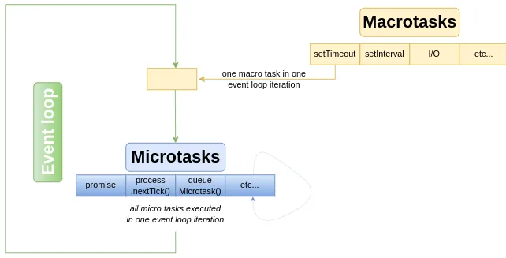

### Table of Contents - Javascript

| No. | Questions |
| --- | --------- |
|   | **Javascript** |
| 1 | [What is the event loop?](#1)|
| 2 | [What is the call stack?](#2)|
| 3 | [What are Macro tasks?](#3)|
| 4 | [Examples of Macro tasks](#4)|
| 5 | [What are Micro tasks?](#5)|
| 6 | [What is a callback?](#6)|
| 7 | [What is a callback hell?](#7)|
| 8 | [What is a promise?](#8)|
| 9 | [What is async/await?](#9)|
| 10| [Passed by Value and by Reference](#10)|
| 11| [What is the difference between var, let and const?](#11)|
| 12| [What is hoisting?](#12)|
| 13| [What is currying?](#13)|
| 14| [What is higher order function?](#14)|
| 15| [What is scope?](#15)|
| 16| [What is context?](#16)|
| 17| [What is an array?](#17)|
| 18 | [Array vs Set](#18)|
| 19 | [Array Methos](#19)|
| 20 | [Set Methods](#20)|
| 21 | [What is the difference between slice and splice?](#21)|
| 22 | [Object deep copy](#22)|
| 23 | [What is prototype?](#23)|
| 24 | [What is prototype chain?](#24)|
| 25 | [What is inheritance?](#25)|
| 26 | [What is the difference between classical inheritance and prototypal inheritance?](#26)|
| 27| [What is the difference between __proto__ and prototype?](#27)|
| 28| [DOM and Virtual DOM](#28)|
| 29| [What is DOM?](#29)|
| 30| [What is Virtual DOM?](#30)|
| 31| [Why is virtual DOM faster?](#31)|
| 32| [Fetch and Axios](#32)|
| 33| [What is REST?](#33)|
# Event Loop

## 1. What is the event loop?

Event loop is simply an infinite loop. 
Wherever you run the JavaScript code, on browser or on Node.js, there will be an event loop which will take care of handling the asynchronous tasks.

Event loop involves Call stack, Macro tasks and Micro tasks.

## 2. What is the call stack?

Call stack is the LIFO (Last In First Out) stack. It is the place where the task gets added from Macro task queue or Micro task queue. 

"JavaScript engine picks up the task for execution from the call stack. Event loop continuously checks the call stack for any function that needs to be run."

## 3. What are Macro tasks?

You will find macro task queue being called as task queue on some resources on the internet. Task queue and Macro task queue are the same concept.

"<b>Macro task</b> is any JavaScript code which is scheduled to run by the standard mechanism such as an event callback, interval or timeout."

### 4. Examples of Macro tasks

- <b>setTimeout():</b> function which accepts the first parameter as a function callback and the second parameter as time in milliseconds. It executes the function callback once the timer expires.
- <b>setImmediate():</b> provided by Node.js which could be one of the options when you want to execute some piece of code asynchronously but as soon as possible. s designed to execute a script once the poll phase of the event loop completes
- <b>setInterval():</b>If a block of code needs to be executed repeatedly, then setInterval() can be used to schedule the repetition of that piece of code. Similar to setTimeout(), it takes callback function as first parameter and number of milliseconds as second parameter. 
The difference between setTimeout() and setInterval() is that, setTimeout() will execute the given callback function only once and setInterval() will execute the callback function infinite number of times.
- <b>requestAnimationFrame()</b>
- <b>I/O</b>
- <b>UI rendering</b>

## 5. What are Micro tasks?

The difference between macro and micro tasks seems minor. Both of them get placed on call stack and run at an appropriate time. Event loop picks up the task from call stack one after another. It treats micro tasks differently. 
All the micro tasks will be executed in one go-around of the event loop. One micro task can schedule another micro task.

### Examples of Micro tasks

- <b>Promise:</b> represents eventual result of an asynchronous operation. Promises are a way to deal with asynchronous code. Async functions use promises behind the scenes.  
The primary way of interacting with Promise is through its then function which registers a callback to receive either a promise’s eventual value or the reason why the promise cannot be fulfilled.
- <b>process.nextTick():</b>In Node.js, each iteration of an event loop is called a tick. The callback passed to the process.nextTick() will be executed in the current phase of the event loop. process.nextTick() is not part of event loop though its part of asynchronous API. process.nextTick() will run before any immediates that are set as well as before any scheduled I/O. process.nextTick() is non-cleanable. Once code is scheduled to execute with process.nextTick(), the execution can not be stopped.
- <b>queueMicrotask:</b>will explicitly put a task in the micro task queue. This is what happens when a promise resolves. The callback function gets queued into the micro tasks. If you chain multiple then statements, all of their callbacks will be added to micro task queue and are guaranteed to be executed before handing the control back to event loop.

## When to use what?

Whenever you want to defer the execution of some piece of code then you should go for a macro task. But, when you want to make JavaScript behave synchronously then go for micro task. Excessive use of micro tasks in the code is not at all recommended. It will block the execution of event loop and it will be a really bad experience for the users of your application.

### given the following code, what will be the output?

~~~js
console.log(1);
setTimeout(()=>console.log(2), 0);
Promise.resolve().then(()=>console.log(3));
setTimeout(()=>console.log(4), 1);
console.log(5);

// 1 5 3 2 4

~~~

## Callback, Promise and Async/Await

### 6. What is a callback? 

A callback is a function passed as an argument to another function. This technique allows a function to call another function. A callback function can run after another function has finished.

### 7. What is a callback hell? 

Callback hell is a phenomenon that afflicts a JavaScript developer when he tries to execute multiple asynchronous operations one after the other. It is a result of writing code in a style that continuously nests callbacks within callbacks.

### example of callback

~~~js

function add(x, y, callback) {
  callback(x + y);
}

add(1, 2, function(result) {
  console.log(result);
});

~~~

### 8. What is a promise?

Represents eventual result of an asynchronous operation.  A promise is an object that may produce a single value some time in the future: either a resolved value, or a reason that it's not resolved (e.g., a network error occurred). A promise may be in one of 3 possible states: fulfilled, rejected, or pending.

### example of promise

~~~js
const myPromise = new Promise((resolve, reject) => {
  setTimeout(() => {
    resolve("foo");
  }, 300);
});

myPromise
  .then((value) => `${value} y barra`, console.error(err))
  .then(handleResolvedB, handleRejectedB)
  .then(handleResolvedC, handleRejectedC)
  .catch(handleRejectedAny);
~~~

### 9. What is async/await? 

Async/await is a new way to write asynchronous code. Previous alternatives for asynchronous code are callbacks and promises.

### example of async/await

~~~js
async function foo() {
  const result1 = await new Promise((resolve) =>
    setTimeout(() => resolve("1")),
  );
  const result2 = await new Promise((resolve) =>
    setTimeout(() => resolve("2")),
  );
}
foo();
~~~

# JavaScript Questions
## 10. Given the following code, what will be the output? 

~~~js
var a = 5; 
var b = a;
a = 7;// a = 7, b = 5

const a = [1];
const b = a;
b.push(2);
console.log(a, b);// [1,2] [1,2]
~~~

After assigning a to b both constants contain a reference to the same object, thus changes made through either of them affect the same object
 primitive data types are passed by value and non-primitive types are passed by reference. 

## Var, Let and Const

### 11. What is the difference between var, let and const?

- <b>var</b> is function scoped when it is declared inside a function. It is global when it is declared outside a function. It can be updated and re-declared within its scope.
- <b>let</b> is block scoped. It can be updated but not re-declared.
- <b>const</b> is block scoped. It can neither be updated nor re-declared. It is also important to note that const declaration alone doesn't really protect your data from mutation. You can freeze the object to prevent this behavior.

### 12. What is hoisting?

Hoisting is a JavaScript mechanism where variables and function declarations are moved to the top of their scope before code execution. This means that if we do this:

~~~js
console.log(hoist); // Output: undefined
var hoist = 'The variable has been hoisted.';
~~~

it is interpreted as this:

~~~js
var hoist;
console.log(hoist); // Output: undefined
hoist = 'The variable has been hoisted';
~~~

## 13. What is currying? 

Currying is a process in functional programming in which we can transform a function with multiple arguments into a sequence of nesting functions. It returns a new function that expects the next argument inline.

### write a function to execute add(3)(4).
~~~js

function add(x){
   return function(y){
        return x + y;
   }
}
add(3)(4)  // returns 7

~~~

### another example

~~~js
function sum(a) {
    return (b, c) => {
        return a * b * c
    }
}

let x = sum(10);
x(3,12);
x(20,12);
x(20,13);
// OR
sum(10)(3,12);
sum(10)(20,12);
sum(10)(20,13);
~~~

## 14. What is higher order function? 

Higher-order functions are functions that make use of functions as either their argument or their return value. 

### example with map

~~~js
const num = [10, 20, 30];
const num10 = num.map(i => i * 2);
console.log(num10);
~~~

### example with our own higher order function like map

~~~js
function mapClone(arr, fn) {
  const nameList = [];
  for(let i = 0; i < arr.length; i++) {
    nameList.push(
      fn(arr[i])
    );
  }
  return nameList;
}

const names = ['Emmanuel', 'John', 'Philip', 'James', 'Andrew'];
const nameLength = mapClone(names, function(item) {
  return item.length;
});

console.log(nameLength) // prints [ 8, 4, 6, 5, 6 ]

~~~

## Context and Scope

### What is scope?

Scope refers to the visibility of variables. In JavaScript, scope is function-based meaning that a variable defined inside a function is only visible within that function. It is not visible outside of the function, unless it is explicitly passed as a return value.

### What is context?

Context is similar to scope in that it determines what is and isn't accessible to a function. Every function invocation has both a scope and a context associated with it. Fundamentally, scope is function-based while context is object-based. In other words, scope pertains to the variable access of a function when it is invoked and is unique to each invocation. Context is always the value of the this keyword which is a reference to the object that “owns” the currently executing code.

## Context and this

### given the following code, what will be the output?

~~~js

const obj = {
  a: this,
  b: function(){
    return this;
  },
  c: ()=>{
    return this;
  },
  d(){
    return this;
  }, 
  e: function(){
    return this.a;
  }
}

console.log(obj.a);// window
console.log(obj.b());// obj
console.log(obj.c());// window
console.log(obj.d());// obj
console.log(obj.e());// window

~~~

### What will be the outputs

~~~js
const obj = {
   name: this,
   foo: function(){
      return this
   } 
}
function bar(){
    return this
}
//what will be the outputs
console.log(obj.name);// window
console.log(obj.foo());// obj
console.log(bar());// window

~~~

## Arrays

### 17. What is an array? 

An array is a special variable, which can hold more than one value at a time.

### How to create an array?

~~~js

const arr = [1,2,3,4,5];

~~~

### 18. Array vs Set 

- <b>Array</b> is an ordered list of elements of the same type. It is a collection of elements which can be accessed via indices and can be iterated upon. It is a mutable data structure.
- <b>Set</b> is a collection of unique elements. It is an unordered collection of elements which can be iterated upon. It is an immutable data structure.

#### 19. Array Methos

- <b>concat():</b> used to merge two or more arrays. This method does not change the existing arrays, but instead returns a new array.
- <b>every():</b> used to check if all the elements in an array pass a test (provided as a function).
- <b>filter():</b> used to create a new array with all the elements that pass the test implemented by the provided function.
- <b>find():</b> used to get the value of the first element in the array that satisfies the provided condition.
- <b>findIndex():</b> used to get the index of the first element in the array that satisfies the provided condition.
- <b>forEach():</b> used to execute a provided function once for each array element.
- <b>includes():</b> used to determine whether an array contains a specified element.
- <b>indexOf():</b> used to get the index of the first occurrence of the specified element in the array.
- <b>join():</b> used to join all elements of an array into a string.
- <b>lastIndexOf():</b> used to get the index of the last occurrence of the specified element in the array.
- <b>map():</b> used to create a new array with the results of calling a provided function on every element in the calling array.
- <b>pop():</b> used to remove the last element from an array and return that element.
- <b>push():</b> used to add one or more elements to the end of an array and returns the new length of the array.
- <b>reduce():</b> used to apply a function to each element in the array to reduce the array to a single value.
- <b>reduceRight():</b> used to apply a function to each element in the array (from right to left) to reduce the array to a single value.
- <b>reverse():</b> used to reverse the order of the elements in an array.
- <b>shift():</b> used to remove the first element from an array and return that element.
- <b>slice():</b> used to extract a section of an array and returns a new array.
- <b>some():</b> used to check if any of the elements in an array pass a test (provided as a function).
- <b>sort():</b> used to sort the elements of an array in place and returns the sorted array.
- <b>splice():</b> used to add or remove items to or from an array and returns the removed item(s).
- <b>toString():</b> used to return a string representing the specified array and its elements.
- <b>unshift():</b> used to add one or more elements to the beginning of an array and returns the new length of the array.
- <b>valueOf():</b> used to return the primitive value of the specified object.

#### 20. Set Methods

~~~js

const set = new Set([1,2,3,4,5]);

~~~

- <b>add():</b> used to add a new element with a specified value to the set.
- <b>clear():</b> used to remove all elements from the set object.
- <b>delete():</b> used to remove the specified element from the set object.
- <b>entries():</b> used to return a new Iterator object that contains an array of [value, value] for each element in the Set object, in insertion order.
- <b>forEach():</b> used to execute a provided function once for each value in the Set object, in insertion order.
- <b>has():</b> used to returns a boolean indicating whether an element with the specified value exists in a Set object or not.
- <b>keys():</b> used to return a new Iterator object that contains the keys for each element in the Set object, in insertion order.
- <b>values():</b> used to return a new Iterator object that contains the values for each element in the Set object, in insertion order.

### 21. What is the difference between slice and splice?

- <b>slice</b> returns a new array containing the extracted elements while splice removes the elements from the original array and returns the removed elements.

## 22. Object deep copy

### give the function to deep copy an object

~~~js

const obj = {
  a: 1,
  b: "hello",c: {
    d: "world"
  },
  e: {
    f: {
      g: 100
    }
  }
};

const deepCopy = (obj) => {
  const newObj = {};
  for(let key in obj) {
    if(typeof obj[key] === "object") {
      newObj[key] = deepCopy(obj[key]);
    } else {
      newObj[key] = obj[key];
    }
  }
  return newObj;
}

~~~

## Prototype and Inheritance

### 23. What is prototype?

Prototypes are the mechanism by which JavaScript objects inherit features from one another. 
JavaScript is a dynamic language. You can attach new properties to an object at any time as shown below. Prototype object is being used by JavaScript engine in two things, 
* 1) to find properties and methods of an object 
* 2) to implement inheritance in JavaScript.

~~~js

function Student() {
    this.name = 'John';
    this.gender = 'Male';
}

var studObj1 = new Student();
studObj1.age = 15;
alert(studObj1.age); // 15

var studObj2 = new Student();
alert(studObj2.age); // undefined
~~~

As you can see in the above example, age property is attached to studObj1 instance. However, studObj2 instance will not have age property because it is defined only on studObj1 instance.

So what to do if we want to add new properties at later stage to a function which will be shared across all the instances?

The answer is <b>Prototype</b>.

The prototype is an object that is associated with every functions and objects by default in JavaScript, where function's prototype property is accessible and modifiable and object's prototype property (aka attribute) is not visible.

~~~js
function Student() {
    this.name = 'John';
    this.gender = 'M';
}

Student.prototype.age = 15;

var studObj1 = new Student();
alert(studObj1.age); // 15

var studObj2 = new Student();
alert(studObj2.age); // 15

~~~

Every object which is created using literal syntax or constructor syntax with the new keyword, includes __proto__ property that points to prototype object of a function that created this object.

As mentioned before, object's prototype property is invisible. Use Object.getPrototypeOf(obj) method instead of __proto__ to access prototype object.

~~~js
function Student() {
    this.name = 'John';
    this.gender = 'M';
}

var studObj = new Student();

Student.prototype.sayHi= function(){
    alert("Hi");
};

var studObj1 = new Student();
var proto = Object.getPrototypeOf(studObj1);  // returns Student's prototype object
            
alert(proto.constructor); // returns Student function 

~~~

### 24. What is prototype chain?

Every object in JavaScript has a built-in property, which is called its prototype. The prototype is itself an object, so the prototype will have its own prototype, making what's called a prototype chain. The chain ends when we reach a prototype that has null for its own prototype.

### 25. What is inheritance?

Inheritance is an important concept in object oriented programming. In the classical inheritance, methods from base class get copied into derived class. In JavaScript, inheritance is supported by using prototype object. 
In JavaScript, inheritance is supported by using prototype object. Some people call it "Prototypal Inheriatance" and some people call it "Behaviour Delegation".

~~~js

function Person(firstName, lastName) {
    this.FirstName = firstName || "unknown";
    this.LastName = lastName || "unknown";            
}

Person.prototype.getFullName = function () {
    return this.FirstName + " " + this.LastName;
}
function Student(firstName, lastName, schoolName, grade)
{
    Person.call(this, firstName, lastName);// base constructor call, call() allows for a function/method belonging to one object to be assigned and called for a different object. Similar to super() in Java

    this.SchoolName = schoolName || "unknown";
    this.Grade = grade || 0;
}
//Student.prototype = Person.prototype;
Student.prototype = new Person();
Student.prototype.constructor = Student;

var std = new Student("James","Bond", "XYZ", 10);
            
alert(std.getFullName()); // James Bond
alert(std instanceof Student); // true
alert(std instanceof Person); // true
~~~

### 26. What is the difference between classical inheritance and prototypal inheritance?

- <b>Class Inheritance:</b> instances inherit from classes (like a blueprint — a description of the class), and create sub-class relationships: hierarchical class taxonomies. Instances are typically instantiated via constructor functions with the `new` keyword. Class inheritance may or may not use the `class` keyword from ES6.

- <b>Prototypal Inheritance:</b> instances inherit directly from other objects. Instances are typically instantiated via factory functions or `Object.create()`. Instances may be composed from many different objects, allowing for easy selective inheritance.

### 27. What is the difference between __proto__ and prototype?

- <b>__proto__</b> is the actual object that is used in the lookup chain to resolve methods, etc. prototype is the object that is used to build __proto__ when you create an object with new:

~~~js

function Foo() {
  this.val = 42;
}

Foo.prototype = {
  method: function() {}
};

function Bar() {}

// Set Bar's prototype to a new instance of Foo

Bar.prototype = new Foo();
Bar.prototype.foo = 'Hello World';

// Make sure to list Bar as the actual constructor

Bar.prototype.constructor = Bar;

var test = new Bar() // create a new bar instance

// test.__proto__ will contain the prototype object of Bar (Bar.prototype).

// test.prototype will be undefined, as the test object will not contain a prototype property.

~~~

## 28. DOM and Virtual DOM

### 29. What is DOM?

The Document Object Model (DOM) is a programming interface for HTML and XML documents. It represents the page so that programs can change the document structure, style, and content. The DOM represents the document as nodes and objects. That way, programming languages can connect to the page.

### 30. What is Virtual DOM?

The virtual DOM (VDOM) is an in-memory representation of Real DOM. The representation of a UI is kept in memory and synced with the "real" DOM. It's a step that happens between the render function being called and the displaying of elements on the screen. This entire process is called reconciliation.

### 31. Why is virtual DOM faster?

The virtual DOM is faster because it updates the DOM tree in an efficient way. It only updates the individual nodes in which some changes have occurred rather than updating all the nodes. This saves a lot of time and hence updates the view faster.

# 32. Fetch and Axios

## What is the difference between fetch and axios?

- <b>fetch</b> is a browser API for loading texts, images, JSON, etc. It is a built-in way to fetch data across the network and it is promise-based.
- <b>axios</b> is a library that helps us make http requests to external resources. It is promise-based and therefore we can take advantage of async and await for more readable asynchronous code.

## example of fetch (GET and POST)

~~~js

fetch('https://jsonplaceholder.typicode.com/todos/1')
  .then(response => response.json())
  .then(json => console.log(json))

fetch('https://jsonplaceholder.typicode.com/todos', {
    method: 'POST',
    body: JSON.stringify({
      title: 'foo',
      body: 'bar',
      userId: 1
    }),
    headers: {
      'Content-type': 'application/json; charset=UTF-8',
    },
  })
    .then((response) => response.json())
    .then((json) => console.log(json));

~~~

## example of axios (GET AND POST)

~~~js

axios.get('https://jsonplaceholder.typicode.com/todos/1')
  .then(response => console.log(response.data))

axios.post('https://jsonplaceholder.typicode.com/todos', {
    title: 'foo',
    body: 'bar',
    userId: 1
  })
    .then(response => console.log(response.data))
~~~

## 33. What is REST?

REST stands for REpresentational State Transfer. It is a software architectural style that defines a set of constraints to be used for creating Web services. Web services that conform to the REST architectural style, called RESTful Web services, provide interoperability between computer systems on the Internet.