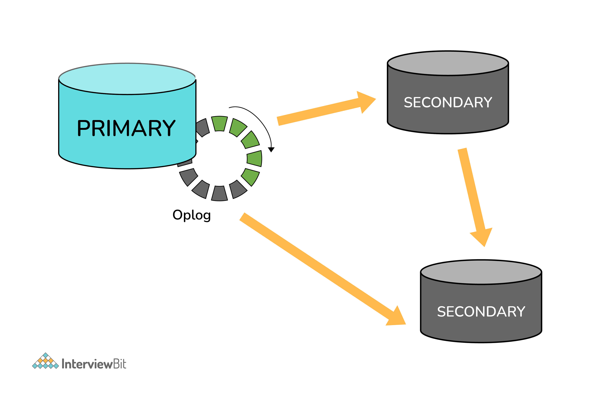
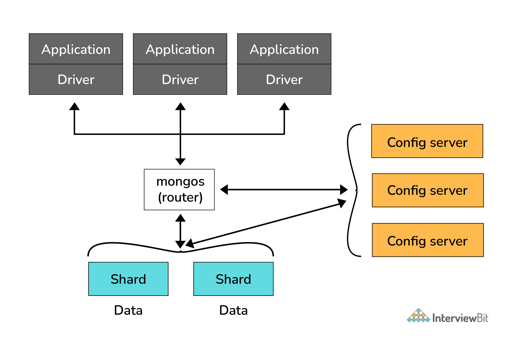
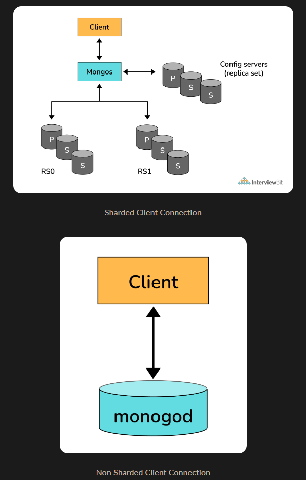
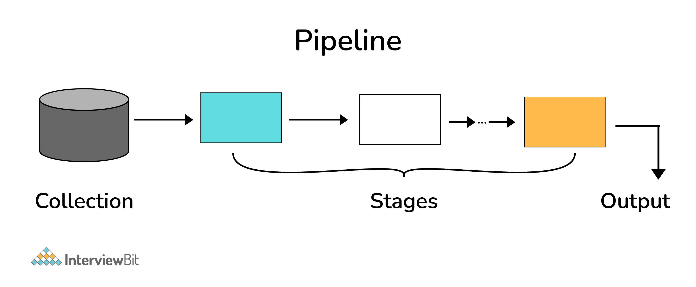

### Table of Contents - MongoDB

| No. | Questions |
| --- | --------- |
|   | **MongoDB** |
| 1 | [What is MongoDB?](#1)|
| 2 | [What are the difference between NoSQL and SQL](#2)|
| 3 | [How to establish MongoDB database connection in a node application?](#3)|
| 4 | [What are Indexes in MongoDB?](#4)|
| 5 | [What are secondary indexes?](#5)|
| 6 | [What are some of the advantages of MongoDB?](#6)|
| 7 | [What are some of the disadvantages of MongoDB?](#7)|
| 8 | [Sharding vs Replication vs Partitioning](#8)|
| 9 | [What is a Document in MongoDB?](#9)|
| 10| [What is a Collection in MongoDB?](#10)|
| 11| [What is a Database in MongoDB?](#11)|
| 12| [What is a Field in MongoDB?](#12)|
| 13| [What is a Subdocument in MongoDB?](#13)|
| 14| [What is a Nested Field in MongoDB?](#14)|
| 15| [What is a Primary Key in MongoDB?](#15)|
| 16| [What is a Replica Set in MongoDB?](#16)|
| 17| [What is the Mongo Shell?](#17)|
| 18| [How does Scale-Out occur in MongoDB?](#18)|
| 19| [What are some features of MongoDB?](#19)|
| 20| [How to add data in MongoDB?](#20)|
| 21| [How to update data in MongoDB?](#21)|
| 22| [How to delete data in MongoDB?](#22)|
| 23| [How to query data in MongoDB?](#23)|
| 24| [How to sort data in MongoDB?](#24)|
| 25| [What are the data types in MongoDB?](#25)|
| 26| [When to use MongoDB?](#26)|
| 27| [What are Geospatial Indexes in MongoDB?](#27)|
| 28| [Explain the process of Sharding.](#28)|
| 29| [Explain the SET Modifier in MongoDB?](#29)|
| 30| [Explain the UNSET Modifier in MongoDB?](#30)|
| 31| [What do you mean by Transactions?](#31)|
| 32| [What are MongoDB Charts?](#32)|
| 33| [What is the Aggregation Framework in MongoDB?](#33)|
| 34| [What is the Aggregation Pipeline in MongoDB?](#34)|
| 35| [What is the Map-Reduce Function in MongoDB?](#35)|
| 36| [What are Single Purpose Aggregation Methods in MongoDB?](#36)|
| 37| [What is the MongoDB Compass?](#37)|
| 38| [What is the MongoDB Stitch?](#38)|
| 39| [What is the MongoDB Atlas?](#39)|
| 40| [What is the MongoDB Realm?](#40)|
| 41| [What are some utilities for backup and restore in MongoDB?](#41)|
| 42| [What is the MongoDB Mobile?](#42)|
| 43| [What is the MongoDB Populate?](#43)|

## 1. What is MongoDB?

- MongoDB is an open-source NoSQL database written in C++ language. It uses JSON-like documents with optional schemas.
- It provides easy scalability and is a cross-platform, document-oriented database.
- MongoDB works on the concept of Collection and Document.
- It combines the ability to scale out with features such as secondary indexes, range queries, sorting, aggregations, and geospatial indexes.
- MongoDB is developed by MongoDB Inc. and licensed under the Server Side Public License (SSPL).
   

## 2. What are the difference between NoSQL and SQL? 

   | Parameter | SQL | NOSQL |
   | --------- | --- | ----- |
   |Definition |SQL databases are primarily called RDBMS or Relational Databases |NoSQL databases are primarily called as Non-relational or distributed database |
   |Query Language|Structured query language (SQL) |No declarative query language |
   |Type |	SQL databases are table based databases |NoSQL databases can be document based, key-value pairs, graph databases |
   |Schema |SQL databases have a predefined schema |NoSQL databases use dynamic schema for unstructured data. |
   |Ability to scale |SQL databases are vertically scalable |NoSQL databases are horizontally scalable |
   |Examples|Oracle, Postgres, and MS-SQL. |	MongoDB, Redis, Neo4j, Cassandra, Hbase.|
   |Best suited for |An ideal choice for the complex query intensive environment. |It is not good fit complex queries. |
   |Hierarchical data storage |SQL databases are not suitable for hierarchical data storage.|More suitable for the hierarchical data store as it supports key-value pair method |
   |Variations|	One type with minor variations|Many different types which include key-value stores, document databases, and graph databases|
   |Consistency |It should be configured for strong consistency. |It depends on DBMS as some offers strong consistency like MongoDB, whereas others offer only offers eventual consistency, like Cassandra. |
   |Hardware|Specialized DB hardware (Oracle Exadata, etc.)|Commodity hardware |
   |Network |Highly available network (Infiniband, Fabric Path, etc.) |Commodity network (Ethernet, etc.) |
   |Best features |Cross-platform support, Secure and free |Easy to use, High performance, and Flexible tool. |
   |Top Companies Using |Hootsuite, CircleCI, Gauges |Airbnb, Uber, Kickstarter |
   |ACID vs. BASE Mode|ACID( Atomicity, Consistency, Isolation, and Durability) is a standard for RDBMS |Base ( Basically Available, Soft state, Eventually Consistent) is a model of many NoSQL systems |
   |Average salary|₹ 5,58,704 per year|₹ 6,04,959 per year|
   
   

## 3. How to establish MongoDB database connection in a node application? 

   **Install MongoDB** 

	**Database Connection**
	Create a file ./config/database.js under the project root.

	Database Connection

	Next, we will add code that connects to the database.

	in database.js file 
  
~~~js
	const mongoose = require('mongoose');
	const server = '127.0.0.1:27017'; // REPLACE WITH YOUR DB SERVER
	const database = 'fcc-Mail';      // REPLACE WITH YOUR DB NAME

     mongoose.connect(`mongodb://${server}/${database}`)
       .then(() => {
         console.log('Database connection successful')
       })
       .catch(err => {
         console.error('Database connection error')
       })
 
	module.exports = { mongoose }
~~~
**MongoDB Atlas**
	sign up to mongosb atlas and it will help you make a connection by url, having a secret key and password

## 4. What are Indexes in MongoDB? 
  In MongoDB, indexes help in efficiently resolving queries. What an Index does is that it stores a small part of the data set in a form that is easy to traverse. The index stores the value of the specific field or set of fields, ordered by the value of the field as specified in the index. 
  MongoDB’s indexes work almost identically to typical relational database indexes.

   Indexes support the efficient execution of queries in MongoDB. Without indexes, MongoDB must perform a collection scan, i.e. scan every document in a collection, to select those documents that match the query statement. If an appropriate index exists for a query, MongoDB can use the index to limit the number of documents it must inspect.

  **MongoDB indexes use a B-tree data structure.** 

- Each index holds a reference to its parent document. The index stores the value of a specific field or set of fields, ordered by the value of the field. The ordering of the index entries supports efficient equality matches and range-based query operations. In addition, MongoDB can return sorted results by using the ordering in the index.

### Index Types
   MongoDB provides several index types and strengths to support various data access patterns.

   - **Single Field Indexes**
   The simplest index, a single field index, indexes on a single field in a document.

   - **Compound Indexes**
   A compound index can include one or more fields of any type except for array. MongoDB indexes each field in the index in ascending order or descending order separately, and can include references to other documents.

   - **Multikey Indexes**
   MongoDB can index arrays, so that you can index fields that contain arrays.

   - **Geospatial Indexes**
   MongoDB supports two types of geospatial indexes: 2d indexes that use planar geometry and 2dsphere indexes that use spherical geometry.

   - **Text Indexes**
   Text indexes support search of string content in documents.

   - **Hashed Indexes**
   Hashed indexes do not support range-based queries. You cannot use a hashed index for sort operations.

   - **Unique Indexes**
   Unique indexes prevent clients from inserting documents that have duplicate values for the indexed field(s). By default, MongoDB creates a unique index on the _id field during the creation of a collection.

   - **Wildcard Indexes**
    Wildcard indexing is an index that can filter and automatically matches any field, sub-document, or array in a collection and then index those matches

## 5. What are secondary indexes? 

 The primary index is typically created when the database is created and is used as the primary means of accessing data in the database. Secondary indexes, on the other hand, can be created and dropped at any time, allowing for greater flexibility in managing the database.

## 6. What are some of the advantages of MongoDB? 

Some advantages of MongoDB are as follows:

- MongoDB supports field, range-based, string pattern matching type queries. for searching the data in the database 
- MongoDB support primary and secondary index on any fields
- MongoDB basically uses JavaScript objects in place of procedures
- MongoDB uses a dynamic database schema
- MongoDB is very easy to scale up or down
- MongoDB has inbuilt support for data partitioning (Sharding).

## 7. What are some of the disadvantages of MongoDB? 

Some disadvantages of MongoDB are as follows:

- MongoDB does not support joins
- In case if the indexing is implemented incorrectly or has any discrepancies, MongoDB will perform at a very low speed.
- MongoDB allows a limited size of only 16 MB for a document. Performance nesting for documents is also limited to only 100 levels.

## 8. Sharding vs Replication vs Partitioning 

- **Sharding** MongoDB uses sharding while handling large datasets. Sharding is the process of dividing data from a large set and distributing it to multiple servers.
In case, there is an issue where the server cannot handle the data due to its size, it automatically divides it further without pausing the activity
- **Replication** MongoDB uses replication to provide high availability. Replication is the process of synchronizing data across multiple servers. Replication provides redundancy and increases data availability with multiple copies of data on different database servers.
- **Partitioning** MongoDB uses partitioning to store data in multiple servers. Partitioning is the process of splitting data across different servers. MongoDB partitioning is known as “sharding”.
**Sharding distributes data across multiple servers, while partitioning splits tables within one server**

## 9. What is a Document in MongoDB? 

A Document in MongoDB is an ordered set of keys with associated values. It is represented by a map, hash, or dictionary. In JavaScript, documents are represented as objects:

~~~js
{
  name: "John",
  age: 25,
  status: "single"
}
~~~

## 10. What is a Collection in MongoDB? 

A collection in MongoDB is a group of documents. If a document is the MongoDB analog of a row in a relational database, then a collection can be thought of as the analog to a table.
Documents within a single collection can have any number of different “shapes.”, i.e. collections have dynamic schemas. 
For example, both of the following documents could be stored in a single collection:

~~~js
{
  name: "John",
  age: 25,
  status: "single"
},
{
  name: "Jane",
  age: 30,
  status: "married",
  children: ["Sam", "Alex"]
}
~~~

## 11. What is a Database in MongoDB? 

MongoDB groups collections into databases. MongoDB can host several databases, each grouping together collections. 
Some reserved database names are as follows:
- admin
- local
- config

## 12. What is a Field in MongoDB? 

A field is a key-value pair in a document. A document has zero or more fields. Fields are analogous to columns in relational databases.

## 13. What is a Subdocument in MongoDB? 

A subdocument is a document nested in another document. Subdocuments are analogous to nested objects in object-oriented programming languages.

## 14. What is a Nested Field in MongoDB? 

A nested field is a field within a subdocument. Nested fields are analogous to nested object fields in object-oriented programming languages.

## 15. What is a Primary Key in MongoDB? 

A primary key is a unique identifier for a document in a collection. Every MongoDB document has a primary key that is automatically assigned by MongoDB on document creation. The primary key is always stored in the _id field.

## 16. What is a Replica Set in MongoDB? 

A replica set is a group of MongoDB servers that maintain the same data set, providing redundancy and increasing data availability. A replica set contains several data bearing nodes and optionally one arbiter node. Of the data bearing nodes, one and only one member is deemed the primary node, while the other nodes are deemed secondary nodes. The primary node receives all write operations. A replica set can have only one primary capable of confirming writes with { w: "majority" } write concern; although in some circumstances, another mongod instance may transiently believe itself to also be primary. Replica sets can have only one arbiter.

The following diagram depicts the architecture diagram of a simple replica set cluster with only three server nodes – one primary node and two secondary nodes:

- In the preceding model, the PRIMARY database is the only active replica set member that receives write operations from database clients. The PRIMARY database saves data changes in the Oplog. Changes saved in the Oplog are sequential—that is, saved in the order that they are received and executed.

- The SECONDARY database is querying the PRIMARY database for new changes in the Oplog. If there are any changes, then Oplog entries are copied from PRIMARY to SECONDARY as soon as they are created on the PRIMARY node.

- Then, the SECONDARY database applies changes from the Oplog to its own datafiles. Oplog entries are applied in the same order they were inserted in the log. As a result, datafiles on SECONDARY are kept in sync with changes on PRIMARY.

- Usually, SECONDARY databases copy data changes directly from PRIMARY. Sometimes a SECONDARY database can replicate data from another SECONDARY. This type of replication is called Chained Replication because it is a two-step replication process. Chained replication is useful in certain replication topologies, and it is enabled by default in MongoDB.

## 17. What is the Mongo Shell? 

The mongo shell is an interactive JavaScript interface to MongoDB. You can use the mongo shell to query and update data as well as perform administrative operations.

To start the shell, run the mongo executable:

~~~js
$ mongod
$ mongo
MongoDB shell version: 4.2.0
connecting to: test
>
~~~

## 18. How does Scale-Out occur in MongoDB? 

The document-oriented data model of MongoDB makes it easier to split data across multiple servers. Balancing and loading data across a cluster is done by MongoDB. It then redistributes documents automatically.

The mongos acts as a query router, providing an interface between client applications and the sharded cluster.

Config servers store metadata and configuration settings for the cluster. MongoDB uses the config servers to manage distributed locks. Each sharded cluster must have its own config servers.

## 19. What are some features of MongoDB? 

- **Indexing**: It supports generic secondary indexes and provides unique, compound, geospatial, and full-text indexing capabilities as well.
- **Aggregation**: It provides an aggregation framework based on the concept of data processing pipelines.
- **Special collection and index types**: It supports time-to-live (TTL) collections for data that should expire at a certain time
- **File storage**: It supports an easy-to-use protocol for storing large files and file metadata.
- **Sharding**: Sharding is the process of splitting data up across machines.

## 20. How to add data in MongoDB? 

To add data in MongoDB, we use the **insert()** or **save()** method. The insert() method inserts a record in the collection whereas the save() method replaces the existing document with the new document passed in the save() method.
**InsertMany()** method is used to insert multiple documents in a collection.

~~~js
db.collection.insert(document); // inserts a record or records in a collection
// or
db.collection.save({"b": 3}, {'c': 4});
db.collections.insetOne(document);//inserts a single record in a collection
db.collection.save(document);//replaces the existing document
//or
db.collection.insertMany([document1, document2, ...]); //inserts multiple records in a collection
~~~

## 21. How to update data in MongoDB? 

Once a document is stored in the database, it can be changed using one of several update methods: **updateOne**, **updateMany**, and **replaceOne**. updateOne and updateMany each takes a filter document as their first parameter and a modifier document, which describes changes to make, as the second parameter. replaceOne also takes a filter as the first parameter, but as the second parameter replaceOne expects a document with which it will replace the document matching the filter.

~~~js
db.collection.updateOne(filter, update, options); //updates a single document matching the filter
db.collection.updateMany(filter, update, options); //updates multiple documents matching the filter
db.collection.replaceOne(filter, replacement, options); //replaces a single document matching the filter
~~~

## 22. How to delete data in MongoDB? 

To delete data in MongoDB, we use the **deleteOne()** or **deleteMany()** method. The deleteOne() method deletes the first document that matches the filter criteria whereas the deleteMany() method deletes all the documents that match the filter criteria.

~~~js
db.collection.deleteOne(filter, options); //deletes a single document matching the filter
db.collection.deleteMany(filter, options); //deletes multiple documents matching the filter
~~~

## 23. How to query data in MongoDB? 

To query data in MongoDB, we use the **find()** method. The find() method returns all occurrences in the selection. To limit these results, we use the **limit()** method.

~~~js
db.collection.find(query, projection); //returns all occurrences in the selection
db.collection.find(query, projection).limit(number); //limits the results
~~~

## 24. How to sort data in MongoDB? 

To sort data in MongoDB, we use the **sort()** method. The sort() method sorts the results by a given field in ascending or descending order.

~~~js
db.collection.find().sort({field: 1}); //sorts the results by a given field in ascending order
db.collection.find().sort({field: -1}); //sorts the results by a given field in descending order
~~~

## 25. What are the data types in MongoDB? 

MongoDB supports the following data types:

- Null  
{"x" : null}
- Boolean  
{"x" : true}
- Number (integer, float, double)  
{"x" : 4}
- String  
{"x" : "foobar"}
- Date  
{"x" : new Date()}
- Regular expression  
{"x" : /foobar/i} // i for case-insensitive
- Array   
{"x" : ["a", "b", "c"]}
- Embedded document  
{"x" : {"foo" : "bar"}}
- Object ID  
{"x" : ObjectId()}
- Binary Data  
Binary data is a string of arbitrary bytes.
- Code  
{"x" : function() { /* ... */ }}

## 26. When to use MongoDB? 

MongoDB is a good choice when:

- You need high availability.
- You need to scale quickly.
- You need to store large amounts of data.
- You need dynamic queries.
- You need to store data in flexible schemas.
- Distributing data across several machines, and facilitating high throughput operations with large sets of data.
- Store, manage and search data with text, geospatial, or time-series dimensions.

## 27. What are Geospatial Indexes in MongoDB? 

Geospatial indexes support queries that calculate geometries on an earth-like sphere. MongoDB supports two types of geospatial indexes: 2d indexes that use planar geometry and 2dsphere indexes that use spherical geometry.

~~~js

db.places.createIndex( { loc : "2dsphere" } )

{
   "name" : "New York City",
   "loc" : {
       "type" : "Point",
       "coordinates" : [50, 2]
   }
}

{
   "name" : "Hudson River",
   "loc" : {
       "type" : "LineString",
       "coordinates" : [[0,1], [0,2], [1,2]]
   }
}

~~~

## 28. Explain the process of Sharding. 

Sharding is the process of splitting data up across machines. We also use the term “partitioning” sometimes to describe this concept. We can store more data and handle more load without requiring larger or more powerful machines, by putting a subset of data on each machine.

In the figure below, RS0 and RS1 are shards. MongoDB’s sharding allows you to create a cluster of many machines (shards) and break up a collection across them, putting a subset of data on each shard. This allows your application to grow beyond the resource limits of a standalone server or replica set.

## 29. Explain the SET Modifier in MongoDB? 

The SET modifier is used to set a new value for a field in an update query. If the field does not exist, the modifier will create a new field with the specified value.

given the following document:
~~~js
{
   "_id" : ObjectId("4b253b067525f35f94b60a31"),
   "name" : "alice",
   "age" : 23,
   "sex" : "female",
   "location" : "India"
}
~~~

The following update query will set the value of the location field to “US”:

~~~js
db.users.update(
   { name: "alice" },
   { $set: { location: "US" } }//set the value of the location field to “US” , if the field does not exist, the modifier will create a new field with the specified value.
)
~~~

## 30. Explain the UNSET Modifier in MongoDB? 

The UNSET modifier is used to delete a field in an update query. If the field does not exist, the modifier will do nothing.

given the following document:
~~~js
{
   "_id" : ObjectId("4b253b067525f35f94b60a31"),
   "name" : "alice",
   "age" : 23,
   "sex" : "female",
   "location" : "India"
}
~~~

The following update query will delete the location field:

~~~js

db.users.update(
   { name: "alice" },
   { $unset: { location: "" } }//delete the location field
)
~~~

## 31. What do you mean by Transactions? 

A transaction is a set of operations that either succeed or fail as a single unit. MongoDB provides the ability to perform transactional read and write operations on existing data in a database.

T**ransactions provide a useful feature in MongoDB to ensure consistency.**

MongoDB provides two APIs to use transactions. 

- **Core API**: It is a similar syntax to relational databases (e.g., start_transaction and commit_transaction)
- **Call-back API**: This is the recommended approach to using transactions. It starts a transaction, executes the specified operations, and commits (or aborts on the error). It also automatically incorporates error handling logic for "TransientTransactionError" and"UnknownTransactionCommitResult".

example of transactions in MongoDB:

~~~js

const session = client.startSession();// 'client' is a MongoClient instance

session.startTransaction({
  readConcern: { level: 'snapshot' },//read concern level 'snapshot' is the default, which means that the transaction will see the data from the time it started
  writeConcern: { w: 'majority' }//write concern level 'majority' is the default, which means that MongoDB will wait until a majority of nodes have acknowledged the write before acknowledging the success of the operation
});

try {
  await collection.insertOne({ name: 'Alice' }, { session });
  await collection.insertOne({ name: 'Bob' }, { session });
  await session.commitTransaction();
} catch (error) {
  await session.abortTransaction();
  throw error;
} finally {
  session.endSession();
}

//or with callback API and error handling

const session = client.startSession();

session.withTransaction(async () => {//withTransaction() method automatically starts a transaction, executes the specified operations, and commits (or aborts on the error)
  await collection.insertOne({ name: 'Alice' }, { session });
  await collection.insertOne({ name: 'Bob' }, { session });
}, {
  readConcern: { level: 'snapshot' },
  writeConcern: { w: 'majority' }
});

~~~

## 32. What are MongoDB Charts? 

MongoDB Charts is a data visualization tool that allows you to create charts and graphs that can be embedded in web pages or dashb

Two types of charts are supported:

- MongoDB Charts PaaS (Platform as a Service)
- MongoDB Charts Server

MongoDB Charts PaaS is a fully managed service that runs on MongoDB Atlas. MongoDB Charts Server is a self-managed version of MongoDB Charts that you can run on-premises or in your own virtual private cloud.

## 33. What is the Aggregation Framework in MongoDB? 

The aggregation framework is a MongoDB query language that processes data records and returns computed results. 

Aggregation operations group values from multiple documents together, and can perform a variety of operations on the grouped data to return a single result. 

MongoDB provides three ways to perform aggregation: the **aggregation pipeline**, the **map-reduce function**, and **single purpose aggregation methods**.

## 34. What is the Aggregation Pipeline in MongoDB? 

The aggregation pipeline is a framework for data aggregation modeled on the concept of data processing pipelines. Documents enter a multi-stage pipeline that transforms the documents into an aggregated result.

The pipeline consists of one or more stages. Each stage transforms the documents as they pass through the pipeline. Pipeline stages do not need to produce one output document for every input document; e.g., some stages may generate new documents or filter out documents.

given the following documents:

~~~js

{ "_id" : 1, "cust_id" : "abc1", "ord_date" : ISODate("2012-11-02T17:04:11.102Z"), "status" : "A", "amount" : 50 }
{ "_id" : 2, "cust_id" : "xyz1", "ord_date" : ISODate("2013-10-01T17:04:11.102Z"), "status" : "A", "amount" : 100 }
{ "_id" : 3, "cust_id" : "xyz1", "ord_date" : ISODate("2013-10-12T17:04:11.102Z"), "status" : "D", "amount" : 25 }
{ "_id" : 4, "cust_id" : "xyz1", "ord_date" : ISODate("2013-10-11T17:04:11.102Z"), "status" : "D", "amount" : 125 }
{ "_id" : 5, "cust_id" : "abc1", "ord_date" : ISODate("2013-11-12T17:04:11.102Z"), "status" : "A", "amount" : 25 }

~~~
example of aggregation pipeline:
~~~js

db.orders.aggregate([
   { $match: { status: "A" } },//selects documents with status equal to "A"
   { $group: { _id: "$cust_id", total: { $sum: "$amount" } } }//groups the documents by the cust_id field to calculate the sum of the amount for each unique cust_id value 
]);

//output
{ "_id" : "xyz1", "total" : 100 }
{ "_id" : "abc1", "total" : 75 }

~~~

An individual stage of an aggregation pipeline is a data processing unit. It takes in a stream of input documents one at a time, processes each document one at a time, and produces an output stream of documents one at a time (see figure below).

## 35. What is the Map-Reduce Function in MongoDB? 

The map-reduce function uses two functions to map and reduce the data into results. The map function processes a single document and emits one or more objects for each input document. The reduce function takes the output of the map function and combines the documents into a single result.

Given the following documents:

~~~js

{ "_id" : 1, "cust_id" : "abc1", "ord_date" : ISODate("2012-11-02T17:04:11.102Z"), "status" : "A", "amount" : 50 }
{ "_id" : 2, "cust_id" : "xyz1", "ord_date" : ISODate("2013-10-01T17:04:11.102Z"), "status" : "A", "amount" : 100 }
{ "_id" : 3, "cust_id" : "xyz1", "ord_date" : ISODate("2013-10-12T17:04:11.102Z"), "status" : "D", "amount" : 25 }
{ "_id" : 4, "cust_id" : "xyz1", "ord_date" : ISODate("2013-10-11T17:04:11.102Z"), "status" : "D", "amount" : 125 }
{ "_id" : 5, "cust_id" : "abc1", "ord_date" : ISODate("2013-11-12T17:04:11.102Z"), "status" : "A", "amount" : 25 }

~~~
example of map-reduce function:

~~~js

db.orders.mapReduce(
   function() { emit(this.cust_id, this.amount); },//map function processes a single document and emits one or more objects for each input document
   function(key, values) { return Array.sum(values) },//reduce function takes the output of the map function and combines the documents into a single result
   {
     query: { status: "A" },//selects documents with status equal to "A"
     out: "order_totals"//stores the results in the order_totals collection
   }
)

//output
{ "_id" : "abc1", "value" : 75 }
{ "_id" : "xyz1", "value" : 100 }

~~~

## 36. What are Single Purpose Aggregation Methods in MongoDB? 

MongoDB provides methods that perform simple aggregation operations. These methods are faster and more efficient than the aggregation pipeline and map-reduce function.

example of single purpose aggregation methods:

~~~js

db.orders.count({ status: "A" });//counts the number of documents with status equal to "A"
db.orders.distinct("cust_id");//returns an array of distinct cust_id values

~~~

## 37. What is the MongoDB Compass? 

MongoDB Compass is a GUI for MongoDB. It allows you to visually explore your data, run ad hoc queries, and interact with your data with full CRUD functionality. MongoDB Compass is available in several versions, described below.

- **Community Edition**: The Community Edition is free and available for both Windows and macOS. It provides a GUI for exploring your data and performing ad hoc queries.
- **Enterprise Edition**: The Enterprise Edition is available as part of MongoDB Enterprise Advanced. It provides a GUI for exploring your data and performing ad hoc queries, as well as a GUI for configuring your MongoDB deployment.

## 38. What is the MongoDB Stitch? 

MongoDB Stitch is a serverless platform that enables developers to quickly build applications without having to set up server infrastructure. MongoDB Stitch provides several features, including:

- **Authentication**: MongoDB Stitch provides several authentication providers, including anonymous, API key, Facebook, Google, and custom authentication.
- **Functions**: MongoDB Stitch provides a serverless functions platform that allows you to write application logic in JavaScript.
- **Services**: MongoDB Stitch provides several services, including MongoDB Atlas, Twilio, AWS, and HTTP.
- **Triggers**: MongoDB Stitch provides several triggers, including database, authentication, and HTTP.

## 39. What is the MongoDB Atlas? 

MongoDB Atlas is a fully managed cloud database service that provides all of the features of MongoDB without the operational heavy lifting required for any new application. MongoDB Atlas enables you to easily and securely run MongoDB deployments in the cloud. MongoDB Atlas is available on-demand through a pay-as-you-go model and billed on an hourly basis, letting you focus on what you do best.

## 40. What is the MongoDB Realm? 

MongoDB Realm is a serverless platform that enables developers to quickly build applications without having to set up server infrastructure. MongoDB Realm provides several features, including:

- **Authentication**: MongoDB Realm provides several authentication providers, including anonymous, API key, Facebook, Google, and custom authentication.
- **Functions**: MongoDB Realm provides a serverless functions platform that allows you to write application logic in JavaScript.
- **Services**: MongoDB Realm provides several services, including MongoDB Atlas, Twilio, AWS, and HTTP.
- **Triggers**: MongoDB Realm provides several triggers, including database, authentication, and HTTP.

## 41. What are some utilities for backup and restore in MongoDB? 

MongoDB provides the following utilities for backup and restore:

- **mongodump**: The mongodump utility creates a binary export of the contents of a database. The mongodump utility can export data from either mongod or mongos instances.
- **mongorestore**: The mongorestore utility reads BSON data created by mongodump and restores that data into a MongoDB instance.
- **mongoimport**: The mongoimport utility imports content from a JSON, CSV, or TSV export created by mongoexport, or potentially, another third-party export tool.
- **mongoexport**: The mongoexport utility produces a JSON or CSV export of data stored in a MongoDB instance.

## 42. What is the MongoDB Mobile? 

MongoDB Mobile is a suite of tools and products that enables developers to build applications for mobile devices using MongoDB as the data store. MongoDB Mobile includes:

- **MongoDB Stitch Mobile Sync**: MongoDB Stitch Mobile Sync provides synchronization between a MongoDB Atlas cluster and a mobile device running MongoDB Mobile. MongoDB Stitch Mobile Sync provides a conflict resolution strategy that allows you to define how conflicts are resolved when a document is updated on both the mobile device and the MongoDB Atlas cluster.
- **MongoDB Mobile**: MongoDB Mobile is a lightweight embedded database that you can include in your mobile applications. MongoDB Mobile provides a MongoDB-compatible API that allows you to interact with the database using the same MongoDB drivers and tools that you use to interact with a MongoDB Atlas cluster.

## 43. What is the MongoDB Populate? 

The populate() method in Mongoose allows you to populate data from a referenced collection into a document. The populate() method takes an array of one or more documents and replaces the specified path in the document with the populated document(s).

Population is the process of automatically replacing the specified paths in the document with document(s) from other collection(s). We may populate a single document, multiple documents, a plain object, multiple plain objects, or all objects returned from a query. Let's look at some examples.

given the following exampl;e:

~~~js

const mongoose = require('mongoose');
const { Schema } = mongoose;

const personSchema = Schema({
  _id: Schema.Types.ObjectId,
  name: String,
  age: Number,
  stories: [{ type: Schema.Types.ObjectId, ref: 'Story' }]
});

const storySchema = Schema({
  author: { type: Schema.Types.ObjectId, ref: 'Person' },
  title: String,
  fans: [{ type: Schema.Types.ObjectId, ref: 'Person' }]
});

const Story = mongoose.model('Story', storySchema);
const Person = mongoose.model('Person', personSchema);

~~~

saving a reference to another document in another collection is as simple as assigning the _id value of the document:

~~~js

const author = new Person({
  _id: new mongoose.Types.ObjectId(),
  name: 'Ian Fleming',
  age: 50
});

await author.save();

const story1 = new Story({
  title: 'Casino Royale',
  author: author._id // assign the _id from the person
});

await story1.save();
// that's it!

~~~

Population:

~~~js

const story = await Story.
  findOne({ title: 'Casino Royale' }).
  populate('author').
  exec();
// prints "The author is Ian Fleming"
console.log('The author is %s', story.author.name);

~~~

So far we've created two Models. Our Person model has its stories field set to an array of ObjectIds. The ref option is what tells Mongoose which model to use during population, in our case the Story model. All _ids we store here must be document _ids from the Story model.

