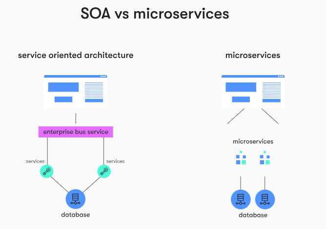

# Interview Questions

## Node.js

### Table of Contents - Node JS

| No. | Questions |
| --- | --------- |
|   | **Node JS** |
| 1 | [What do you mean by Asynchronous API?](#1)|  
| 2 | [What are the benefits of using Node.js?](#2)|
| 2.1 | [What is NodeJS?](#2.1)|              
| 2.2 | [What is Package.json?](#2.2)|
| 2.3 | [Purpose of module exports](#2.3)|               
| 3 | [Is Node a single threaded application?](#3)|        
| 4 | [What is global installation of dependencies?](#4)|                                                                          
| 5 | [What is an error-first callback?](#5)|
| 6 | [What's the difference between operational and programmer errors?](#6)|                             
| 7 | [What is the difference between Nodejs, AJAX, and jQuery?](#7) |
| 8 | [How to make Post request in Node.js?](#8)|                                                                       
| 9 | [What are the key features of Node.js?](#9)|
| 10| [What is control flow function?](#10)|                         
| 11| [ What are Event Listeners?](#11)| 
| 11.1| [What Is EventEmitter In NodeJs?](#11.1)|                                        
| 12| [If Node.js is single threaded then how it handles concurrency?](#12)|                                            
| 13| [What is Callback Hell?](#13)|
| 14| [Could we run an external process with Node.js?](#l4) |
| 14.1| [How can we spawn the child process asynchronously without blocking the Nodejs event loop?](#14.1) |
| 15| [List out the differences between AngularJS and NodeJS?](#15) |
| 16| [How you can monitor a file for modifications in Node.js ?](#16) |
| 17| [What are the core modules of Node,js?](#17) |
| 18| [What is V8?](#18) |
| 19| [What is libuv?](#19) |
| 20| [What is the difference between returning a callback and just calling a callback?](#20) |
| 21| [What is REPL in context of Node?](#21) |
| 22| [What is Callback?](#22) |
| 23| [What is a blocking code?](#23) |
| 24| [How Node prevents blocking code?](#24) |
| 25| [What is Event Loop?](#25) |
| 26| [ What is Event Emmitter?](#26) |
| 27| [What is purpose of Buffer class in Node?](#27) |
| 27.1| [What are buffer objects in nodejs?](#27.1) |
| 28| [What is difference between synchronous and asynchronous method of fs module?](#28) |
| 29| [What are streams?](#29) |
| 30| [What is Chaining in Node?](#30) |
| 31| [What is the purpose of setTimeout function?](#31) |
| 32| [How can you avoid callback hells?](#32) |
| 33| [What's the event loop?](#33) |
| 34| [How to avoid callback hell in Node.js?](#34) |
| 35| [Explain how does Node.js work?](#35) |
| 36| [When should we use Node.js?](#36) |
| 37| [How does Node.js handle child threads?](#37) |
| 38| [What is the preferred method of resolving unhandled exceptions in Node.js?](#38) |
| 39| [What is stream and what are types of streams available in Node.js?](#39) |
| 40| [What are the global objects of Node.js?](#40) |
| 41| [ What is Piping in Node?](#41) |
| 42| [Name some of the events fired by streams](#42) |
| 43| [What is the purpose of __filename variable? ](#43) |
| 44| [How can you listen on port 80 with Node? ](#44) |
| 45| [What tools can be used to assure consistent code style?](#45)|
| 46| [What's a stub? Name a use case.](#46) |
| 47| [Does Node.js support multi-core platforms? And is it capable of utilizing all the cores?](#47) |
| 48| [Is Node.js entirely based on a single-thread?](#48) |
| 49| [Is Node.js entirely based on a single-thread?](#49) |
| 50| [When to not use Node.js?](#50) |
| 50.1| [When to use Node.js?](#50.1) |
| 51| [Why to use Buffers instead of binary strings to handle binary data ?](#51) |
| 52| [How to use Buffer in Node.js?](#52) |
| 53| [When should I use EventEmitter?](#53) |
| 54| [How do you debug Node.js applications?](#54) |
| 55| [Rewrite promise-based Node.js applications to Async/Await](#55) |
| 56| [What is the relationship between Node.js and V8?](#56) |
| 57| [What is N-API in Node.js?](#57) |
| 58| [ Explain the concept of Domain in Node.js](#58) |
| 59| [Are you familiar with differences between Node.js nodules and ES6 nodules?](#59) |
| 60| [What are the use cases for the Node.js "vm" core module?](#60) |
| 61| [What is Piping in Node?](#61) |
| 62| [Name some of the events fired by streams.](#62) |
| 63| [What is the purpose of __filename variable?](#63) |
| 64| [How can you listen on port 80 with Node?](#64) |
| 65| [What tools can be used to assure consistent code style?](#65) |
| 66| [ What's a stub? Name a use case.](#66) |
| 67| [Does Node.js support multi-core platforms? And is it capable of utilizing all the cores?](#67) |
| 68| [Is Node.js entirely based on a single-thread?](#68) |
| 69| [Is Node.js entirely based on a single-thread?](#69) |
| 70| [When to not use Node.js?](#70) |
| 71| [Why to use Buffers instead of binary strings to handle binary data ?](#71) |
| 72| [How to gracefully Shutdown Node.js Server?](#72) |
| 73| [What are the timing features of Node.js? ](#73) |
| 74| [Explain usage of NODE_ENV](#74) |
| 75| [What is LTS releases of Node.js why should you care? ](#75) |
| 76| [Provide some example of config file separation for dev and prod environments ](#76) |
| 77| [How would you handle errors for async code in Node.js?](#77) |
| 78| [What's the difference between dependencies, devDependencies and peerDependencies in npm package.json file?](#78) |
| 79| [How do you convert an existing callback API to promises?](#79) |
| 80| [What are async functions in Node? Provide some examples.](#80) |
| 81| [Consider following code snippet](#81) |
| 82| [Can Node.js use other engines than V8?](#82) |
| 83| [How would you scale Node application?](#83) |
| 84| [What is the difference between process.nextTick() and setImmediate() ?](#84) |
| 85| [How to solve "Process out of Memory Exception" in Node.js ?](#85) |
| 86| [Explain what is Reactor Pattern in Node.js?](#86) |
| 87| [Explain some Error Handling approaches in Node.js you know about. Which one will you use?](#87) |
| 88| [ Why should you separate Express 'app' and 'server'?](#88) |
| 89| [Rewrite the code sample without try/catch block](#89) |
| 90| [How many threads does Node actually create?](#90) |
| 91| [Can Node.js work without V8?](#91) |
| 92| [How the V8 engine works?](#92) |
| 93| [What is the purpose of using hidden classes in V8?](#93) |
| 94| [How V8 compiles JavaScript code?](#94) |
| 95| [How does libuv work under the hood?](#95) |
| 96| [How does the cluster module work? What’s the difference between it and a load balancer?](#96) |
| 97| [ What is V8 Templates?](#97) |
| 98| [Why do we need C++ Addons in Node.js?](#98) |
| 99| [Is it possible to use "Class" in Node.js?](#99) |
| 100| [Why Node.js devs tend to lean towards the Module Requiring vs Dependency Injection? ](#100) |
| 101| [Explain the result of this code execution](#101) |
| 102| [Explain the result of this code execution](#102) |
| 103| [What will happen when that code will be executed?](#103) |
| 104| [List down the major security implementations within Nodejs?](#104) |
| 105| [Explain the concept of URL module?](#105) |
| 106| [Explain the concept of middleware in Nodejs?](#106) |
| 107| [List down the two arguments that async.queue takes as input?](#107) |
| 108| [Explain the purpose of ExpressJS package?](#108) |
| 109| [Describe the exit codes of Nodejs?](#109) |
| 110| [Is cryptography supported in Nodejs?](#110) |
| 111| [What is the role of assert module in nodejs?](#111) |
| 112| [What is the role of async_hooks module in nodejs?](#112) |
| 113| [How can we take advantage of multi-core system in Nodejs as nodejs works on single thread?](#113) |
| 114| [What is the datatype of console?](#114) |
| 115| [Which are the different console methods available?](#115) |
| 116| [How can we read or write files in node js?](#116) |
| 117| [How can we perform asynchronous network API in Node JS?](#117) |
| 118| [OS module](#118) |
| 119| [CRUD Withoud frameworks](#119) |
| 120| [What is single threaded in node?](#120) |
| 121| [How to handle errors?](#121) |
| 122| [What is the purpose of __dirname variable?](#122) |
| 123| [What is the purpose of __filename variable?](#123) |
| 124| [What is the purpose of process object?](#124) |
| 125| [What is the purpose of process.argv property?](#125) |
| 126| [What is the purpose of process.env property?](#126) |
| 127| [What is the purpose of process.nextTick() method?](#127) |
| 128| [What is the purpose of process.exit() method?](#128) |
| 129| [What is the purpose of process.kill() method?](#129) |
| 130| [What is the purpose of process.pid property?](#130) |
| 131| [Whats the difference between Authentication and Authorization?](#131) |
| 132| [What is the difference between Asynchronous and Non-blocking?](#132) |
| 133| [What is the difference between Nodejs vs Ajax?](#133) |
| 134| [What is the difference between NPM and NPX?](#134) |
| 135| [What are the modules in Node.JS?](#135) |
| 136| [What is the purpose of the module .Exports?](#136) |
| 137| [What is the purpose of the module .Require?](#137) |
| 138| [What does event-driven programming mean?](#138) |
| 139| [What is the purpose of the module .EventEmitter?](#139) |
| 140| [What is the purpose of the module .Buffer?](#140) |
| 141| [What is the purpose of the module .Stream?](#141) |
| 142| [How do you install, update, and delete a dependency?](#142) |
| 143| [Explain asynchronous and non-blocking APIs in Node.js](#143) |
| 144| [How do we implement async in Node.js?](#144) |
| 145| [What is the difference between fork() and spawn() methods in Node.js?](#145) |
| 146| [What is a reactor pattern in Node.js?](#146) |
| 147| [What is a test pyramid in Node.js?](#147) |
| 148| [Describe Node.js exit codes.](#148) |
| 149| [What are the different types of HTTP requests?](#149) |
| 150| [What is the purpose of NODE_ENV?](#150) |
| 151| [What do you understand about ESLint?](#151) |
| 152| [How are worker threads different from clusters?](#152) |
| 153| [How to measure the duration of async operations?](#153) |
| 154| [What is the difference between readFile and create Read Stream in Node.js?](#154) |
| 155| [What is the purpose of the module .Crypto?](#155) |
| 156| [What is a passport in Node.js?](#156) |
| 157| [How do you decide whether to use Node.js Express or Node.js Nest based on the project size?](#157) |
| 158| [Explain 0auth2.0 and its benefits](#158) |
| 159| [Compare service-oriented architecture (SOA) and microservice architecture (MSA)](#159) |
| 160| [What does “low in coupling and high in cohesion” mean in backend development?](#160) |
| 161| [How do you ensure the security of backend systems?](#161) |
| 162| [What’s the difference between using PostgreSQL and MongoDB for Node.js server projects?](#162) |
| 163| [How do you decide when to implement caching in your backend systems?](#163) |
| 164| [What is the difference between a monolithic and microservice architecture?](#164) |
| 165| [How would you describe a good approach to deploying a backend project?](#165) |


### Q1: What do you mean by Asynchronous API? <a id="1"></a>

**Answer:**
All APIs of Node.js library are aynchronous that is non-blocking. It essentially means a Node.js based server never waits for an API to return data. Server moves to next API after calling it and a notification mechanism of Events of Node.js helps server to get response from the previous API call.

**Source:** _tutorialspoint.com_
### Q2: What are the benefits of using Node.js? ☆☆<a id="2"></a>

**Answer:**
Following are main benefits of using Node.js

*   **Aynchronous and Event Driven** - All APIs of Node.js library are asynchronous that is non-blocking. It essentially means a Node.js based server never waits for a API to return data. Server moves to next API after calling it and a notification mechanism of Events of Node.js helps server to get response from the previous API call.
*   **Very Fast** - Being built on Google Chrome's V8 JavaScript Engine, Node.js library is very fast in code execution.
*   **Single Threaded but highly Scalable** - Node.js uses a single threaded model with event looping. Event mechanism helps server to respond in a non-bloking ways and makes server highly scalable as opposed to traditional servers which create limited threads to handle requests. Node.js uses a single threaded program and same program can services much larger number of requests than traditional server like Apache HTTP Server.
*   **No Buffering** \- Node.js applications never buffer any data. These applications simply output the data in chunks.

**Source:** _tutorialspoint.com_

### Q2.1: What is NodeJS? ☆☆<a id="2.1"></a>

Node.js is an open-source, cross-platform, JavaScript runtime environment that executes JavaScript code outside of a browser. Node JS was created by Ryan Dahl, Ryan Dahl is a software engineer and the original developer of the Node.js JavaScript runtime.

### Q2.2: What is package.json? ☆☆<a id="2.2"></a>

The package.json file in Node.js is the heart of the entire application. It is basically the manifest file that contains the metadata of the project where we define the properties of a package.

### Q2.2.1: What is the purpose of package.json? ☆☆<a id="2.2.1"></a>

The purpose of the package.json file is to keep track of the project dependencies and other metadata of the project. It holds various metadata relevant to the project like the project name, author name, description, version, license information, etc. It also defines the project dependencies, command-line scripts, provides various other metadata like the project repository, keywords, bugs, and other metadata.

### Q2.2.2 What is package-lock.json? ☆☆<a id="2.2.2"></a>

The package-lock.json file is automatically generated for any operations where npm modifies either the node_modules tree, or package.json. It describes the exact tree that was generated, such that subsequent installs are able to generate identical trees, regardless of intermediate dependency updates.

### Q2.3: Purpose of module exports ☆☆<a id="2.3"></a>

A module in Node.js is used to encapsulate all the related codes into a single unit of code which can be interpreted by shifting all related functions into a single file
### Q3: Is Node a single threaded application? ☆☆<a id="3"></a>

**Answer:**
Yes! Node uses a single threaded model with event looping.

**Source:** _tutorialspoint.com_
### Q4: What is global installation of dependencies? ☆☆<a id="4"></a>

**Answer:**
Globally installed packages/dependencies are stored in **<user-directory>**/npm directory. Such dependencies can be used in CLI (Command Line Interface) function of any node.js but can not be imported using require() in Node application directly. To install a Node project globally use -g flag.

**Source:** _tutorialspoint.com_
### Q5: What is an error-first callback? ☆☆<a id="5"></a>

**Answer:**
*Error-first callbacks* are used to pass errors and data. The first argument is always an error object that the programmer has to check if something went wrong. Additional arguments are used to pass data.

```js
fs.readFile(filePath, function(err, data) {
  if (err) {
    //handle the error
  }
  // use the data object
});
```

**Source:** _tutorialspoint.com_
### Q6: What's the difference between operational and programmer errors? ☆☆<a id="6"></a>

**Answer:**
Operation errors are not bugs, but problems with the system, like _request timeout_ or _hardware failure_. On the other hand programmer errors are actual bugs.

**Source:** _blog.risingstack.com_
### Q7: What is the difference between Nodejs, AJAX, and jQuery? ☆☆<a id="7"></a>

**Answer:**
The one common trait between Node.js, AJAX, and jQuery is that all of them are the advanced implementation of JavaScript. However, they serve completely different purposes.

* Node.js –It is a server-side platform for developing client-server applications. For example, if we’ve to build an online employee management system, then we won’t do it using client-side JS. But the Node.js can certainly do it as it runs on a server similar to Apache, Django not in a browser.

* AJAX (aka Asynchronous Javascript and XML) –It is a client-side scripting technique, primarily designed for rendering the contents of a page without refreshing it. There are a no. of large companies utilizing AJAX such as Facebook and Stack Overflow to display dynamic content.

* jQuery –It is a famous JavaScript module which complements AJAX, DOM traversal, looping and so on. This library provides many useful functions to help in JavaScript development. However, it’s not mandatory to use it but as it also manages cross-browser compatibility, so can help you produce highly maintainable web applications.

**Source:** _techbeamers.com_
### Q8: How to make Post request in Node.js? ☆☆<a id="8"></a>

**Answer:**
Following code snippet can be used to make a Post Request in Node.js.

```js
var request = require('request');
request.post('http://www.example.com/action', {
  form: {
    key: 'value'
  }
}, function(error, response, body) {
  if (!error && response.statusCode == 200) {
    console.log(body)
  }
});
```

**Source:** _techbeamers.com_
### Q9: What are the key features of Node.js? ☆☆<a id="9"></a>

**Answer:**
Let’s look at some of the key features of Node.js.

*   **Asynchronous event driven IO helps concurrent request handling –** All APIs of Node.js are asynchronous. This feature means that if a Node receives a request for some Input/Output operation, it will execute that operation in the background and continue with the processing of other requests. Thus it will not wait for the response from the previous requests.
*   **Fast in Code execution –** Node.js uses the V8 JavaScript Runtime engine, the one which is used by Google Chrome. Node has a wrapper over the JavaScript engine which makes the runtime engine much faster and hence processing of requests within Node.js also become faster.
*   **Single Threaded but Highly Scalable –** Node.js uses a single thread model for event looping. The response from these events may or may not reach the server immediately. However, this does not block other operations. Thus making Node.js highly scalable. Traditional servers create limited threads to handle requests while Node.js creates a single thread that provides service to much larger numbers of such requests.
*   **Node.js library uses JavaScript –** This is another important aspect of Node.js from the developer’s point of view. The majority of developers are already well-versed in JavaScript. Hence, development in Node.js becomes easier for a developer who knows JavaScript.
*   **There is an Active and vibrant community for the Node.js framework –** The active community always keeps the framework updated with the latest trends in the web development.
*   **No Buffering –** Node.js applications never buffer any data. They simply output the data in chunks.

**Source:** _techbeamers.com_
### Q10: What is control flow function?   ☆☆<a id="10"></a>

**Answer:**
It is a generic piece of code which runs in between several asynchronous function calls is known as control flow function.

**Source:** _lazyquestion.com_
### Q11: What are Event Listeners?   ☆☆<a id="11"></a>

**Answer:**
**Event Listeners** are similar to call back functions but are associated with some event. For example when a server listens to http request on a given port a event will be generated and to specify http server has received and will invoke corresponding event listener. Basically, Event listener's are also call backs for a corresponding event.

Node.js has built in event's and built in event listeners. Node.js also provides functionality to create Custom events and Custom Event listeners.

**Source:** _lazyquestion.com_
### Q11.1: What are Event Listeners?   ☆☆<a id="11.1"></a>

**Answer:**
Events module in Node.js allows us to create and handle custom events. The Event module contains “EventEmitter” class which can be used to raise and handle custom events. It is accessible via the following code.

~~~js
// Import events module
var events = require('events');

// Create an eventEmitter object
var eventEmitter = new events.EventEmitter();
~~~

### Q12: If Node.js is single threaded then how it handles concurrency? ☆☆<a id="12"></a>

**Answer:**
Node provides a single thread to programmers so that code can be written easily and without bottleneck. Node internally uses multiple POSIX threads for various I/O operations such as File, DNS, Network calls etc.

When Node gets I/O request it creates or uses a thread to perform that I/O operation and once the operation is done, it pushes the result to the event queue. On each such event, event loop runs and checks the queue and if the execution stack of Node is empty then it adds the queue result to execution stack.

This is how Node manages concurrency.

**Source:** _codeforgeek.com_
### Q13: What is Callback Hell? ☆☆<a id="13"></a>

**Answer:**
The asynchronous function requires callbacks as a return parameter. When multiple asynchronous functions are chained together then callback hell situation comes up. 

**Source:** _codeforgeek.com_
### Q14: Could we run an external process with Node.js? ☆☆<a id="14"></a>

**Answer:**
Yes. *Child process module* enables us to access operating system functionaries or other apps. Scalability is baked into Node and child processes are the key factors to scale our application. You can use child process to run system commands, read large files without blocking event loop,  decompose the application into various “nodes” (That’s why it’s called Node).

Child process module has following three major ways to create child processes –

* spawn  - child_process.spawn launches a new process with a given command.
* exec  - child_process.exec method runs a command in a shell/console and buffers the output.
* fork - The child_process.fork method is a special case of the spawn() to create child processes.

### Q14.1: How can we spawn the child process asynchronously without blocking the Nodejs event loop? ☆☆<a id="14.1"></a>

child_process.spawn() method spawns the child process asynchronously, without blocking the Node.js event loop,The child_process.
spawnSync() function provides equivalent functionality in a synchronous manner that blocks the event loop until the spawned process either exits or is terminated
### Q15:  List out the differences between AngularJS and NodeJS? ☆☆<a id="15"></a>

**Answer:**
AngularJS is a web application development framework. It’s a JavaScript and it is different from other web app frameworks written in JavaScript like jQuery. NodeJS is a runtime environment used for building server-side applications while AngularJS is a JavaScript framework mainly useful in building/developing client-side part of applications which run inside a web browser.

**Source:** _a4academics.com_
### Q16:  How you can monitor a file for modifications in Node.js ? ☆☆<a id="16"></a>

**Answer:**
We can take advantage of File System `watch()` function which watches the changes of the file.

**Source:** _codingdefined.com_
### Q17: What are the core modules of Node,js? ☆☆<a id="17"></a>

**Answer:**
* EventEmitter
* Stream
* FS
* Net
* Global Objects

**Source:** _github.com/jimuyouyou_
### Q18: What is V8? ☆☆<a id="18"></a>

**Answer:**
The V8 library provides Node.js with a JavaScript engine (a program that converts Javascript code into lower level or machine code that microprocessors can understand), which Node.js controls via the V8 C++ API. V8 is maintained by Google, for use in Chrome.

The Chrome V8 engine :

* The V8 engine is written in C++ and used in Chrome and Nodejs.
* It implements ECMAScript as specified in ECMA-262.
* The V8 engine can run standalone we can embed it with our own C++ program.


**Source:** _nodejs.org_
### Q19: What is libuv? ☆☆<a id="19"></a>

**Answer:**
**libuv** is a C library that is used to abstract non-blocking I/O operations to a consistent interface across all supported platforms. It provides mechanisms to handle file system, DNS, network, child processes, pipes, signal handling, polling and streaming. It also includes a thread pool for offloading work for some things that can't be done asynchronously at the operating system level.

**Source:** _nodejs.org_
### Q20: What is the difference between returning a callback and just calling a callback? ☆☆<a id="20"></a>

**Answer:**
```js
return callback();
//some more lines of code; -  won't be executed

callback();
//some more lines of code; - will be executed
```

Of course returning will help the context calling async function get the value returned by callback.
```js
function do2(callback) {
    log.trace('Execute function: do2');
    return callback('do2 callback param');
}

var do2Result = do2((param) => {
    log.trace(`print ${param}`);
    return `return from callback(${param})`; // we could use that return
});

log.trace(`print ${do2Result}`);
```
Output:
```sh
C:\Work\Node>node --use-strict main.js
[0] Execute function: do2
[0] print do2 callback param
[0] print return from callback(do2 callback param)
```

**Source:** _stackoverflow.com_

### Q21: What is REPL in context of Node? ☆☆☆<a id="21"></a>

**Answer:**
**REPL** stands for Read Eval Print Loop and it represents a computer environment like a window console or unix/linux shell where a command is entered and system responds with an output. Node.js or Node comes bundled with a REPL environment. It performs the following desired tasks.

*   **Read** \- Reads user's input, parse the input into JavaScript data-structure and stores in memory.
*   **Eval** \- Takes and evaluates the data structure
*   **Print** \- Prints the result
*   **Loop** \- Loops the above command until user press ctrl-c twice.

**Source:** _tutorialspoint.com_
### Q22: What is Callback? ☆☆☆<a id="22"></a>

**Answer:**
**Callback** is an asynchronous equivalent for a function. A callback function is called at the completion of a given task. Node makes heavy use of callbacks. All APIs of Node are written is such a way that they supports callbacks. 

For example, a function to read a file may start reading file and return the control to execution environment immediately so that next instruction can be executed. Once file I/O is complete, it will call the callback function while passing the callback function, the content of the file as parameter. So there is no blocking or wait for File I/O. 

This makes Node.js highly scalable, as it can process high number of request without waiting for any function to return result.

**Source:** _tutorialspoint.com_
### Q23: What is a blocking code? ☆☆☆<a id="23"></a>

**Answer:**
If application has to wait for some I/O operation in order to complete its execution any further then the code responsible for waiting is known as blocking code.

**Source:** _tutorialspoint.com_
### Q24: How Node prevents blocking code? ☆☆☆<a id="24"></a>

**Answer:**
By providing callback function. Callback function gets called whenever corresponding event triggered.


**Source:** _tutorialspoint.com_
### Q25: What is Event Loop? ☆☆☆<a id="25"></a>

**Answer:**
Node.js is a single threaded application but it support concurrency via concept of event and callbacks. As every API of Node js are asynchronous and being a single thread, it uses async function calls to maintain the concurrency. Node uses observer pattern. Node thread keeps an event loop and whenever any task get completed, it fires the corresponding event which signals the event listener function to get executed.

**Source:** _tutorialspoint.com_
### Q26: What is Event Emmitter? ☆☆☆<a id="26"></a>

**Answer:**
All objects that emit events are members of EventEmitter class. These objects expose an `eventEmitter.on()` function that allows one or more functions to be attached to named events emitted by the object.

When the EventEmitter object emits an event, all of the functions attached to that specific event are called synchronously. 

```js
const EventEmitter = require('events');

class MyEmitter extends EventEmitter {}

const myEmitter = new MyEmitter();
myEmitter.on('event', () => {
  console.log('an event occurred!');
});
myEmitter.emit('event');
```

**Source:** _tutorialspoint.com_
### Q27: What is purpose of Buffer class in Node? ☆☆☆<a id="27"></a>

**Answer:**
**Buffer** class is a global class and can be accessed in application without importing buffer module. A Buffer is a kind of an array of integers and corresponds to a raw memory allocation outside the V8 heap. A Buffer cannot be resized.

**Source:** _tutorialspoint.com_

### Q27.1: What are buffer objects in nodejs? ☆☆☆<a id="27.1"></a>

In Node.js, Buffer objects are used to represent binary data in the form of a sequence of bytes. Many Node.js APIs, for example streams and file system operations, support Buffers, as interactions with the operating system or other processes generally always happen in terms of binary data
### Q28: What is difference between synchronous and asynchronous method of fs module? ☆☆☆<a id="28"></a>

**Answer:**

Every method in `fs` module has synchronous as well as asynchronous form. Asynchronous methods takes a last parameter as completion function callback and first parameter of the callback function is error. It is preferred to use asynchronous method instead of synchronous method as former never block the program execution where the latter one does.

**Source:** _tutorialspoint.com_
### Q29: What are streams? ☆☆☆<a id="29"></a>

**Answer:**
Streams are objects that let you read data from a source or write data to a destination in continuous fashion. In Node.js, there are four types of streams.

*   **Readable** \- Stream which is used for read operation.
*   **Writable** \- Stream which is used for write operation.
*   **Duplex** \- Stream which can be used for both read and write operation.
*   **Transform** \- A type of duplex stream where the output is computed based on input.

**Source:** _tutorialspoint.com_
### Q30: What is Chaining in Node? ☆☆☆<a id="30"></a>

**Answer:**
**Chanining** is a mechanism to connect output of one stream to another stream and create a chain of multiple stream operations. It is normally used with piping operations.

**Source:** _tutorialspoint.com_
### Q31: What is the purpose of setTimeout function? ☆☆☆<a id="31"></a>

**Answer:**
The `setTimeout(cb, ms)` global function is used to run callback `cb` after at least `ms` milliseconds. The actual delay depends on external factors like OS timer granularity and system load. A timer cannot span more than 24.8 days.

**Source:** _tutorialspoint.com_
### Q32: How can you avoid callback hells? ☆☆☆<a id="32"></a>

**Answer:**
To do so you have more options:

*   **modularization**: break callbacks into independent functions
*   use _Promises_
*   use `yield` with _Generators_ and/or _Promises_

**Source:** _tutorialspoint.com_
### Q33: What's the event loop? ☆☆☆<a id="33"></a>

**Answer:**
**The event loop** is what allows Node.js to perform non-blocking I/O operations — despite the fact that JavaScript is single-threaded — by offloading operations to the system kernel whenever possible.

<div class="text-center">

</div>

Every I/O requires a callback - once they are done they are pushed onto the event loop for execution. Since most modern kernels are multi-threaded, they can handle multiple operations executing in the background. When one of these operations completes, the kernel tells Node.js so that the appropriate callback may be added to the poll queue to eventually be executed.

**Source:** _blog.risingstack.com_
### Q34: How to avoid callback hell in Node.js? ☆☆☆<a id="34"></a>

**Answer:**
Node.js internally uses a single-threaded event loop to process queued events. But this approach may lead to blocking the entire process if there is a task running longer than expected.

Node.js addresses this problem by incorporating callbacks also known as higher-order functions. So whenever a long-running process finishes its execution, it triggers the callback associated. 

sometimes, it could lead to complex and unreadable code. More the no. of callbacks, longer the chain of returning callbacks would be.

There are four solutions which can address the callback hell problem.

**Make your program modular**

It proposes to split the logic into smaller modules. And then join them together from the main module to achieve the desired result.

**Use async mechanism**

It is a widely used Node.js module which provides a sequential flow of execution.

The async module has <async.waterfall> API which passes data from one operation to other using the next callback.

Another async API <async.map> allows iterating over a list of items in parallel and calls back with another list of results.

With the async approach, the caller’s callback gets called only once. The caller here is the main method using the async module.

**Use promises mechanism**

Promises give an alternate way to write async code. They either return the result of execution or the error/exception. Implementing promises requires the use of <.then()> function which waits for the promise object to return. It takes two optional arguments, both functions. Depending on the state of the promise only one of them will get called. The first function call proceeds if the promise gets fulfilled. However, if the promise gets rejected, then the second function will get called.

**Use generators**

Generators are lightweight routines, they make a function wait and resume via the yield keyword. Generator functions uses a special syntax <function* ()>. They can also suspend and resume asynchronous operations using constructs such as promises or <thunks> and turn a synchronous code into asynchronous.

**Source:** _techbeamers.com_
### Q35: Explain how does Node.js work? ☆☆☆<a id="35"></a>

**Answer:**
A Node.js application creates a single thread on its invocation. Whenever Node.js receives a request, it first completes its processing before moving on to the next request.

Node.js works asynchronously by using the event loop and callback functions, to handle multiple requests coming in parallel. An Event Loop is a functionality which handles and processes all your external events and just converts them to a callback function. It invokes all the event handlers at a proper time. Thus, lots of work is done on the back-end, while processing a single request, so that the new incoming request doesn’t have to wait if the processing is not complete.

While processing a request, Node.js attaches a callback function to it and moves it to the back-end. Now, whenever its response is ready, an event is called which triggers the associated callback function to send this response.

**Source:** _techbeamers.com_
### Q36: When should we use Node.js? ☆☆☆<a id="36"></a>

**Answer:**
**Node.js** is well suited for applications that have a lot of concurrent connections and each _request only needs very few CPU cycles_, because the event loop (with all the other clients) is blocked during execution of a function. I believe Node.js is best suited for real-time applications: online games, collaboration tools, chat rooms, or anything where what one user (or robot? or sensor?) does with the application needs to be seen by other users immediately, without a page refresh.

**Source:** _techbeamers.com_
### Q37: How does Node.js handle child threads? ☆☆☆<a id="37"></a>

**Answer:**
Node.js, in its essence, is a single thread process. It does not expose child threads and thread management methods to the developer. Technically, Node.js does spawn child threads for certain tasks such as asynchronous I/O, but these run behind the scenes and do not execute any application JavaScript code, nor block the main event loop.

If threading support is desired in a Node.js application, there are tools available to enable it, such as the ChildProcess module.

**Source:** _lazyquestion.com_
### Q38: What is the preferred method of resolving unhandled exceptions in Node.js? ☆☆☆<a id="38"></a>

**Answer:**
Unhandled exceptions in Node.js can be caught at the `Process` level by attaching a handler for `uncaughtException` event.

```js
process.on('uncaughtException', function(err) {
  console.log('Caught exception: ' + err);
});
```
However, `uncaughtException` is a very crude mechanism for exception handling and may be removed from Node.js in the future. An exception that has bubbled all the way up to the `Process` level means that your application, and Node.js may be in an undefined state, and the only sensible approach would be to restart everything.

The preferred way is to add another layer between your application and the Node.js process which is called the [domain](http://nodejs.org/api/domain.html).

Domains provide a way to handle multiple different I/O operations as a single group. So, by having your application, or part of it, running in a separate domain, you can safely handle exceptions at the domain level, before they reach the `Process` level.

**Source:** _lazyquestion.com_
### Q39: What is stream and what are types of streams available in Node.js? ☆☆☆<a id="39"></a>

**Answer:**
**Streams** are a collection of data that might not be available all at once and don’t have to fit in memory. Streams provide chunks of data in a continuous manner. It is useful to read a large set of data and process it.

There is four fundamental type of streams:

* Readable.
* Writeable.
* Duplex.
* Transform.

Readable streams as the name suggest used in reading a large chunk of data from a source. Writable streams are used in writing a large chunk of data to the destination.

Duplex streams are both readable and writable ( Eg socket). Transform stream is the duplex stream which is used in modifying the data (eg zip creation).

**Source:** _codeforgeek.com_
### Q40: What are the global objects of Node.js? ☆☆☆<a id="40"></a>

**Answer:**
These objects are available in all modules:
* **process** - The process object is a global that provides information about, and control over, the current Node.js process. 
* **console** - Used to print to stdout and stderr. 
* **buffer** - Used to handle binary data. 

which are the global objects of Node.js?

* __dirname
* __filename
* clearImmediate(immediateObject)
* clearInterval(intervalObject)
* clearTimeout(timeoutObject)
* console
* exports
* global
* module
* process
* queueMicrotask(callback)
* require()
* setImmediate(callback[, ...args])
* setInterval(callback, delay[, ...args])
* setTimeout(callback, delay[, ...args])
* TextDecoder
* TextEncoder
* URL
* URLSearchParams
* WebAssembly

**Source:** _github.com/jimuyouyou_

### Q41: What is Piping in Node? ☆☆☆☆<a id="41"></a>

**Answer:**
**Piping** is a mechanism to connect output of one stream to another stream. It is normally used to get data from one stream and to pass output of that stream to another stream. There is no limit on piping operations.

**Source:** _tutorialspoint.com_
### Q42: Name some of the events fired by streams. ☆☆☆☆<a id="42"></a>

**Answer:**
Each type of Stream is an **EventEmitter** instance and throws several events at different instance of times. For example, some of the commonly used events are:

*   **data** \- This event is fired when there is data is available to read.
*   **end** \- This event is fired when there is no more data to read.
*   **error** \- This event is fired when there is any error receiving or writing data.
*   **finish** \- This event is fired when all data has been flushed to underlying system

**Source:** _tutorialspoint.com_
### Q43: What is the purpose of __filename variable? ☆☆☆☆<a id="43"></a>

**Answer:**
The `__filename` represents the filename of the code being executed. This is the resolved absolute path of this code file. For a main program this is not necessarily the same filename used in the command line. The value inside a module is the path to that module file.

**Source:** _tutorialspoint.com_
### Q44: How can you listen on port 80 with Node? ☆☆☆☆<a id="44"></a>

**Answer:**
Run the application on any port above 1024, then put a reverse proxy like [nginx](http://nginx.org/) in front of it.

The server is set to listen on the specified port and hostname. When the server is ready, the callback function is called, in this case informing us that the server is running.

~~~js
// Importing 'http' module 
const http = require('http'); 

// Setting Port Number as 80 
const port = 80; 

// Setting hostname as the localhost 
// NOTE: You can set hostname to something 
// else as well, for example, say 127.0.0.1 
const hostname = 'localhost'; 

// Creating Server 
const server = http.createServer((req,res)=>{ 

	// Handling Request and Response 
	res.statusCode=200; 
	res.setHeader('Content-Type', 'text/plain') 
	res.end("Welcome to Geeks For Geeks") 
}); 

// Making the server to listen to required 
// hostname and port number 
server.listen(port,hostname,()=>{ 

	// Callback 
	console.log(`Server running at http://${hostname}:${port}/`); 
});


~~~

**Source:** _blog.risingstack.com_
### Q45: What tools can be used to assure consistent code style? ☆☆☆☆<a id="45"></a>

**Answer:**
You have plenty of options to do so:

*   [JSLint](http://jslint.com/) by Douglas Crockford
*   [JSHint](http://jshint.com/)
*   [ESLint](http://eslint.org/)
*   [JSCS](http://jscs.info/)

These tools are really helpful when developing code in teams, to enforce a given style guide and to catch common errors using static analysis.

**Source:** _blog.risingstack.com_
### Q46: What's a stub? Name a use case. ☆☆☆☆<a id="46"></a>

**Answer:**
**Stubs** are functions/programs that simulate the behaviours of components/modules. Stubs provide canned answers to function calls made during test cases. Also, you can assert on with what these stubs were called.

A use-case can be a file read, when you do not want to read an actual file:

```js
var fs = require('fs');

var readFileStub = sinon.stub(fs, 'readFile', function(path, cb) {
  return cb(null, 'filecontent');
});

expect(readFileStub).to.be.called;
readFileStub.restore();
```

**Source:** _blog.risingstack.com_
### Q47: Does Node.js support multi-core platforms? And is it capable of utilizing all the cores? ☆☆☆☆<a id="47"></a>

**Answer:**
Yes, Node.js would run on a multi-core system without any issue. But it is by default a single-threaded application, so it can’t completely utilize the multi-core system.

However, Node.js can facilitate deployment on multi-core systems where it does use the additional hardware. It packages with a Cluster module which is capable of starting multiple Node.js worker processes that will share the same port.

**Source:** _techbeamers.com_
### Q48: Is Node.js entirely based on a single-thread? ☆☆☆☆<a id="48"></a>

**Answer:**
Yes, it’s true that Node.js processes all requests on a single thread. But it’s just a part of the theory behind Node.js design. In fact, more than the single thread mechanism, it makes use of events and callbacks to handle a large no. of requests asynchronously.

Moreover, Node.js has an optimized design which utilizes both JavaScript and C++ to guarantee maximum performance. JavaScript executes at the server-side by Google Chrome v8 engine. And the C++ lib UV library takes care of the non-sequential I/O via background workers.

To explain it practically, let’s assume there are 100s of requests lined up in Node.js queue. As per design, the main thread of Node.js event loop will receive all of them and forwards to background workers for execution. Once the workers finish processing requests, the registered callbacks get notified on event loop thread to pass the result back to the user.

**Source:** _techbeamers.com_
### Q49: Is Node.js entirely based on a single-thread? ☆☆☆☆<a id="49"></a>

**Answer:**
Yes, it’s true that Node.js processes all requests on a single thread. But it’s just a part of the theory behind Node.js design. In fact, more than the single thread mechanism, it makes use of events and callbacks to handle a large no. of requests asynchronously.

Moreover, Node.js has an optimized design which utilizes both JavaScript and C++ to guarantee maximum performance. JavaScript executes at the server-side by Google Chrome v8 engine. And the C++ lib UV library takes care of the non-sequential I/O via background workers.

To explain it practically, let’s assume there are 100s of requests lined up in Node.js queue. As per design, the main thread of Node.js event loop will receive all of them and forwards to background workers for execution. Once the workers finish processing requests, the registered callbacks get notified on event loop thread to pass the result back to the user.

**Source:** _techbeamers.com_
### Q50: When to not use Node.js? ☆☆☆☆<a id="50"></a>

**Answer:**
We can use Node.js for a variety of applications. But it is a single threaded framework, so we should not use it for cases where the application requires long processing time. If the server is doing some calculation, it won’t be able to process any other requests. Hence, Node.js is best when processing needs less dedicated CPU time.


### Q50.1: When to use Node.js? ☆☆☆☆<a id="50.1"></a>

**Answer:**
I/O bound Applications
Data Streaming Applications
Data Intensive Real-time Applications (DIRT)
JSON APIs based Applications
Single Page Applications

**Source:** _techbeamers.com_
### Q51: Why to use Buffers instead of binary strings to handle binary data ? ☆☆☆☆<a id="51"></a>

**Answer:**
Pure JavaScript does not able to handle straight binary data very well. Since Node.js servers have to deal with TCP streams for reading and writing of data, binary strings will become problematic to work with as it is very slow and has a tendency to break. That's why it is always advisable to use Buffers instead of binary strings to handle binary data.

**Source:** _codingdefined.com_
### Q52: How to use Buffer in Node.js? ☆☆☆<a id="52"></a>

**Answer:**
Buffer is used to process binary data, such as pictures, mp3, database files, etc. Buffer supports a variety of encoding and decoding, binary string conversion.

**Source:** _github.com/jimuyouyou_
### Q53: When should I use EventEmitter? ☆☆☆<a id="53"></a>

**Answer:**
Whenever it makes sense for code to *subscribe* to something rather than get a callback from something. The typical use case would be that there's multiple blocks of code in your application that may need to do something when an event happens.

**Source:** _stackoverflow.com/_
### Q54: How do you debug Node.js applications? ☆☆☆<a id="54"></a>

**Answer:**
Node has its own built in GUI debugger as of version 6.3 (using Chrome's DevTools).

```js
node --inspect server.js
```

Some other options for debugging are:
- [Joyent's Guide](http://www.joyent.com/developers/node/debug)
- [Debugger](https://nodejs.org/api/debugger.html)
- [Node Inspector](https://github.com/node-inspector/node-inspector)
- [Visual Studio Code](https://code.visualstudio.com/docs/runtimes/nodejs#_debugging-your-node-application)
- [Cloud9](https://docs.c9.io/running_and_debugging_code.html)
- [Brackets](https://github.com/adobe-research/theseus)

**Source:** _stackoverflow.com_
### Q55: Rewrite promise-based Node.js applications to Async/Await ☆☆☆<a id="55"></a>

**Details:**
Rewrite this code to Async/Await:
```js
function asyncTask() {
    return functionA()
        .then((valueA) => functionB(valueA))
        .then((valueB) => functionC(valueB))
        .then((valueC) => functionD(valueC))
        .catch((err) => logger.error(err))
}
```


**Answer:**
```js
async function asyncTask() {
    try {
        const valueA = await functionA()
        const valueB = await functionB(valueA)
        const valueC = await functionC(valueB)
        return await functionD(valueC)
    } catch (err) {
        logger.error(err)
    }
}
```

**Source:** _stackoverflow.com_
### Q56: What is the relationship between Node.js and V8? ☆☆☆<a id="56"></a>

**Answer:**
V8 is the Javascript engine inside of node.js that parses and runs your Javascript. The same V8 engine is used inside of Chrome to run javascript in the Chrome browser. Google open-sourced the V8 engine and the builders of node.js used it to run Javascript in node.js.

**Source:** _stackoverflow.com_
### Q57: What is N-API in Node.js? ☆☆☆<a id="57"></a>

**Answer:**
**N-API** (pronounced N as in the letter, followed by API) is an API for building native Addons. It is independent from the underlying JavaScript runtime (ex V8) and is maintained as part of Node.js itself. This API will be Application Binary Interface (ABI) stable across versions of Node.js. It is intended to insulate Addons from changes in the underlying JavaScript engine and allow modules compiled for one version to run on later versions of Node.js without recompilation.

**Source:** _medium.com_
### Q58: Explain the concept of Domain in Node.js ☆☆☆<a id="58"></a>

**Answer:**
Domains provide a way to handle multiple different IO operations as a single group. If any of the event emitters or callbacks registered to a domain emit an `error` event, or throw an error, then the domain object will be notified, rather than losing the context of the error in the `process.on('uncaughtException')` handler, or causing the program to exit immediately with an error code.

Domain error handlers are not a substitute for closing down a process when an error occurs. The safest way to respond to a thrown error is to shut down the process. In a normal web server, the better approach is to send an error response to the request that triggered the error, while letting the others finish in their normal time, and stop listening for new requests in that worker.

```js
var domain = require('domain');
var d = domain.create();
// Domain emits 'error' when it's given an unhandled error
d.on('error', function(err) {
    console.log(err.stack);
    // Our handler should deal with the error in an appropriate way
});

// Enter this domain
d.run(function() {
    // If an un-handled error originates from here, process.domain will handle it
    console.log(process.domain === d); // true
});

// domain has now exited. Any errors in code past this point will not be caught.
```

**Source:** _nodejs.org_
### Q59: Are you familiar with differences between Node.js nodules and ES6 nodules? ☆☆☆<a id="59"></a>

**Answer:**
The modules used in Node.js follow a module specification known as the **CommonJS** specification. The recent updates to the JavaScript programming language, in the form of ES6, specify changes to the language, adding things like new class syntax and a module system. This module system is different from Node.js modules. To import ES6 module, we'd use the ES6 `import` functionality.

Now ES6 modules are incompatible with Node.js modules. This has to do with the way modules are loaded differently between the two formats. If you use a compiler like Babel, you can mix and match module formats.

**Source:** _stackoverflow.com_
### Q60: What are the use cases for the Node.js "vm" core module? ☆☆☆<a id="60"></a>

**Answer:**
It can be used to safely execute a piece of code contained in a string or file. The execution is performed in a separate environment that by default has no access to the environment of the program that created it. Moreover, you can specify execution timeout and context-specific error handling.

**Source:** _quora.com_

### 61: What is Piping in Node? ☆☆☆☆<a id="61"></a>

**Answer:**
**Piping** is a mechanism to connect output of one stream to another stream. It is normally used to get data from one stream and to pass output of that stream to another stream. There is no limit on piping operations.

**Source:** _tutorialspoint.com_
### 62: Name some of the events fired by streams. ☆☆☆☆<a id="62"></a>

**Answer:**
Each type of Stream is an **EventEmitter** instance and throws several events at different instance of times. For example, some of the commonly used events are:

*   **data** \- This event is fired when there is data is available to read.
*   **end** \- This event is fired when there is no more data to read.
*   **error** \- This event is fired when there is any error receiving or writing data.
*   **finish** \- This event is fired when all data has been flushed to underlying system

**Source:** _tutorialspoint.com_
### Q63: What is the purpose of __filename variable? ☆☆☆☆<a id="63"></a>

**Answer:**
The `__filename` represents the filename of the code being executed. This is the resolved absolute path of this code file. For a main program this is not necessarily the same filename used in the command line. The value inside a module is the path to that module file.

**Source:** _tutorialspoint.com_
### Q64: How can you listen on port 80 with Node? ☆☆☆☆<a id="64"></a>

**Answer:**
Run the application on any port above 1024, then put a reverse proxy like [nginx](http://nginx.org/) in front of it.

**Source:** _blog.risingstack.com_
### Q65: What tools can be used to assure consistent code style? ☆☆☆☆<a id="65"></a>

**Answer:**
You have plenty of options to do so:

*   [JSLint](http://jslint.com/) by Douglas Crockford
*   [JSHint](http://jshint.com/)
*   [ESLint](http://eslint.org/)
*   [JSCS](http://jscs.info/)

These tools are really helpful when developing code in teams, to enforce a given style guide and to catch common errors using static analysis.

**Source:** _blog.risingstack.com_
### Q66: What's a stub? Name a use case. ☆☆☆☆<a id="66"></a>

**Answer:**
**Stubs** are functions/programs that simulate the behaviours of components/modules. Stubs provide canned answers to function calls made during test cases. Also, you can assert on with what these stubs were called.

A use-case can be a file read, when you do not want to read an actual file:

```js
var fs = require('fs');

var readFileStub = sinon.stub(fs, 'readFile', function(path, cb) {
  return cb(null, 'filecontent');
});

expect(readFileStub).to.be.called;
readFileStub.restore();
```

**Source:** _blog.risingstack.com_
### Q67: Does Node.js support multi-core platforms? And is it capable of utilizing all the cores? ☆☆☆☆<a id="67"></a>

**Answer:**
Yes, Node.js would run on a multi-core system without any issue. But it is by default a single-threaded application, so it can’t completely utilize the multi-core system.

However, Node.js can facilitate deployment on multi-core systems where it does use the additional hardware. It packages with a Cluster module which is capable of starting multiple Node.js worker processes that will share the same port.

**Source:** _techbeamers.com_
### Q68: Is Node.js entirely based on a single-thread? ☆☆☆☆<a id="68"></a>

**Answer:**
Yes, it’s true that Node.js processes all requests on a single thread. But it’s just a part of the theory behind Node.js design. In fact, more than the single thread mechanism, it makes use of events and callbacks to handle a large no. of requests asynchronously.

Moreover, Node.js has an optimized design which utilizes both JavaScript and C++ to guarantee maximum performance. JavaScript executes at the server-side by Google Chrome v8 engine. And the C++ lib UV library takes care of the non-sequential I/O via background workers.

To explain it practically, let’s assume there are 100s of requests lined up in Node.js queue. As per design, the main thread of Node.js event loop will receive all of them and forwards to background workers for execution. Once the workers finish processing requests, the registered callbacks get notified on event loop thread to pass the result back to the user.

**Source:** _techbeamers.com_
### Q69: Is Node.js entirely based on a single-thread? ☆☆☆☆<a id="69"></a>

**Answer:**
Yes, it’s true that Node.js processes all requests on a single thread. But it’s just a part of the theory behind Node.js design. In fact, more than the single thread mechanism, it makes use of events and callbacks to handle a large no. of requests asynchronously.

Moreover, Node.js has an optimized design which utilizes both JavaScript and C++ to guarantee maximum performance. JavaScript executes at the server-side by Google Chrome v8 engine. And the C++ lib UV library takes care of the non-sequential I/O via background workers.

To explain it practically, let’s assume there are 100s of requests lined up in Node.js queue. As per design, the main thread of Node.js event loop will receive all of them and forwards to background workers for execution. Once the workers finish processing requests, the registered callbacks get notified on event loop thread to pass the result back to the user.

**Source:** _techbeamers.com_
### Q70: When to not use Node.js? ☆☆☆☆<a id="70"></a>

**Answer:**
We can use Node.js for a variety of applications. But it is a single threaded framework, so we should not use it for cases where the application requires long processing time. If the server is doing some calculation, it won’t be able to process any other requests. Hence, Node.js is best when processing needs less dedicated CPU time.

**Source:** _techbeamers.com_
### Q71: Why to use Buffers instead of binary strings to handle binary data ? ☆☆☆☆<a id="71"></a>

**Answer:**
Pure JavaScript does not able to handle straight binary data very well. Since Node.js servers have to deal with TCP streams for reading and writing of data, binary strings will become problematic to work with as it is very slow and has a tendency to break. That's why it is always advisable to use Buffers instead of binary strings to handle binary data.

**Source:** _codingdefined.com_
### Q72: How to gracefully Shutdown Node.js Server? ☆☆☆☆<a id="72"></a>

**Answer:**
We can gracefully shutdown Node.js server by using the generic signal called SIGTERM or SIGINT which is used for program termination. We need to call SIGTERM or SIGINT which will terminate the program and clean up the resources utilized by the program.

**Source:** _codingdefined.com_
### Q73: What are the timing features of Node.js? ☆☆☆☆<a id="73"></a>

**Answer:**
The Timers module in Node.js contains functions that execute code after a set period of time. 

* **setTimeout/clearTimeout** - can be used to schedule code execution after a designated amount of milliseconds
* **setInterval/clearInterval** - can be used to execute a block of code multiple times 
* **setImmediate/clearImmediate** - will execute code at the end of the current event loop cycle
* **process.nextTick** - used to schedule a callback function to be invoked in the next iteration of the Event Loop

```js
function cb(){
  console.log('Processed in next iteration');
}
process.nextTick(cb);
console.log('Processed in the first iteration');
```

Output:

```js
Processed in the first iteration
Processed in next iteration
```

**Source:** _github.com/jimuyouyou_
### Q74: Explain usage of NODE_ENV ☆☆☆☆<a id="74"></a>

**Answer:**
Node encourages the convention of using a variable called NODE_ENV to flag whether we’re in production right now. This determination allows components to provide better diagnostics during development, for example by disabling caching or emitting verbose log statements. Setting NODE_ENV to production makes your application 3 times faster.

```sh
// Setting environment variables in bash before starting the node process
$ NODE_ENV=development
$ node

// Reading the environment variable using code
if (process.env.NODE_ENV === “production”)
    useCaching = true;
```

**Source:** _github.com/i0natan/nodebestpractices_
### Q75: What is LTS releases of Node.js why should you care? ☆☆☆☆<a id="75"></a>

**Answer:**
An **LTS(Long Term Support)** version of Node.js receives all the critical bug fixes, security updates and performance improvements. 

LTS versions of Node.js are supported for at least 18 months and are indicated by even version numbers (e.g. 4, 6, 8). They're best for production since the LTS release line is focussed on stability and security, whereas the *Current* release line has a shorter lifespan and more frequent updates to the code. Changes to LTS versions are limited to bug fixes for stability, security updates, possible npm updates, documentation updates and certain performance improvements that can be demonstrated to not break existing applications.

**Source:** _github.com/i0natan/nodebestpractices_
### Q76: Provide some example of config file separation for dev and prod environments ☆☆☆☆<a id="76"></a>

**Answer:**
A perfect and flawless configuration setup should ensure:
* keys can be read from file AND from environment variable
* secrets are kept outside committed code
* config is hierarchical for easier findability

Consider the following config file:

```js
var config = {
  production: {
    mongo : {
      billing: '****'
    }
  },
  default: {
    mongo : {
      billing: '****'
    }
  }
}

exports.get = function get(env) {
  return config[env] || config.default;
}
```
And it's usage:
```js
const config = require('./config/config.js').get(process.env.NODE_ENV);
const dbconn = mongoose.createConnection(config.mongo.billing);
```

**Source:** _github.com/i0natan/nodebestpractices_
### Q77: How would you handle errors for async code in Node.js? ☆☆☆☆<a id="77"></a>

**Answer:**
Handling async errors in callback style (error-first approach) is probably the fastest way to hell (a.k.a the pyramid of doom). It's better to use a reputable promise library or async-await instead which enables a much more compact and familiar code syntax like try-catch.

Consider promises to catch errors:
```js
doWork()
 .then(doWork)
 .then(doOtherWork)
 .then((result) => doWork)
 .catch((error) => {throw error;})
 .then(verify);
```
or using async/await:
```js
async function check(req, res) {
    try {
        const a = await someOtherFunction();
        const b = await somethingElseFunction();
        res.send("result")
    } catch (error) {
        res.send(error.stack);
    }
}
```

**Source:** _github.com/i0natan/nodebestpractices_
### Q78: What's the difference between dependencies, devDependencies and peerDependencies in npm package.json file? ☆☆☆☆<a id="78"></a>

**Answer:**
* **dependencies** - Dependencies that your project needs to run, like a library that provides functions that you call from your code. They are installed transitively (if A depends on B depends on C, npm install on A will install B and C).

* **devDependencies** - Dependencies you only need during development or releasing, like compilers that take your code and compile it into javascript, test frameworks or documentation generators. They are not installed transitively (if A depends on B dev-depends on C, npm install on A will install B only).
* **peerDependencies** - Dependencies that your project hooks into, or modifies, in the parent project, usually a plugin for some other library or tool. It is just intended to be a check, making sure that the parent project (project that will depend on your project) has a dependency on the project you hook into. So if you make a plugin C that adds functionality to library B, then someone making a project A will need to have a dependency on B if they have a dependency on C. They are not installed (unless npm < 3), they are only checked for.

**Source:** _stackoverflow.com_
### Q79: How do you convert an existing callback API to promises? ☆☆☆☆<a id="79"></a>

**Details:**
How to convert this callback code to Promise? Provide some examples.
```js
function divisionAPI (number, divider, successCallback, errorCallback) {
    if (divider == 0) {
        return errorCallback( new Error("Division by zero") )
    }
    successCallback( number / divider )
}
```

**Answer:**
```js
function divisionAPI(number, divider) {
    return new Promise(function(fulfilled, rejected) {
        if (divider == 0) {
            return rejected(new Error("Division by zero"))
        }
        fulfilled(number / divider)
    })
}

// Promise can be used with together async\await in ES7 to make the program flow wait for a fullfiled result
async function foo() {
    var result = await divisionAPI(1, 2); // awaits for a fulfilled result!
    console.log(result);
}

// Another usage with the same code by using .then() method
divisionAPI(1, 2).then(function(result) {
    console.log(result)
})
```
Node.js 8.0.0 includes a new `util.promisify()` API that allows standard Node.js callback style APIs to be wrapped in a function that returns a Promise. 

```js
const fs = require('fs');
const util = require('util');

const readfile = util.promisify(fs.readFile);

readfile('/some/file')
    .then((data) => {
        /** ... **/ 
     })
    .catch((err) => {
        /** ... **/ 
    });
```


**Source:** _stackoverflow.com_
### Q80: What are async functions in Node? Provide some examples. ☆☆☆☆<a id="80"></a>

**Answer:**
With the release of Node.js 8, the long awaited async functions have landed in Node.js as well. ES 2017 introduced Asynchronous functions. Async functions are essentially a cleaner way to work with asynchronous code in JavaScript.

Async/Await is:
* The newest way to write asynchronous code in JavaScript.
* It is non blocking (just like promises and callbacks).
* Async/Await was created to simplify the process of working with and writing chained promises.
* Async functions return a Promise. If the function throws an error, the Promise will be rejected. If the function returns a value, the Promise will be resolved.

**Async functions** can make use of the `await` expression. This will pause the async function and wait for the _Promise_ to resolve prior to moving on.

### Q81: Consider following code snippet ☆☆☆☆☆<a id="81"></a>

**Details:**
Consider following code snippet:

```js
{
  console.time("loop");
  for (var i = 0; i < 1000000; i += 1) {
    // Do nothing
  }
  console.timeEnd("loop");
}
```

The time required to run this code in Google Chrome is considerably more than the time required to run it in Node.js Explain why this is so, even though both use the v8 JavaScript Engine.

**Answer:**
Within a web browser such as Chrome, declaring the variable `i` outside of any function’s scope makes it global and therefore binds it as a property of the `window` object. As a result, running this code in a web browser requires repeatedly resolving the property `i` within the heavily populated `window` namespace in each iteration of the `for` loop.

In Node.js, however, declaring any variable outside of any function’s scope binds it only to the module’s own scope (not the `window` object) which therefore makes it much easier and faster to resolve.

**Source:** _toptal.com_
### Q82: Can Node.js use other engines than V8? ☆☆☆☆☆<a id="82"></a>

**Answer:**
Yes. Microsoft Chakra is another JavaScript engine which can be used with Node.js. It’s not officially declared yet.

**Source:** _codeforgeek.com_
### Q83: How would you scale Node application? ☆☆☆☆☆<a id="83"></a>

**Answer:**
We can scale Node application in following ways:

* cloning using *Cluster* module.
* decomposing the application into smaller services – i.e micro services.

**Source:** _codeforgeek.com_
### Q84: What is the difference between process.nextTick() and setImmediate() ? ☆☆☆☆☆<a id="84"></a>

**Answer:**
The difference between `process.nextTick()` and `setImmediate()` is that `process.nextTick()` defers the execution of an action till the next pass around the event loop or it simply calls the callback function once the ongoing execution of the event loop is finished whereas `setImmediate()` executes a callback on the next cycle of the event loop and it gives back to the event loop for executing any I/O operations.

**Source:** _codingdefined.com_
### Q85: How to solve "Process out of Memory Exception" in Node.js ? ☆☆☆☆☆<a id="85"></a>

**Answer:**
To solve the process out of memory exception in Node.js we need to increase the `max-old-space-size`. By default the max size of max-old-space-size is 512 mb which you can increase by the command:

```sh
node --max-old-space-size=1024 file.js
```

**Source:** _codingdefined.com_
### Q86: Explain what is Reactor Pattern in Node.js? ☆☆☆☆☆<a id="86"></a>

**Answer:**
**Reactor Pattern** is an idea of non-blocking I/O operations in Node.js. This pattern provides a handler(in case of Node.js, a *callback function*) that is associated with each I/O operation. When an I/O request is generated, it is submitted to a *demultiplexer*.

This *demultiplexer* is a notification interface that is used to handle concurrency in non-blocking I/O mode and collects every request in form of an event and queues each event in a queue. Thus, the demultiplexer provides the *Event Queue*. 

At the same time, there is an Event Loop which iterates over the items in the Event Queue. Every event has a callback function associated with it, and that callback function is invoked when the Event Loop iterates.

**Source:** _hackernoon.com_
### Q87: Explain some Error Handling approaches in Node.js you know about. Which one will you use? ☆☆☆☆☆<a id="87"></a>

**Answer:**
Error handling in an asynchronous language works in a unique way and presents many challenges, some unexpected. There are four main error handling patterns in node:

* **Error return value** - doesn't work asynchronously

```js
var validateObject = function (obj) {
    if (typeof obj !== 'object') {
        return new Error('Invalid object');
    }
};
```
* **Error throwing** - well-establish pattern, in which a function does its thing and if an error situation arises, it simply bails out throwing an error. Can leave you in an unstable state. It requires extra work to catch them. Also wrapping the async calls in try/catch won't help because the errors happen asynchronously. To fix this, we need *domains*. Domains provide an asynchronous try...catch.

```js
var validateObject = function (obj) {
    if (typeof obj !== 'object') {
        throw new Error('Invalid object');
    }
};

try {
    validateObject('123');
}
catch (err) {
    console.log('Thrown: ' + err.message);
}
```
* **Error callback** - returning an error via a callback is the most common error handling pattern in Node.js. Handling error callbacks can become a mess (callback hell or the pyramid of doom).

```js
var validateObject = function (obj, callback) {
    if (typeof obj !== 'object') {
        return callback(new Error('Invalid object'));
    }
    return callback();
};

validateObject('123', function (err) {
    console.log('Callback: ' + err.message);
});
```
* **Error emitting** - when emitting errors, the errors are broadcast to any interested subscribers and handled within the same process tick, in the order subscribed.

```js
var Events = require('events');
var emitter = new Events.EventEmitter();

var validateObject = function (a) {
    if (typeof a !== 'object') {
        emitter.emit('error', new Error('Invalid object'));
    }
};

emitter.on('error', function (err) {
    console.log('Emitted: ' + err.message);
});

validateObject('123');
```
* **Promises** for async error handling

```js
doWork()
.then(doWork)
.then(doError)
.then(doWork)
.catch(errorHandler)
.then(verify);
```
* **Try...catch with async/await** - ES7 Async/await allows us as developers to write asynchronous JS code that look synchronous.

```js
async function f() {

  try {
    let response = await fetch('http://no-such-url');
  } catch(err) {
    alert(err); // TypeError: failed to fetch
  }
}

f();
```

* **Await-to-js lib** - async/await without try-catch blocks in Javascript

```js
import to from 'await-to-js';

async function main(callback) {
    const [err,quote] = await to(getQuote());

    if(err || !quote) return callback(new Error('No Quote found');

    callback(null,quote);

}
```

**Source:** _gist.github.com_
### Q88: Why should you separate Express 'app' and 'server'? ☆☆☆☆☆<a id="88"></a>

**Answer:**
Keeping the API declaration separated from the network related configuration (port, protocol, etc) allows testing the API in-process, without performing network calls, with all the benefits that it brings to the table: fast testing execution and getting coverage metrics of the code. It also allows deploying the same API under flexible and different network conditions. Bonus: better separation of concerns and cleaner code.

API declaration, should reside in app.js:

```js
var app = express();
app.use(bodyParser.json());
app.use("/api/events", events.API);
app.use("/api/forms", forms);
```
Server network declaration, should reside in /bin/www:

```js
var app = require('../app');
var http = require('http');

/**
 * Get port from environment and store in Express.
 */

var port = normalizePort(process.env.PORT || '3000');
app.set('port', port);

/**
 * Create HTTP server.
 */

var server = http.createServer(app);
```

**Source:** _github.com/i0natan/nodebestpractices_
### Q89: Rewrite the code sample without try/catch block ☆☆☆☆☆<a id="89"></a>

**Details:**
Consider the code:
```js
async function check(req, res) {
  try {
    const a = await someOtherFunction();
    const b = await somethingElseFunction();
    res.send("result")
  } catch (error) {
    res.send(error.stack);
  }
}
```
Rewrite the code sample without try/catch block.

**Answer:**
```js
async function getData(){
  const a = await someFunction().catch((error)=>console.log(error));
  const b = await someOtherFunction().catch((error)=>console.log(error));
  if (a && b) console.log("some result")
}
```
or if you wish to know which specific function caused error:
```js
async function loginController() {
  try {
    const a = await loginService().
    catch((error) => {
      throw new CustomErrorHandler({
        code: 101,
        message: "a failed",
        error: error
      })
    });
    const b = await someUtil().
    catch((error) => {
      throw new CustomErrorHandler({
        code: 102,
        message: "b failed",
        error: error
      })
    });
    //someoeeoe
    if (a && b) console.log("no one failed")
  } catch (error) {
    if (!(error instanceof CustomErrorHandler)) {
      console.log("gen error", error)
    }
  }
}
```

**Source:** _medium.com_
### Q90: How many threads does Node actually create? ☆☆☆☆☆<a id="90"></a>

**Answer:**
**4 extra threads** are for use by V8. V8 uses these threads to perform various tasks, such as GC-related background tasks and optimizing compiler tasks.

**Source:** _stackoverflow.com_
### Q91: Can Node.js work without V8? ☆☆☆☆<a id="91"></a>

**Answer:**
No. The current node.js binary cannot work without V8. It would have no Javascript engine and thus no ability to run code which would obviously render it non-functional. Node.js was not designed to run with any other Javascript engine and, in fact, all the native code bindings that come with node.js (such as the fs module or the net module) all rely on the specific V8 interface between C++ and Javascript.

There is an effort by Microsoft to allow the Chakra Javascript engine (that's the engine in Edge) to be used with node.js. Node.js can actually function to some extent without V8, through use of the node-chakracore project. There is ongoing work to reduce the tight coupling between V8 and Node, so that different JavaScript engines can be used in-place.

**Source:** _stackoverflow.com_
### Q92: How the V8 engine works? ☆☆☆☆<a id="92"></a>

**Answer:**
**V8** is a JavaScript engine built at the google development center, in Germany. It is open source and written in C++. It is used for both client side (Google Chrome) and server side (node.js) JavaScript applications.

V8 was first designed to increase the performance of the JavaScript execution inside web browsers. In order to obtain speed, V8 translates JavaScript code into more efficient machine code instead of using an interpreter. It compiles JavaScript code into machine code at execution by implementing a **JIT (Just-In-Time)** compiler like a lot of modern JavaScript engines such as SpiderMonkey or Rhino (Mozilla) are doing. The main difference with V8 is that it doesn’t produce bytecode or any intermediate code.

**Source:** _nodejs.org_
### Q93: What is the purpose of using hidden classes in V8? ☆☆☆☆☆<a id="93"></a>

**Answer:**
JavaScript is a prototype-based language: there are no classes and objects are created by using a cloning process. JavaScript is also dynamically typed: types and type informations are not explicit and properties can be added to and deleted from objects on the fly. 

Accessing types and properties effectively makes a first big challenge for V8. Instead of using a dictionary-like data structure for storing object properties and doing a dynamic lookup to resolve the property location (like most JavaScript engines do), V8 creates** hidden classes**, at runtime, in order to have an internal representation of the type system and to improve the property access time.

**Source:** _thibaultlaurens.github.io_
### Q94: How V8 compiles JavaScript code? ☆☆☆☆☆<a id="94"></a>

**Answer:**
V8 has two compilers:

* A **“Full” Compiler** that can generate good code for any JavaScript: good but not great JIT code. The goal of this compiler is to generate code quickly. To achieve its goal, it doesn’t do any type analysis and doesn’t know anything about types. Instead, it uses an Inline Caches or “IC” strategy to refine knowledge about types while the program runs. IC is very efficient and brings about 20 times speed improvment.

* An **Optimizing Compiler** that produces great code for most of the JavaScript language. It comes later and re-compiles hot functions. The optimizing compiler takes types from the Inline Cache and make decisions about how to optimize the code better. However, some language features are not supported yet like try/catch blocks for instance. (The workaround for try/catch blocks is to write the “non stable” code in a function and call the function in the try block)

V8 also supports **de-optimization**: the optimizing compiler makes optimistic assumptions from the Inline Cache about the different types, de-optimization comes if these assumptions are invalid. For example, if a hidden class generated was not the one expected, V8 throws away the optimized code and comes back to the Full Compiler to get types again from the Inline Cache. This process is slow and should be avoided by trying to not change functions after they are optimized.

**Source:** _thibaultlaurens.github.io_
### Q95: How does libuv work under the hood? ☆☆☆☆☆<a id="95"></a>

**Answer:**
There is only one thread that executes JavaScript code and this is the thread where the event loop is running provided by **libuv**. The execution of callbacks (know that every userland code in a running Node.js application is a callback) is done by the event loop.

Libuv by default creates a thread pool with four threads to offload asynchronous work to. Today’s operating systems already provide asynchronous interfaces for many I/O tasks (e.g. AIO on Linux).
Whenever possible, libuv will use those asynchronous interfaces, avoiding usage of the thread pool.

The event loop as a process is a set of phases with specific tasks that are processed in a round-robin manner. Each phase has a FIFO queue of callbacks to execute. While each phase is special in its own way, generally, when the event loop enters a given phase, it will perform any operations specific to that phase, then execute callbacks in that phase's queue until the queue has been exhausted or the maximum number of callbacks has executed. When the queue has been exhausted or the callback limit is reached, the event loop will move to the next phase, and so on.

*   **timers**: this phase executes callbacks scheduled by `setTimeout()` and `setInterval()`.
*   **pending callbacks**: executes I/O callbacks deferred to the next loop iteration.
*   **idle, prepare**: only used internally.
*   **poll**: retrieve new I/O events; execute I/O related callbacks (almost all with the exception of close callbacks, the ones scheduled by timers, and `setImmediate()`); node will block here when appropriate.
*   **check**: `setImmediate()` callbacks are invoked here.
*   **close callbacks**: some close callbacks, e.g. `socket.on('close', ...)`.

<div class="text-center"/>

</div>


**Source:** _nodejs.org_
### Q96: How does the cluster module work? What’s the difference between it and a load balancer? ☆☆☆☆<a id="96"></a>

**Answer:**
The cluster module performs fork from your server (at that moment it is already an OS process), thus creating several slave processes. The cluster module supports two methods of distributing incoming connections.

* The first one (and the default one on all platforms except Windows), is the round-robin approach, where the master process listens on a port, accepts new connections and distributes them across the workers in a round-robin fashion, with some built-in smarts to avoid overloading a worker process.

* The second approach is where the master process creates the listen socket and sends it to interested workers. The workers then accept incoming connections directly.

The difference between a cluster module and a load balancer is that instead of distributing load between processes, the balancer distributes requests.

**Source:** _imasters.com_
### Q97: What is V8 Templates? ☆☆☆☆☆<a id="97"></a>

**Answer:**
A template is a blueprint for JavaScript functions and objects. You can use a template to wrap C++ functions and data structures within JavaScript objects. V8 has two types of templates: Function Templates and Object Templates.

* **Function Template** is the blueprint for a single function. You create a JavaScript instance of template by calling the template’s GetFunction method from within the context in which you wish to instantiate the JavaScript function. You can also associate a C++ callback with a function template which is called when the JavaScript function instance is invoked.

* **Object Template** is used to configure objects created with function template as their constructor. You can associate two types of C++ callbacks with object templates: accessor callback and interceptor callback. Accessor callback is invoked when a specific object property is accessed by a script. Interceptor callback is invoked when any object property is accessed by a script. In a nutshell, you can wrap C++ objects\structures within JavaScript objects.

**Source:** _blog.ghaiklor.com_
### Q98: Why do we need C++ Addons in Node.js? ☆☆☆☆☆<a id="98"></a>

**Answer:**
**Node.js Addons** are dynamically-linked shared objects, written in C++, that can be loaded into Node.js using the require() function, and used just as if they were an ordinary Node.js module. They are used primarily to provide an interface between JavaScript running in Node.js and C/C++ libraries.

There can be many reasons to write nodejs addons:
1. You may want to access some native apis that is difficult using JS alone.
2. You may want to integrate a third party library written in C/C++ and use it directly in Node.js.
3. You may want to rewrite some of the modules in C++ for performance reasons.

N-API (pronounced N as in the letter, followed by API) is an API for building native Addons.

**Source:** _nodejs.org_
### Q99: Is it possible to use "Class" in Node.js? ☆☆☆☆<a id="99"></a>

**Answer:**
With ES6, you are able to make "actual" classes just like this:

```js
class Animal {

    constructor(name) {
        this.name = name;
    }

    print() {
        console.log('Name is :' + this.name);
    }
}
```
You can export a class just like anything else:
```js
module.exports = class Animal {

};
```
Once imported into another module, then you can treat it as if it were defined in that file:
```js
var Animal = require('./Animal');

class Cat extends Animal {
    ...
}
```

**Source:** _stackoverflow.com_
### Q100: Why Node.js devs tend to lean towards the Module Requiring vs Dependency Injection? ☆☆☆☆☆<a id="100"></a>

**Answer:**
Dependency injection is somewhat the opposite of normal _module design_. In normal module design, a module uses `require()` to load in all the other modules that it needs with the goal of making it simple for the caller to use your module. The caller can just require() in your module and your module will load all the other things it needs.

With dependency injection, rather than the module loading the things it needs, the caller is required to pass in things (usually objects) that the module needs. This can make certain types of testing easier and it can make mocking certain things for testing purposes easier.

Modules and dependency injection are orthogonal: if you need dependency injection for testability or extensibility then use it. If not, importing modules is fine. The great thing about JS is that you can modify just about anything to achieve what you want. This comes in handy when it comes to testing.

**Source:** _reddit.com_

### Q101: Explain the result of this code execution ☆☆☆☆☆<a id="101"></a>

**Details:**
Explain the result of that code execution:

```js
var EventEmitter = require("events");

var crazy = new EventEmitter();

crazy.on('event1', function () {
    console.log('event1 fired!');
    crazy.emit('event2');
});

crazy.on('event2', function () {
    console.log('event2 fired!');
    crazy.emit('event3');

});

crazy.on('event3', function () {
    console.log('event3 fired!');
    crazy.emit('event1');
});

crazy.emit('event1');
```

**Answer:**
You’ll get an exception that basically says the call stack has exploded. Why? Every emit will invoke synchronous code. Because all callbacks are executed in a synchronous manner it’ll just recursive call itself to infinity and beyond.

Output:
```sh
console.js:165
    if (isStackOverflowError(e))
        ^

RangeError: Maximum call stack size exceeded
    at write (console.js:165:9)
    at Console.log (console.js:197:3)
    at EventEmitter.<anonymous> (C:\Work\Node\main.js:6:13)
    at EventEmitter.emit (events.js:182:13)
    at EventEmitter.<anonymous> (C:\Work\Node\main.js:18:11)
    at EventEmitter.emit (events.js:182:13)
    at EventEmitter.<anonymous> (C:\Work\Node\main.js:12:11)
    at EventEmitter.emit (events.js:182:13)
    at EventEmitter.<anonymous> (C:\Work\Node\main.js:7:11)
    at EventEmitter.emit (events.js:182:13)
```

**Source:** _codementor.io_
### Q102: Explain the result of this code execution ☆☆☆☆☆<a id="102"></a>

**Details:**
Explain the result of this code execution
```js
var EventEmitter = require('events');

var crazy = new EventEmitter();

crazy.on('event1', function () {
    console.log('event1 fired!');
    setImmediate(function () {
        crazy.emit('event2');
    });
});

crazy.on('event2', function () {
    console.log('event2 fired!');
    setImmediate(function () {
        crazy.emit('event3');
    });

});

crazy.on('event3', function () {
    console.log('event3 fired!');
    setImmediate(function () {
        crazy.emit('event1');
    });
});

crazy.emit('event1');
```

**Answer:**
Shortly - the app will be run infinitely. Any function passed as the setImmediate() argument is a callback that's executed in the _next iteration_ of the event loop. Without `setImmidiate` all callbacks are executed in a synchronous manner. With `setImmidiate` each call back executed as a part of next event loop iteration so no recursion/stuck occurs.

**Source:** _codementor.io_
### Q103: What will happen when that code will be executed? ☆☆☆☆☆<a id="103"></a>

**Details:**

What will happen when that code will be executed?
```js
var EventEmitter = require('events');

var crazy = new EventEmitter();

crazy.on('event1', function () {
    console.log('event1 fired!');
    process.nextTick(function () {
        crazy.emit('event2');
    });
});

crazy.on('event2', function () {
    console.log('event2 fired!');
    process.nextTick(function () {
        crazy.emit('event3');
    });

});

crazy.on('event3', function () {
    console.log('event3 fired!');
    process.nextTick(function () {
        crazy.emit('event1');
    });
});

crazy.emit('event1');
```

**Answer:**
It’ll get stuck! And if you wait long enough, about 30 seconds, it’ll eventually give you a “process out of memory” exception. Now, the problem is not stack overflow, it’s GC not being able to reclaim memory. Every handler has its own closure to access the crazy on the outer layer. This cost comes out of the heap. Though you might not be 100% why GC can't successfully get the memory back, you can probably guess that the program got stuck in some even loop phase because there’s always another `process.nextTick` callback to be processed. So essentially, the event loop is blocked completely. 

**Source:** _codementor.io_Consider the code:
```js
function doubleAfter2Seconds(x) {
    return new Promise(resolve => {
        setTimeout(() => {
            resolve(x * 2);
        }, 2000);
    });
}
```
What if we want to run a few different values through our function and add the result?

Promise-based solution will be:
```js
function addPromise(x) {
    return new Promise(resolve => {
        doubleAfter2Seconds(10).then((a) => {
            doubleAfter2Seconds(20).then((b) => {
                doubleAfter2Seconds(30).then((c) => {
                    resolve(x + a + b + c);
                })
            })
        })
    });
}

addPromise(10).then((sum) => {
  console.log(sum);
});
```
Async/Await solution will look like:
```js
async function addAsync(x) {
    const a = await doubleAfter2Seconds(10);
    const b = await doubleAfter2Seconds(20);
    const c = await doubleAfter2Seconds(30);
    return x + a + b + c;
}

addAsync(10).then((sum) => {
  console.log(sum);
});
```

**Source:** _medium.com_

### Q104: List down the major security implementations within Nodejs? ☆☆☆☆☆<a id="104"></a>

Major security implementations in Node.js are:Authentications,Error Handling

### Q105: Explain the concept of URL module? ☆☆☆☆☆<a id="105"></a>
The URL module splits up a web address into readable parts

### Q106: Explain the concept of middleware in Nodejs? ☆☆☆☆☆<a id="106"></a>

In general, middleware is a function receives the Request and Response objects. In other words, in an application’s request-response cycle these functions have access to various request & response objects along with the next function of the cycle,The next function of middleware is represented with the help of a variable, usually named next. Most commonly performed tasks by the middleware functions are

Execute any type of code
Update or modify the request and the response objects
Finish the request-response cycle
Invoke the next middleware in the stack

### Q107: List down the two arguments that async.queue takes as input?<a id="107"></a>

Below are the two arguments that async.queue takes as input - Task Function & Concurrency Value

~~~js

// Defining The queue
const queue = async.queue((task, completed) => { 
    // Here task is the current element being 
    // processed and completed is the callback function
     
    console.log("Currently Busy Processing Task " + task);
     
    // Simulating a complex process.
    setTimeout(()=>{ 
        // Number of elements to be processed.
        const remaining = queue.length();
        completed(null, {task, remaining});
    }, 1000);
 
}, 1);
 
// The concurrency value is set to one, 
// Which means that one element is being
// Processed at a particular time

~~~

### Q108: Purpose of expressJs<a id="108"></a>

Express.js is a framework built on top of Node.js that facilitates the management of the flow of data between server and routes in the server-side applications. It is a lightweight and flexible framework that provides a wide range of features required for the web as well as mobile application development. Express.js is developed on the middleware module of Node.js called connect. The connect module further makes use of http module to communicate with Node.js. Thus, if you are working with any of the connect based middleware modules, then you can easily integrate with Express.js.

### Q109: Describe the exit codes of Nodejs?<a id="109"></a>

In Node.js, exit codes are a set of specific codes which are used for finishing a specific process. These processes can include the global object as well. Below are some of the exit codes used in Node.js:
* Uncaught fatal exception
* Unused
* Fatal Error
* Internal Exception handler Run-time failure
* Internal JavaScript Evaluation Failure

### Q110: Is cryptography supported in Nodejs?<a id="110"></a>

Yes, Node.js does support cryptography through a module called Crypto. This module provides various cryptographic functionalities like cipher, decipher, sign and verify functions, a set of wrappers for open SSL’s hash HMAC etc.

~~~js

const crypto = require'crypto');
const secret = 'akerude';
const hash = crypto.createHmac('swaEdu', secret).update('Welcome to Edureka').digest('hex');
console.log(hash);

~~~

### Q111: What is the role of assert module in nodejs?<a id="111"></a>

The assert module provides a set of assertion functions for verifying invariants

### Q112: What is the role of async_hooks module in nodejs?<a id="112"></a>
The async_hooks module provides an API to track asynchronous resources. It can be accessed using:

~~~js

const async_hooks = require('async_hooks');

~~~


### Q113: How can we take advantage of multi-core system in Nodejs as nodejs works on single thread?<a id="113"></a>
**Answer:**
We can use node js cluster to use multicores in the hardware,The cluster module allows easy creation of child processes that all share server ports

### Q114: What is the datatype of console?<a id="114"></a>

**Answer:**
The datatype of console is an object

### Q115: Which are the different console methods available?<a id="115"></a>

**Answer:**
There are around 21 inbuilt console methods , we can also built our own prototypes using new Console constructor function
here are a few popular one's
1.console.clear() will clear only the output in the current terminal viewport for the Node.js binary.
2.console.error([data][, ...args]) Prints to stderr with newline. Multiple arguments can be passed, with the first used as the primary message and all additional used as substitution
3.console.table(tabularData[, properties]) a table with the columns of the properties of tabularData (or use properties) and rows of tabularData and log it.

### Q116: How can we read or write files in node js?<a id="116"></a>

**Answer:**

The fs module provides an API for interacting with the file system in a manner closely modeled around standard POSIX functions. To use this module:

~~~js
const fs = require('fs');
There are a few methods like
fs.readFile(file, data[, options], callback)
fs.writeFile(file, data[, options], callback)

~~~

### Q117: How can we perform asynchronous network API in Node JS?<a id="117"></a>

**Answer:**

The net module provides an asynchronous network API for creating stream-based TCP or IPC servers (net.createServer()) and clients (net.createConnection()).

It can be accessed using:

const net = require('net');

### Q118: OS Module <a id="118"></a>

**Answer:**
The os module provides operating system-related utility methods and properties. It can be accessed using:

const os = require('os');.

### Q119: CRUD Without frameworks<a id="119"></a>

**Answer:**
Yes,we can use inbuilt http library for that , here is a simple code for the same:

~~~js
var http = require('http');//create a server object:
http.createServer(function (req, res) {
res.writeHead(200, {'Content-Type': 'text/html'}); // http headervar 	url = req.url;
if(url ==='/about'){
	res.write('<h1>about us page<h1>'); //write a response
	res.end(); //end the response
}else if(url ==='/contact'){
	res.write('<h1>contact us page<h1>'); //write a response
	res.end(); //end the response
}else{
	res.write('<h1>Hello World!<h1>'); //write a response
	res.end(); //end the response
}}).listen(3000, function(){
console.log("server start at port 3000"); //the server object listens on port 3000
});

~~~

## Q120: What is single threaded in nodejs?

Node.js is a single-threaded application, but it can support concurrency via the concept of event and callbacks. Every API of Node.js is asynchronous and being single-threaded, they use async function calls to maintain concurrency.

## Q121: How to handle errors in nodejs?

- <b>try/catch</b> is used to handle synchronous code.
- <b>.catch()</b> is used to handle asynchronous code.

## Q122: What is the purpose of __dirname variable?<a id="122"></a>

- <b>__dirname</b> is used to get the current directory name.

## Q123: What is the purpose of __filename variable?<a id="123"></a>

- <b>__filename</b> is used to get the current filename.

## Q124: What is the purpose of process object?<a id="124"></a>

- <b>process</b> object is used to get all the information about the current process of nodejs application.

## Q125: What is the purpose of process.argv property?<a id="125"></a>

- <b>process.argv</b> property is used to get all the command line arguments passed while running the nodejs application.

## Q126: What is the purpose of process.env property?<a id="126"></a>

- <b>process.env</b> property is used to get all the environment variables.

## Q127: What is the purpose of process.nextTick() method?<a id="127"></a>

- <b>process.nextTick()</b> method is used to schedule a callback function to be invoked in the next iteration of the event loop.

## Q128: What is the purpose of process.exit() method?<a id="128"></a>

- <b>process.exit()</b> method is used to exit from the current process.

## Q129: What is the purpose of process.kill() method?<a id="129"></a>

- <b>process.kill()</b> method is used to kill the process with the given process id.

## Q130: What is the purpose of process.pid property?<a id="130"></a>

- <b>process.pid</b> property is used to get the process id of the current process.

## Q131: Whats the difference between Authentication and Authorization?<a id="131"></a>

**Authentication** is the process of ascertaining that somebody really is who he claims to be. For example, authentication is used for login to a website.

**Authorization** refers to rules that determine who is allowed to do what. For example, authorization is used to determine whether a user has admin privileges.

## Q132: What is the difference between Asynchronous and Non-blocking?<a id="132"></a>

**Asynchronous** means that you can execute multiple things at a time and you don't have to finish executing the current thing in order to move on to next one.

**Non-blocking** means that if an answer can't be returned quickly, instead of waiting for the answer, the program returns to the caller immediately with an error and allows the caller to handle the error or do something else while waiting for the answer to become available.

## Q133: What is the difference between Nodejs vs Ajax?<a id="133"></a>

**Node.js** is a platform built on Chrome's JavaScript runtime for easily building fast, scalable network applications. It uses JavaScript on the server.

**Ajax** is a set of web development techniques using many web technologies on the client side to create asynchronous web applications. With Ajax, web applications can send data to and retrieve from a server asynchronously without interfering with the display and behavior of the existing page.

## Q134: What is the difference between NPM and NPX?<a id="134"></a>

**NPM** is a package manager for Node.js packages, or modules if you like. It consists of a command line client, also called npm, and an online database of public and paid-for private packages, called the npm registry.

**NPX** is a tool intended to help round out the experience of using packages from the npm registry — the same way npm makes it super easy to install and manage dependencies hosted on the registry, npx makes it easy to use CLI tools and other executables hosted on the registry. 

It also encourages an experimentation workflow, making it easy to try out new tools without installing them permanently. 

## Q135: What are the modules in Node.JS?<a id="135"></a>

Modules are the libraries which are used to perform different operations. There are three types of modules in Node.js:

- Core Modules
- Local Modules
- Third Party Modules

|Core Modules|Description|
|---|---|
|http|To make Node.js act as an HTTP server.|
|url|To parse the URL.|
|querystring|To deal with query string.|
|path|To deal with file paths.|
|fs|To deal with the file system.|
|util|To access utility functions.|
|crypto|To provide cryptographic functionality.|
|events|To handle events.|
|net|To create servers and clients.|
|dns|To do DNS lookups and name resolution functions.|
|domain|To handle unhandled errors.|
|zlib|To compress or decompress files.|

## Q136: What is the purpose of the module .Exports?<a id="136"></a>

- <b>module.exports</b> is used to expose the module as an object.

~~~js
// module.js
module.exports = {
    name: 'John',
    email: '
};
~~~

## Q137: What is the purpose of the module .Require?<a id="137"></a>

- <b>module.require</b> is used to load the module.
-  “require” command is used for importing external libraries.

~~~js
// app.js

// Load the module
const module = require('./module');
~~~

## Q138: What does event-driven programming mean?<a id="138"></a>

An event-driven programming approach uses events to trigger various functions. An event can be anything, such as typing a key or clicking a mouse button. A call-back function is already registered with the element executes whenever an event is triggered.

## Q139: What is the purpose of the module .EventEmitter?<a id="139"></a>

- <b>EventEmitter</b> is used to handle the events.

~~~js
// app.js

// Load the module
const EventEmitter = require('events');

// Create an object of EventEmitter class by using above reference
const emitter = new EventEmitter();

// Register a listener
emitter.on('messageLogged', function() {
    console.log('Listener called');
});

// Raise an event
emitter.emit('messageLogged');
~~~

## Q140: What is the purpose of the module .Buffer?<a id="140"></a>

- <b>Buffer</b> is used to deal with binary data.

~~~js
// app.js

// Load the module
const buffer = Buffer.from('Hello World', 'utf8');

// Print the buffer
console.log(buffer);
~~~

## Q141: What is the purpose of the module .Stream?<a id="141"></a>

- <b>Stream</b> is used to read and write data from the source to the destination as a continuous process.

## Q142: How do you install, update, and delete a dependency?<a id="142"></a>

- <b>npm install</b> is used to install a dependency.
- <b>npm update</b> is used to update a dependency.
- <b>npm uninstall</b> is used to delete a dependency.

## Q143: Explain asynchronous and non-blocking APIs in Node.js.<a id="143"></a>

**Asynchronous** means that you can execute multiple things at a time and you don't have to finish executing the current thing in order to move on to next one.

**Non-blocking** means that if an answer can't be returned quickly, instead of waiting for the answer, the program returns to the caller immediately with an error and allows the caller to handle the error or do something else while waiting for the answer to become available.

## Q144: How do we implement async in Node.js?<a id="144"></a>

- <b>async</b> module is used to implement async in Node.js.

As shown below, the async code asks the JavaScript engine running the code to wait for the request.get() function to complete before moving on to the next line for execution.

~~~js
async function getApiData() {
    try {
        const response = await request.get('https://api.github.com/users');
        console.log(response);
    } catch (error) {
        console.log(error);
    }
}
~~~

## Q145: What is the difference between fork() and spawn() methods in Node.js?<a id="145"></a>

|fork()|spawn()|
|---|---|
|fork() is a special case of spawn() method.|spawn() method is used to spawn the child process asynchronously.|
|fork() method returns an object with a built-in communication channel.|spawn() method returns streams (stdout & stderr) and it is object of ChildProcess.|
|fork() method is a special case of spawn() to create child processes.|spawn() method is used to spawn the child process asynchronously.|
|Multiple workers run on a single node code base for multiple tasks.|This method doesn’t generate a new V8 instance, and only a single copy of the node module is active on the processor.|

## Q146: What is a reactor pattern in Node.js?<a id="146"></a>

**Reactor Pattern** is a design pattern that handles service requests that are delivered concurrently to a service handler by one or more inputs. The service handler then demultiplexes the incoming requests and dispatches them synchronously to the associated request handlers.

## Q147: What is a test pyramid in Node.js?<a id="147"></a>

**Test Pyramid** is a concept that helps you to balance your tests better. It also helps you to create a reliable test suite that executes quickly and gives you fast feedback.

- Unit Tests: Unit tests are the smallest and fastest tests in the test pyramid. They are used to test a single function or a single module. They are also used to test the interaction between two or more modules.
- Integration Tests: Integration tests are used to test the interaction between two or more modules. They are also used to test the integration between systems.
- End-to-End Tests: End-to-end tests are used to test the entire system from start to finish. They are also used to test the entire system from the user's perspective.

## Q148: Describe Node.js exit codes.<a id="148"></a>

**Exit codes** are a set of specific codes which are used for finishing a specific process. These processes can include the global object as well. Below are some of the exit codes used in Node.js:

- Uncaught fatal exception
- Unused
- Fatal Error
- Internal Exception handler Run-time failure
- Internal JavaScript Evaluation Failure

## Q149: What are the different types of HTTP requests?<a id="149"></a>

- GET: GET method is used to retrieve data from the server.
- POST: POST method is used to send data to the server.
- PUT: PUT method is used to update data to the server.
- DELETE: DELETE method is used to delete data from the server.
- HEAD: HEAD method is used to retrieve the header information from the server.

## Q150: What is the purpose of NODE_ENV?<a id="150"></a>

- <b>NODE_ENV</b> is used to specify the environment in which the application is running.

## Q151: What do you understand about ESLint?<a id="151"></a>

**ESLint** is a tool for identifying and reporting on patterns found in ECMAScript/JavaScript code, with the goal of making code more consistent and avoiding bugs. In many ways, it is similar to JSLint and JSHint with a few exceptions:

## Q152: How are worker threads different from clusters?<a id="152"></a>

Worker threads and clusters are two different approaches to leveraging the power of multiple CPUs in Node.js. While clusters create multiple instances of a Node.js process, each running on a separate CPU core, worker threads provide a way to create multiple threads within a single process.

## Q153: How to measure the duration of async operations?<a id="153"></a>

- <b>console.time()</b> and <b>console.timeEnd()</b> methods are used to measure the duration of async operations.

## Q154: What is the difference between readFile and create Read Stream in Node.js?<a id="154"></a>

Create Read Stream is a better option for reading large files, while the read file is a better option for small files. It is important to choose the right method based on the size of the file and the requirements of the application.

## Q155: What is the purpose of the module .Crypto?<a id="155"></a>

- <b>Crypto</b> is used to provide cryptographic functionality.
- The crypto module is widely used in Node.js applications to generate secure random numbers, create digital signatures, and verify signatures. It also provides support for various encryption algorithms such as AES, DES, and RSA.

## Q156: What is a passport in Node.js?<a id="156"></a>

Passport is a popular authentication middleware for Node.js. It provides a simple and modular way to implement authentication in Node.js applications. Passport supports many authentication mechanisms, including username/password, social logins like Facebook and Google, and JSON Web Tokens (JWTs).

## Q157: How do you decide whether to use Node.js Express or Node.js Nest based on the project size?<a id="157"></a>
- For smaller projects that require less structure and simplicity, Express can be a suitable choice. Express is a lightweight framework that is easy to set up and allows for flexibility in how you structure your application. It is ideal for building small to medium-sized applications where speed and simplicity are a priority.

- for larger projects that require more organization and structure, Nest can be a better choice. Nest is a TypeScript-based framework that is built on top of Express, and it provides a more opinionated and structured approach to building applications. It includes features like dependency injection, modules, and decorators, which make it easier to manage larger and more complex applications.

## Q158: Explain 0auth2.0 and its benefits<a id="158"></a>

OAuth2.0 is an authorization framework that allows a user to grant a third party application access to their resources without sharing their credentials (i.e., username and password). It is commonly used to enable users to authenticate and authorize applications to access their data and services without sharing their login credentials.

Here are some of the benefits of using OAuth2.0:

- <b>Improved security:</b> OAuth2.0 provides an additional layer of security by eliminating the need for users to share their passwords with third-party applications. Instead, applications are authorized to access the user's resources with a token, which can be revoked by the user at any time.
- <b>Better user experience:</b> OAuth2.0 eliminates the need for users to create separate accounts for each application they use. Instead, users can log in to an application using their existing credentials from a trusted provider (e.g., Google, Facebook).
- <b>Access control:</b> OAuth2.0 allows users to control the level of access granted to each application. Users can choose to grant read-only access, read-write access, or full access to their resources.
- <b>Scalability:</b> OAuth2.0 is widely adopted and supported by many major providers, making it easy for developers to integrate with multiple services and platforms.

Overall, OAuth2.0 provides a secure and convenient way for users to share their resources with third-party applications, without compromising their credentials or data.

## Q159: Compare service-oriented architecture (SOA) and microservice architecture (MSA)<a id="159"></a>

Service-oriented architecture (SOA) and microservice architecture (MSA) are two popular software architecture styles used for building complex software systems. While both of them are used for designing distributed applications, there are some fundamental differences between the two:

- <b>Architecture style:</b> SOA is an architecture style that focuses on the decomposition of an application into loosely coupled services, whereas MSA is an architecture style that decomposes an application into independent, small and modular services.
- <b>Service granularity:</b> SOA typically deals with larger, coarse-grained services that handle multiple functions, while MSA services are fine-grained and focused on performing a single function.
- <b>Communication mechanism:</b> SOA relies heavily on web services and middleware for communication between services, while MSA primarily relies on lightweight communication protocols such as REST or messaging for inter-service communication.
- <b>Deployment:</b> SOA services are typically deployed in a centralized manner, with a few large services running on dedicated servers, while MSA services are deployed in a decentralized manner, with small services running on their own servers or containers.
- <b>Development:</b> SOA services are developed using a top-down approach, with a focus on standardization and reuse, while MSA services are developed using a bottom-up approach, with a focus on agility and flexibility.
- <b>Scalability:</b> SOA services are less scalable than MSA services due to their larger size and centralized deployment, while MSA services are highly scalable due to their small size and decentralized deployment.

SOA services are larger and more tightly coupled, while MSA services are smaller and more loosely coupled, making them easier to develop, deploy, and scale.



## Q160: What does “low in coupling and high in cohesion” mean in backend development?<a id="160"></a>

In backend development, "low in coupling and high in cohesion" refers to the design principles that aim to make software systems more modular, maintainable, and scalable.

- <b>Low coupling:</b> Low coupling means that the components or modules of the system are designed to be independent of each other. In other words, they have minimal or no dependencies on each other. This design principle makes the codebase easier to maintain, test, and modify because changes in one module do not affect other modules in the system. It also allows for better scalability as new features can be added without disturbing the existing system.

- <b>High cohesion:</b> High cohesion, on the other hand, refers to the design principle of grouping related functionality together within a module or component. This means that the functions or methods within a module have a common purpose and work together to achieve that purpose. This design principle also makes the codebase easier to maintain, test, and modify, as changes to one function or method affect only the related functionality.

In summary, low coupling and high cohesion are two important design principles that promote modularity, maintainability, and scalability in software systems. By minimizing dependencies and grouping related functionality, developers can create software systems that are easier to work with and modify, leading to a more stable and maintainable codebase over time.

## Q161: How do you ensure the security of backend systems?<a id="161"></a>

There are several measures one can take to ensure the security of backend systems, including:

- <b>Secure coding practices:</b> Ensuring that the code written for backend systems is secure is one of the most important ways to ensure system security. Developers should follow secure coding practices such as input validation, output encoding, and avoiding the use of vulnerable libraries.
- <b>Authentication and access control:</b> Backend systems should implement strong authentication mechanisms such as multi-factor authentication and role-based access control. This ensures that only authorized personnel have access to the system.
- <b>Encryption:</b> Backend systems should encrypt sensitive data at rest and in transit. This includes using secure communication protocols such as HTTPS and SSL/TLS for network communication.
- <b>Regular security testing:</b> Regular security testing, including penetration testing and vulnerability assessments, can help identify and address security issues in backend systems.
- <b>Monitoring and logging:</b> Backend systems should be continuously monitored for suspicious activity, and logs should be kept for audit and analysis purposes. This can help identify security breaches and provide insight into system weaknesses.
- <b>Regular updates and patches:</b> Backend systems should be regularly updated with the latest security patches and updates to ensure that any known vulnerabilities are addressed.

Overall, ensuring the security of backend systems requires a holistic approach that includes secure coding practices, strong authentication and access control, encryption, regular security testing, monitoring and logging, and regular updates and patches.

## Q162: What’s the difference between using PostgreSQL and MongoDB for Node.js server projects?<a id="162"></a>

PostgreSQL and MongoDB are both popular databases used for Node.js server projects, but they have some key differences that can affect their suitability for specific use cases. Here are some of the main differences between the two:

- Data structure: PostgreSQL is a relational database, which means it stores data in tables with predefined relationships between them. On the other hand, MongoDB is a NoSQL database that stores data as JSON-like documents.
- Scalability: MongoDB is designed for scalability and can handle large amounts of unstructured data, making it a good choice for big data and real-time applications. PostgreSQL, on the other hand, may require more setup and optimization to handle large data sets.
- Query language: PostgreSQL uses SQL, a standardized query language, while MongoDB uses its own query language, which is based on JavaScript. If you're familiar with SQL, PostgreSQL may be easier to work with, but if you're comfortable with JavaScript, you may prefer MongoDB.
- ACID compliance: PostgreSQL is fully ACID-compliant, meaning it ensures data consistency and accuracy even in the event of a system failure. MongoDB, on the other hand, sacrifices some of the guarantees of ACID compliance in favor of performance and scalability.
- Community and support: Both PostgreSQL and MongoDB have large and active communities, but PostgreSQL has been around longer and has a more established support network.

In summary, the choice between PostgreSQL and MongoDB largely depends on the specific needs of your Node.js project. If you need a database that can handle large amounts of unstructured data and prioritize scalability, MongoDB might be a better choice. On the other hand, if you require a fully ACID-compliant database with a proven track record, PostgreSQL may be a better fit.

## Q163: How do you decide when to implement caching in your backend systems?<a id="163"></a>

Caching is a technique that can help improve the performance and scalability of backend systems by storing frequently accessed data in memory or on disk, allowing it to be retrieved more quickly. However, it's important to carefully consider when and where to implement caching, as it can also introduce complexity and potential tradeoffs.

Here are some factors to consider when deciding whether to implement caching in your backend systems:

-  **Frequency of data access:** Caching is most effective when data is frequently accessed and rarely updated. If a piece of data is only accessed once in a while, caching it may not provide a significant performance improvement.
-  **Data size and complexity:** Caching large or complex data structures can be expensive in terms of memory and processing overhead. It's important to balance the benefits of caching with the cost of storing and retrieving the cached data.
-  **Latency and response time requirements:** If your system requires very low latency and fast response times, caching can be an effective way to achieve those goals. However, if your system can tolerate some delay or variability in response times, caching may not be as important.
-  **Scalability requirements:** Caching can help improve the scalability of a system by reducing the load on backend databases or other services. If your system needs to handle high volumes of traffic, caching can be a valuable tool for managing that load.
-  **Data consistency requirements:** Caching introduces the potential for data inconsistency, since the cached data may not always be up to date with the latest changes. It's important to carefully consider the impact of stale or outdated data on your system and whether the benefits of caching outweigh that risk.

## Q164: What is the difference between a monolithic and microservice architecture?<a id="164"></a>

A monolithic architecture is a traditional approach to building software systems, where all the components of the system are tightly coupled and run on a single server or cluster of servers. In contrast, a microservice architecture is a more modern approach that decomposes an application into smaller, loosely coupled services that can be deployed independently.

Here are some of the key differences between the two architectures:

- **Architecture style:** A monolithic architecture is a traditional approach to building software systems, where all the components of the system are tightly coupled and run on a single server or cluster of servers. In contrast, a microservice architecture is a more modern approach that decomposes an application into smaller, loosely coupled services that can be deployed independently.
- **Scalability:** A monolithic architecture is less scalable than a microservice architecture, as it requires all the components of the system to be scaled together. In contrast, a microservice architecture allows for more granular scaling, as each service can be scaled independently.
- **Development process:** A monolithic architecture typically follows a top-down approach, where the system is designed as a whole and then broken down into smaller components. In contrast, a microservice architecture follows a bottom-up approach, where the system is built from the ground up by composing smaller services.
- **Deployment process:** A monolithic architecture typically requires a centralized deployment process, where all the components of the system are deployed together. In contrast, a microservice architecture allows for decentralized deployment, where each service can be deployed independently.
- **Maintenance and updates:** A monolithic architecture requires all the components of the system to be updated together, which can be difficult and time-consuming. In contrast, a microservice architecture allows for more granular updates, as each service can be updated independently.
- **Testing:** A monolithic architecture requires all the components of the system to be tested together, which can be difficult and time-consuming. In contrast, a microservice architecture allows for more granular testing, as each service can be tested independently.

Overall, a monolithic architecture is a traditional approach to building software systems, while a microservice architecture is a more modern approach that offers greater flexibility and scalability.

## Q165: How would you describe a good approach to deploying a backend project?<a id="164"></a>

- <b>Prepare your application for deployment:</b> 
    - Before deploying your application, you need to ensure that it is properly configured and optimized for production use. This includes setting environment variables, configuring any necessary database connections, and optimizing any performance-related settings.
- <b>Choose a hosting provider:</b>
    - There are many hosting providers available that can host your Express application, such as AWS, Google Cloud Platform, Heroku, and Digital Ocean. Consider your budget, deployment needs, and other factors when selecting a provider.
- <b>Create a deployment environment: </b>
    - Once you have chosen a hosting provider, create a deployment environment that mirrors your production environment. This typically involves setting up a virtual machine or container with the necessary dependencies and configurations.
- <b>Install dependencies:</b>
    - Install any necessary dependencies using a package manager like npm. Ensure that you only include production dependencies, not development dependencies.
- <b>Build and bundle your application: </b>
    - Use a build tool like webpack or gulp to bundle your application's code and assets into a single file or set of files. This can help optimize performance and reduce load times.
- <b>Test your application:</b>
    - Before deploying your application, test it in your deployment environment to ensure that everything is working as expected. This may include functional testing, performance testing, or security testing.
- <b>Deploy your application:</b>
    - Once you are confident that your application is ready to be deployed, use a deployment tool like Git, FTP, or a CI/CD pipeline to deploy your application to your hosting provider.
- <b>Monitor and maintain your application:</b>
    - After deployment, monitor your application to ensure that it is running smoothly and perform regular maintenance tasks, such as updating dependencies and performing security updates.

## Q166: Can you give an example of a project that required WebSocket communication?<a id="166"></a>

Imagine you're building a real-time multiplayer game where players can move around a virtual world and interact with each other. To make this work, you need to establish a persistent, bidirectional communication channel between the game client (running in the player's web browser) and the game server (running on a remote server).

One way to achieve this is by using WebSockets. With WebSockets, the client and server can exchange data in real time, without the need for repeated HTTP requests/responses. The server can push updates to the client whenever something important happens (e.g., a player moves or scores points), and the client can send messages to the server whenever the player takes an action (e.g., moves, attacks, chats).

To implement this, you might use a WebSocket library like socket.io (for Node.js), which abstract away some of the lower-level details of WebSocket communication. You would need to create a WebSocket server on the backend, which listens for incoming WebSocket connections and handles incoming/outgoing messages. You would also need to create a WebSocket client on the frontend, which establishes a connection to the server and sends/receives messages as needed.

With this infrastructure in place, you could then implement the game logic on top of the WebSocket communication layer. For example, when a player moves, the client would send a "move" message to the server over the WebSocket connection. The server would receive this message, update the game state accordingly, and then broadcast the new state to all connected clients. Each client would receive the updated state and redraw the game world to reflect the changes. This would happen in real time, with no need for page refreshes or long polling.