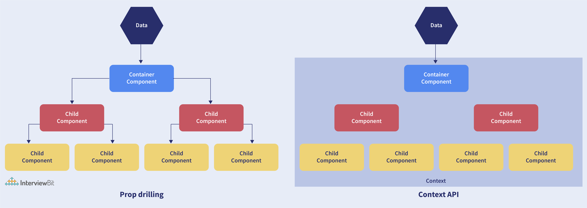

### Table of Contents - React and Redux

| No. | Questions |
| --- | --------- |
|   | **Javascript** |
| 1 | [What is React?](#1)|
| 2 | [What are the advantages of using React?](#2)|
| 3 | [What are the limitations of React?](#3)|
| 4 | [What is useState() in React?](#4)|
| 5 | [What are keys in React?](#5)|
| 6 | [What is JSX?](#6)|
| 7 | [What are the differences between functional and class components?](#7)|
| 8 | [What is the virtual DOM? How does react use the virtual DOM to render the UI?](#8)|
| 9 | [What are the differences between controlled and uncontrolled components?](#9)|
| 10| [What are props in React](#10)|
| 11| [Explain React state and props.](#11)|
| 12| [Explain about types of side effects in React component.](#12)|
| 13| [What is prop drilling in React?](#13)|
| 14| [What are error boundaries?](#14)|
| 15| [What is scope?](#15)|
| 16| [What is context?](#16)|
| 17| [What is an array?](#17)|
| 18 | [Array vs Set](#18)|
| 19 | [Array Methos](#19)|
| 20 | [Set Methods](#20)|
| 21 | [What is the difference between slice and splice?](#21)|
| 22 | [Object deep copy](#22)|
| 23 | [What is prototype?](#23)|
| 24 | [What is prototype chain?](#24)|
| 25 | [What is inheritance?](#25)|
| 26 | [What is the difference between classical inheritance and prototypal inheritance?](#26)|
| 27| [What is the difference between __proto__ and prototype?](#27)|
| 28| [DOM and Virtual DOM](#28)|
| 29| [What is DOM?](#29)|
| 30| [What is Virtual DOM?](#30)|
| 31| [Why is virtual DOM faster?](#31)|
| 32| [Fetch and Axios](#32)|
| 33| [What is REST?](#33)|
# Event Loop

## 1. What is React?

React is a front-end and open-source JavaScript library which is useful in developing user interfaces specifically for applications with a single page. It is helpful in building complex and reusable user interface(UI) components of mobile and web applications as it follows the component-based approach.

- It supports server-side rendering.
- It will make use of the virtual DOM rather than real DOM (Data Object Model) as RealDOM manipulations are expensive.
- It follows unidirectional data binding or data flow.
- It uses reusable or composable UI components for developing the view.

## 2. What are the advantages of using React?

- Use of Virtual DOM to improve efficiency: React uses virtual DOM to render the view. As the name suggests, virtual DOM is a virtual representation of the real DOM. Each time the data changes in a react app, a new virtual DOM gets created. Creating a virtual DOM is much faster than rendering the UI inside the browser. Therefore, with the use of virtual DOM, the efficiency of the app improves.

- Gentle learning curve: React has a gentle learning curve when compared to frameworks like Angular. Anyone with little knowledge of javascript can start building web applications using React.

- SEO friendly: React allows developers to develop engaging user interfaces that can be easily navigated in various search engines. It also allows server-side rendering, which boosts the SEO of an app.

- Reusable components: React uses component-based architecture for developing applications. Components are independent and reusable bits of code. These components can be shared across various applications having similar functionality. The re-use of components increases the pace of development.

- Huge ecosystem of libraries to choose from: React provides you with the freedom to choose the tools, libraries, and architecture for developing an application based on your requirement.

## 3. What are the limitations of React?

- React is not a full-blown framework as it is only a library.
- The components of React are numerous and will take time to fully grasp the benefits of all.
- It might be difficult for beginner programmers to understand React.
- Coding might become complex as it will make use of inline templating and JSX.

## 4. What is useState() in React?

The useState() is a built-in React Hook that allows you for having state variables in functional components. It should be used when the DOM has something that is dynamically manipulating/controlling.

~~~js
...
const [count, setCounter] = useState(0);
const [otherStuffs, setOtherStuffs] = useState(...);
...
const setCount = () => {
   setCounter(count + 1);
   setOtherStuffs(...);
   ...
};
~~~

The useState(0) will return a tuple where the count is the first parameter that represents the counter’s current state and the second parameter setCounter method will allow us to update the state of the counter.

We can make use of setCounter() method for updating the state of count anywhere. The idea with the usage of hooks is that we will be able to keep our code more functional and avoid class-based components if they are not required.

## 5. What are keys in React?

A key is a special string attribute that needs to be included when using lists of elements.

~~~js
const ids = [1,2,3,4,5];
const listElements = ids.map((id)=>{
return(
<li key={id.toString()}>
  {id}
</li>
)
})
~~~

- Keys help react identify which elements were added, changed or removed.
- Keys should be given to array elements for providing a unique identity for each element.
- Without keys, React does not understand the order or uniqueness of each element.
- With keys, React has an idea of which particular element was deleted, edited, and added.
- Keys are generally used for displaying a list of data coming from an API.

***Note- Keys used within arrays should be unique among siblings. They need not be globally unique.

## 6. What is JSX?

JSX stands for JavaScript XML. It allows us to write HTML inside JavaScript and place them in the DOM without using functions like appendChild( ) or createElement( ).

As stated in the official docs of React, JSX provides syntactic sugar for React.createElement( ) function.

Note- We can create react applications without using JSX as well. But JSX makes the code more readable and easier to debug.

~~~js
const container = (

  
This is a text

);
ReactDOM.render(container,rootElement);
~~~

Whitout JSX

~~~js
const text = React.createElement('p', {}, 'This is a text');
const container = React.createElement('div','{}',text );
ReactDOM.render(container,rootElement);
~~~

## 7. What are the differences between functional and class components?

Before the introduction of Hooks in React, functional components were called stateless components and were behind class components on a feature basis. After the introduction of Hooks, functional components are equivalent to class components.

| Functional Components | Class Components |
| --- | --- |
| A functional component is just a plain JavaScript pure function that accepts props as an argument and returns a React element(JSX). | A class component requires you to extend from React. Component and create a render function that returns a React element. |
| There is no render method used in functional components. | It must have the render() method returning JSX (which is syntactically similar to HTML) |
| Functional components run from top to bottom and once the function is returned it can’t be kept alive. | The class component is instantiated and different life cycle method is kept alive and is run and invoked depending on the phase of the class component. |
| Also known as Stateless components as they simply accept data and display them in some form, they are mainly responsible for rendering UI. | Also known as Stateful components because they implement logic and state. |
| React lifecycle methods (for example, componentDidMount) cannot be used in functional components. | React lifecycle methods can be used inside class components (for example, componentDidMount). |
| Hooks can be easily used in functional components to make them Stateful. | It requires different syntax inside a class component to implement hooks. |
| Constructors are not used. | Constructor is used as it needs to store state.  |

Functional components are nothing but JavaScript functions and therefore can be declared using an arrow function or the function keyword:

~~~js
  function card(props){
   return(
      

        <h2>Title of the card</h2>
      

    )
   }
   const card = (props) =>{
    return(
      

        <h2>Title of the card</h2>
      

    )
   }
~~~

Class components, on the other hand, are declared using the ES6 class:

~~~js
 class Card extends React.Component{
  constructor(props){
     super(props);
   }
    render(){
      return(
        

          <h2>Title of the card</h2>
        

      )
    }
   }
~~~

### Handling props

~~~js
<Student Info name="Vivek" rollNumber="23" />
~~~

In functional components, the handling of props is pretty straightforward. Any prop provided as an argument to a functional component can be directly used inside HTML elements:

~~~js
 function StudentInfo(props){
   return(
     

       <h2>{props.name}</h2>
       <h4>{props.rollNumber}</h4>
     

   )
 }
~~~

In the case of class components, props are handled in a different way:

~~~js
 class StudentInfo extends React.Component{
   constructor(props){
     super(props);
    }
    render(){
      return(
        

          <h2>{this.props.name}</h2>
          <h4>{this.props.rollNumber}</h4> 
        

      )
    }
   }
~~~

### Handling state

Functional components use React hooks to handle state. It uses the useState hook to set the state of a variable inside the component:

~~~js
 function ClassRoom(props){
   let [studentsCount,setStudentsCount] = useState(0);
    const addStudent = () => {
      setStudentsCount(++studentsCount);
   }
    return(
      

        
Number of students in class room: {studentsCount}

        <button onClick={addStudent}>Add Student</button>
      

    )
}
~~~

Since useState hook returns an array of two items, the first item contains the current state, and the second item is a function used to update the state.

In the code above, using array destructuring we have set the variable name to studentsCount with a current value of “0” and setStudentsCount is the function that is used to update the state.

For reading the state, we can see from the code above, the variable name can be directly used to read the current state of the variable.

We cannot use React Hooks inside class components, therefore state handling is done very differently in a class component:

~~~js
class ClassRoom extends React.Component{
        constructor(props){
            super(props);
            this.state = {studentsCount : 0};
            
            this.addStudent = this.addStudent.bind(this);
         }
            
        addStudent(){
            this.setState((prevState)=>{
               return {studentsCount: prevState.studentsCount++}
            });
         }
            
        render(){
            return(
            

                
Number of students in class room: {this.state.studentsCount}

                <button onClick={this.addStudent}>Add Student</button>
            

            )
        }
}  
~~~

# 8. What is the virtual DOM? How does react use the virtual DOM to render the UI?

As stated by the react team, virtual DOM is a concept where a virtual representation of the real DOM is kept inside the memory and is synced with the real DOM by a library such as ReactDOM.

### Why was virtual DOM introduced? 

DOM manipulation is an integral part of any web application, but DOM manipulation is quite slow when compared to other operations in JavaScript. The efficiency of the application gets affected when several DOM manipulations are being done. Most JavaScript frameworks update the entire DOM even when a small part of the DOM changes.

To address the problem of inefficient updating, the react team introduced the concept of virtual DOM.

### How does it work?

For every DOM object, there is a corresponding virtual DOM object(copy), which has the same properties. The main difference between the real DOM object and the virtual DOM object is that any changes in the virtual DOM object will not reflect on the screen directly. Consider a virtual DOM object as a blueprint of the real DOM object. Whenever a JSX element gets rendered, every virtual DOM object gets updated.

React uses two virtual DOMs to render the user interface. One of them is used to store the current state of the objects and the other to store the previous state of the objects. Whenever the virtual DOM gets updated, react compares the two virtual DOMs and gets to know about which virtual DOM objects were updated. After knowing which objects were updated, react renders only those objects inside the real DOM instead of rendering the complete real DOM. This way, with the use of virtual DOM, react solves the problem of inefficient updating.

# 9. What are the differences between controlled and uncontrolled components?

Controlled and uncontrolled components are just different approaches to handling input from elements in react. 

- **Controlled component**: In a controlled component, the value of the input element is controlled by React. We store the state of the input element inside the code, and by using event-based callbacks, any changes made to the input element will be reflected in the code as well.

- **Uncontrolled component**: In an uncontrolled component, the value of the input element is handled by the DOM itself. Input elements inside uncontrolled components work just like normal HTML input form elements.
The state of the input element is handled by the DOM. Whenever the value of the input element is changed, event-based callbacks are not called. Basically, react does not perform any action when there are changes made to the input element.

### Controlled component
When a user enters data inside the input element of a controlled component, onChange function gets triggered and inside the code, we check whether the value entered is valid or invalid. 
~~~js
function FormValidation(props) {
let [inputValue, setInputValue] = useState("");
let updateInput = e => {
  setInputValue(e.target.value);
};
return (
  

    <form>
      <input type="text" value={inputValue} onChange={updateInput} />
    </form>
  

);
}
~~~

### Uncontrolled component
Whenever use enters data inside the input field, the updated data is shown directly. To access the value of the input element, we can use ref.

~~~js
function FormValidation(props) {
    let inputValue = React.createRef();
    let handleSubmit = e => {
    alert(`Input value: ${inputValue.current.value}`);
    e.preventDefault();
    };
    return (
    

        <form onSubmit={handleSubmit}>
        <input type="text" ref={inputValue} />
        <button type="submit">Submit</button>
        </form>
    

    );
}
~~~

# 10. What are props in React?

The props in React are the inputs to a component of React. They can be single-valued or objects having a set of values that will be passed to components of React during creation by using a naming convention that almost looks similar to HTML-tag attributes. We can say that props are the data passed from a parent component into a child component.

The main purpose of props is to provide different component functionalities such as:

- Passing custom data to the React component.
- Using through this.props.reactProp inside render() method of the component.
- Triggering state changes.

## 11. Explain React state and props.

| Props | State |
| --- | --- |
| Immutable  | Owned by its component |
| Has better performance | Locally scoped |
| Can be accessed by the child component | Writeable/Mutable |
|  | has setState() method to modify properties |
|  | Changes to state can be asynchronous |
|  | can only be passed as props |

### React State

Every component in react has a built-in state object, which contains all the property values that belong to that component.
In other words, the state object controls the behaviour of a component. Any change in the property values of the state object leads to the re-rendering of the component.

Note- State object is not available in functional components but, we can use React Hooks to add state to a functional component.

### React Props

Every React component accepts a single object argument called props (which stands for “properties”).  These props can be passed to a component using HTML attributes and the component accepts these props as an argument.

Using props, we can pass data from one component to another.

## 12. Explain about types of side effects in React component.

There are two types of side effects in React component. They are:

**Effects without Cleanup:**This side effect will be used in useEffect which does not restrict the browser from screen update. It also improves the responsiveness of an application. A few common examples are network requests, Logging, manual DOM mutations, etc.
**Effects with Cleanup:**Some of the Hook effects will require the cleanup after updating of DOM is done. For example, if you want to set up an external data source subscription, it requires cleaning up the memory else there might be a problem of memory leak. It is a known fact that React will carry out the cleanup of memory when the unmounting of components happens. But the effects will run for each render() method rather than for any specific method. Thus we can say that, before execution of the effects succeeding time the React will also cleanup effects from the preceding render.

## 13. What is prop drilling in React?

Sometimes while developing React applications, there is a need to pass data from a component that is higher in the hierarchy to a component that is deeply nested. To pass data between such components, we pass props from a source component and keep passing the prop to the next component in the hierarchy till we reach the deeply nested component.

The disadvantage of using prop drilling is that the components that should otherwise be not aware of the data have access to the data.

## 14. What are error boundaries?

Introduced in version 16 of React, Error boundaries provide a way for us to catch errors that occur in the render phase.

What is an error boundary?
Any component which uses one or Both of the following lifecycle methods is considered an error boundary.

- static getDerivedStateFromError 
- componentDidCatch.

In what places can an error boundary detect an error?

- Render phase
- Inside a lifecycle method
- Inside the constructor

Example whitout error boundary

~~~js

class CounterComponent extends React.Component{
  constructor(props){
    super(props);
    this.state = {
      counterValue: 0
    }
    this.incrementCounter = this.incrementCounter.bind(this);
  }
  incrementCounter(){
    this.setState(prevState => counterValue = prevState+1);
  }
  render(){
    if(this.state.counter === 2){
      throw new Error('Crashed');
    }
    return(
      

        <button onClick={this.incrementCounter}>Increment Value</button>
        
Value of counter: {this.state.counterValue}

      

    )
  }
}
~~~

In the code above, when the counterValue equals 2, we throw an error inside the render method.

When we are not using the error boundary, instead of seeing an error, we see a blank page. Since any error inside the render method leads to unmounting of the component. To display an error that occurs inside the render method, we use error boundaries.

Let’s create an error boundary to handle errors in the render phase:

~~~js
class ErrorBoundary extends React.Component {
  constructor(props) {
    super(props);
    this.state = { hasError: false };
  }
  static getDerivedStateFromError(error) {     
    return { hasError: true }; 
  }
  componentDidCatch(error, errorInfo) {       
    logErrorToMyService(error, errorInfo); 
  }
  render() {
    if (this.state.hasError) {     
      return <h4>Something went wrong</h4>     
    }
    return this.props.children;
  }
}

~~~

In the code above, getDerivedStateFromError function renders the fallback UI interface when the render method has an error.

componentDidCatch logs the error information to an error tracking service.

Now with the error boundary, we can render the CounterComponent in the following way:

~~~js
<ErrorBoundary>
 <CounterComponent/>
</ErrorBoundary>
~~~

