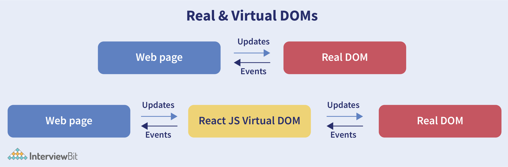
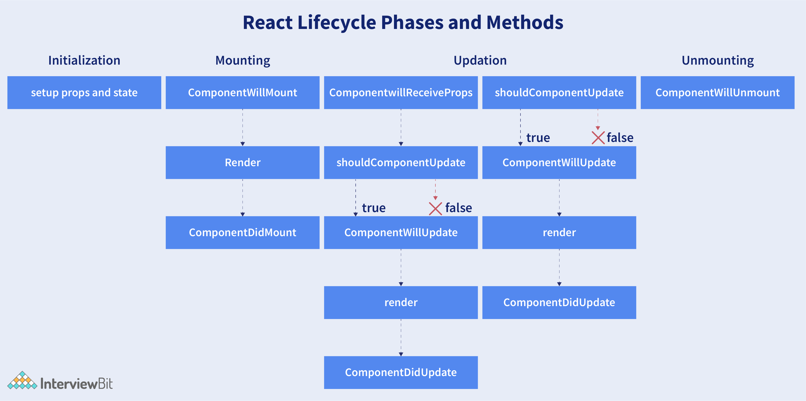

### Table of Contents - React and Redux

| No. | Questions |
| --- | --------- |
|   | **Javascript** |
| 1 | [What is React?](#1)|
| 2 | [What are the advantages of using React?](#2)|
| 3 | [What are the limitations of React?](#3)|
| 4 | [What is useState() in React?](#4)|
| 5 | [What are keys in React?](#5)|
| 6 | [What is JSX?](#6)|
| 7 | [What are the differences between functional and class components?](#7)|
| 8 | [What is the virtual DOM? How does react use the virtual DOM to render the UI?](#8)|
| 9 | [What are the differences between controlled and uncontrolled components?](#9)|
| 10| [What are props in React](#10)|
| 11| [Explain React state and props.](#11)|
| 12| [Explain about types of side effects in React component.](#12)|
| 13| [What is prop drilling in React?](#13)|
| 14| [What are error boundaries?](#14)|
| 15| [What is React Hooks?](#15)|
| 16| [Explain React Hooks.](#16)|
| 17| [What are the rules that must be followed while using React Hooks?](#17)|
| 18 | [What is the use of useEffect React Hooks?](#18)|
| 19 | [Why do React Hooks make use of refs?](#19)|
| 20 | [What are Custom Hooks?](#20)|
| 21 | [Explain Strict Mode in React.](#21)|
| 22 | [How to prevent re-renders in React?](#22)|
| 23 | [What are the different ways to style a React component?](#23)|
| 24 | [Name a few techniques to optimize React app performance.](#24)|
| 25 | [How to pass data between react components?](#25)|
| 26 | [What are Higher Order Components?](#26)|
| 27| [What are the different phases of the component lifecycle?](#27)|
| 28| [What are the lifecycle methods of React?](#28)|
| 29| [Does React Hook work with static typing?](#29)|
| 30| [Explain about types of Hooks in React.](#30)|
| 31| [Differentiate React Hooks vs Classes.](#31)|
| 32| [What is React Router?](#32)|
| 33| [Can React Hook replaces Redux?](#33)|
| 34| [Explain conditional rendering in React.](#34)|
| 35| [Explain how to create a simple React Hooks example program.](#35)|
| 36| [How to create a switching component for displaying different pages?](#36)|
| 37| [How to re-render the view when the browser is resized?](#37)|
| 38| [How to pass data between sibling components using React router?](#38)|
| 39| [How to perform automatic redirect after login?](#39)|

# Event Loop

## 1. What is React?

React is a front-end and open-source JavaScript library which is useful in developing user interfaces specifically for applications with a single page. It is helpful in building complex and reusable user interface(UI) components of mobile and web applications as it follows the component-based approach.

- It supports server-side rendering.
- It will make use of the virtual DOM rather than real DOM (Data Object Model) as RealDOM manipulations are expensive.
- It follows unidirectional data binding or data flow.
- It uses reusable or composable UI components for developing the view.

## 2. What are the advantages of using React?

- Use of Virtual DOM to improve efficiency: React uses virtual DOM to render the view. As the name suggests, virtual DOM is a virtual representation of the real DOM. Each time the data changes in a react app, a new virtual DOM gets created. Creating a virtual DOM is much faster than rendering the UI inside the browser. Therefore, with the use of virtual DOM, the efficiency of the app improves.

- Gentle learning curve: React has a gentle learning curve when compared to frameworks like Angular. Anyone with little knowledge of javascript can start building web applications using React.

- SEO friendly: React allows developers to develop engaging user interfaces that can be easily navigated in various search engines. It also allows server-side rendering, which boosts the SEO of an app.

- Reusable components: React uses component-based architecture for developing applications. Components are independent and reusable bits of code. These components can be shared across various applications having similar functionality. The re-use of components increases the pace of development.

- Huge ecosystem of libraries to choose from: React provides you with the freedom to choose the tools, libraries, and architecture for developing an application based on your requirement.

## 3. What are the limitations of React?

- React is not a full-blown framework as it is only a library.
- The components of React are numerous and will take time to fully grasp the benefits of all.
- It might be difficult for beginner programmers to understand React.
- Coding might become complex as it will make use of inline templating and JSX.

## 4. What is useState() in React?

The useState() is a built-in React Hook that allows you for having state variables in functional components. It should be used when the DOM has something that is dynamically manipulating/controlling.

~~~js
...
const [count, setCounter] = useState(0);
const [otherStuffs, setOtherStuffs] = useState(...);
...
const setCount = () => {
   setCounter(count + 1);
   setOtherStuffs(...);
   ...
};
~~~

The useState(0) will return a tuple where the count is the first parameter that represents the counter’s current state and the second parameter setCounter method will allow us to update the state of the counter.

We can make use of setCounter() method for updating the state of count anywhere. The idea with the usage of hooks is that we will be able to keep our code more functional and avoid class-based components if they are not required.

## 5. What are keys in React?

A key is a special string attribute that needs to be included when using lists of elements.

~~~js
const ids = [1,2,3,4,5];
const listElements = ids.map((id)=>{
return(
<li key={id.toString()}>
  {id}
</li>
)
})
~~~

- Keys help react identify which elements were added, changed or removed.
- Keys should be given to array elements for providing a unique identity for each element.
- Without keys, React does not understand the order or uniqueness of each element.
- With keys, React has an idea of which particular element was deleted, edited, and added.
- Keys are generally used for displaying a list of data coming from an API.

***Note- Keys used within arrays should be unique among siblings. They need not be globally unique.

## 6. What is JSX?

JSX stands for JavaScript XML. It allows us to write HTML inside JavaScript and place them in the DOM without using functions like appendChild( ) or createElement( ).

As stated in the official docs of React, JSX provides syntactic sugar for React.createElement( ) function.

Note- We can create react applications without using JSX as well. But JSX makes the code more readable and easier to debug.

~~~js
const container = (

  
This is a text

);
ReactDOM.render(container,rootElement);
~~~

Whitout JSX

~~~js
const text = React.createElement('p', {}, 'This is a text');
const container = React.createElement('div','{}',text );
ReactDOM.render(container,rootElement);
~~~

## 7. What are the differences between functional and class components?

Before the introduction of Hooks in React, functional components were called stateless components and were behind class components on a feature basis. After the introduction of Hooks, functional components are equivalent to class components.

| Functional Components | Class Components |
| --- | --- |
| A functional component is just a plain JavaScript pure function that accepts props as an argument and returns a React element(JSX). | A class component requires you to extend from React. Component and create a render function that returns a React element. |
| There is no render method used in functional components. | It must have the render() method returning JSX (which is syntactically similar to HTML) |
| Functional components run from top to bottom and once the function is returned it can’t be kept alive. | The class component is instantiated and different life cycle method is kept alive and is run and invoked depending on the phase of the class component. |
| Also known as Stateless components as they simply accept data and display them in some form, they are mainly responsible for rendering UI. | Also known as Stateful components because they implement logic and state. |
| React lifecycle methods (for example, componentDidMount) cannot be used in functional components. | React lifecycle methods can be used inside class components (for example, componentDidMount). |
| Hooks can be easily used in functional components to make them Stateful. | It requires different syntax inside a class component to implement hooks. |
| Constructors are not used. | Constructor is used as it needs to store state.  |

Functional components are nothing but JavaScript functions and therefore can be declared using an arrow function or the function keyword:

~~~js
  function card(props){
   return(
      

        <h2>Title of the card</h2>
      

    )
   }
   const card = (props) =>{
    return(
      

        <h2>Title of the card</h2>
      

    )
   }
~~~

Class components, on the other hand, are declared using the ES6 class:

~~~js
 class Card extends React.Component{
  constructor(props){
     super(props);
   }
    render(){
      return(
        

          <h2>Title of the card</h2>
        

      )
    }
   }
~~~

### Handling props

~~~js
<Student Info name="Vivek" rollNumber="23" />
~~~

In functional components, the handling of props is pretty straightforward. Any prop provided as an argument to a functional component can be directly used inside HTML elements:

~~~js
 function StudentInfo(props){
   return(
     

       <h2>{props.name}</h2>
       <h4>{props.rollNumber}</h4>
     

   )
 }
~~~

In the case of class components, props are handled in a different way:

~~~js
 class StudentInfo extends React.Component{
   constructor(props){
     super(props);
    }
    render(){
      return(
        

          <h2>{this.props.name}</h2>
          <h4>{this.props.rollNumber}</h4> 
        

      )
    }
   }
~~~

### Handling state

Functional components use React hooks to handle state. It uses the useState hook to set the state of a variable inside the component:

~~~js
 function ClassRoom(props){
   let [studentsCount,setStudentsCount] = useState(0);
    const addStudent = () => {
      setStudentsCount(++studentsCount);
   }
    return(
      

        
Number of students in class room: {studentsCount}

        <button onClick={addStudent}>Add Student</button>
      

    )
}
~~~

Since useState hook returns an array of two items, the first item contains the current state, and the second item is a function used to update the state.

In the code above, using array destructuring we have set the variable name to studentsCount with a current value of “0” and setStudentsCount is the function that is used to update the state.

For reading the state, we can see from the code above, the variable name can be directly used to read the current state of the variable.

We cannot use React Hooks inside class components, therefore state handling is done very differently in a class component:

~~~js
class ClassRoom extends React.Component{
        constructor(props){
            super(props);
            this.state = {studentsCount : 0};
            
            this.addStudent = this.addStudent.bind(this);
         }
            
        addStudent(){
            this.setState((prevState)=>{
               return {studentsCount: prevState.studentsCount++}
            });
         }
            
        render(){
            return(
            

                
Number of students in class room: {this.state.studentsCount}

                <button onClick={this.addStudent}>Add Student</button>
            

            )
        }
}  
~~~

# 8. What is the virtual DOM? How does react use the virtual DOM to render the UI?

As stated by the react team, virtual DOM is a concept where a virtual representation of the real DOM is kept inside the memory and is synced with the real DOM by a library such as ReactDOM.

### Why was virtual DOM introduced? 

DOM manipulation is an integral part of any web application, but DOM manipulation is quite slow when compared to other operations in JavaScript. The efficiency of the application gets affected when several DOM manipulations are being done. Most JavaScript frameworks update the entire DOM even when a small part of the DOM changes.

To address the problem of inefficient updating, the react team introduced the concept of virtual DOM.

### How does it work?

For every DOM object, there is a corresponding virtual DOM object(copy), which has the same properties. The main difference between the real DOM object and the virtual DOM object is that any changes in the virtual DOM object will not reflect on the screen directly. Consider a virtual DOM object as a blueprint of the real DOM object. Whenever a JSX element gets rendered, every virtual DOM object gets updated.

React uses two virtual DOMs to render the user interface. One of them is used to store the current state of the objects and the other to store the previous state of the objects. Whenever the virtual DOM gets updated, react compares the two virtual DOMs and gets to know about which virtual DOM objects were updated. After knowing which objects were updated, react renders only those objects inside the real DOM instead of rendering the complete real DOM. This way, with the use of virtual DOM, react solves the problem of inefficient updating.

# 9. What are the differences between controlled and uncontrolled components?

Controlled and uncontrolled components are just different approaches to handling input from elements in react. 

- **Controlled component**: In a controlled component, the value of the input element is controlled by React. We store the state of the input element inside the code, and by using event-based callbacks, any changes made to the input element will be reflected in the code as well.

- **Uncontrolled component**: In an uncontrolled component, the value of the input element is handled by the DOM itself. Input elements inside uncontrolled components work just like normal HTML input form elements.
The state of the input element is handled by the DOM. Whenever the value of the input element is changed, event-based callbacks are not called. Basically, react does not perform any action when there are changes made to the input element.

### Controlled component
When a user enters data inside the input element of a controlled component, onChange function gets triggered and inside the code, we check whether the value entered is valid or invalid. 
~~~js
function FormValidation(props) {
let [inputValue, setInputValue] = useState("");
let updateInput = e => {
  setInputValue(e.target.value);
};
return (
  

    <form>
      <input type="text" value={inputValue} onChange={updateInput} />
    </form>
  

);
}
~~~

### Uncontrolled component
Whenever use enters data inside the input field, the updated data is shown directly. To access the value of the input element, we can use ref.

~~~js
function FormValidation(props) {
    let inputValue = React.createRef();
    let handleSubmit = e => {
    alert(`Input value: ${inputValue.current.value}`);
    e.preventDefault();
    };
    return (
    

        <form onSubmit={handleSubmit}>
        <input type="text" ref={inputValue} />
        <button type="submit">Submit</button>
        </form>
    

    );
}
~~~

# 10. What are props in React?

The props in React are the inputs to a component of React. They can be single-valued or objects having a set of values that will be passed to components of React during creation by using a naming convention that almost looks similar to HTML-tag attributes. We can say that props are the data passed from a parent component into a child component.

The main purpose of props is to provide different component functionalities such as:

- Passing custom data to the React component.
- Using through this.props.reactProp inside render() method of the component.
- Triggering state changes.

## 11. Explain React state and props.

| Props | State |
| --- | --- |
| Immutable  | Owned by its component |
| Has better performance | Locally scoped |
| Can be accessed by the child component | Writeable/Mutable |
|  | has setState() method to modify properties |
|  | Changes to state can be asynchronous |
|  | can only be passed as props |

### React State

Every component in react has a built-in state object, which contains all the property values that belong to that component.
In other words, the state object controls the behaviour of a component. Any change in the property values of the state object leads to the re-rendering of the component.

Note- State object is not available in functional components but, we can use React Hooks to add state to a functional component.

### React Props

Every React component accepts a single object argument called props (which stands for “properties”).  These props can be passed to a component using HTML attributes and the component accepts these props as an argument.

Using props, we can pass data from one component to another.

## 12. Explain about types of side effects in React component.

There are two types of side effects in React component. They are:

**Effects without Cleanup:**This side effect will be used in useEffect which does not restrict the browser from screen update. It also improves the responsiveness of an application. A few common examples are network requests, Logging, manual DOM mutations, etc.
**Effects with Cleanup:**Some of the Hook effects will require the cleanup after updating of DOM is done. For example, if you want to set up an external data source subscription, it requires cleaning up the memory else there might be a problem of memory leak. It is a known fact that React will carry out the cleanup of memory when the unmounting of components happens. But the effects will run for each render() method rather than for any specific method. Thus we can say that, before execution of the effects succeeding time the React will also cleanup effects from the preceding render.

## 13. What is prop drilling in React?

Sometimes while developing React applications, there is a need to pass data from a component that is higher in the hierarchy to a component that is deeply nested. To pass data between such components, we pass props from a source component and keep passing the prop to the next component in the hierarchy till we reach the deeply nested component.

The disadvantage of using prop drilling is that the components that should otherwise be not aware of the data have access to the data.

## 14. What are error boundaries?

Introduced in version 16 of React, Error boundaries provide a way for us to catch errors that occur in the render phase.

What is an error boundary?
Any component which uses one or Both of the following lifecycle methods is considered an error boundary.

- static getDerivedStateFromError 
- componentDidCatch.

In what places can an error boundary detect an error?

- Render phase
- Inside a lifecycle method
- Inside the constructor

Example whitout error boundary

~~~js

class CounterComponent extends React.Component{
  constructor(props){
    super(props);
    this.state = {
      counterValue: 0
    }
    this.incrementCounter = this.incrementCounter.bind(this);
  }
  incrementCounter(){
    this.setState(prevState => counterValue = prevState+1);
  }
  render(){
    if(this.state.counter === 2){
      throw new Error('Crashed');
    }
    return(
      

        <button onClick={this.incrementCounter}>Increment Value</button>
        
Value of counter: {this.state.counterValue}

      

    )
  }
}
~~~

In the code above, when the counterValue equals 2, we throw an error inside the render method.

When we are not using the error boundary, instead of seeing an error, we see a blank page. Since any error inside the render method leads to unmounting of the component. To display an error that occurs inside the render method, we use error boundaries.

Let’s create an error boundary to handle errors in the render phase:

~~~js
class ErrorBoundary extends React.Component {
  constructor(props) {
    super(props);
    this.state = { hasError: false };
  }
  static getDerivedStateFromError(error) {     
    return { hasError: true }; 
  }
  componentDidCatch(error, errorInfo) {       
    logErrorToMyService(error, errorInfo); 
  }
  render() {
    if (this.state.hasError) {     
      return <h4>Something went wrong</h4>     
    }
    return this.props.children;
  }
}

~~~

In the code above, getDerivedStateFromError function renders the fallback UI interface when the render method has an error.

componentDidCatch logs the error information to an error tracking service.

Now with the error boundary, we can render the CounterComponent in the following way:

~~~js
<ErrorBoundary>
 <CounterComponent/>
</ErrorBoundary>
~~~

## 15. What is React Hooks?

React Hooks are the built-in functions that permit developers for using the state and lifecycle methods within React components. These are newly added features made available in React 16.8 version. Each lifecycle of a component is having 3 phases:

- Mounting
- Updating
- Unmounting

 Along with that, components have properties and states. Hooks will allow using these methods by developers for improving the reuse of code with higher flexibility navigating the component tree.

 Using Hook, all features of React can be used without writing class components. For example, before React version 16.8, it required a class component for managing the state of a component. But now using the useState hook, we can keep the state in a functional component.

## 16. Explain React Hooks.

What are Hooks? Hooks are functions that let us “hook into” React state and lifecycle features from a functional component.

React Hooks cannot be used in class components. They let us write components without class.

Why were Hooks introduced in React?

React hooks were introduced in the 16.8 version of React. Previously, functional components were called stateless components.

Example of a hook: useState hook:

In functional components, the useState hook lets us define a state for a component:

~~~js
function Person(props) {
  // We are declaring a state variable called name.
  // setName is a function to update/change the value of name
  let [name, setName] = useState('');
}
~~~
The state variable “name” can be directly used inside the HTML.

## 17. What are the rules that must be followed while using React Hooks?

There are 2 rules which must be followed while you code with Hooks:

- React Hooks must be called only at the top level. It is not allowed to call them inside the nested functions, loops, or conditions.
- It is allowed to call the Hooks only from the React Function Components.

## 18. What is the use of useEffect React Hooks?

The useEffect React Hook is used for performing the side effects in functional components. 

With the help of useEffect, you will inform React that your component requires something to be done after rendering the component or after a state change. The function you have passed(can be referred to as “effect”) will be remembered by React and call afterwards the performance of DOM updates is over.

Using this, we can perform various calculations such as data fetching, setting up document title, manipulating DOM directly, etc, that don’t target the output value. The useEffect hook will run by default after the first render and also after each update of the component. React will guarantee that the DOM will be updated by the time when the effect has run by it.

The useEffect React Hook will accept 2 arguments: useEffect(callback,[dependencies]);

~~~js
import { useEffect } from 'react';
export default function WelcomeGreetings({ name }) {
 const msg = `Hi, ${name}!`;     // Calculates output
 useEffect(() => {
   document.title = `Welcome to you ${name}`;    // Side-effect!
 }, [name]);
 return 
{msg}
;         // Calculates output
}
~~~

another example with an async function

~~~js

import { useEffect} from 'react';
export default function AsyncExample({name}) {
  const msg = `Hi, ${name}!`;
 useEffect(() => {
    fetchPosts(); // Side-effect!
 }, []);

const fetchPosts = async () => {
  const response = await fetch('https://jsonplaceholder.typicode.com/posts');
  // await axios.get('https://jsonplaceholder.typicode.com/posts');
  const data = await response.json();
  console.log(data);
}

 return 
{msg}
;
}
~~~

in the App.js

~~~js

import React from 'react';
import './App.css';
import WelcomeGreetings from './components/WelcomeGreetings';
import AsyncExample from './components/AsyncExample';

function App() {
  return (
    

      <WelcomeGreetings name="Vivek" />
      <AsyncExample name="Vivek" />
    

  );
}

export default App;

~~~

# 19. Why do React Hooks make use of refs?

Earlier, refs were only limited to class components but now it can also be accessible in function components through the useRef Hook in React.

The refs are used for:

- Managing focus, media playback, or text selection.
- Integrating with DOM libraries by third-party.
- Triggering the imperative animations.

### What is a ref?

In order to work with refs in React you need to first initialize a ref which is what the useRef hook is for. This hook is very straightforward, and takes an initial value as the only argument.

~~~js
//This hook then returns a ref for you to work with.
const myRef = useRef(null)
~~~

In the above example we have created a ref called myRef and set its default value to null. This means that myRef is now equal to an object that looks like this.

~~~js
{
  current: null
}
~~~

This is because a **ref is always an object with a single .current property which is set to the current value of the ref**. If we were to instead create a ref with a default value of 0 it would look like this.

~~~js
const myRef = useRef(0)
console.log(myRef)
// { current: 0 }
~~~

Now this seems like a lot of work in order to save a single value, but what makes refs so powerful is the fact that **they are persisted between renders**. I like to think of refs very similarly to state, since they persist between renders, but **refs do not cause a component to re-render when changed**.

Imagine that we want to count the number of times a component re-renders. Here is the code to do so with state and refs.

~~~js
function State() {
  const [rerenderCount, setRerenderCount] = useState(0)

  useEffect(() => {
    setRerenderCount(prevCount => prevCount + 1)
  })

  return 
{rerenderCount}

}
~~~

~~~js
function Ref() {
  const rerenderCount = useRef(0)

  useEffect(() => {
    rerenderCount.current = rerenderCount.current + 1
  })

  return 
{rerenderCount.current}

}
~~~

Both of these components will correctly display the number of times a component has been re-rendered, but in the state example the component will infinitely re-render itself since setting the state causes the component to re-render. 

The ref example on the other hand will only render once since setting the value of a ref does not cause any re-renders.

### How to use refs?

The most common use case for refs in React is to reference a DOM element. Because of how common this use case is every DOM element has a ref property you can use for setting a ref to that element. For example, if you wanted to focus an input element whenever a button was clicked you could use a ref to do that.

~~~js
function Component() {
  const inputRef = useRef(null)

  const focusInput = () => {
    inputRef.current.focus()
  }

  return (
    <>
      <input ref={inputRef} />
      <button onClick={focusInput}>Focus Input</button>
    </>
  )
}
~~~

As you can see in the code above we use the ref property on the input element to set the current value of inputRef to the input element. Now when we click the button it will call focusInput which uses the current value of the inputRef variable to set the focus on the input element.

Being able to access any DOM element directly with a ref is really useful for doing things like setting focus or managing other attributes that you cannot directly control in React, but it can be easy to abuse this power. I often see newer React developers using refs to dynamically add and remove elements (appendChild, removeChild, etc.) in a component instead of having React do that for you. This leads to inconsistencies between the actual DOM and the React virtual DOM which is very bad.

### Using Refs Beyond The DOM

While most use cases for refs lie with referencing DOM elements, refs can also be used for any form of storage that is persisted across component renders. A very common use case for this would be storing the previous value of a state variable.

~~~js
function Component() {
  const [name, setName] = useState("Kyle")
  const previousName = useRef(null)

  useEffect(() => {
    previousName.current = name
  }, [name])

  return (
    <>
      <input value={name} onChange={e => setName(e.target.value)} />
      

        {previousName.current} => {name}
      

    </>
  )
}
~~~

The above code will update the previousName ref every time the name changes so that it always has the previous value of the name variable stored in it.

## 20. What are Custom Hooks?

A Custom Hook is a function in Javascript whose name begins with ‘use’ and which calls other hooks. It is a part of React v16.8 hook update and permits you for reusing the stateful logic without any need for component hierarchy restructuring.

In almost all of the cases, custom hooks are considered to be sufficient for replacing render props and HoCs (Higher-Order components) and reducing the amount of nesting required. Custom Hooks will allow you for avoiding multiple layers of abstraction or wrapper hell that might come along with Render Props and HoCs.

The disadvantage of Custom Hooks is it cannot be used inside of the classes.

## 21. Explain Strict Mode in React.

StrictMode is a tool added in version 16.3 of React to highlight potential problems in an application. It performs additional checks on the application.

To enable StrictMode, <React.StrictMode> tags need to be added inside the application:

~~~js
import React from "react";
import ReactDOM from "react-dom";
import App from "./App";
const rootElement = document.getElementById("root");
ReactDOM.render(
<React.StrictMode>
  <App />
</React.StrictMode>,
rootElement
);
~~~

### StrictMode currently helps with the following issues:

- Identifying components with unsafe lifecycles
- Warning about legacy string ref API usage
- Warning about deprecated findDOMNode usage
- Detecting unexpected side effects
- Warning about the usage of legacy context API (because the API is error-prone).

## 22. How to prevent re-renders in React?

Reason for re-renders in React:
- Re-rendering of a component and its child components occur when props or the state of the component has been changed.
- Re-rendering components that are not updated, affects the performance of an application.

How to prevent re-rendering:
Consider the following components:

~~~js
class Parent extends React.Component {
  state = { messageDisplayed: false };
  componentDidMount() {
    this.setState({ messageDisplayed: true });
  }
  render() {
    console.log("Parent is getting rendered");
    return (
      

        <Message />
      

    );
  }
  }
  class Message extends React.Component {
  constructor(props) {
    super(props);
    this.state = { message: "Hello, this is vivek" };
  }  
  render() {
    console.log("Message is getting rendered");
    return (
      

        
{this.state.message}

      

    );
  }
}
~~~

The Parent component is the parent component and the Message is the child component. Any change in the parent component will lead to re-rendering of the child component as well. To prevent the re-rendering of child components, we use the shouldComponentUpdate( ) method:

**Note- Use shouldComponentUpdate( ) method only when you are sure that it’s a static component.

~~~js
class Message extends React.Component {
  constructor(props) {
    super(props);
    this.state = { message: "Hello, this is vivek" };
  }
  shouldComponentUpdate() {
    console.log("Does not get rendered");
    return false;
  }
  render() {
    console.log("Message is getting rendered");
    return (
      

        
{this.state.message}

      

    );
  }
}
~~~
we have returned false from the shouldComponentUpdate( ) method, which prevents the child component from re-rendering.

## 23. What are the different ways to style a React component?

There are 4 ways to style a React component:

- ### CSS Stylesheet
~~~js
import './RandomComponent.css';

class RandomComponent extends React.Component {
 render() {
   return (
     

       <h3 className="heading">This is a heading</h3>
       
This is a paragraph

     

   );
 }
}
~~~
- ### Inline Styling

~~~js
class RandomComponent extends React.Component {
 render() {
   return (
     

       <h3 style={{ color: "Yellow" }}>This is a heading</h3>
       
This is a paragraph

     

   );
 }
}
~~~

- ### CSS Modules

~~~js
import styles from  './styles.module.css';

class RandomComponent extends React.Component {
 render() {
   return (
     

       <h3 className="heading">This is a heading</h3>
       
This is a paragraph

     

   );
 }
}
~~~

.module.css
~~~css 
.paragraph{
 color:"red";
 border:1px solid black;
}
~~~

- ### Using JS objects

~~~js
class RandomComponent extends React.Component {
 paragraphStyles = {
   color: "Red",
   fontSize: "32px"
 };

 headingStyles = {
   color: "blue",
   fontSize: "48px"
 };

 render() {
   return (
     

       <h3 style={this.headingStyles}>This is a heading</h3>
       
This is a paragraph

     

   );
 }
}
~~~

# 24. Name a few techniques to optimize React app performance.

There are many ways through which one can optimize the performance of a React app, let’s have a look at some of them:

- Using useMemo( ) -
  - It is a React hook that is used for caching CPU-Expensive functions.
  -Sometimes in a React app, a CPU-Expensive function gets called repeatedly due to re-renders of a component, which can lead to slow rendering.

  - useMemo( ) hook can be used to cache such functions. By using useMemo( ), the CPU-Expensive function gets called only when it is needed.

- Using React.PureComponent -
  - It is a base component class that checks the state and props of a component to know whether the component should be updated.
  - Instead of using the simple React.Component, we can use React.PureComponent to reduce the re-renders of a component unnecessarily.

- Maintaining State Colocation
  - This is a process of moving the state as close to where you need it as possible.
  - Sometimes in React app, we have a lot of unnecessary states inside the parent component which makes the code less readable and harder to maintain. Not to forget, having many states inside a single component leads to unnecessary re-renders for the component.
  - It is better to shift states which are less valuable to the parent component, to a separate component.
- Lazy Loading
  - It is a technique used to reduce the load time of a React app. Lazy loading helps reduce the risk of web app performances to a minimum
  - Lazy loading is a technique in which the components are loaded only when they are needed.

# 25. How to pass data between react components?

There are 3 ways to pass data between react components:

- ### Parent Component to Child Component (using props)

~~~js
import ChildComponent from "./Child";
   function ParentComponent(props) {
    let [counter, setCounter] = useState(0);
   
    let increment = () => setCounter(++counter);
   
    return (
      

        <button onClick={increment}>Increment Counter</button>
        <ChildComponent counterValue={counter} />
      

    );
   }
~~~

As one can see in the code above, we are rendering the child component inside the parent component, by providing a prop called counterValue. The value of the counter is being passed from the parent to the child component.

We can use the data passed by the parent component in the following way:

~~~js
function ChildComponent(props) {
return (
  

    
Value of counter: {props.counterValue}

  

);
}
~~~

- ### Child Component to Parent Component (using callbacks)

This one is a bit tricky. We follow the steps below:

- Create a callback in the parent component which takes in the data needed as a parameter.
- Pass this callback as a prop to the child component.
- Send data from the child component using the callback.
We are considering the same example above but in this case, we are going to pass the updated counterValue from child to parent.

Step 1 and 2:

~~~js
function ParentComponent(props) {
  let [counter, setCounter] = useState(0);
  let callback = valueFromChild => setCounter(valueFromChild);
  return (
    

      
Value of counter: {counter}

      <ChildComponent callbackFunc={callback} counterValue={counter} />
    

  );
}
~~~
we created a function called callback which takes in the data received from the child component as a parameter.

Next, we passed the function callback as a prop to the child component.

Step 3:

~~~js
function ChildComponent(props) {
let childCounterValue = props.counterValue;
return (
  

    <button onClick={() => props.callbackFunc(++childCounterValue)}>
      Increment Counter
    </button>
  

);
}
~~~

In the code above, we have used the props.counterValue and set it to a variable called childCounterValue.

Next, on button click, we pass the incremented childCounterValue to the props.callbackFunc.

This way, we can pass data from the child to the parent component.

- ### Using Redux

Redux is a state management library that can be used to pass data between components. It is a predictable state container for JavaScript apps.

# 26. What are Higher Order Components?

Simply put, Higher-Order Component(HOC) is a function that takes in a component and returns a new component.

### When do we need HOC?

While developing React applications, we might develop components that are quite similar to each other with minute differences. In most cases, developing similar components might not be an issue but, while developing larger applications we need to keep our code DRY, therefore, we want an abstraction that allows us to define this logic in a single place and share it across components. HOC allows us to create that abstraction.

DRY stands for Don’t Repeat Yourself.

example:

Consider the following components having similar functionality. The following component displays the list of articles:

~~~js
// "GlobalDataSource" is some global data source
class ArticlesList extends React.Component {
 constructor(props) {
   super(props);
   this.handleChange = this.handleChange.bind(this);
   this.state = {
     articles: GlobalDataSource.getArticles(),
   };
 }
 componentDidMount() {
   // Listens to the changes added
   GlobalDataSource.addChangeListener(this.handleChange);
 }
 componentWillUnmount() {
   // Listens to the changes removed
   GlobalDataSource.removeChangeListener(this.handleChange);
 }
 handleChange() {
   // States gets Update whenver data source changes
   this.setState({
     articles: GlobalDataSource.getArticles(),
   });
 }
 render() {
   return (
     

       {this.state.articles.map((article) => (
         <ArticleData article={article} key={article.id} />
       ))}
     

   );
 }
}
~~~

The following component displays the list of users:

~~~js
// "GlobalDataSource" is some global data source
class UsersList extends React.Component {
 constructor(props) {
   super(props);
   this.handleChange = this.handleChange.bind(this);
   this.state = {
     users: GlobalDataSource.getUsers(),
   };
 }
 componentDidMount() {
   // Listens to the changes added
   GlobalDataSource.addChangeListener(this.handleChange);
 }
 componentWillUnmount() {
   // Listens to the changes removed
   GlobalDataSource.removeChangeListener(this.handleChange);
 }
 handleChange() {
   // States gets Update whenver data source changes
   this.setState({
     users: GlobalDataSource.getUsers(),
   });
 }
 render() {
   return (
     

       {this.state.users.map((user) => (
         <UserData user={user} key={user.id} />
       ))}
     

   );
 }
}
~~~

Notice the above components, both have similar functionality but, they are calling different methods to an API endpoint.

Let’s create a Higher Order Component to create an abstraction:

~~~js
// Higher Order Component which takes a component
// as input and returns another component
// "GlobalDataSource" is some global data source
function HOC(WrappedComponent, selectData) {
 return class extends React.Component {
   constructor(props) {
     super(props);
     this.handleChange = this.handleChange.bind(this);
     this.state = {
       data: selectData(GlobalDataSource, props),
     };
   }
   componentDidMount() {
     // Listens to the changes added
     GlobalDataSource.addChangeListener(this.handleChange);
   }
   componentWillUnmount() {
     // Listens to the changes removed
     GlobalDataSource.removeChangeListener(this.handleChange);
   }
   handleChange() {
     this.setState({
       data: selectData(GlobalDataSource, this.props),
     });
   }
   render() {
     // Rendering the wrapped component with the latest data data
     return <WrappedComponent data={this.state.data} {...this.props} />;
   }
 };
}
~~~

In the code above, we have created a function called HOC which returns a component and performs functionality that can be shared across both the ArticlesList component and UsersList Component.

The second parameter in the HOC function is the function that calls the method on the API endpoint.

We have reduced the duplicated code of the componentDidUpdate and componentDidMount functions.

Using the concept of Higher-Order Components, we can now render the ArticlesList and UsersList components in the following way:

~~~js
const ArticlesListWithHOC = HOC(ArticlesList, (GlobalDataSource) => GlobalDataSource.getArticles());
const UsersListWithHOC = HOC(UsersList, (GlobalDataSource) => GlobalDataSource.getUsers());
~~~

Remember, we are not trying to change the functionality of each component, we are trying to share a single functionality across multiple components using HOC.

# 27. What are the different phases of the component lifecycle?

There are four different phases in the lifecycle of React component. They are:

- Initialization: During this phase, React component will prepare by setting up the default props and initial state.
- Mounting: Mounting refers to putting the elements into the browser DOM. Since React uses VirtualDOM, the entire browser DOM which has been currently rendered would not be refreshed. This phase includes the lifecycle methods **componentWillMount** and **componentDidMount**.
- Updating: In this phase, a component will be updated when there is a change in the state or props of a component. This phase will have lifecycle methods like **componentWillUpdate**, **shouldComponentUpdate**, **render**, and **componentDidUpdate**.
- Unmounting: In this last phase of the component lifecycle, the component will be removed from the DOM or will be unmounted from the browser DOM. This phase will have the lifecycle method named **componentWillUnmount**.

# 28. What are the lifecycle methods of React?

React lifecycle hooks will have the methods that will be automatically called at different phases in the component lifecycle and thus it provides good control over what happens at the invoked point. It provides the power to effectively control and manipulate what goes on throughout the component lifecycle.

The various lifecycle methods are:

- **constructor()**: 

This method will be called when the component is initiated before anything has been done. It helps to set up the initial state and initial values.
- **getDerivedStateFromProps()**:

 This method will be called just before element(s) rendering in the DOM. It helps to set up the state object depending on the initial props. The getDerivedStateFromProps() method will have a state as an argument and it returns an object that made changes to the state. This will be the first method to be called on an updating of a component.
- **render()**: 

This method will output or re-render the HTML to the DOM with new changes. The render() method is an essential method and will be called always while the remaining methods are optional and will be called only if they are defined.
- **componentDidMount()**: 

This method will be called after the rendering of the component. Using this method, you can run statements that need the component to be already kept in the DOM.
- **shouldComponentUpdate()**: 

The Boolean value will be returned by this method which will specify whether React should proceed further with the rendering or not. The default value for this method will be True.
- **getSnapshotBeforeUpdate()**: 

This method will provide access for the props as well as for the state before the update. It is possible to check the previously present value before the update, even after the update.
- **componentDidUpdate()**: 

This method will be called after the component has been updated in the DOM.
- **componentWillUnmount()**: 

This method will be called when the component removal from the DOM is about to happen

# 29. Does React Hook work with static typing?

Yes, React Hooks work with static typing. React Hooks are the functions that are used to add the state and lifecycle methods to the functional components. The static typing will help in catching bugs during the devel.

Static typing refers to the process of code check during the time of compilation for ensuring all variables will be statically typed. 

 React Hooks are functions that are designed to make sure about all attributes must be statically typed. For enforcing stricter static typing within our code, we can make use of the React API with custom Hooks.

# 30. Explain about types of Hooks in React.

There are two types of Hooks in React. They are:

- 1. **Built-in Hooks**: The built-in Hooks are divided into 2 parts as given below:

    - **Basic Hooks**:
        - useState(): This functional component is used to set and retrieve the state.
        - useEffect(): It enables for performing the side effects in the functional components.
        - useContext(): It is used for creating common data that is to be accessed by the components hierarchy without having to pass the props down to each level.
    - **Additional Hooks**:
        - useReducer() : It is used when there is a complex state logic that is having several sub-values or when the upcoming state is dependent on the previous state. It will also enable you to optimization of component performance that will trigger deeper updates as it is permitted to pass the dispatch down instead of callbacks.
        - useMemo() : This will be used for recomputing the memoized value when there is a change in one of the dependencies. This optimization will help for avoiding expensive calculations on each render.
        - useCallback() : This is useful while passing callbacks into the optimized child components and depends on the equality of reference for the prevention of unneeded renders.
        - useImperativeHandle():  It will enable modifying the instance that will be passed with the ref object.
        - useDebugValue(): It is used for displaying a label for custom hooks in React DevTools.
        - useRef() : It will permit creating a reference to the DOM element directly within the functional component.
        - useLayoutEffect(): It is used for the reading layout from the DOM and re-rendering synchronously.

- 2. **Custom Hooks**: The custom Hooks are the JavaScript functions that are used for sharing the common logic in the application. The custom Hooks will be named with the prefix “use” so that the linter will be able to recognize them.

The difference between useMemo and useCallback is that useMemo will return a memoized value whereas useCallback will return a memoized callback.

### What is memoization?

Memoization is a technique used to cache the return value of a function. If the function is called again with the same arguments, the cached value is returned instead of calling the function again.

### What is useMemo?

useMemo is a React hook that will only recompute the memoized value when one of the dependencies has changed. This optimization helps to avoid expensive calculations on every render.

### What is useCallback?

useCallback is a React hook that will return a memoized callback. It will return a memoized version of the callback that only changes if one of the dependencies has changed. This is useful when passing callbacks to optimized child components that rely on reference equality to prevent unnecessary renders.

# 31. Differentiate React Hooks vs Classes.

| Hooks | Classes |
| --- | --------- |
| It is used in functional components of React. | It is used in class-based components of React.|
| It will not require a declaration of any kind of constructor. | It is necessary to declare the constructor inside the class component.|
| It does not require the use of this keyword in state declaration or modification. | Keyword this will be used in state declaration (this.state) and in modification (this.setState()).|
| It is easier to use because of the useState functionality. | No specific function is available for helping us to access the state and its corresponding setState variable.|
|React Hooks can be helpful in implementing Redux and context API. | Because of the long setup of state declarations, class states are generally not preferred.|

### How does the performance of using Hooks will differ in comparison with the classes?

- React Hooks will avoid a lot of overheads such as the instance creation, binding of events, etc., that are present with classes.
- Hooks in React will result in smaller component trees since they will be avoiding the nesting that exists in HOCs (Higher Order Components) and will render props which result in less amount of work to be done by React.

### Do Hooks cover all the functionalities provided by the classes?

Our goal is for Hooks to cover all the functionalities for classes at its earliest. There are no Hook equivalents for the following methods that are not introduced in Hooks yet:

- **getSnapshotBeforeUpdate**
- **getDerivedStateFromError**
- **componentDidCatch**

Since it is an early time for Hooks, few third-party libraries may not be compatible with Hooks at present, but they will be added soon.

# 32. What is React Router?

React Router refers to the standard library used for routing in React.

- It permits us for building a single-page web application in React with navigation without even refreshing the page when the user navigates.

- It also allows to change the browser URL and will keep the user interface in sync with the URL. 

- React Router will make use of the component structure for calling the components, using which appropriate information can be shown.

The major components of React Router are given below:

- **BrowserRouter**: It is a router that will make use of HTML5 history API(pushState, popstate, and event replaceState)  for keeping the UI in sync with the URL.It is the parent component useful in storing all other components.
- **Route**: It is a component that will render some UI when the path matches the current URL.
- **Link**: It is a component that will render a navigation link to the application. It works similarly to the anchor tag in HTML
- **Switch**: It is a component that will render the first child that matches the location.
- **Redirect**: It is a component that will navigate to a new location.
- **Routes**: It is a component that will render multiple routes at a time. It is useful for grouping the routes. It is similar to the Switch component. It is a newer component that has been introduced in the React v6 and an upgrade of the component.

# 33. Can React Hook replaces Redux?

### What is Redux?

Redux is a state management library that can be used to pass data between components. It is a predictable state container for JavaScript apps.

The React Hook cannot be considered as a replacement for Redux when it comes to the management of the global application state tree in large complex applications, even though the React will provide a useReducer hook that manages state transitions similar to Redux. Redux is very useful at a lower level of component hierarchy to handle the pieces of a state which are dependent on each other, instead of a declaration of multiple useState hooks.

# 34. Explain conditional rendering in React.

Conditional rendering refers to the dynamic output of user interface markups based on a condition state.

It works in the same way as JavaScript conditions. Using conditional rendering, it is possible to toggle specific application functions, API data rendering, hide or show elements, decide permission levels, authentication handling, and so on.

There are different approaches for implementing conditional rendering in React. Some of them are:

- **Using if-else** conditional logic which is suitable for smaller as well as for medium-sized applications
- **Using ternary operators**, which takes away some amount of complication from if-else statements
- **Using element variables**, which will enable us to write cleaner code

# 35. Explain how to create a simple React Hooks example program.

 An installation of Node comes along with the command-line tools: npm and npx, where npm is useful to install the packages into a project and npx is useful in running commands of Node from the command line.

  The npx looks in the current project folder for checking whether a command has been installed there. When the command is not available on your computer, the npx will look in the npmjs.com repository, then the latest version of the command script will be loaded and will run without locally installing it. This feature is useful in creating a skeleton React application within a few key presses.

  Open the Terminal inside the folder of your choice, and run the following command:

~~~properties
npx create-react-app react-items-with-hooks
~~~

the create-react-app is an app initializer created by Facebook, to help with the easy and quick creation of React.
The above command will create a new folder named react-items-with-hooks and it will be initialized with a basic React application. Now, you will be able to open the project in your favourite IDE. 

You can see an src folder inside the project along with the main application component App.js. This file is having a single function App() which will return an element and it will make use of an extended JavaScript syntax(JSX) for defining the component.

It is possible to define your own React components by writing a function that will return a JSX element. You can try this by creating a new file src/SearchItem.jsand put the following code into it.

~~~js
import React from 'react';
export function SearchItem() {
 return (
   

     

       <input type="text" placeholder="SearchItem"/>
     

     <h1 className="h1">Search Results</h1>
     

       <table>
         <thead>
           <tr>
             <th className="itemname-col">Item Name</th>
             <th className="price-col">Price</th>
             <th className="quantity-col">Quantity</th>
           </tr>
         </thead>
         <tbody></tbody>
       </table>
     

   

 );
}
~~~
This is all about how you can create a component. It will only display the empty table and doesn’t do anything. But you will be able to use the Search component in the application. Open the file src/App.js and add the import statement given below to the top of the file.

~~~js
import { SearchItem } from './SearchItem';
~~~

Now, from the logo.svg, import will be removed and then contents of returned value in the function App() will be replaced with the following code:

~~~js

 <header>
   Items with Hooks
 </header>
 <SearchItem/>

~~~

You can notice that the element <SearchItem/> has been used just similar to an HTML element. The JSX syntax will enable for including the components in this approach directly within the JavaScript code. Your application can be tested by running the below-given command in your terminal.

~~~properties
npm start
~~~

This command will compile your application and open your default browser into http://localhost:4000. This command can be kept on running when code development is in progress to make sure that the application is up-to-date, and also this browser page will be reloaded each time you modify and save the code.

# 36. How to create a switching component for displaying different pages?

A switching component refers to a component that will render one of the multiple components. We should use an object for mapping prop values to components.

A below-given example will show you how to display different pages based on page prop using switching component:

~~~js
import HomePage from './HomePage'
import AboutPage from './AboutPage'
import FacilitiesPage from './FacilitiesPage'
import ContactPage from './ContactPage'
import HelpPage from './HelpPage'
const PAGES = {
 home: HomePage,
 about: AboutPage,
 facilitiess: FacilitiesPage,
 contact: ContactPage
 help: HelpPage
}
const Page = (props) => {
 const Handler = PAGES[props.page] || HelpPage
 return <Handler {...props} />
}
// The PAGES object keys can be used in the prop types for catching errors during dev-time.
Page.propTypes = {
 page: PropTypes.oneOf(Object.keys(PAGES)).isRequired
}
~~~

# 37. How to re-render the view when the browser is resized?

It is possible to listen to the resize event in componentDidMount() and then update the width and height dimensions. It requires the removal of the event listener in the componentWillUnmount() method.

~~~js
class WindowSizeDimensions extends React.Component {
 constructor(props){
   super(props);
   this.updateDimension = this.updateDimension.bind(this);
 }
  
 componentWillMount() {
   this.updateDimension()
 }
 componentDidMount() {
   window.addEventListener('resize', this.updateDimension)
 }
 componentWillUnmount() {
   window.removeEventListener('resize', this.updateDimension)
 }
 updateDimension() {
   this.setState({width: window.innerWidth, height: window.innerHeight})
 }
 render() {
   return {this.state.width} x {this.state.height}
 }
}
~~~

# 38. How to pass data between sibling components using React router?

Passing data between sibling components of React is possible using React Router with the help of **history.push** and **match.params**.

In the code given below, we have a Parent component **AppDemo.js** and have two Child Components **HomePage** and **AboutPage**. Everything is kept inside a Router by using React-router Route. It is also having a route for **/about/{params}** where we will pass the data.

~~~js
import React, { Component } from ‘react’;
class AppDemo extends Component {
render() {
  return (
    <Router>
      

            <ul>
              <li>
                <NavLink to="/"  activeStyle={{ color:'blue' }}>Home</NavLink>
              </li>
              <li>
                <NavLink to="/about"  activeStyle={{ color:'blue' }}>About
                </NavLink>
              </li>
            </ul>
             <Route path="/about/:aboutId" component={AboutPage} />
             <Route path="/about" component={AboutPage} />
             <Route path="/" component={HomePage} />
      

    </Router>
  );
}
}
export default AppDemo;
~~~

The HomePage is a functional component with a button. On button click, we are using **props.history.push(‘/about/’ + data**) to programmatically navigate into **/about/data**.

~~~js
export default function HomePage(props) {
 const handleClick = (data) => {
  props.history.push('/about/' + data);
 }
return (
  

    <button onClick={() => handleClick('DemoButton')}>To About</button>
  

)
}
~~~

Also, the functional component **AboutPage** will obtain the data passed by **props.match.params.aboutId**.

~~~js
export default function AboutPage(props) {
if(!props.match.params.aboutId) {
    return 
No Data Yet

}
return (
  

    {`Data obtained from HomePage is ${props.match.params.aboutId}`}
  

)
}
~~~

# 39. How to perform automatic redirect after login?

The react-router package will provide the component <Redirect> in React Router. Rendering of a <Redirect> component will navigate to a newer location. In the history stack, the current location will be overridden by the new location just like the server-side redirects.

~~~js
import React, { Component } from 'react'
import { Redirect } from 'react-router'
export default class LoginDemoComponent extends Component {
 render() {
   if (this.state.isLoggedIn === true) {
     return <Redirect to="/your/redirect/page" />
   } else {
     return 
{'Please complete login'}

   }
 }
}
~~~

