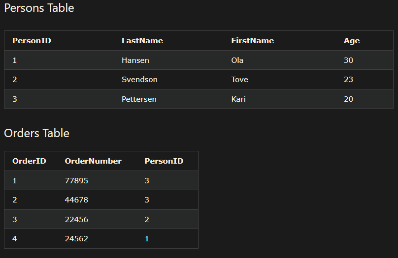
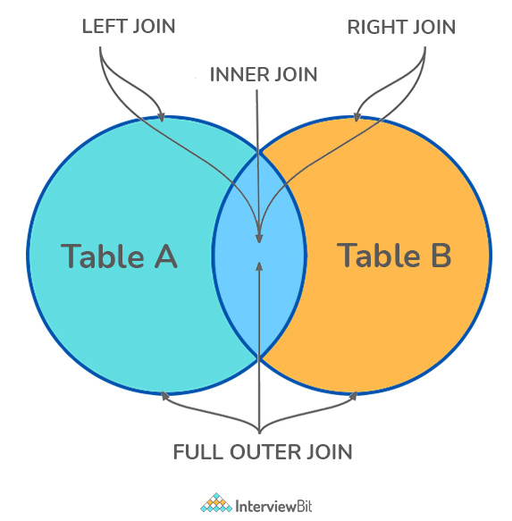
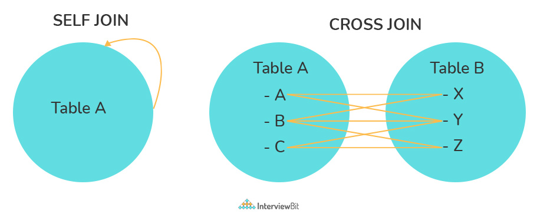
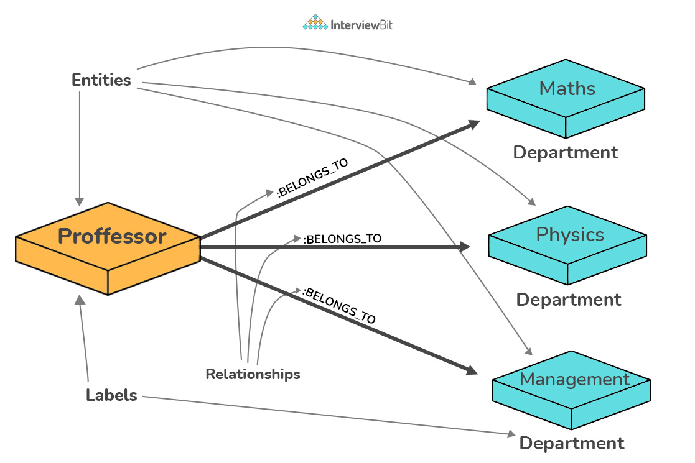
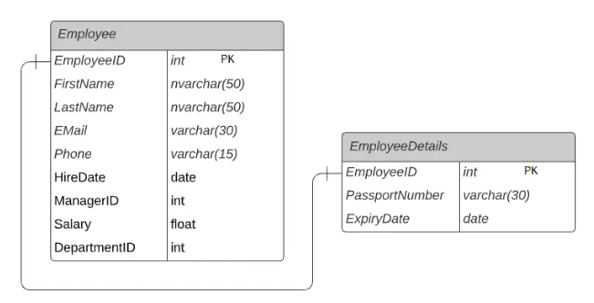
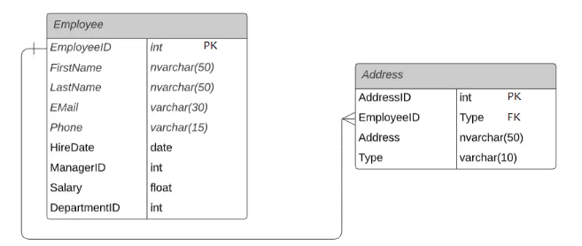
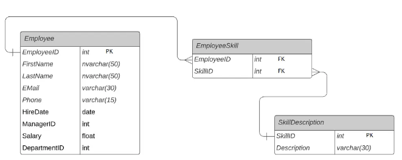
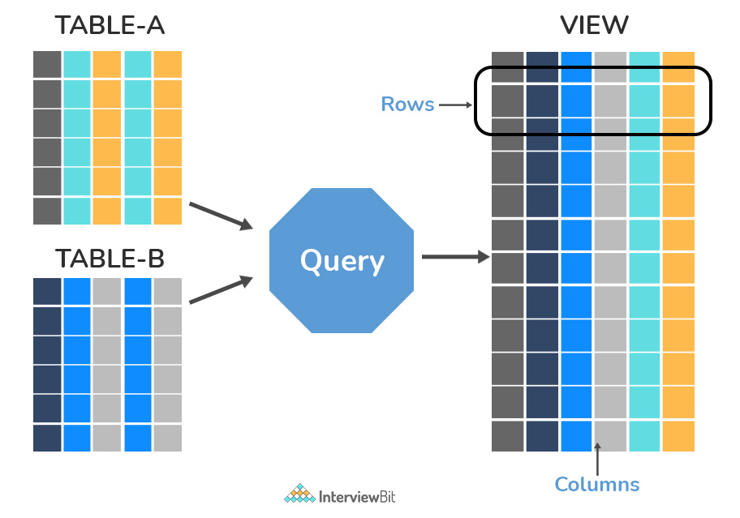
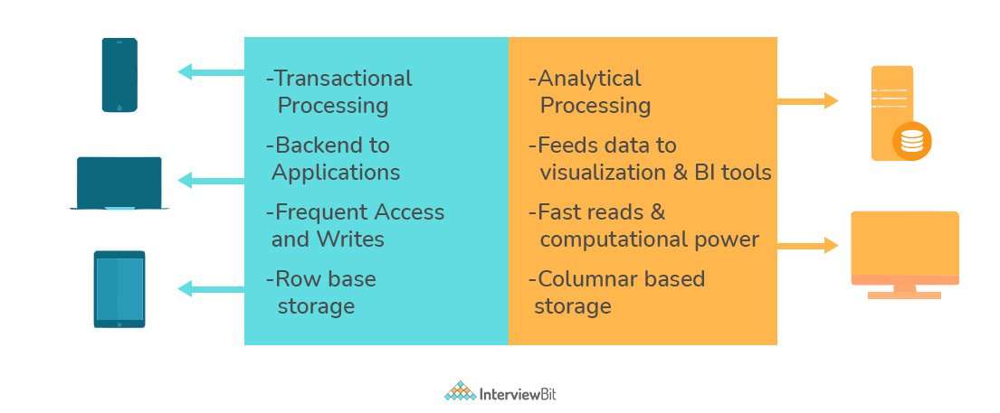
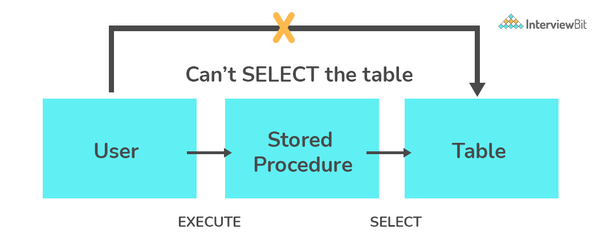

| No. | Questions |
| --- | --------- |
|   | **SQL** |
| 1 | [What is Database?](#1)|
| 2 | [What is DBMS?](#2)|
| 3 | [What is RDBMS? How is it different from DBMS?](#3)|
| 4 | [What is SQL?](#4)|
| 5 | [What is the difference between SQL and MySQL?](#5)|
| 6 | [What are Tables and Fields?](#6)|
| 7 | [What are Constraints in SQL?](#7)|
| 8 | [What is a Primary Key?](#8)|
| 9 | [What is a UNIQUE constraint?](#9)|
| 10| [What is a Foreign Key?](#10)|
| 11| [What is a Join? List its different types.](#11)|
| 12| [What is a Self-Join?](#12)|
| 13| [What is a Cross-Join?](#13)|
| 14| [What is an Index? Explain its different types.](#14)|
| 15| [What is the difference between Clustered and Non-clustered index?](#15)|
| 16| [What is Data Integrity?](#16)|
| 17| [What is a Query?](#17)|
| 18 | [What is a Subquery? What are its types?](#18)|
| 19 | [What is the SELECT statement?](#19)|
| 20 | [What are some common clauses used with SELECT query in SQL?](#20)|
| 21 | [What are UNION, MINUS and INTERSECT commands?](#21)|
| 22 | [What is Cursor? How to use a Cursor?](#22)|
| 23 | [What are Entities and Relationships?](#23)|
| 24 | [List the different types of relationships in SQL.](#24)|
| 25 | [What is an Alias in SQL?](#25)|
| 26 | [What is a View?](#26)|
| 27| [What is Normalization?](#27)|
| 28| [What is Denormalization?](#28)|
| 29| [What are the various forms of Normalization?](#29)|
| 30| [What are the TRUNCATE, DELETE and DROP statements?](#30)|
| 31| [What are Aggregate and Scalar functions?](#31)|
| 32| [What is User-defined function? What are its various types?](#32)|
| 33| [What is OLTP?](#33)|
| 34| [What are the differences between OLTP and OLAP?](#34)|
| 35| [What is Collation? What are the different types of Collation Sensitivity?](#35)|
| 36| [What is a Stored Procedure?](#36)|
| 37| [What is a Recursive Stored Procedure?](#37)|
| 38| [How to create empty tables with the same structure as another table?](#38)|
| 39| [What is Pattern Matching in SQL?](#39)|
| 40| [What is a transaction?](#40)|
| 41| [What is a rigger?](#41)|

## 1. What is Database?

A database is an organized collection of data, stored and retrieved digitally from a remote or local computer system. Databases can be vast and complex, and such databases are developed using fixed design and modeling approaches.

## 2. What is DBMS?

DBMS stands for Database Management System. DBMS is a system software responsible for the creation, retrieval, updation, and management of the database. It ensures that our data is consistent, organized, and is easily accessible by serving as an interface between the database and its end-users or application software.

## 3. What is RDBMS? How is it different from DBMS?

RDBMS stands for Relational Database Management System. The key difference here, compared to DBMS, is that RDBMS stores data in the form of a collection of tables, and relations can be defined between the common fields of these tables. Most modern database management systems like MySQL, Microsoft SQL Server, Oracle, IBM DB2, and Amazon Redshift are based on RDBMS.

## 4. What is SQL?

SQL stands for Structured Query Language. It is the standard language for relational database management systems. It is especially useful in handling organized data comprised of entities (variables) and relations between different entities of the data.

## 5. What is the difference between SQL and MySQL?

SQL is a standard language for retrieving and manipulating structured databases. On the contrary, MySQL is a relational database management system, like SQL Server, Oracle or IBM DB2, that is used to manage SQL databases.

## 6. What are Tables and Fields?

- A table is an organized collection of data stored in the form of rows and columns. 
- Columns can be categorized as vertical, and Rows are horizontal.
- Columns are also called as fields, and rows are also called as records.

## 7. What are Constraints in SQL?

Constraints are used to specify the rules concerning data in the table. It can be applied for single or multiple fields in an SQL table during the creation of the table or after creating using the ALTER TABLE command.

- **NOT NULL** - Restricts NULL value from being inserted into a column.
- **CHECK** - Verifies that all values in a field satisfy a condition.
- **DEFAULT** - Automatically assigns a default value if no value has been specified for the field.
- **UNIQUE** - Ensures unique values to be inserted into the field.
- **INDEX** - Indexes a field providing faster retrieval of records.
- **PRIMARY KEY** - Uniquely identifies each record in a table.
- **FOREIGN KEY** - Ensures referential integrity for a record in another table

## 8. What is a Primary Key?

The PRIMARY KEY constraint uniquely identifies each row in a table. It must contain UNIQUE values and has an implicit NOT NULL constraint.
A table in SQL is strictly restricted to have one and only one primary key, which is comprised of single or multiple fields (columns).

~~~sql
CREATE TABLE Students (   /* Create table with a single field as primary key */
   ID INT NOT NULL
   Name VARCHAR(255)
   PRIMARY KEY (ID)
);

CREATE TABLE Students (   /* Create table with multiple fields as primary key */
   ID INT NOT NULL
   LastName VARCHAR(255)
   FirstName VARCHAR(255) NOT NULL,
   CONSTRAINT PK_Student
   PRIMARY KEY (ID, FirstName)
);

ALTER TABLE Students   /* Set a column as primary key */
ADD PRIMARY KEY (ID);
ALTER TABLE Students   /* Set multiple columns as primary key */
ADD CONSTRAINT PK_Student   /*Naming a Primary Key*/
PRIMARY KEY (ID, FirstName);
~~~

## 9. What is a UNIQUE constraint?

A UNIQUE constraint ensures that all values in a column are different. Unlike primary key, there can be multiple unique constraints defined per table. The code syntax for UNIQUE is quite similar to that of PRIMARY KEY and can be used interchangeably.

~~~sql
CREATE TABLE Students (   /* Create table with a single field as unique */
   ID INT NOT NULL UNIQUE
   Name VARCHAR(255)
);

CREATE TABLE Students (   /* Create table with multiple fields as unique */
   ID INT NOT NULL
   LastName VARCHAR(255)
   FirstName VARCHAR(255) NOT NULL
   CONSTRAINT PK_Student
   UNIQUE (ID, FirstName)
);

ALTER TABLE Students   /* Set a column as unique */
ADD UNIQUE (ID);
ALTER TABLE Students   /* Set multiple columns as unique */
ADD CONSTRAINT PK_Student   /* Naming a unique constraint */
UNIQUE (ID, FirstName);
~~~

## 10. What is a Foreign Key?

A FOREIGN KEY comprises of single or collection of fields in a table that essentially refers to the PRIMARY KEY in another table.

Foreign key constraint ensures referential integrity in the relation between two tables.

**Note**: Referential integrity ensures that the value or existence of one column (or collection of columns) of a table depends on the value or existence of another column (or collection of columns) in another table.

The table with the foreign key constraint is labeled as the child table, and the table containing the candidate key is labeled as the referenced or parent table.

The syntax of the SQL FOREIGN KEY constraint is:

~~~sql
CREATE TABLE table_name (
    column1 data_type,
    column2 data_type,
    ...,
    FOREIGN KEY (column_name)
    REFERENCES referenced_table_name (referenced_column_name)
);
~~~

Here:

- **table_name** - is the name of the table where the FOREIGN KEY constraint is to be defined
- **column_name1, column_name2, ...** - is the name of the column where the FOREIGN KEY constraint is to be defined
- **referenced_table_name** and **referenced_column_name** - are the names of the table and the column that the FOREIGN KEY constraint references

~~~sql
/* Create table with a single field as foreign key */
CREATE TABLE Orders (
    OrderID int NOT NULL,
    OrderNumber int NOT NULL,
    PersonID int,
    PRIMARY KEY (OrderID),
    FOREIGN KEY (PersonID) REFERENCES Persons(PersonID)
);
/* Create table with multiple fields as foreign key */
ALTER TABLE Orders
ADD FOREIGN KEY (PersonID,Age) REFERENCES Persons(PersonID,Age);
/* Naming a foreign key */
ALTER TABLE Orders
ADD CONSTRAINT FK_PersonOrder
FOREIGN KEY (PersonID) REFERENCES Persons(PersonID);
~~~

## 11. What is a Join? List its different types.

A JOIN clause is used to combine rows from two or more tables, based on a related column between them.

The SQL Join clause is used to combine records (rows) from two or more tables in a SQL database based on a related column between the two.

There are four different types of JOINs in SQL:

- **(INNER) JOIN**: Returns records that have matching values in both tables

~~~sql
SELECT *
FROM Table_A
JOIN Table_B;
/* or */
/* INNER JOIN is the default JOIN */
SELECT *
FROM Table_A
INNER JOIN Table_B;
~~~

- **LEFT (OUTER) JOIN**: Returns all records from the left table, and the matched records from the right table

~~~sql
SELECT *
FROM Table_A A
LEFT JOIN Table_B B
ON A.col = B.col;
~~~

- **RIGHT (OUTER) JOIN**: Returns all records from the right table, and the matched records from the left table

~~~sql
SELECT *
FROM Table_A A
RIGHT JOIN Table_B B
ON A.col = B.col;
~~~

- **FULL (OUTER) JOIN**: Returns all records when there is a match in either left or right table

~~~sql
SELECT *
FROM Table_A A
FULL JOIN Table_B B
ON A.col = B.col;
~~~

Given the following tables:

<table>
<tr><th>Employees</th><th>Department</th></tr>

<tr>
   <td>

   | id | name | dept_id |
   | -- | ---- | ------- |
   | 1 | Rafferty | 31 |
   | 2 | Jones | 33 |
   | 3 | Heisenberg | 31 |
   | 4 | Robinson | 34 |
   | 5 | Smith | 34 |
   | 6 | Williams | NULL |

   </td>

   <td>

   | id | Nombre |
   | -- | ------- |
   | 31 | Sales   |
   | 33 | Engineering |
   | 34 | Clerical |
   | 35 | Marketing |

   </td>
</tr> </table>

### INNER JOIN

~~~sql

SELECT Employees.name, Department.Nombre as "Department"
FROM Employees
INNER JOIN Department
ON Employees.dept_id = Department.id;

~~~

Result in:

| name | Department |
| ---- | ------- |
| Rafferty | Sales   |
| Heisenberg | Sales |
| Jones | Engineering |
| Robinson | Clerical |
| Smith | Clerical |

### LEFT JOIN

~~~sql

SELECT Employees.name, Department.Nombre as "Department"
FROM Employees
LEFT JOIN Department
ON Employees.dept_id = Department.id;

~~~

Result in:

| name | Department |
| ---- | ------- |
| Rafferty | Sales   |
| Heisenberg | Sales |
| Jones | Engineering |
| Robinson | Clerical |
| Smith | Clerical |
| Williams | NULL |

### RIGHT JOIN

~~~sql

SELECT Employees.name, Department.Nombre as "Department"
FROM Employees
RIGHT JOIN Department
ON Employees.dept_id = Department.id;

~~~

Result in:

| name | Department |
| ---- | ------- |
| Rafferty | Sales   |
| Heisenberg | Sales |
| Jones | Engineering |
| Robinson | Clerical |
| Smith | Clerical |
| NULL | Marketing |

### FULL JOIN

~~~sql

SELECT Employees.name, Department.Nombre as "Department"
FROM Employees
FULL JOIN Department
ON Employees.dept_id = Department.id;

~~~

Result in:

| name | Department |
| ---- | ------- |
| Rafferty | Sales   |
| Heisenberg | Sales |
| Jones | Engineering |
| Robinson | Clerical |
| Smith | Clerical |
| Williams | NULL |
| NULL | Marketing |

## 12. What is a Self-Join?

A self JOIN is a case of regular join where a table is joined to itself based on some relation between its own column(s). Self-join uses the INNER JOIN or LEFT JOIN clause and a table alias is used to assign different names to the table within the query.

Given the following table:

<table>
<tr><th>Employee</th></tr>
<tr>
   <td>

   | Id | Name | Salary | supervisorId |
   | -- | ---- | ------- | ------- |
   | 1 | Rafferty | 10000 | 2 |
   | 2 | Jones | 10200 | 4 |
   | 3 | Heisenberg | 10200 | 1 |
   | 4 | Robinson | 15000 | 2 |
   | 5 | Smith | 9000 | NULL |
   | 6 | Williams | NULL | NULL |

   </td>

</tr> </table>

~~~sql
SELECT
    emp.Id,
        emp.Name,
        emp.supervisorId,
        sup.Name as Supervisor
FROM Employee emp
JOIN Employee sup
ON emp.supervisorId = sup.Id;
~~~

Result in:

| Id | Name | supervisorId | Supervisor |
| -- | ---- | ------- | ------- |
| 1 | Rafferty | 2 | Jones |
| 2 | Jones | 4 | Robinson |
| 3 | Heisenberg | 1 | Rafferty |
| 4 | Robinson | 2 | Jones |

## 13. What is a Cross-Join?

Cross join can be defined as a cartesian product of the two tables included in the join. The table after join contains the same number of rows as in the cross-product of the number of rows in the two tables. If a WHERE clause is used in cross join then the query will work like an INNER JOIN.

~~~sql
SELECT stu.name, sub.subject 
FROM students AS stu
CROSS JOIN subjects AS sub;
~~~

Given the following tables:
<table>
<tr><th>students</th><th>subjects</th></tr>
<tr>
   <td>

   | id | name |
   | -- | ---- |
   | 1 | John |
   | 2 | Sam |
   | 3 | Tom |

   </td>

   <td>

   | id | subject |
   | -- | ------- |
   | 1 | Maths   |
   | 2 | Science |
   | 3 | English |
   | 4 | History |
   | 5 | Geography |
   | 6 | Civics |

   </td>
</tr> </table>

Result in:

| name | subject |
| ---- | ------- |
| John | Maths   |
| John | Science |
| John | English |
| John | History |
| John | Geography |
| John | Civics |
| Sam | Maths |
| Sam | Science |
| Sam | English |
| Sam | History |
| Sam | Geography |
| Sam | Civics |
| Tom | Maths |
| Tom | Science |
| Tom | English |
| Tom | History |
| Tom | Geography |
| Tom | Civics |

## 14. What is an Index? Explain its different types.

A database index is a data structure that provides a quick lookup of data in a column or columns of a table. It enhances the speed of operations accessing data from a database table at the cost of additional writes and memory to maintain the index data structure.

~~~sql
CREATE INDEX index_name   /* Create Index */
ON table_name (column_1, column_2);
DROP INDEX index_name;   /* Drop Index */
~~~

There are Four types of indexes in SQL:

- **Unique Index**: It does not allow the field to have duplicate values if the column is unique indexed. If a primary key is defined, a unique index can be applied automatically.

- **Non-Unique Index**: It allows the field to have duplicate values.

- **Clustered Index**: It reorders the physical order of the table and searches based on the basis of key values. Each table can only have one clustered index.

- **Non-Clustered Index**: It does not alter the physical order of the table and maintains a logical order of the data. Each table can have many nonclustered indexes.

## 15. What is the difference between Clustered and Non-clustered index?

As explained above, the differences can be broken down into three small factors -

- Clustered index modifies the way records are stored in a database based on the indexed column. A non-clustered index creates a separate entity within the table which references the original table.
- Clustered index is used for easy and speedy retrieval of data from the database, whereas, fetching records from the non-clustered index is relatively slower.
- In SQL, a table can have a single clustered index whereas it can have multiple non-clustered indexes.

## 16. What is Data Integrity?

Data Integrity is the assurance of accuracy and consistency of data over its entire life-cycle and is a critical aspect of the design, implementation, and usage of any system which stores, processes, or retrieves data.

## 17. What is a Query?

A query is a request for data or information from a database table or combination of tables. A database query can be either a select query or an action query.

~~~sql
SELECT fname, lname    /* select query */
FROM myDb.students
WHERE student_id = 1;
~~~

~~~sql
UPDATE myDB.students    /* action query */
SET fname = 'Captain', lname = 'America'
WHERE student_id = 1;
~~~

## 18. What is a Subquery? What are its types?

A subquery is a query within another query, also known as a nested query or inner query. 

It is used to restrict or enhance the data to be queried by the main query, thus restricting or enhancing the output of the main query respectively. 

~~~sql
SELECT name, email, mob, address
FROM myDb.contacts
WHERE roll_no IN (
 SELECT roll_no
 FROM myDb.students
 WHERE subject = 'Maths');
~~~

There are two types of subquery - Correlated and Non-Correlated.

- **Correlated Subquery**: A subquery that uses values from the outer query is called a correlated subquery. In this case, the inner query is executed multiple times, once for each row returned by the outer query.

- **Non-Correlated Subquery**: A subquery that is executed independently of the outer query and cannot access the values from the outer query is called a non-correlated subquery. In this case, the inner query is executed first, and the results are fed to the outer query.

## 19. What is the SELECT statement?

SELECT operator in SQL is used to select data from a database. The data returned is stored in a result table, called the result-set.

~~~sql

SELECT column1, column2, ...
FROM table_name;

~~~

## 20. What are some common clauses used with SELECT query in SQL?

Some common SQL clauses used in conjuction with a SELECT query are as follows:

- **WHERE**: It is used to filter records based on a specified condition.

- **GROUP BY**: It is used to group the result-set by one or more columns.

- **HAVING**: It is used to filter records based on a specified condition, used only with GROUP BY (Aggregations) .

- **ORDER BY**: It is used to sort the result-set by one or more columns.

~~~sql
SELECT *
FROM myDB.students
WHERE graduation_year = 2019
ORDER BY studentID DESC;
~~~

~~~sql
SELECT COUNT(studentId), country
FROM myDB.students
WHERE country != "INDIA"
GROUP BY country
HAVING COUNT(studentID) > 5;
~~~

## 21. What are UNION, MINUS and INTERSECT commands?

- The UNION operator combines and returns the result-set retrieved by two or more SELECT statements.

- The MINUS operator in SQL is used to remove duplicates from the result-set obtained by the second SELECT query from the result-set obtained by the first SELECT query and then return the filtered results from the first.

- The INTERSECT clause in SQL combines the result-set fetched by the two SELECT statements where records from one match the other and then returns this intersection of result-sets.

Certain conditions need to be met before executing either of the above statements in SQL:

- Each SELECT statement within the clause must have the same number of columns
- The columns must also have similar data types
- The columns in each SELECT statement should necessarily have the same order

~~~sql
/*UNION */
SELECT name FROM Students   /* Fetch the union of queries */
UNION
SELECT name FROM Contacts;
SELECT name FROM Students   /* Fetch the union of queries with duplicates*/
UNION ALL
SELECT name FROM Contacts;

/*MINUS */
SELECT name FROM Students   /* Fetch names from students */
MINUS     /* that aren't present in contacts */
SELECT name FROM Contacts;

/*INTERSECT */
SELECT name FROM Students   /* Fetch names from students */
INTERSECT    /* that are present in contacts as well */
SELECT name FROM Contacts;
~~~

## 22. What is Cursor? How to use a Cursor?

A database cursor is a control structure that allows for the traversal of records in a database. 

Cursors, in addition, facilitates processing after traversal, such as retrieval, addition, and deletion of database records.

They can be viewed as a pointer to one row in a set of rows.

## 23. What are Entities and Relationships?

- Entity: An entity can be a real-world object, either tangible or intangible, that can be easily identifiable.
    - For example, in a college database, students, professors, workers, departments, and projects can be referred to as entities. Each entity has some associated properties that provide it an identity.
- Relationships: Relations or links between entities that have something to do with each other. 
   - For example - The employee's table in a company's database can be associated with the salary table in the same database.

## 24. List the different types of relationships in SQL.

- One-to-One - This can be defined as the relationship between two tables where each record in one table is associated with the maximum of one record in the other table.
    - In One-to-One relationship, one record of the first table will be linked to zero or one record of another table
    - For example, each employee in the Employee table will have a corresponding row in EmployeeDetails table that stores the current passport details for that particular employee. So, each employee will have zero or one record in the EmployeeDetails table

- One-to-Many & Many-to-One - This is the most commonly used relationship where a record in a table is associated with multiple records in the other table.
   - The Employee table stores employee records where EmployeeID is the primary key. The Address table holds the addresses of employees where AddressID is a primary key and EmployeeID is a foreign key. Each employee will have one record in the Employee table. Each employee can have many addresses such as Home address, Office Address, Permanent address, etc.

- Many-to-Many - This is used in cases when multiple instances on both sides are needed for defining a relationship.
   -  As an example, an employee in the Employee table can have many skills from the EmployeeSkill table and also, one skill can be associated with one or more employees.

- Self-Referencing Relationships - This is used when a table needs to define a relationship with itself.

## 25. What is an Alias in SQL?

It is a temporary name assigned to the table or table column for the purpose of a particular SQL query.

 In addition, aliasing can be employed as an obfuscation technique to secure the real names of database fields. A table alias is also called a correlation name.

 An alias is represented explicitly by the AS keyword but in some cases, the same can be performed without it as well. Nevertheless, using the AS keyword is always a good practice.

~~~sql
SELECT A.emp_name AS "Employee"  /* Alias using AS keyword */
B.emp_name AS "Supervisor"
FROM employee A, employee B   /* Alias without AS keyword */
WHERE A.emp_sup = B.emp_id;
~~~

## 26. What is a View?

A view in SQL is a virtual table based on the result-set of an SQL statement. 

A view contains rows and columns, just like a real table. The fields in a view are fields from one or more real tables in the database.

## 27. What is Normalization?

Normalization represents the way of organizing structured data in the database efficiently. 

It includes the creation of tables, establishing relationships between them, and defining rules for those relationships. 

Inconsistency and redundancy can be kept in check based on these rules, hence, adding flexibility to the database.

## 28. What is Denormalization?

Denormalization is the inverse process of normalization, where the normalized schema is converted into a schema that has redundant information. 

The performance is improved by using redundancy and keeping the redundant data consistent.

 The reason for performing denormalization is the overheads produced in the query processor by an over-normalized structure.

## 29. What are the various forms of Normalization?

- First Normal Form (1NF)
- Second Normal Form (2NF)
- Third Normal Form (3NF)
- Boyce-Codd Normal Form (BCNF)

**First Normal Form**: A relation is in first normal form if every attribute in that relation is a single-valued attribute. If a relation contains a composite or multi-valued attribute, it violates the first normal form.

Consider the next table:

| Student | Address | Books Issued | Salutation |
| ------- | ------- | ------------ | ---------- |
| Sara | 123, Park Street, New York | C++, Java | Ms. |
| John | 456, Park Street, New York | C++, Java, Python | Mr. |
| Sam | 789, Park Street, New York | Python, Ruby | Mr. |
| Tom | 101, Park Street, New York | Dracula (Bram Stoker) | Mr. |

As we can observe, the Books Issued field has more than one value per record, and to convert it into 1NF, this has to be resolved into separate individual records for each book issued. 

Check the following table in 1NF form:

| Student | Address | Books Issued | Salutation |
| ------- | ------- | ------------ | ---------- |
| Sara | 123, Park Street, New York | C++ | Ms. |
| Sara | 123, Park Street, New York | Java | Ms. |
| John | 456, Park Street, New York | C++ | Mr. |
| John | 456, Park Street, New York | Java | Mr. |
| John | 456, Park Street, New York | Python | Mr. |
| Sam | 789, Park Street, New York | Python | Mr. |
| Sam | 789, Park Street, New York | Ruby | Mr. |
| Tom | 101, Park Street, New York | Dracula (Bram Stoker) | Mr. |

**Second Normal Form**: A relation is in second normal form if it satisfies the conditions for the first normal form and does not contain any partial dependency.

A partial dependency occurs when a primary key has more than one attributes and a non-key attribute is dependent on only one of those attributes.

Often, specifying a single column Primary Key is the solution to the problem.

- **Example** - As we can observe, the Students Table in the 1NF form has a candidate key in the form of [Student, Address] that can uniquely identify all records in the table. The field Books Issued (non-prime attribute) depends partially on the Student field. Hence, the table is not in 2NF. To convert it into the 2nd Normal Form, we will partition the tables into two while specifying a new Primary Key attribute to identify the individual records in the Students table. The Foreign Key constraint will be set on the other table to ensure referential integrity.

Books Issued dependency on Student field: Student → Books Issued (partial dependency).

Students Table in 2NF form:

| Student_ID | Student | Address | Salutation |
| ---------- | ------- | ------- | ---------- |
| 1 | Sara | 123, Park Street, New York | Ms. |
| 2 | John | 456, Park Street, New York | Mr. |
| 3 | Sam | 789, Park Street, New York | Mr. |
| 4 | Tom | 101, Park Street, New York | Mr. |

Books Issued Table in 2NF form:

| Student_ID | Books Issued |
| ---------- | ------------ |
| 1 | C++ |
| 1 | Java |
| 2 | C++ |
| 2 | Java |
| 2 | Python |
| 3 | Python |
| 3 | Ruby |
| 4 | Dracula (Bram Stoker) |

**Third Normal Form**: A relation is in third normal form if it satisfies the conditions for the second normal form and does not contain any transitive dependency. All non-prime attributes are determined only by the candidate keys of the relation and not by any other non-prime attribute.

A transitive dependency occurs when a non-prime attribute is dependent on another non-prime attribute rather than on the candidate key.

- **Example** -  Consider the Students Table in the above example. As we can observe, the Students Table in the 2NF form has a single candidate key Student_ID (primary key) that can uniquely identify all records in the table. The field Salutation (non-prime attribute), however, depends on the Student Field rather than the candidate key. Hence, the table is not in 3NF. To convert it into the 3rd Normal Form, we will once again partition the tables into two while specifying a new Foreign Key constraint to identify the salutations for individual records in the Students table. The Primary Key constraint for the same will be set on the Salutations table to identify each record uniquely.

Salutations dependency on Student field: Student → Salutation (transitive dependency).

Students Table in 3NF form:

| Student_ID | Student | Address | Salutation_ID |
| ---------- | ------- | ------- | ------------- |
| 1 | Sara | 123, Park Street, New York | 1 |
| 2 | John | 456, Park Street, New York | 2 |
| 3 | Sam | 789, Park Street, New York | 2 |
| 4 | Tom | 101, Park Street, New York | 2 |

Salutations Table in 3NF form:

| Salutation_ID | Salutation |
| ------------- | ---------- |
| 1 | Ms. |
| 2 | Mr. |
| 3 | Mrs. |

Books Issued Table in 2NF form:

| Student_ID | Books Issued |
| ---------- | ------------ |
| 1 | C++ |
| 1 | Java |
| 2 | C++ |
| 2 | Java |
| 2 | Python |
| 3 | Python |
| 3 | Ruby |
| 4 | Dracula (Bram Stoker) |

**Boyce-Codd Normal Form**: A relation is in Boyce-Codd normal form if it satisfies the conditions for the third normal form and every determinant is a candidate key. A determinant is any attribute in a specific row whose value directly determines other values in that row.

## 30. What are the TRUNCATE, DELETE and DROP statements?

DELETE statement is used to delete rows from a table.

~~~sql
DELETE FROM Candidates
WHERE CandidateId > 1000;
~~~

TRUNCATE statement is used to remove all the rows from a table.

~~~sql
TRUNCATE TABLE Candidates;
~~~

DROP statement is used to remove the table definition and its contents.

~~~sql
DROP TABLE Candidates;
~~~

### What is the difference between DROP and TRUNCATE statements?

If a table is dropped, all things associated with the tables are dropped as well. This includes - the relationships defined on the table with other tables, the integrity checks and constraints, access privileges and other grants that the table has. 

if a table is truncated, none of the above problems exist and the table retains its original structure.

### What is the difference between DELETE and TRUNCATE statements?

The TRUNCATE command is used to delete all the rows from the table and free the space containing the table.

The DELETE command deletes only the rows from the table based on the condition given in the where clause or deletes all the rows from the table if no condition is specified. But it does not free the space containing the table (when you delete data from the database, the database file (.MDF) does not automatically become smaller. This is by design. Increasing the size of the database then shrinking all the time is inefficient.).

## 31. What are Aggregate and Scalar functions?

An **aggregate function** performs operations on a collection of values to return a single scalar value.

Aggregate functions are often used with the GROUP BY and HAVING clauses of the SELECT statement. 

- **AVG()**: Returns the average value
- **COUNT()**: Returns the number of rows
- **FIRST()**: Returns the first value
- **LAST()**: Returns the last value
- **MAX()**: Returns the largest value
- **MIN()**: Returns the smallest value
- **SUM()**: Returns the sum

**Note**: All aggregate functions described above ignore NULL values except for the COUNT function.

A **scalar function** returns a single value based on the input value. Following are the widely used SQL scalar functions:

- **UCASE()**: Converts a field to upper case
- **LCASE()**: Converts a field to lower case
- **MID()**: Extract characters from a text field
- **LEN()**: Returns the length of a text field
- **ROUND()**: Rounds a numeric field to the number of decimals specified
- **NOW()**: Returns the current system date and time
- **FORMAT()**: Formats how a field is to be displayed
- **CONCAT()**: Adds two or more strings together
- **RAND()**: Returns a random number between 0 and 1

## 32. What is User-defined function? What are its various types?

The user-defined functions in SQL are like functions in any other programming language that accept parameters, perform complex calculations, and return a value. 

There are two types of SQL user-defined functions:

- **Scalar functions**: These functions return a single value based on the input value.
- **Table-valued functions**: These functions return a table data type.
    - **Inline Table-valued functions**: returns a table data type based on a single SELECT statement.
    - **Multi-statement Table-valued functions**: returns a tabular result-set but, unlike inline, multiple SELECT statements can be used inside the function body

## 33. What is OLTP?

OLTP stands for Online Transaction Processing, is a class of software applications capable of supporting transaction-oriented programs. 

An essential attribute of an OLTP system is its ability to maintain concurrency. To avoid single points of failure, OLTP systems are often decentralized.

These systems are usually designed for a large number of users who conduct short transactions. 

Database queries are usually simple, require sub-second response times, and return relatively few records.

## 34. What are the differences between OLTP and OLAP?

OLAP stands for Online Analytical Processing, a class of software programs that are characterized by the relatively low frequency of online transactions.

Queries are often too complex and involve a bunch of aggregations.

For OLAP systems, the effectiveness measure relies highly on response time. Such systems are widely used for data mining or maintaining aggregated, historical data, usually in multi-dimensional schemas.

## 35. What is Collation? What are the different types of Collation Sensitivity?

Collation refers to a set of rules that determine how data is sorted and compared.

Rules defining the correct character sequence are used to sort the character data. It incorporates options for specifying case sensitivity, accent marks, kana character types, and character width. Below are the different types of collation sensitivity:

- **Case Sensitivity**: A and a, B and b, etc.
- **Accent Sensitivity**: a and á, o and ó, etc.
- **Kana Sensitivity**: When Japanese kana characters Hiragana and Katakana are treated differently, it is called Kana sensitive.
- **Width Sensitivity**: A single-byte character (half-width) and the same character represented as a double-byte character (full-width) are treated differently than it is width sensitive.

## 36. What is a Stored Procedure?

A stored procedure is a subroutine available to applications that access a relational database management system (RDBMS). 

Such procedures are stored in the database data dictionary. The sole disadvantage of stored procedure is that it can be executed nowhere except in the database and occupies more memory in the database server. It also provides a sense of security and functionality as users who can't access the data directly can be granted access via stored procedures.

## 37. What is a Recursive Stored Procedure?

A stored procedure that calls itself until a boundary condition is reached, is called a recursive stored procedure.

This recursive function helps the programmers to deploy the same set of code several times as and when required.

## 38. How to create empty tables with the same structure as another table?

Creating empty tables with the same structure can be done smartly by fetching the records of one table into a new table using the INTO operator while fixing a WHERE clause to be false for all records.

Hence, SQL prepares the new table with a duplicate structure to accept the fetched records but since no records get fetched due to the WHERE clause in action, nothing is inserted into the new table.

~~~sql
SELECT * INTO Students_copy
FROM Students WHERE 1 = 2;
~~~

## 39. What is Pattern Matching in SQL?

SQL pattern matching provides for pattern search in data if you have no clue as to what that word should be.

This kind of SQL query uses wildcards to match a string pattern, rather than writing the exact word. The LIKE operator is used in conjunction with SQL Wildcards to fetch the required information.

- Using the % wildcard to perform a simple search: The % wildcard matches zero or more characters of any type and can be used to define wildcards both before and after the pattern. Search a student in your database with first name beginning with the letter K:

~~~sql
SELECT *
FROM students
WHERE first_name LIKE 'K%'
~~~

- Omitting the patterns using the NOT keyword: Use the NOT keyword to select records that don't match the pattern.

~~~sql
SELECT *
FROM students
WHERE first_name NOT LIKE 'K%'
~~~

- Matching a pattern anywhere using the % wildcard twice: Search for a student in the database where he/she has a K in his/her first name.

~~~sql
SELECT *
FROM students
WHERE first_name LIKE '%Q%'
~~~

- Using the _ wildcard to match pattern at a specific position: The _ wildcard matches exactly one character of any type. It can be used in conjunction with % wildcard. This query fetches all students with letter K at the third position in their first name.

~~~sql
SELECT *
FROM students
WHERE first_name LIKE '__K%' /* 2 underscores */
~~~

- Matching patterns for a specific length: The _ wildcard plays an important role as a limitation when it matches exactly one character. It limits the length and position of the matched results.

~~~sql
SELECT *   /* Matches first names with three or more letters */
FROM students
WHERE first_name LIKE '___%'

SELECT *   /* Matches first names with exactly four characters */
FROM students
WHERE first_name LIKE '____'
~~~

## 40. What is a transaction?
A transaction is a unit or sequence of work that is performed on a database.

Transactions are accomplished in a logical order, whether in a manual fashion by a user or automatically by some sort of a database program.

A transaction is the propagation of one or more changes to the database. For example, if you are creating, updating or deleting a record from the table, then you are performing a transaction on that table.

### Transactional Control Commands

Transactional control commands are only used with the DML Commands such as - INSERT, UPDATE and DELETE. They cannot be used while creating tables or dropping them because these operations are automatically committed in the database.

- **COMMIT**: Commit command is used to permanently save any transaction into the database.
- **ROLLBACK**: This command restores the database to last committed state.
- **SAVEPOINT**: This command is used to temporarily save a transaction so that you can rollback to that point whenever necessary.
- **SET TRANSACTION**: This command is used to specify characteristics for the transaction.

## 41. What is a Trigger?

A trigger is a special kind of stored procedure that automatically executes when an event occurs in the database server.