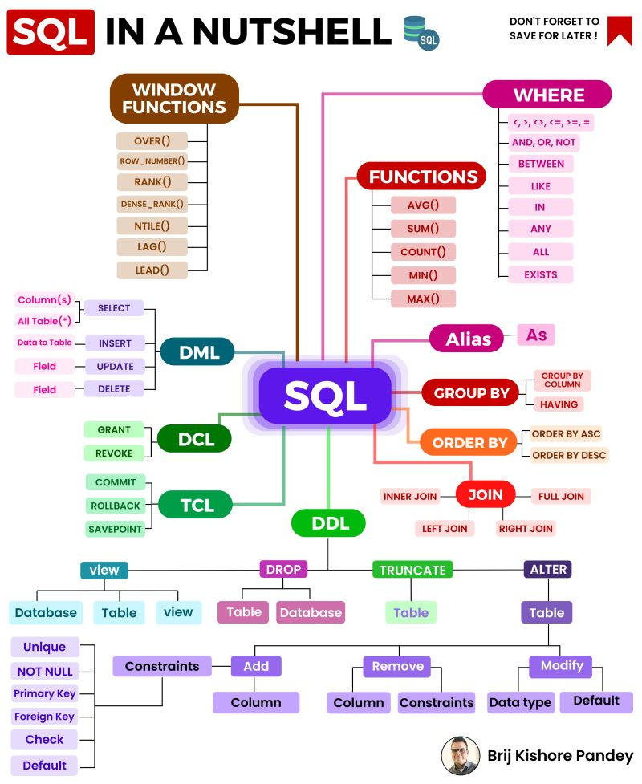

# SQL QUERIES BEGGINERS
## Structured Query Languaje
### normally we are going to read from a DB more than anything else
### We use SELECT

~~~sql
SELECT column1, column2, ...
FROM table_name;
SELECT * FROM table_name;
~~~

### Retornar toda la información de la tabla sin importar las columnas
~~~sql
SELECT * from products;
SELECT Product,Cost_per_box from products;
~~~

### Retornar la información con WHERE clause, OR clause, AND clause
~~~sql
SELECT * from products where Category='Bars';

SELECT * from products where Category='Bars' or Category='Other';

SELECT * from products where Category='Bars' and Size='SMALL';

SELECT * from products where (Category='Bars' or Category='Other') and Size='SMALL';
~~~

### IN operator, instead of multiple ORs use IN
~~~sql
SELECT * from products where Category in ('Bars','Other');
~~~

### ORDER BY clause
~~~sql
SELECT * from products where Size='SMALL' order by Cost_per_box;
SELECT * from products where Size='SMALL' order by Cost_per_box desc;
~~~

### NOT operator
~~~sql
SELECT * from products where not Size='SMALL';
SELECT * from products where not ( Category='Bars' or Category='Other' );
~~~

### GroupBy Operator
~~~sql
SELECT count(*) from products group by Category;
SELECT Category, count(*) from products group by Category;
~~~

# SQL QUERIES 50 QUERIES

### Mostrar todas las tablas de la BD
~~~sql
show tables;
~~~
### Mostrar la descripción de la tabla
~~~sql
desc sales;
~~~
### Basic queries
~~~sql
--Select all columns
select * from sales;
--Select specific columns
select SaleDate, Amount, Customers from sales;
~~~

### Calculated Columns in Select
~~~sql
--Select columns and make and operation, adds new colum 'Amount/Boxes'
select SaleDate, Amount, Boxes, Amount/Boxes from sales;
--Add another name to Amount/Boxes column
select SaleDate, Amount, Boxes, Amount/Boxes as 'Amount per box' from sales;
~~~

### Select with Conditions WHERE
~~~sql
--Select all where AMOUNT is greater
select * from sales where Amount>10000;
--Add another name to Amount/Boxes column
select SaleDate, Amount, Boxes, Amount/Boxes as 'Amount per box' from sales;

-- More examples
--AND and WHERE
select * from sales where Amount>10000 and SaleDate >= '2022-01-01';
--Where , AND YEAR and ORDERBY
select SaleDate,Amount from sales where Amount>10000 and year(SaleDate) = 2022 order by Amount desc;
~~~

### Select with OrdeBy
~~~sql
-- Ascendig order
select * from sales where Amount>10000 order by Amount;
--Descending order
select * from sales where Amount>10000 order by Amount desc;
-- Several criteria of orderby
select * from sales where GeoID='g1' order by PID,Amount desc;
~~~

### Between Condition
~~~sql
-- Between with conditions
select * from sales where Boxes>0 and Boxes <=50;
-- Between with SQL (includes 0 and 50)
select * from sales where Boxes between 0 and 50;
~~~

### Dates
~~~sql
-- WEEKS =  returns days of the week
select SaleDate,Amount,Boxes, weekday(SaleDate) as 'Day of Week' from sales;
-- WHERE
select SaleDate,Amount,Boxes, weekday(SaleDate) as 'Day of Week' from sales where weekday(SaleDate) = 4 ;
~~~
### Other Tables PEOPLE

~~~sql
select * from people;
select * from people where Team ='Delish' or Team = 'Jucies';
-- IN CLAUSE
select * from people where Team in ('Delish','Jucies');
~~~

### Pattern Matchin
~~~sql
-- Anything that begins with B
select * from people where Salesperson like 'B%';
-- People with B in any part of their name
select * from people where Salesperson like '%B%';
~~~

### Case Operator (categorizations)
~~~sql
-- Create categorizations for amount
select SaleDate,Amount, 
	case when amount < 1000 then 'Under 1k'
		 when amount < 5000 then 'Under 5k'
		 when amount < 10000 then 'Under 10k'
		 else '10k or more'
		 end as 'Amount category'
 from sales;
~~~

### Joins
~~~sql
-- Rename SALES as S to make aout query easier to understand
select s.SaleDate, s.Amount from sales as s;

-- JOIN with two tables with the SPID 
select s.SaleDate, s.Amount, p.Salesperson, s.SPID, p.SPID
	from sales as s 
    join people p on p.SPID = s.SPID ;
~~~

### Left Join
~~~sql
select s.SaleDate,s.Amount,s.PID ,pr.PID, pr.Product
	from sales s
    left join products pr on pr.PID = s.PID ;

-- Combinig Join and Left Join

select s.SaleDate,s.Amount,p.Salesperson,pr.Product,p.Team
	from sales s
    join people p on p.SPID = s.SPID
    left join products pr on pr.pid = s.pid;
~~~

### Conditions with Joins
~~~sql

select s.SaleDate,s.Amount,p.Salesperson,pr.Product,p.Team
	from sales s
    join people p on p.SPID = s.SPID
    left join products pr on pr.pid = s.pid
    where s.Amount <500 ;
-- two conditions
select s.SaleDate,s.Amount,p.Salesperson,pr.Product,p.Team
	from sales s
    join people p on p.SPID = s.SPID
    left join products pr on pr.pid = s.pid
    where s.Amount <500 and p.Team = 'Delish';

-- The ones that doesnt have values
select s.SaleDate,s.Amount,p.Salesperson,pr.Product,p.Team
	from sales s
    join people p on p.SPID = s.SPID
    left join products pr on pr.pid = s.pid
    where s.Amount <500 and p.Team ="";

-- three joins with GEO table
select s.SaleDate,s.Amount,p.Salesperson,pr.Product,p.Team, g.Region
	from sales s
    join people p on p.SPID = s.SPID
    left join products pr on pr.pid = s.pid
    join geo g on g.GeoID = s.GeoID
    where s.Amount <500 and p.Team ="" and g.Region in ('Americas', 'Europe');
-- ORDER BY

select s.SaleDate,s.Amount,p.Salesperson,pr.Product,p.Team, g.Region
	from sales s
    join people p on p.SPID = s.SPID
    left join products pr on pr.pid = s.pid
    join geo g on g.GeoID = s.GeoID
    where s.Amount <500 and p.Team ="" and g.Region in ('Americas', 'Europe')
    order by SaleDate;
~~~

### Group BY Agreggations
~~~sql
-- sum Aggregation
select GeoID, sum(Amount)
	from sales s
    group by GeoID;
-- with avg
select GeoID, sum(Amount), avg(Amount)
	from sales s
    group by GeoID;
-- three aggregations
select GeoID, sum(Amount), avg(Amount), sum(Boxes)
	from sales s
    group by GeoID;
-- with joins
select g.Geo, sum(Amount), avg(Amount), sum(Boxes)
	from sales s
    join geo g on s.GeoID = g.GeoID
    group by g.geo;
-- order by
select pr.Category, p.Team, sum(Amount), sum(Boxes)
	from sales s
    join people p on p.SPID = s.SPID
    join products pr on pr.PID = s.PID
    group by  pr.Category, p.Team order by pr.Category, p.Team ;
-- not equal and where (!= could be <>)
select pr.Category, p.Team, sum(Amount), sum(Boxes)
	from sales s
    join people p on p.SPID = s.SPID
    join products pr on pr.PID = s.PID
    where p.Team != ''
    group by  pr.Category, p.Team order by pr.Category, p.Team ;

-- create column and order
select pr.Product, sum(s.Amount) as 'Total Amount'
	from sales s
    join products pr on pr.PID = s.PID
    group by pr.Product
    order by sum(s.Amount) desc;
~~~

### Limit operation
~~~sql
select pr.Product, sum(s.Amount) as 'Total Amount'
	from sales s
    join products pr on pr.PID = s.PID
    group by pr.Product
    order by sum(s.Amount) desc
    limit 10;
~~~

# Practice Problems

### 1.Print details of shipments (sales) where amounts are > 2,000 and boxes are <100?

~~~sql
select * from sales where Amount>2000 and Boxes < 100;
~~~

### 2.How many shipments (sales) each of the sales persons had in the month of January 2022?

~~~sql
select * from people p join sales s on s.SPID = p.SPID where  month(s.SaleDate) = 1 ;
~~~

### 3.Which product sells more boxes? Milk Bars or Eclairs?

~~~sql
select p.PID, p.Product, sum(s.Amount) as 'Total'
	from sales s join products p on s.PID = p.PID 
    where p.Product = 'Milk Bars' or p.Product ='Eclairs'
    group by p.PID order by sum(s.Amount) desc;
~~~

### 4. Which product sold more boxes in the first 7 days of February 2022? Milk Bars or Eclairs?

~~~sql
select p.PID, p.Product, sum(s.Amount) as 'Total'
	from sales s join products p on s.PID = p.PID 
    where ((year(s.SaleDate) = 2022 and dayofyear(s.SaleDate) < 8)
    and (p.Product = 'Milk Bars' or p.Product ='Eclairs'))
    group by p.PID order by sum(s.Amount) desc;
~~~

### 5. Which shipments had under 100 customers & under 100 boxes? Did any of them occur on Wednesday?

~~~sql
select PID,Customers,Boxes,SaleDate from sales where ((Customers < 100 and Boxes <100) and dayofweek(SaleDate) = 4);
~~~

### 6. What are the names of salespersons who had at least one shipment (sale) in the first 7 days of January 2022?

~~~sql
select p.Salesperson,s.Amount,s.SaleDate 
	from people p join sales s on p.SPID = s.SPID 
    where (s.Amount > 1) and 
    (dayofyear(s.SaleDate) < 8 and year(s.SaleDate) =2022 ) ;
~~~

### 7. Which salespersons did not make any shipments in the first 7 days of January 2022?

~~~sql
select p.Salesperson,s.Amount,s.SaleDate 
	from people p join sales s on p.SPID = s.SPID 
    where (s.Amount = 0) and (dayofyear(s.SaleDate) <8 and year(s.SaleDate) = 2022 ) ;
~~~

### 8. How many times we shipped more than 1,000 boxes in each month?

~~~sql
select monthname(SaleDate) as 'Month', count(*) as 'Total'
	from sales where Boxes > 1000
    group by monthname(SaleDate) order by count(*) desc;
~~~

### 9. Did we ship at least one box of ‘After Nines’ to ‘New Zealand’ on all the months?

~~~sql
select monthname(s.SaleDate) as 'Month', count(*) as 'Total'
	from sales s join geo g 
    where ( Boxes > 1) and 
    (g.Geo = 'New Zealand') and 
    (s.PID = 'P11')
    group by monthname(s.SaleDate) order by count(*) desc;
~~~

### 9. India or Australia? Who buys more chocolate boxes on a monthly basis?

~~~sql
select g.Geo, sum(s.Boxes) as 'Total' from sales s
	join geo g on g.GeoID = s.GeoID
    where (g.Geo = 'India'and ( s.PID ='P03')) or (g.Geo = 'Australia' and ( s.PID ='P03'))
    group by g.Geo;
~~~

### Image of SQL common commands

# Quick SQL Cheatsheet

A quick reminder of all relevant SQL queries and examples on how to use them. 

This repository is constantly being updated and added to by the community. 
Pull requests are welcome. Enjoy!

# Table of Contents 
1. [ Finding Data Queries. ](#find)
2. [ Data Modification Queries. ](#modify)
3. [ Reporting Queries. ](#report)
4. [ Join Queries. ](#joins)
5. [ View Queries. ](#view)
6. [ Altering Table Queries.](#alter)
7. [ Creating Table Query.](#create)

# 1. Finding Data Queries

### **SELECT**: used to select data from a database
* `SELECT` * `FROM` table_name;

### **DISTINCT**: filters away duplicate values and returns rows of specified column
* `SELECT DISTINCT` column_name;

### **WHERE**: used to filter records/rows
* `SELECT` column1, column2 `FROM` table_name `WHERE` condition;
* `SELECT` * `FROM` table_name `WHERE` condition1 `AND` condition2;
* `SELECT` * `FROM` table_name `WHERE` condition1 `OR` condition2;
* `SELECT` * `FROM` table_name `WHERE NOT` condition;
* `SELECT` * `FROM` table_name `WHERE` condition1 `AND` (condition2 `OR` condition3);
* `SELECT` * `FROM` table_name `WHERE EXISTS` (`SELECT` column_name `FROM` table_name `WHERE` condition);

### **ORDER BY**: used to sort the result-set in ascending or descending order
* `SELECT` * `FROM` table_name `ORDER BY` column;
* `SELECT` * `FROM` table_name `ORDER BY` column `DESC`;
* `SELECT` * `FROM` table_name `ORDER BY` column1 `ASC`, column2 `DESC`;

### **SELECT TOP**: used to specify the number of records to return from top of table
* `SELECT TOP` number columns_names `FROM` table_name `WHERE` condition;
* `SELECT TOP` percent columns_names `FROM` table_name `WHERE` condition;
* Not all database systems support `SELECT TOP`. The MySQL equivalent is the `LIMIT` clause
* `SELECT` column_names `FROM` table_name `LIMIT` offset, count;

### **LIKE**: operator used in a WHERE clause to search for a specific pattern in a column
* % (percent sign) is a wildcard character that represents zero, one, or multiple characters
* _ (underscore) is a wildcard character that represents a single character
* `SELECT` column_names `FROM` table_name `WHERE` column_name `LIKE` pattern;
* `LIKE` ‘a%’ (find any values that start with “a”)
* `LIKE` ‘%a’ (find any values that end with “a”)
* `LIKE` ‘%or%’ (find any values that have “or” in any position)
* `LIKE` ‘_r%’ (find any values that have “r” in the second position)
* `LIKE` ‘a_%_%’ (find any values that start with “a” and are at least 3 characters in length)
* `LIKE` ‘[a-c]%’ (find any values starting with “a”, “b”, or “c”

### **IN**: operator that allows you to specify multiple values in a WHERE clause
* essentially the IN operator is shorthand for multiple OR conditions
* `SELECT` column_names `FROM` table_name `WHERE` column_name `IN` (value1, value2, …);
* `SELECT` column_names `FROM` table_name `WHERE` column_name `IN` (`SELECT STATEMENT`);

### **BETWEEN**: operator selects values within a given range inclusive
* `SELECT` column_names `FROM` table_name `WHERE` column_name `BETWEEN` value1 `AND` value2;
* `SELECT` * `FROM` Products `WHERE` (column_name `BETWEEN` value1 `AND` value2) `AND NOT` column_name2 `IN` (value3, value4);
* `SELECT` * `FROM` Products `WHERE` column_name `BETWEEN` #01/07/1999# AND #03/12/1999#;

### **NULL**: values in a field with no value
* `SELECT` * `FROM` table_name `WHERE` column_name `IS NULL`;
* `SELECT` * `FROM` table_name `WHERE` column_name `IS NOT NULL`;

### **AS**: aliases are used to assign a temporary name to a table or column
* `SELECT` column_name `AS` alias_name `FROM` table_name;
* `SELECT` column_name `FROM` table_name `AS` alias_name;
* `SELECT` column_name `AS` alias_name1, column_name2 `AS` alias_name2;
* `SELECT` column_name1, column_name2 + ‘, ‘ + column_name3 `AS` alias_name;

### **UNION**: set operator used to combine the result-set of two or more SELECT statements
* Each SELECT statement within UNION must have the same number of columns
* The columns must have similar data types
* The columns in each SELECT statement must also be in the same order
* `SELECT` columns_names `FROM` table1 `UNION SELECT` column_name `FROM` table2;
* `UNION` operator only selects distinct values, `UNION ALL` will allow duplicates

### **INTERSECT**: set operator which is used to return the records that two SELECT statements have in common
* Generally used the same way as **UNION** above
* `SELECT` columns_names `FROM` table1 `INTERSECT SELECT` column_name `FROM` table2;

### **EXCEPT**: set operator used to return all the records in the first SELECT statement that are not found in the second SELECT statement
* Generally used the same way as **UNION** above
* `SELECT` columns_names `FROM` table1 `EXCEPT SELECT` column_name `FROM` table2;

### **ANY|ALL**: operator used to check subquery conditions used within a WHERE or HAVING clauses
* The `ANY` operator returns true if any subquery values meet the condition
* The `ALL` operator returns true if all subquery values meet the condition
* `SELECT` columns_names `FROM` table1 `WHERE` column_name operator (`ANY`|`ALL`) (`SELECT` column_name `FROM` table_name `WHERE` condition);

### **GROUP BY**: statement often used with aggregate functions (COUNT, MAX, MIN, SUM, AVG) to group the result-set by one or more columns
* `SELECT` column_name1, COUNT(column_name2) `FROM` table_name `WHERE` condition `GROUP BY` column_name1 `ORDER BY` COUNT(column_name2) DESC;

### **HAVING**: this clause was added to SQL because the WHERE keyword could not be used with aggregate functions
* `SELECT` `COUNT`(column_name1), column_name2 `FROM` table `GROUP BY` column_name2 `HAVING` `COUNT(`column_name1`)` > 5;

### **WITH**: often used for retrieving hierarchical data or re-using temp result set several times in a query. Also referred to as "Common Table Expression"
* `WITH RECURSIVE` cte `AS` ( 
    &nbsp;&nbsp;`SELECT` c0.* `FROM` categories `AS` c0 `WHERE` id = 1 `# Starting point` 
    &nbsp;&nbsp;`UNION ALL` 
    &nbsp;&nbsp;`SELECT` c1.* `FROM` categories `AS` c1 `JOIN` cte `ON` c1.parent_category_id = cte.id 
  ) 
  `SELECT` * 
  `FROM` cte

# 2. Data Modification Queries

### **INSERT INTO**: used to insert new records/rows in a table
* `INSERT INTO` table_name (column1, column2) `VALUES` (value1, value2);
* `INSERT INTO` table_name `VALUES` (value1, value2 …);

### **UPDATE**: used to modify the existing records in a table
* `UPDATE` table_name `SET` column1 = value1, column2 = value2 `WHERE` condition;
* `UPDATE` table_name `SET` column_name = value;

### **DELETE**: used to delete existing records/rows in a table
* `DELETE FROM` table_name `WHERE` condition;
* `DELETE` * `FROM` table_name;

# 3. Reporting Queries

### **COUNT**: returns the # of occurrences
* `SELECT COUNT (DISTINCT` column_name`)`;

### **MIN() and MAX()**: returns the smallest/largest value of the selected column
* `SELECT MIN (`column_names`) FROM` table_name `WHERE` condition;
* `SELECT MAX (`column_names`) FROM` table_name `WHERE` condition;

### **AVG()**: returns the average value of a numeric column
* `SELECT AVG (`column_name`) FROM` table_name `WHERE` condition;

### **SUM()**: returns the total sum of a numeric column
* `SELECT SUM (`column_name`) FROM` table_name `WHERE` condition;

# 4. Join Queries

###  **INNER JOIN**: returns records that have matching value in both tables
* `SELECT` column_names `FROM` table1 `INNER JOIN` table2 `ON` table1.column_name=table2.column_name;
* `SELECT` table1.column_name1, table2.column_name2, table3.column_name3 `FROM` ((table1 `INNER JOIN` table2 `ON` relationship) `INNER JOIN` table3 `ON` relationship);

### **LEFT (OUTER) JOIN**: returns all records from the left table (table1), and the matched records from the right table (table2)
* `SELECT` column_names `FROM` table1 `LEFT JOIN` table2 `ON` table1.column_name=table2.column_name;

### **RIGHT (OUTER) JOIN**: returns all records from the right table (table2), and the matched records from the left table (table1)
* `SELECT` column_names `FROM` table1 `RIGHT JOIN` table2 `ON` table1.column_name=table2.column_name;

### **FULL (OUTER) JOIN**: returns all records when there is a match in either left or right table
* `SELECT` column_names `FROM` table1 ``FULL OUTER JOIN`` table2 `ON` table1.column_name=table2.column_name;

### **Self JOIN**: a regular join, but the table is joined with itself
* `SELECT` column_names `FROM` table1 T1, table1 T2 `WHERE` condition;

# 5. View Queries

### **CREATE**: create a view
* `CREATE VIEW` view_name `AS SELECT` column1, column2 `FROM` table_name `WHERE` condition;

### **SELECT**: retrieve a view
* `SELECT` * `FROM` view_name;

### **DROP**: drop a view
* `DROP VIEW` view_name;

# 6. Altering Table Queries

### **ADD**: add a column
* `ALTER TABLE` table_name `ADD` column_name column_definition;

### **MODIFY**: change data type of column
* `ALTER TABLE` table_name `MODIFY` column_name column_type;

### **DROP**: delete a column
* `ALTER TABLE` table_name `DROP COLUMN` column_name;

# 7. Creating Table Query

### **CREATE**: create a table
* `CREATE TABLE` table_name `(`  
   `column1` `datatype`,  
   `column2` `datatype`,  
   `column3` `datatype`,  
   `column4` `datatype`,  
   `);`